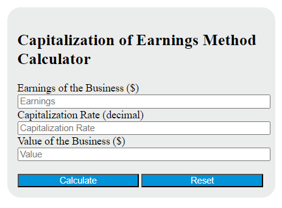

In the dynamic world of finance, understanding the value of a business is crucial for informed decision-making. The capitalization of earnings method is a popular approach used by investors, financial analysts, and entrepreneurs to determine a company's valuation. This method evaluates a company's worth based on its ability to generate future earnings, transforming those anticipated earnings into present value. By focusing on potential profitability, this approach offers a comprehensive perspective on a company's financial health, taking into account both risk and return.

The capitalization of earnings method is particularly valuable in various financial scenarios, including mergers, acquisitions, and investment analyses. It involves estimating the future earnings of a business and converting these projections to their present value using an appropriate capitalization rate. This rate reflects the level of risk associated with the business and the expected return on investment, providing essential insights into the sustainable profitability of the company beyond its current market evaluation.



This article explores the intricacies of the capitalization of earnings, its calculation, uses in financial analysis, and its relevance in algorithmic trading. Understanding the process of calculating the earnings rate is essential, as it directly influences the valuation results. By assessing projected earnings through this method, stakeholders can gain a clearer understanding of a company's intrinsic value and utilize this information to make strategic investment decisions or optimize trading strategies in today's ever-evolving financial landscape.

## Table of Contents

## Understanding Capitalization of Earnings

Capitalization of earnings is an essential valuation method used in financial analysis to determine the value of a business based on its expected future profitability. This technique translates anticipated future earnings into present value, thereby providing a tangible perspective on a company's worth. 

The process begins with determining the expected earnings of the business, which involves forecasting future net income. These projections are generally based on historical performance, industry trends, and macroeconomic factors that could impact the business's future operations. It is crucial to have a realistic and detailed estimation to ensure accuracy in the valuation outcome.

Another critical element is selecting an appropriate capitalization rate, often referred to as the "cap rate." The capitalization rate reflects the perceived risk and potential return associated with the business. Calculating the cap rate involves assessing the risk profile of the business, incorporating factors such as market competition, operational stability, and economic conditions. Adjustments to the capitalization rate can also be based on qualitative assessments, like managerial expertise or brand reputation.

The formula for the capitalization of earnings method is:

$$

\text{Value of Business} = \frac{\text{Expected Earnings}}{\text{Capitalization Rate}} 
$$

For instance, if a company's expected annual earnings are $500,000 and the capitalization rate is determined to be 20%, the business valuation would be:

$$

\text{Value of Business} = \frac{500,000}{0.20} = 2,500,000 
$$

This valuation method is frequently employed in financial assessments, especially during mergers and acquisitions. It provides a benchmark for negotiation regarding sale prices or investment stakes by quantifying the company's ability to generate future profits.

Additionally, the capitalization of earnings method can be adapted to specific contexts, such as when analyzing companies with fluctuating earnings or when strategic investments require a forward-looking valuation approach. This adaptability underscores the method's relevance across various financial scenarios, making it a versatile tool for analysts and investors.

## Calculating the Capitalization Rate

The capitalization rate, often referred to as the "cap rate," is a critical component in the capitalization of earnings method. This rate essentially translates expected future earnings into present value, facilitating a clearer understanding of a company's value. Typically, capitalization rates for small businesses range between 20% to 25%, reflecting average return on investment (ROI) expectations within this sector.

### Calculating the Capitalization Rate

To calculate the capitalization rate, several key factors must be considered:

1. **Industry Norms**: Different industries have varying risk profiles and expected returns, influenced by market dynamics and economic conditions. Understanding the normative cap rates within a specific sector is crucial for accurate valuation.

2. **Business-Specific Risks**: Each business has unique risks influenced by factors such as operational efficiency, market competition, management quality, and economic resilience. Assessing these risks allows investors to adjust the cap rate accordingly.

3. **Potential Returns**: Estimating potential returns involves analyzing a company’s historical financial performance, projected revenue growth, and profitability trends. These projections provide a foundation for determining reasonable earnings expectations.

### Formula and Step-by-Step Guide

The basic formula for calculating the capitalization rate is:

$$
\text{Capitalization Rate (Cap Rate)} = \frac{\text{Net Operating Income (NOI)}}{\text{Current Market Value}}
$$

Here's a step-by-step guide to understanding and calculating the cap rate:

1. **Determine the Net Operating Income (NOI)**: 
   - Calculate the company's expected annual earnings before interest and taxes (EBIT).
   - Subtract operating expenses, excluding interest and taxes, to get the NOI.

2. **Estimate the Market Value**:
   - Assess the current market value of the company, which could be based on recent market transactions, comparable company valuations, or a previous appraisal.

3. **Calculate the Cap Rate**:
   - Divide the NOI by the market value to arrive at the cap rate. Adjust the rate as necessary to account for industry norms and business-specific risks.

### Practical Example

Consider a small business with an NOI of $150,000 annually and an estimated market value of $750,000. The basic cap rate calculation would be:

$$
\text{Cap Rate} = \frac{150,000}{750,000} = 0.20 \text{ or } 20\%
$$

If industry analysis suggests industry norms for similar businesses are around 22%, and business-specific risk factors are in line with market assumptions, a 20% cap rate could signify a conservative and realistic estimation. However, adjustments may be necessary if specific risks are underestimated or if industry conditions vary significantly, leading to a final cap rate of, for example, 21%. 

By calculating the capitalization rate precisely, investors and analysts can better understand the potential return on investment, aiding in the accurate valuation of companies for diverse financial activities.

## Applications in Financial Analysis

Utilizing the capitalization of earnings method in financial analysis assists investors in assessing both the risks and expected returns associated with an investment. This valuation technique focuses on estimating a company's sustainable earnings potential, providing a perspective that extends beyond its current market valuation. By converting expected future earnings into present value, this approach facilitates a clearer understanding of a company's intrinsic worth.

One significant advantage of employing capitalization of earnings is its capacity to offer insights into a business's ability to generate consistent profits. This method is especially effective in evaluating businesses with stable and predictable earnings because it emphasizes future profitability. For instance, if a company has demonstrated consistent revenue growth and minimal fluctuation in operating expenses, the capitalization of earnings approach can more accurately reflect its potential to sustain earnings over time.

The method also allows for comparisons with other valuation techniques, such as asset-based or market-based methods. An asset-based valuation focuses on a company’s net asset value, taking into account tangible and intangible assets minus liabilities. In contrast, a market-based valuation relies on metrics like price-to-earnings (P/E) ratios by comparing similar companies within the industry. Each method has its merits, but the capitalization of earnings stands out by emphasizing the ongoing profitability potential, which might not be fully captured by the other approaches.

For example, in practice, when determining the valuation of a company using the capitalization of earnings method, an investor might proceed as follows:

1. **Estimate Future Earnings**: Assume the company is projected to earn $200,000 annually.
2. **Determine the Capitalization Rate**: Based on industry analysis and specific business risks, an appropriate capitalization rate might be 20%.
3. **Calculate the Business Value**: Divide the projected earnings by the capitalization rate:
$$
   \text{Business Value} = \frac{\text{Future Earnings}}{\text{Capitalization Rate}} = \frac{200,000}{0.20} = 1,000,000

$$

This simplified calculation illustrates how the method captures the business's ability to generate income relative to its perceived risk and potential return. By understanding the sustainable earnings potential, investors can make informed decisions about whether the company's market valuation accurately reflects its true value or if adjustments are necessary.

Consequently, investors and analysts use the capitalization of earnings method not only to estimate the worth of a company but also to develop a comprehensive view of its financial health relative to other valuation methods. This approach's effectiveness stems from its focus on the [earning](/wiki/earning-announcement) capacity of a business, making it a crucial tool for informed decision-making in financial analysis.

## Role in Algorithmic Trading

In [algorithmic trading](/wiki/algorithmic-trading), the capitalization of earnings method is significant for harnessing data-driven strategies to identify optimal investment opportunities. By incorporating earnings rate calculations, trading algorithms can make informed decisions regarding the purchase or sale of assets. This involves integrating the potential profitability of an asset, as derived from its projected earnings, with real-time market data to gauge whether an asset is undervalued or overvalued.

A crucial aspect of using capitalization of earnings in algorithmic trading is its ability to align trading strategies with the intrinsic value of assets. This alignment is achieved by assessing the present value of anticipated earnings, which can be computed using the formula:

$$
\text{Present Value} = \frac{\text{Expected Earnings}}{\text{Capitalization Rate}}
$$

This calculation helps determine whether the asset's current market price appropriately reflects its future earnings potential. By incorporating this valuation model, algorithmic trading systems can be designed to execute trades automatically when discrepancies between market prices and intrinsic values are detected, thereby capitalizing on these differences.

To implement these strategies effectively, trading algorithms can be programmed using languages such as Python. Below is an example of Python code that demonstrates the basic concept of calculating the present value of a stock based on its expected earnings and a given capitalization rate:

```python
def calculate_present_value(expected_earnings, capitalization_rate):
    return expected_earnings / capitalization_rate

# Example usage
expected_earnings = 50000  # Projected annual earnings
capitalization_rate = 0.2  # 20% cap rate

present_value = calculate_present_value(expected_earnings, capitalization_rate)
print(f'The present value of the asset is: ${present_value}')
```

In this code, `calculate_present_value` is a function that calculates the intrinsic value of an asset by dividing the expected earnings by the capitalization rate.

Incorporating such calculations into trading algorithms enables dynamic adjustments to investment portfolios based on real-time financial forecasts. Algorithms can evaluate earnings reports and projections regularly, adjusting strategies in response to fluctuations in the capitalization rate or earnings outlook. This provides traders with a robust mechanism for enhancing the precision of their investment strategies, ultimately aiming to improve returns while managing risks associated with market [volatility](/wiki/volatility-trading-strategies).

## Challenges and Limitations

The capitalization of earnings method, while advantageous in evaluating a business's potential, has inherent challenges and limitations primarily rooted in its dependence on accurate earnings projections. Accurate forecasting of future earnings is crucial to achieving a reliable company valuation through this method. However, projecting future earnings is fraught with uncertainties that can significantly affect accuracy. Market volatility is a major [factor](/wiki/factor-investing) that can influence earnings projections. Fluctuations in economic conditions—such as changes in interest rates, inflation, and currency exchange rates—can lead to instability in a company's earnings, making predictions less reliable.

Economic changes, both on a global and local scale, can also present challenges. For instance, shifts in consumer behavior, technological advancements, and regulatory changes can alter the business environment, impacting a company's profitability and, consequently, its projected earnings. Furthermore, unforeseen business disruptions, such as those caused by natural disasters, political instability, or pandemics, can have sudden and severe effects on a company's financial performance, adding another layer of uncertainty to earnings projections.

These factors not only affect the earnings projections but also impact the capitalization rate itself, as they alter the perceived risk and potential return associated with the business. Since the capitalization rate reflects the expected rate of return, any event that changes the risk landscape can necessitate a reevaluation of this rate.

Understanding and acknowledging these challenges is crucial for financial analysts, investors, and business owners to make well-informed financial decisions. By recognizing the potential variability in earnings projections and capitalization rates, stakeholders can better prepare for and mitigate the risks associated with valuations. Employing robust risk management strategies and considering a range of scenarios in valuation models can help in accommodating these uncertainties and improving the reliability of the capitalization of earnings method.

## Practical Insights and Recommendations

Choosing the appropriate capitalization rate and projecting future earnings with accuracy are paramount when employing the capitalization of earnings method for valuation. The capitalization rate, which reflects the expected rate of return and risk associated with a business, should be selected with consideration of current market conditions, industry norms, and specific business risks. Regular analysis of market trends and economic shifts can aid in optimizing these rates over time, allowing for more precise business valuations in various economic climates.

To enhance the precision of future earnings projections, analysts should incorporate a comprehensive review of historical financial performance, industry trends, and macroeconomic indicators. For instance, using regression analysis or time series modeling can help establish a reliable forecast of a company's future financial performance by correlating past earnings data and economic factors.

Combining the capitalization of earnings method with other valuation tools, such as discounted cash flow analysis or market-based valuations, can yield a more nuanced assessment of a business's financial standing. This hybrid approach allows analysts to cross-verify results and align their findings with the business's intrinsic value, reflected in its capacity to generate future earnings.

In Python, conducting a comparative analysis of these methods can be illustrated with a simple script:

```python
def forecast_earnings(past_earnings, growth_rate, years):
    return [past_earnings * ((1 + growth_rate) ** year) for year in range(1, years + 1)]

def capitalization_value(earnings, capitalization_rate):
    return earnings / capitalization_rate

past_earnings = 100000  # Example past earnings
growth_rate = 0.05  # Example annual growth rate of 5%
years = 5  # Forecasting for 5 years

projected_earnings = forecast_earnings(past_earnings, growth_rate, years)
capitalization_rate = 0.20  # Example capitalization rate of 20%

val = capitalization_value(sum(projected_earnings) / years, capitalization_rate)
print(f"Capitalization Value based on forecasted earnings: {val}")
```

Utilizing such an approach, which combines rigorous market analysis and strategic use of analytical tools, can significantly improve the reliability of business valuations. It's essential for financial analysts to remain vigilant about industry developments and continually refine their analytical strategies to accommodate evolving economic conditions.

## Conclusion

The capitalization of earnings method remains an essential tool in financial analysis, particularly in mergers, acquisitions, and algorithmic trading. This valuation technique focuses on a company's future earnings potential, offering insights that often surpass traditional market evaluations. By emphasizing the forecast of future earnings, this method allows analysts and investors to gauge a firm's long-term profitability and sustainability effectively.

Applying the capitalization of earnings method efficiently can lead to more informed investment decisions. It enables stakeholders to look beyond short-term market fluctuations, assessing the intrinsic value of a business based on its projected earnings. Such an approach can aid in identifying undervalued or overvalued companies, honing in on investment opportunities aligned with future profitability rather than merely current market sentiments.

For algorithmic trading, integrating earnings capitalization into decision-making frameworks enhances trading strategies. Algorithms can be tailored to factor in this valuation method, thus improving the alignment of trades with intrinsic asset values predicted by future earnings. The ability to incorporate earnings projections into algorithmic models can refine trading signals, making strategies more precise and in tune with underlying business strengths.

Overall, the method provides a robust foundation for assessing potential investment and trading opportunities, emphasizing the importance of future earnings over static market metrics. Understanding and applying this valuation technique can yield significant advantages in various financial contexts, supporting more strategic and data-driven financial decision-making.

## References & Further Reading

[1]: ["Valuation: Measuring and Managing the Value of Companies, University Edition"](https://www.amazon.com/Valuation-Measuring-Managing-Companies-Finance/dp/1119610885) by McKinsey & Company Inc., Tim Koller, Marc Goedhart, David Wessels

[2]: ["Investment Valuation: Tools and Techniques for Determining the Value of Any Asset"](https://www.amazon.com/Investment-Valuation-Tools-Techniques-Determining/dp/111801152X) by Aswath Damodaran

[3]: ["The Handbook of Financial Modeling: A Practical Approach to Creating and Implementing Valuation Projection Models"](https://link.springer.com/book/10.1007/978-1-4842-6540-6) by Jack Avon

[4]: Fernandez, P. (2007). [Valuation Methods and Shareholder Value Creation](https://www.sciencedirect.com/book/9780122538414/valuation-methods-and-shareholder-value-creation).

[5]: ["Algorithms and Data Structures for Financial Applications"](https://www.geeksforgeeks.org/real-time-application-of-data-structures/) by Michael W. Wong

[6]: ["The Basics of Algorithmic Trading: Concepts and Examples"](https://www.investopedia.com/articles/active-trading/101014/basics-algorithmic-trading-concepts-and-examples.asp) by Investopedia Staff

[7]: ["Valuation: The Art and Science of Corporate Investment Decisions"](https://www.pearson.com/en-us/subject-catalog/p/valuation-the-art-and-science-of-corporate-investment-decisions/P200000006430/9780137614400) by Sheridan Titman and John D. Martin