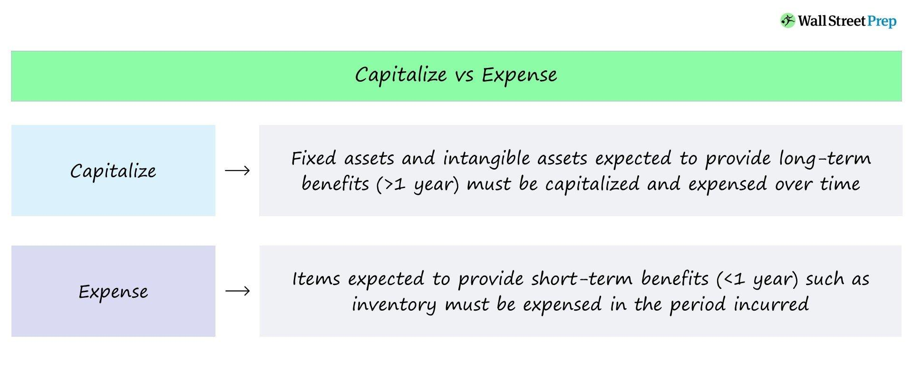

## Table of Contents

## What is capitalization of costs?

Capitalization of costs means recording a cost as an asset on a company's balance sheet instead of as an expense on the income statement. This is done when the cost is expected to provide future benefits to the company. For example, if a company buys a machine that will be used for many years, the cost of the machine is capitalized and shown as an asset. This way, the company can spread the cost over the useful life of the machine, matching the expense with the revenue it helps to generate.

Not all costs can be capitalized. Only costs that provide future economic benefits and meet certain accounting rules can be treated this way. For instance, costs like repairs and maintenance are usually expensed immediately because they don't provide long-term benefits. On the other hand, costs related to building a new factory or developing a new product can be capitalized because they will benefit the company over time. It's important for companies to follow the right accounting rules to make sure their financial statements are accurate and fair.

## Why is it important to capitalize costs in accounting?

Capitalizing costs is important in accounting because it helps show a true picture of a company's financial health. When costs are capitalized, they are recorded as assets on the balance sheet instead of being immediately expensed. This means that the cost is spread out over the time the asset will be used, which matches the expense with the revenue it helps to generate. This gives a clearer view of the company's profitability and financial position over time.

It also helps with better financial planning and decision-making. By capitalizing costs, a company can see how much it is investing in long-term assets like buildings, equipment, or new product development. This information is useful for planning future investments and understanding how these assets will contribute to the company's growth. Overall, capitalizing costs helps make sure that financial statements are accurate and fair, which is important for investors, lenders, and other stakeholders who rely on these reports to make decisions.

## What are the different types of costs that can be capitalized?

There are several types of costs that can be capitalized. These include the costs of buying or making long-term assets like buildings, machinery, or vehicles. For example, if a company buys a new truck, the cost of the truck can be capitalized. This also includes costs to get the asset ready for use, like installation fees or delivery charges. Another type of cost that can be capitalized is the cost of developing new products or software. If a company spends money on research and development to create a new product, those costs can be capitalized if they meet certain rules.

Another type of cost that can be capitalized is related to improving existing assets. If a company makes changes to a building or a piece of equipment that make it last longer or work better, those costs can be capitalized. For example, if a company adds a new wing to its factory, the cost of that addition can be capitalized. Costs for major repairs or upgrades that extend the life of an asset can also be capitalized, but regular maintenance costs cannot. It's important for companies to follow accounting rules to know which costs can be capitalized and which ones should be expensed right away.

## How does capitalization affect a company's financial statements?

When a company capitalizes costs, it affects the financial statements by showing the costs as assets on the balance sheet instead of expenses on the income statement right away. This makes the company's profit look higher in the short term because the expenses are spread out over time. For example, if a company buys a machine for $10,000, it can capitalize this cost and show it as an asset. Instead of taking the full $10,000 as an expense in the year it was bought, the company can spread this cost over the years the machine will be used.

This also affects the cash flow statement. Even though the cost is shown as an asset, the money spent to buy the asset is still shown as a cash outflow in the investing activities section. Over time, as the asset is used, the company will record depreciation or amortization expenses on the income statement. These expenses will reduce the asset's value on the balance sheet and also reduce the company's profit. This way, the cost of the asset is matched with the revenue it helps to generate over its useful life.

## What are the criteria for capitalizing a cost?

To capitalize a cost, it must meet certain rules. The main rule is that the cost must provide future benefits to the company. This means the cost should help the company make money in the future. For example, if a company buys a new machine, the cost of the machine can be capitalized because it will help the company make products and earn money over many years.

Another important rule is that the cost must be for something that will last a long time. Usually, this means the asset should last more than one year. Also, the cost should be for buying, making, or improving an asset, not just fixing it. For example, if a company adds a new wing to its factory, that cost can be capitalized because it makes the factory bigger and better. But if the company just fixes a broken window, that cost cannot be capitalized because it doesn't make the factory last longer or work better.

## Can you explain the difference between capitalizing and expensing a cost?

When a company capitalizes a cost, it means they treat the cost as an asset on their balance sheet instead of an expense on their income statement right away. This is done for costs that will help the company make money in the future. For example, if a company buys a new machine, they can capitalize the cost of the machine because it will help them make products for many years. By capitalizing the cost, the company spreads the expense over the time the machine will be used, which makes their profit look higher in the short term.

On the other hand, when a company expenses a cost, they take the full amount as an expense on their income statement right away. This is done for costs that don't provide long-term benefits, like regular maintenance or office supplies. For example, if a company buys paper for their office, they would expense the cost of the paper because it won't help them make money in the future. Expensing the cost means the company's profit will be lower in the year they bought the paper, but it won't affect their profits in future years.

## What are the tax implications of capitalizing costs?

When a company capitalizes costs, it can change how much tax they have to pay. Instead of taking the full cost as an expense in the year they bought it, they spread the cost over many years. This means their profit looks higher in the short term, so they might have to pay more tax in the first year. But over time, as they start to expense the cost through depreciation, their profit will go down and they will pay less tax in future years.

This can help companies plan their taxes better. By capitalizing costs, they can match the tax they pay with the money they make from the asset over time. But it's important for companies to follow the tax rules carefully. Different countries have different rules about what costs can be capitalized and how long it takes to expense them. If a company doesn't follow the rules, they might have to pay more tax or even get in trouble with the tax office.

## How do companies determine the useful life of a capitalized asset?

Companies figure out the useful life of a capitalized asset by looking at how long they think the asset will help them make money. They often use guidelines from the government or industry standards to help them decide. For example, a company might look at how long similar assets last for other businesses in their industry. They might also think about how much they plan to use the asset and how fast it might wear out. If a company buys a computer, they might guess it will last about three years because that's how long most computers last before they need to be replaced.

Sometimes, companies can change their minds about the useful life of an asset if something unexpected happens. If the asset starts to wear out faster than they thought, or if they find a way to make it last longer, they can change the useful life. This is important because it affects how much the company can expense each year and how much tax they have to pay. By getting the useful life right, companies can make sure their financial statements show a true picture of how the asset is helping them make money over time.

## What are some common errors businesses make when capitalizing costs?

One common mistake businesses make when capitalizing costs is not following the rules about what can be capitalized. Some businesses might try to capitalize costs that should be expensed right away, like small repairs or regular maintenance. This can make their profits look higher in the short term, but it's not allowed by accounting rules. If they get caught, they could have to pay more taxes or get in trouble with the tax office.

Another mistake is not getting the useful life of an asset right. Businesses need to guess how long an asset will help them make money, but sometimes they guess wrong. If they say an asset will last too long, they might not expense enough each year, which can make their profits look too high. If they say it will last too short a time, they might expense too much each year, which can make their profits look too low. It's important to get this right so their financial statements show a true picture of how the asset is helping them make money over time.

## How does the capitalization of costs impact a company's profitability and cash flow?

When a company capitalizes costs, it shows those costs as assets on the balance sheet instead of expenses on the income statement right away. This makes the company's profit look higher in the short term because the expenses are spread out over time. For example, if a company buys a machine for $10,000, it can capitalize this cost and show it as an asset. Instead of taking the full $10,000 as an expense in the year it was bought, the company can spread this cost over the years the machine will be used. This means the company's profit will be higher in the first year, but it will go down a bit each year as they start to expense the cost through depreciation.

Capitalizing costs also affects a company's cash flow. Even though the cost is shown as an asset, the money spent to buy the asset is still shown as a cash outflow in the investing activities section of the cash flow statement. Over time, as the asset is used, the company will record depreciation or amortization expenses on the income statement. These expenses will reduce the asset's value on the balance sheet and also reduce the company's profit. But they don't affect the cash flow directly because depreciation is a non-cash expense. So, while capitalizing costs can make a company's profit look better in the short term, it doesn't change the fact that they spent the money to buy the asset.

## What are the international accounting standards related to the capitalization of costs?

International accounting standards, like those set by the International Accounting Standards Board (IASB), have rules about when and how companies can capitalize costs. One important standard is IAS 16, which deals with property, plant, and equipment. It says that companies can capitalize the cost of buying or making long-lasting assets if those assets will help the company make money in the future. This includes the cost of the asset itself, plus any other costs needed to get it ready for use, like delivery or installation fees. But companies can't capitalize costs for regular maintenance or small repairs because those don't make the asset last longer or work better.

Another important standard is IAS 38, which focuses on intangible assets like patents or software. It says that companies can capitalize costs for developing new products or software if they meet certain rules. The costs have to be clearly linked to the development of the asset, and the company has to be sure that the asset will help them make money in the future. If the costs don't meet these rules, they have to be expensed right away. These standards help make sure that companies around the world follow the same rules when they decide to capitalize costs, which makes it easier for people to compare financial statements from different countries.

## How do advanced accounting software systems assist in the management and tracking of capitalized costs?

Advanced accounting software systems help businesses keep track of capitalized costs by making it easy to record and manage these costs. When a company buys a new asset, like a machine or a building, the software lets them enter the cost as an asset right away. It also helps them keep track of other costs related to the asset, like delivery or installation fees. The software can automatically spread the cost of the asset over its useful life, so the company doesn't have to do this by hand. This makes it easier for the company to see how much they are spending on long-term assets and how these costs affect their profits over time.

These systems also help with following the rules about capitalizing costs. They can be set up to follow the rules from different countries or industries, so the company knows they are doing things the right way. The software can remind the company when it's time to start expensing the cost of an asset through depreciation, and it can even do the calculations for them. This helps the company make sure their financial statements are correct and fair. By using advanced accounting software, businesses can manage their capitalized costs better and make smarter decisions about their money.

## What is the understanding of accounting costs in algorithmic trading?

Accounting costs in algorithmic trading represent the various expenses that are incurred during the operation and maintenance of trading algorithms. These costs are critical metrics in determining the financial efficiency and viability of trading strategies utilized by firms. 

**Development Costs:** The creation of algorithmic trading systems necessitates substantial investment in programming, system design, back-testing, and other technical aspects. Development costs can be extensive, as they often require hiring skilled software engineers and data scientists to create algorithmic models that can process vast datasets and execute trades in milliseconds.

**Data Acquisition Costs:** High-frequency trading relies heavily on real-time data feeds to make informed trading decisions. Acquiring data from exchanges or third-party vendors incurs significant expenses. These vendor fees are associated with obtaining historical market data, real-time market quotes, and news feeds essential for algorithmic operations. 

**Compliance Fees:** Algorithmic trading falls under strict regulatory scrutiny to prevent market abuses such as spoofing and front running. To comply with financial regulations, firms must spend on legal services, audits, and the implementation of systems that monitor trading activities and ensure regulatory adherence. Compliance fees also cover costs associated with reporting transactions to financial authorities and maintaining auditable trails.

**Sound Financial Analysis through Proper Accounting:** To enable effective financial analysis, it's essential to ensure that all costs are accurately recorded and aligned with accounting principles. This involves employing robust accounting systems that categorize expenses correctly, facilitate ongoing cost monitoring, and aid in the periodic assessment of trading performance. Accurate accounting enables firms to derive metrics such as Cost-Benefit Analysis (CBA), which compares the benefits or revenue derived from algorithmic trading to the overall costs, as shown in the formula below:

$$
\text{CBA} = \frac{\text{Total Revenue from Trading} - \text{Total Costs}}{\text{Total Costs}}
$$

Proper cost accounting ensures clear visibility into profitability and operational efficiency, providing management with the detailed insights necessary for strategic decision-making. Automating these processes using software solutions can further streamline cost management, reduce manual errors, and provide real-time insights into cost structures and their implications.

## What is the Role of Capitalization in Financial Reporting?

Capitalization in financial reporting plays a crucial role by enabling firms to defer the immediate recognition of certain costs as expenses, instead reflecting them as assets on the balance sheet. This accounting approach allows companies to distribute significant expenditures, such as those related to software development and infrastructure upgrades, across multiple accounting periods. By doing so, firms can stabilize their financial reports, providing a smoother representation of their financial performance over time.

In [algorithmic trading](/wiki/algorithmic-trading), the rapid evolution of technology necessitates substantial investment in the development and enhancement of trading platforms. Typically, these expenditures include the creation of proprietary trading algorithms, acquisition or leasing of data feeds, and upgrading of technological infrastructure. When these costs are capitalized, they are recorded as assets, gradually expensed as amortization or depreciation over their useful life. For example, if a trading firm develops a software system costing $1,000,000 and estimates a useful life of five years, the firm can amortize the cost at $200,000 per year, rather than expensing the full amount in the year incurred.

Mathematically, the annual amortization expense for a capitalized cost C over N years can be represented as:

$$
\text{Annual Amortization Expense} = \frac{C}{N}
$$

Applying capitalization ensures a firm's financial results are not adversely impacted by large, one-time expenses, which can lead investors and stakeholders to perceive financial instability. This method also facilitates a more accurate comparison of a firm's financial health over time and against competitors, particularly in industries like algorithmic trading, where technological investment is both significant and constant.

Proper capitalization also enhances a firm's balance sheet by increasing asset values, which can improve key financial metrics such as the return on assets (ROA) and equity ratios. This strategic financial reporting supports algo-trading firms in portraying a robust financial status, which is beneficial when seeking investments or financing.

## What are the benefits of capitalization for algo-trading firms?

Capitalization of costs in algorithmic trading firms offers significant advantages that impact both financial health and operational efficiency. By capitalizing costs, firms improve their balance sheets, which in turn enhances critical financial ratios such as return on assets (ROA) and debt to equity. This improvement is achieved as expenses are not immediately subtracted from revenues, but are instead recorded as assets on the balance sheet and amortized over time. This treatment results in a higher net income in the short term, boosting investor confidence and making the firm more appealing to potential financiers.

Cost management is also optimized through the capitalization process. By spreading expenses over multiple periods, firms can avoid large, singular impacts on their financial statements that may distort performance analysis and strategic decision-making. For instance, a substantial investment in trading software that is capitalized allows a firm to amortize the expense aligned with the software's useful economic life, typically resulting in a smoother expense pattern across reporting periods. This approach can be illustrated using the equation for linear amortization:

$$
\text{Amortization Expense} = \frac{\text{Initial Cost} - \text{Residual Value}}{\text{Useful Life}}
$$

The stability afforded by capitalization is another notable benefit. Stable earnings reports are critical for maintaining investor trust and supporting stock price stability. Fluctuations in earnings due to one-time expense recognitions can lead to [volatility](/wiki/volatility-trading-strategies) in perceived business performance, affecting investor sentiment negatively. Consistent earnings, obtained through a well-managed capitalization strategy, are fundamental in securing favorable loan terms and capital investments, as they reflect reduced financial risk to lenders and investors alike.

By adopting capitalization, algo-trading firms can navigate financial challenges more effectively, positioning themselves competitively within the financial technology sector. The adoption of consistent capitalization policies aligned with financial reporting standards ensures transparency and reliability, which are essential qualities in today's data-driven trading environments.

## References & Further Reading

[1]: Bergstra, J., Bardenet, R., Bengio, Y., & Kégl, B. (2011). ["Algorithms for Hyper-Parameter Optimization."](https://dl.acm.org/doi/10.5555/2986459.2986743) Advances in Neural Information Processing Systems 24.

[2]: ["Advances in Financial Machine Learning"](https://www.amazon.com/Advances-Financial-Machine-Learning-Marcos/dp/1119482089) by Marcos Lopez de Prado

[3]: ["Evidence-Based Technical Analysis: Applying the Scientific Method and Statistical Inference to Trading Signals"](https://www.amazon.com/Evidence-Based-Technical-Analysis-Scientific-Statistical/dp/0470008741) by David Aronson

[4]: ["Machine Learning for Algorithmic Trading"](https://github.com/PacktPublishing/Machine-Learning-for-Algorithmic-Trading-Second-Edition) by Stefan Jansen

[5]: ["Quantitative Trading: How to Build Your Own Algorithmic Trading Business"](https://books.google.com/books/about/Quantitative_Trading.html?id=j70yEAAAQBAJ) by Ernest P. Chan