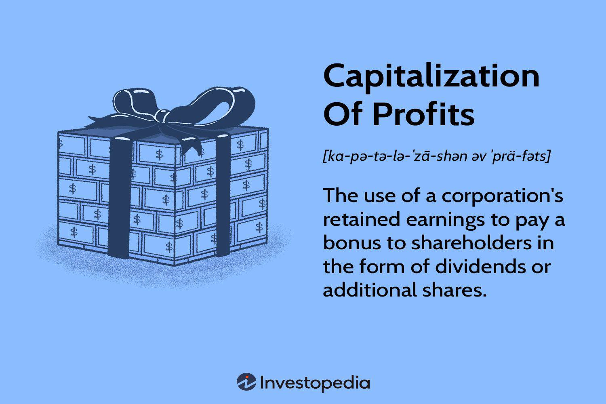

In the rapidly evolving world of finance, acquiring a firm grasp of financial jargon is essential for anyone interested in exploring investment opportunities. As financial markets and instruments become increasingly complex, understanding the specific vocabulary used in the industry is crucial for making informed decisions. This article aims to highlight significant financial terminologies such as capitalization of profits and algorithmic trading, and to elucidate their roles in modern financial frameworks.

Capitalization of profits involves the utilization of a company's retained earnings to reward shareholders, either through dividends or by issuing additional shares. This approach allows firms to enhance shareholder value without depleting their cash reserves. Being familiar with this concept equips investors with a better understanding of how companies prioritize and implement shareholder reward policies, a critical factor that can influence investment choices and strategy.



Algorithmic (or algo) trading, on the other hand, employs intricate computer algorithms to execute trading orders at speeds and efficiencies far beyond human capability. This form of trading is pivotal to current market dynamics, offering the potential for increased liquidity and improved market efficiency. Algo trading strategies provide traders the ability to manage extensive trading volumes with precision and to exploit transient market inefficiencies—opportunities that traditional trading methods might overlook.

Both concepts—capitalization of profits and algorithmic trading—play significant roles in shaping trading strategies and in realizing profits in today's financial landscape. A nuanced understanding of these can not only potentially enhance investors' strategies but also help in navigating the intricacies of modern finance with increased confidence. The forthcoming sections will provide a deeper exploration into these terminologies, discussing how they integrate with trading strategies and impact profit realization.

## Table of Contents

## Understanding Financial Terminology

Financial terminology is critical in shaping investment strategies by influencing decision-making and outcomes. For investors, clear definitions and thorough understanding are essential to make informed decisions. Terms such as 'capitalization' and 'profits' possess distinct meanings and implications, affecting financial reporting and decisions by stakeholders.

Capitalization refers to the total market value of a company’s outstanding shares, often used as a measure of a company's size. It can impact investment decisions as investors typically categorize companies into large-cap, mid-cap, and small-cap. This classification can influence portfolio diversification and risk management strategies.

Profits, the financial gains realized when revenue exceeds expenses, are key indicators of a company's financial health. They can directly affect shareholder value and influence strategic choices like reinvestment, dividend payout, and expansion. Understanding the nuances in profit reporting, such as gross profit, operating profit, and net profit, allows investors to assess the operational efficiency and financial viability of a company.

By mastering financial terminology, investors navigate financial reports with greater clarity and insight. This knowledge aids in interpreting economic forecasts and identifying market trends, thus playing a crucial role in achieving successful investment outcomes.

## Capitalization of Profits

Capitalization of profits is a strategic approach adopted by corporations to enhance shareholder value through mechanisms such as dividends or the issuance of additional shares. This financial maneuver leverages retained earnings, which are essentially the profits that a company decides to retain rather than disburse as dividends. By converting these retained profits into equity, companies can reward shareholders without diminishing their cash reserves, thus maintaining [liquidity](/wiki/liquidity-risk-premium) and financial stability.

The process involves issuing bonus shares to existing shareholders, which increases the company's share capital without bringing in new funds. For instance, a company with a retained earnings balance of $1 million might issue 100,000 new shares valued at $10 each, transferring this amount from retained earnings to share capital. This move effectively reallocates the company's financial resources from retained earnings to equity, reflecting a change in the company's capital structure without an actual outflow of cash.

The benefits of capitalization of profits are manifold. Firstly, it signals corporate health, indicating that the company is doing well enough to provide returns to investors in the form of additional shares. This can enhance investor confidence and attract new investors. Secondly, it offers tax advantages in certain jurisdictions where capital gains are taxed more favorably than dividend income.

Moreover, understanding this concept provides insights into a company's policy regarding shareholder rewards. Companies that frequently capitalize profits might be focused on long-term capital growth rather than immediate cash returns. Such a strategy can align with the interests of investors seeking to increase their equity stakes over time.

Overall, by transforming profits into equity, companies not only reward loyal shareholders but also bolster their financial structure, preparing themselves for future growth opportunities without sacrificing present liquidity. This method of profit allocation is an essential tool in corporate financial management, offering a balanced approach to shareholder value creation.

## Algorithmic Trading and Its Impact

Algorithmic trading employs computer algorithms to automate trading activities, enabling orders to be executed rapidly and with minimal human intervention. This technology has transformed trading by allowing participants to handle vast quantities of trades with remarkable speed and precision, thereby reducing the market impact of large transactions. The primary advantage of [algorithmic trading](/wiki/algorithmic-trading) lies in its ability to process complex calculations and data sets far more efficiently than traditional methods.

One of the significant impacts of algorithmic trading is its contribution to market liquidity. By facilitating the quick execution of trades, algorithmic strategies help ensure that markets remain fluid, with tighter bid-ask spreads and more consistent price signals. This liquidity is crucial for maintaining market stability, as it allows investors to enter and [exit](/wiki/exit-strategy) positions with ease, minimizing the potential for large price swings caused by block trades.

Additionally, algorithmic trading enhances market efficiency by allowing real-time analysis of vast amounts of data. This capability enables the swift identification of [arbitrage](/wiki/arbitrage) opportunities and discrepancies in asset pricing, which helps align prices more closely with their intrinsic values. For instance, algorithms can be programmed to exploit price differences across different exchanges or between related securities, contributing to the arbitrage process that keeps markets efficient.

Python is commonly used in the development of algorithmic trading strategies due to its extensive libraries and frameworks that simplify data handling and model implementation. For example, using the `pandas` library for data manipulation and `numpy` for numerical computations, traders can efficiently develop and backtest trading models. Here is an example of a simple moving average crossover strategy in Python:

```python
import pandas as pd

# Load data
data = pd.read_csv('stock_data.csv')
data['SMA_50'] = data['Close'].rolling(window=50).mean()
data['SMA_200'] = data['Close'].rolling(window=200).mean()

# Generate signals
data['Signal'] = 0  # Initialize column
data['Signal'][50:] = np.where(data['SMA_50'][50:] > data['SMA_200'][50:], 1, 0)

# Compute trading position based on signals
data['Position'] = data['Signal'].diff()

# Calculate returns
data['Return'] = data['Close'].pct_change()
data['Strategy_Return'] = data['Return'] * data['Position'].shift(1)

# Print final strategy return
print("Total Strategy Return:", data['Strategy_Return'].sum())
```

In this script, a simple moving average (SMA) crossover strategy is implemented, where buy and sell signals are generated based on the crossing of the 50-day and 200-day moving averages. This kind of strategy illustrates how algorithmic trading can automate decision-making processes, reacting swiftly to changes in market conditions.

While the benefits of algorithmic trading are substantial, they also come with challenges, such as the potential for exacerbating market [volatility](/wiki/volatility-trading-strategies) during periods of stress. As such, regulatory bodies continue to monitor and adapt to the evolving landscape of algorithmic trading to ensure that its contribution to market efficiency does not come at the expense of market stability.

## Profits in the Era of Algo Trading

Algorithmic trading has revolutionized how profits are generated in modern financial markets. By employing sophisticated computer algorithms, traders can swiftly identify and exploit market inefficiencies, effectively enhancing profit margins with precision and speed that manual methods cannot match. This synergy between algorithms and profitability is essential for developing competitive trading strategies.

At the core of algorithmic trading is the ability to process vast amounts of market data in real time, identify arbitrage opportunities, and execute trades at speeds unattainable by human traders. For example, [statistical arbitrage](/wiki/statistical-arbitrage) strategies involve scanning for temporary price discrepancies across various financial instruments, allowing traders to buy low and sell high almost instantaneously. 

To illustrate, consider a simple moving average crossover strategy implemented using Python:

```python
import pandas as pd
import numpy as np

# Load historical data
data = pd.read_csv('historical_prices.csv')
data['SMA_50'] = data['Close'].rolling(window=50).mean()
data['SMA_200'] = data['Close'].rolling(window=200).mean()

# Identify buy/sell signals
data['Signal'] = np.where(data['SMA_50'] > data['SMA_200'], 1, -1)  # 1 for buy, -1 for sell

# Example of executing trades based on signals
data['Position'] = data['Signal'].shift()
data.dropna(inplace=True)
```

This code snippet tracks a simple moving average crossover on historical price data, signaling potential buy/sell actions when short-term trends cross long-term moving averages. Traders can capitalize on the shifting [momentum](/wiki/momentum) to generate profits. 

Moreover, high-frequency trading ([HFT](/wiki/high-frequency-trading-strategies)), a subset of algorithmic trading, pushes these strategies to the extreme, executing thousands of trades in fractions of a second. Such methods hinge upon minimal market impact, leveraging speed and access to liquidity for profit generation. Despite its potential, traders must be wary of associated challenges, such as increased transaction costs and the risk of overfitting algorithms to historical data.

In optimizing profitability, understanding the role of [machine learning](/wiki/machine-learning) in creating adaptive algorithmic strategies is crucial. Algorithms increasingly incorporate predictive analytics, harnessing both historical and real-time data to forecast market trends and adjust trading actions accordingly. By employing machine learning models, traders can adapt to market conditions dynamically, optimizing positions based on predicted market movements.

Ultimately, the integration of algorithmic strategies represents a potent tool for profit realization. Traders proficient in these technologies can dissect fleeting market opportunities, crafting agile strategies that cater to evolving financial landscapes. Understanding the nuances of algorithm-driven trading beyond the execution speed, including factors like data quality, model robustness, and market conditions, is pivotal for maintaining a competitive edge.

## Challenges and Considerations

Though algorithmic trading offers significant advantages in terms of speed and efficiency, it also presents a set of challenges that necessitate comprehensive risk management strategies. One of the primary concerns is market volatility. Algorithmic trading can exacerbate price fluctuations due to the high [volume](/wiki/volume-trading-strategy) and speed of trades executed automatically. This volatility is particularly apparent during events known as flash crashes, where large sell-offs can trigger precipitous price drops within a very short time frame. The May 6, 2010, flash crash serves as a quintessential example, where the Dow Jones Industrial Average plummeted about 1,000 points in mere minutes before quickly recovering.

Algorithmic faults present another layer of complexity. Algorithms, while precise, are not infallible and may malfunction due to coding errors or unforeseen market conditions. Such issues can lead to unintended trading activities, resulting in significant financial losses. To mitigate these risks, traders must implement exhaustive testing and regular monitoring of their algorithms, ensuring that they perform reliably under varied market conditions.

Robust risk management strategies are essential to address these challenges. Techniques such as stress testing and scenario analysis can help assess the potential impact of extreme market events on algorithmic performance. Additionally, implementing circuit breakers that temporarily halt trading during severe market movements can prevent catastrophic losses.

Investors and traders must maintain a keen understanding of both the potential and limitations inherent in automated trading systems. While these systems can execute complex strategies with unparalleled precision, human oversight remains critical to manage unexpected market dynamics and technical anomalies. By balancing algorithmic efficiency with careful risk assessment and strategic oversight, stakeholders can capitalize on the benefits of automated trading while minimizing its risks.

## Conclusion

In conclusion, a thorough understanding of financial terminology, the capitalization of profits, and the role of algorithmic trading is essential for achieving success in contemporary finance. Each element contributes uniquely to the landscape of investment strategies and market dynamics. 

An understanding of financial terminology equips traders and investors with the ability to interpret financial reports and forecasts effectively. A firm grasp on terms such as 'capitalization' and 'profits' aids in informed decision-making and optimizing financial outcomes.

The capitalization of profits is a key strategy for corporations, enabling them to reward shareholders without the substantial depletion of cash reserves. This practice not only enhances shareholder value but also reflects on a company's strategic approach to growth and reinvestment. Recognizing how a company capitalizes on its profits can provide significant insights into its long-term objectives and financial health.

Algorithmic trading, with its speed and precision, has revolutionized modern trading practices, allowing for the execution of complex strategies and market penetration with minimal human intervention. It plays a crucial role in providing market liquidity and enhancing efficiency. For traders, understanding the mechanics of algorithmic trading is crucial for leveraging technological advancements to adapt to competitive and fast-paced market conditions.

By integrating knowledge of these critical concepts, traders and investors can significantly enhance their strategies. This comprehension not only aids in improving profitability but also empowers market participants to navigate the evolving complexities of the financial markets with confidence and strategic foresight. Thus, remaining informed and adaptable are key traits for success in the continuously advancing realm of finance.

## References & Further Reading

[1]: Bergstra, J., Bardenet, R., Bengio, Y., & Kégl, B. (2011). ["Algorithms for Hyper-Parameter Optimization."](https://dl.acm.org/doi/10.5555/2986459.2986743) Advances in Neural Information Processing Systems 24.

[2]: ["Advances in Financial Machine Learning"](https://www.amazon.com/Advances-Financial-Machine-Learning-Marcos/dp/1119482089) by Marcos Lopez de Prado

[3]: ["Evidence-Based Technical Analysis: Applying the Scientific Method and Statistical Inference to Trading Signals"](https://www.amazon.com/Evidence-Based-Technical-Analysis-Scientific-Statistical/dp/0470008741) by David Aronson

[4]: ["Machine Learning for Algorithmic Trading"](https://github.com/stefan-jansen/machine-learning-for-trading) by Stefan Jansen

[5]: ["Quantitative Trading: How to Build Your Own Algorithmic Trading Business"](https://www.amazon.com/Quantitative-Trading-Build-Algorithmic-Business/dp/1119800064) by Ernest P. Chan