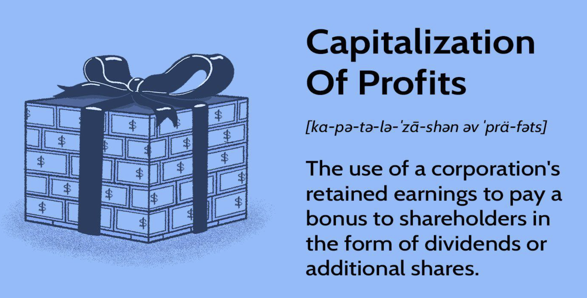

## Table of Contents

## What is capitalization of profits?

Capitalization of profits is when a company uses its earnings to create more value for the business instead of giving it away as dividends to shareholders. This can be done by investing the profits back into the company, like buying new equipment, starting new projects, or paying off debts. By doing this, the company hopes to grow bigger and become more profitable in the future.

When a company decides to capitalize its profits, it's making a choice to focus on long-term growth rather than short-term gains for shareholders. This can be good for the company because it can lead to more stability and the ability to expand. However, it might not be what some shareholders want, as they might prefer to receive dividends right away instead of waiting for the company to grow.

## Why is capitalization of profits important for businesses?

Capitalization of profits is important for businesses because it helps them grow and become stronger over time. When a company uses its earnings to buy new things or start new projects, it can make the business bigger and better. This can lead to more sales and more profits in the future. Instead of giving money to shareholders right away, the company keeps the money to make the business even better. This can make the company more stable and able to handle tough times.

Another reason capitalization of profits is important is that it can help a business stay competitive. If a company keeps investing in itself, it can keep up with or even get ahead of other businesses in the same industry. This can mean better products, new technology, or new ways of doing things. By focusing on long-term growth instead of short-term gains, the company can build a strong future for itself. This can make shareholders happy in the long run, even if they don't get dividends right away.

## How does capitalization of profits affect a company's financial statements?

When a company capitalizes its profits, it shows up in the financial statements in a few ways. Instead of showing the profits as income on the income statement and then paying them out as dividends, the company keeps the money and uses it to buy things like new equipment or to pay off debts. This means the income statement will show less profit because the money is being used for other things. But, the balance sheet will show more assets or less liabilities because of the investments or debt payments made with the profits.

The cash flow statement also changes when profits are capitalized. Instead of showing the profits as cash from operations and then showing a cash outflow for dividends, the cash flow statement will show the money being used for investments or to pay off debts. This can make the company look like it's using its cash more for growth than for paying shareholders. Overall, capitalizing profits can make a company's financial statements look different, showing more focus on long-term growth rather than short-term payouts.

## What are the common methods used for capitalizing profits?

One common way to capitalize profits is by reinvesting them into the business. This means using the money to buy new things like equipment or to start new projects. For example, a company might use its profits to build a new factory or to buy new computers for its workers. By doing this, the company hopes to grow bigger and make more money in the future. This can help the business stay strong and keep up with other companies in the same industry.

Another way to capitalize profits is by paying off debts. If a company has borrowed money, it can use its profits to pay back what it owes. This can make the company more stable because it won't have to pay as much interest on its debts. Instead of giving money to shareholders as dividends, the company keeps the money to make its financial situation better. This can help the business in the long run by making it less risky and more able to handle tough times.

## Can you explain the difference between capitalizing and expensing profits?

When a company capitalizes its profits, it uses the money to buy things that will help the business grow, like new equipment or to pay off debts. Instead of giving the money to shareholders as dividends, the company keeps it to make the business bigger and better. This is good for long-term growth because it can make the company more stable and able to handle tough times. It also helps the business stay competitive by investing in new projects or technology.

On the other hand, when a company expenses its profits, it uses the money to pay for things that don't last long, like office supplies or employee salaries. This means the money is spent right away and doesn't help the business grow over time. Expensing profits can be good for shareholders who want to get dividends now, but it might not be the best for the company's long-term health. By expensing profits, the company might miss out on chances to invest in its future.

## What are the tax implications of capitalizing profits?

When a company capitalizes its profits, it means they're using the money to buy things that will help the business grow, like new equipment or to pay off debts. This can affect the company's taxes because the money spent on these things can sometimes be deducted from the company's taxable income over time. Instead of paying taxes on the profits right away, the company can spread out the tax deductions over the life of the asset. This can help lower the company's tax bill in the years after they buy the new things.

But, if the company had expensed the profits instead, they would have used the money to pay for things that don't last long, like office supplies or employee salaries. When a company expenses its profits, it can usually deduct the full cost of these things from its taxable income in the year they're bought. This means the company might pay less tax in that year, but it won't get any tax benefits in future years from those expenses. So, capitalizing profits can help a company save on taxes over a longer period of time, while expensing profits can give a quick tax break but no long-term tax benefits.

## How does capitalization of profits impact a company's valuation?

When a company capitalizes its profits, it uses the money to buy things like new equipment or to pay off debts instead of giving it to shareholders as dividends. This can make the company more valuable because it's investing in its future growth. If the company uses the money wisely, it can become bigger and make more money over time. This can make investors think the company is worth more because it's growing and becoming more stable.

On the other hand, if shareholders were expecting dividends and don't get them, they might think the company is worth less. They might sell their shares, which could make the stock price go down. But if the company can show that capitalizing profits will lead to better results in the future, it might convince shareholders to keep their shares. In the long run, a company that uses its profits to grow can be seen as more valuable because it's building a strong future for itself.

## What are the potential risks associated with capitalizing profits?

One risk of capitalizing profits is that it might not work out as planned. When a company uses its money to buy new things or start new projects, there's a chance those things won't help the business grow as much as expected. If the new equipment breaks down or the new project fails, the company could lose the money it spent. This could make the business weaker instead of stronger, which could hurt its value and make shareholders unhappy.

Another risk is that shareholders might want dividends instead of waiting for the company to grow. If a company keeps its profits instead of giving them out, shareholders might think the company isn't doing enough for them right now. They might sell their shares, which could make the stock price go down. This could make it harder for the company to get new investors or borrow money, which could slow down its growth plans.

Overall, while capitalizing profits can help a company grow in the long run, it comes with risks. The company needs to be careful about how it spends its money and make sure it can show shareholders that its plans will pay off in the future. If it can't do that, capitalizing profits might end up hurting the business instead of helping it.

## How do different accounting standards treat the capitalization of profits?

Different accounting standards, like Generally Accepted Accounting Principles (GAAP) and International Financial Reporting Standards (IFRS), have rules about how companies can capitalize their profits. GAAP is used mostly in the United States and has strict rules about what counts as a capital expenditure. For example, GAAP says that a company can only capitalize costs that will benefit the business for more than one year, like buying a new machine. If the cost doesn't last long, like office supplies, it has to be expensed instead. This means that under GAAP, a company might have to show more expenses on its income statement and less profit if it's using profits for short-term things.

IFRS, which is used in many other countries, is a bit more flexible than GAAP. IFRS allows companies to capitalize more types of costs if they can show that the costs will bring future benefits to the business. For example, under IFRS, a company might be able to capitalize the cost of developing a new product if it can prove that the product will make money in the future. This can make the company's financial statements look different because it might show more assets and less expenses than a company following GAAP. So, the way a company capitalizes its profits can depend a lot on which accounting standard it follows.

## What are some real-world examples of companies capitalizing profits?

One real-world example of a company capitalizing profits is Apple. Instead of giving all its profits to shareholders as dividends, Apple uses a lot of its money to make new products and improve the ones it already has. For example, Apple spends a lot on research and development to create new iPhones and iPads. By doing this, Apple hopes to keep making new things that people want to buy, which can help the company grow bigger and make more money in the future.

Another example is Amazon. Amazon doesn't pay big dividends to its shareholders. Instead, it uses its profits to grow its business. Amazon spends a lot of money building new warehouses and improving its delivery system. This helps Amazon get products to customers faster and more cheaply, which can make more people want to shop there. By using its profits this way, Amazon is trying to become a bigger and stronger company over time.

## How does the capitalization of profits relate to sustainable growth models?

When a company capitalizes its profits, it's choosing to use the money to help the business grow bigger and last longer instead of giving it to shareholders right away. This is a lot like what sustainable growth models are all about. Sustainable growth means a company grows in a way that can keep going for a long time without hurting the business. By using profits to buy new things or start new projects, a company can keep growing without having to borrow more money or depend on outside help. This can make the business stronger and more able to handle tough times.

For example, if a company uses its profits to build a new factory or buy new technology, it can make more products or better products. This can help the company make more money over time and keep growing without stopping. It's like planting a seed and letting it grow into a big tree instead of [picking](/wiki/asset-class-picking) the fruit right away. By focusing on sustainable growth, a company can keep getting bigger and better, which is good for the business and for the people who own shares in it.

## What advanced strategies can companies employ to optimize the capitalization of profits?

Companies can use a few smart strategies to make the best use of their profits. One way is to put money into research and development. This means spending on new ideas and technologies that can make the company's products better or create new ones. By doing this, the company can stay ahead of others in the same business and keep growing. Another smart move is to buy other companies that can help them grow faster. This is called making acquisitions. If a company finds another business that fits well with what they do, buying it can make them bigger and stronger quicker than starting from scratch.

Another strategy is to use profits to make the company's operations more efficient. This could mean spending on new machines or systems that help the company make things faster or cheaper. When a company does this, it can save money and make more profit in the long run. Also, companies can use profits to expand into new places where they can sell more of their products. This means opening new stores or selling in new countries. By spreading out where they sell, companies can reach more customers and make more money, which helps them grow in a sustainable way.

## References & Further Reading

[1]: Bergstra, J., Bardenet, R., Bengio, Y., & Kégl, B. (2011). ["Algorithms for Hyper-Parameter Optimization."](https://dl.acm.org/doi/10.5555/2986459.2986743) Advances in Neural Information Processing Systems 24.

[2]: ["Advances in Financial Machine Learning"](https://www.amazon.com/Advances-Financial-Machine-Learning-Marcos/dp/1119482089) by Marcos Lopez de Prado

[3]: ["Evidence-Based Technical Analysis: Applying the Scientific Method and Statistical Inference to Trading Signals"](https://www.amazon.com/Evidence-Based-Technical-Analysis-Scientific-Statistical/dp/0470008741) by David Aronson

[4]: ["Machine Learning for Algorithmic Trading"](https://github.com/stefan-jansen/machine-learning-for-trading) by Stefan Jansen

[5]: ["Quantitative Trading: How to Build Your Own Algorithmic Trading Business"](https://www.amazon.com/Quantitative-Trading-Build-Algorithmic-Business/dp/1119800064) by Ernest P. Chan