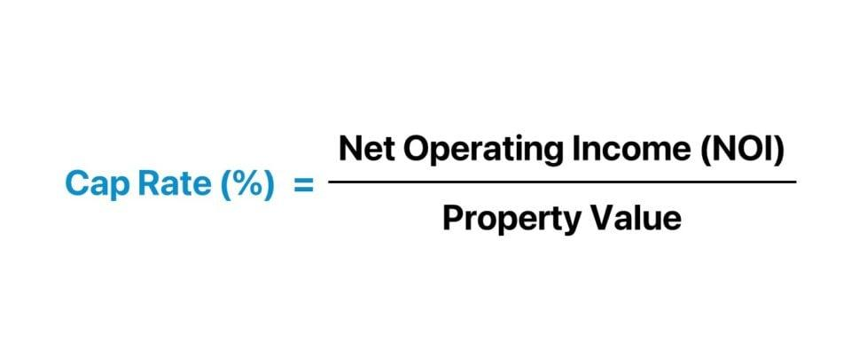

## Table of Contents

## What is the Capitalization Rate (Cap Rate)?

The Capitalization Rate, often called the Cap Rate, is a way to figure out how much money an investment property might make each year. It's found by taking the property's net operating income (the money left after paying all the bills to run the property) and dividing it by the property's current market value or purchase price. The Cap Rate is shown as a percentage, and a higher Cap Rate usually means the investment could bring in more money, but it might also be riskier.

Cap Rates are really helpful for comparing different properties or seeing if a property is a good investment. For example, if you're looking at two similar buildings but one has a higher Cap Rate, it might be a better choice if you're okay with the extra risk. But remember, the Cap Rate doesn't tell the whole story. It doesn't include things like the money you borrow to buy the property or the taxes you'll pay on the income it generates. So, while it's a useful tool, it's just one part of deciding if an investment is right for you.

## Why is the Cap Rate important in real estate?

The Cap Rate is important in real estate because it helps investors see how much money a property might make each year. It's like a quick way to compare different properties. If you're looking at two buildings and one has a higher Cap Rate, it might make more money, but it could also be riskier. So, the Cap Rate helps you decide which property might be a better investment for you.

But, the Cap Rate isn't perfect. It doesn't include everything, like the money you borrow to buy the property or the taxes you'll pay on the income. So, while it's a useful tool, it's just one part of deciding if an investment is right for you. You need to look at other things too, like how easy it is to rent out the property and how much it might cost to fix it up.

## How do you calculate the Cap Rate?

To calculate the Cap Rate, you need to know two things: the property's net operating income (NOI) and its current market value or purchase price. The NOI is the money left over after paying all the costs to run the property, like maintenance and property taxes. You take the NOI and divide it by the property's value or purchase price. Then, you multiply the result by 100 to turn it into a percentage. That percentage is the Cap Rate.

For example, if a property has a NOI of $50,000 and its market value is $500,000, you would divide $50,000 by $500,000 to get 0.1. Multiply 0.1 by 100 to get a Cap Rate of 10%. This means the property could potentially earn 10% of its value each year, before considering things like loan payments or income taxes.

## What are the key components of the Cap Rate formula?

The Cap Rate formula has two main parts: the net operating income (NOI) and the property's value or purchase price. The NOI is the money left over after paying all the costs to run the property, like maintenance and property taxes. It's what the property makes before you pay for things like loans or income taxes. The property's value or purchase price is what the property is worth or what you paid for it.

To find the Cap Rate, you divide the NOI by the property's value or purchase price. Then, you turn that number into a percentage by multiplying by 100. For example, if a property's NOI is $50,000 and its value is $500,000, you divide $50,000 by $500,000 to get 0.1. Multiply 0.1 by 100 to get a Cap Rate of 10%. This means the property could potentially earn 10% of its value each year, before considering things like loan payments or income taxes.

## Can you provide a simple example of calculating the Cap Rate?

Let's say you're looking at a building that makes $100,000 a year after paying for things like repairs and taxes. That's the net operating income, or NOI. The building is worth $1 million. To find the Cap Rate, you divide the NOI by the building's value. So, you take $100,000 and divide it by $1 million. That gives you 0.1.

Now, to turn that into a percentage, you multiply 0.1 by 100. That gives you a Cap Rate of 10%. This means the building could make 10% of its value each year, before you pay for things like loans or income taxes. So, if you're thinking about buying this building, the Cap Rate helps you see how much money it might make.

## How does the Cap Rate differ from other investment metrics like ROI?

The Cap Rate and Return on Investment (ROI) are both used to see how good an investment might be, but they look at different things. The Cap Rate is all about how much money a property makes each year compared to what it's worth. It's like a quick way to see if a property is making enough money. You don't need to know about loans or taxes to use it. On the other hand, ROI looks at the total profit you make from an investment over time, including everything like loans, taxes, and any money you put into fixing up the property.

So, the Cap Rate is simpler and focuses just on the yearly income from the property, while ROI gives you a bigger picture of all the money coming in and going out over the life of the investment. If you're comparing different properties quickly, the Cap Rate can be really helpful. But if you want to see the full impact of an investment, including all the costs and benefits, ROI is a better tool to use.

## What factors can influence the Cap Rate of a property?

Several things can change the Cap Rate of a property. One big thing is how risky the investment seems. If people think a property is riskier, they might want a higher return, so the Cap Rate goes up. The location of the property matters too. If it's in a popular area where lots of people want to live or work, the Cap Rate might be lower because the property is seen as safer and more likely to keep making money. Also, how easy it is to rent out the property can affect the Cap Rate. If it's hard to find tenants, the Cap Rate might go up because it's riskier.

Another thing that can change the Cap Rate is the overall economy. When interest rates are high, people might want a higher return from their investments, which can push up the Cap Rate. On the other hand, if interest rates are low, the Cap Rate might go down because people are okay with lower returns. The condition of the property also plays a role. If a building needs a lot of repairs, the Cap Rate might be higher because it's riskier. But if the property is in great shape, the Cap Rate could be lower because it's seen as a safer bet.

## How can investors use the Cap Rate to compare different investment opportunities?

Investors use the Cap Rate to compare different properties by looking at how much money each one makes each year compared to its price. If one property has a higher Cap Rate than another, it might make more money, but it could also be riskier. For example, if you're looking at two similar buildings, and one has a Cap Rate of 8% and the other has a Cap Rate of 10%, the one with the 10% Cap Rate might make more money each year. But, you need to think about why it has a higher Cap Rate. Maybe it's in a less popular area, or maybe it needs more repairs. So, the Cap Rate helps you see which property might be a better deal, but you need to look at other things too.

The Cap Rate is just one part of the puzzle when comparing investments. It doesn't tell you everything, like how much you'll pay for loans or taxes. So, while it's a quick and easy way to compare properties, you should also think about other factors. For example, how easy will it be to find tenants? How much will it cost to fix up the property? And what's happening in the economy right now? By looking at all these things together, you can get a better idea of which investment might be the best choice for you.

## What are the limitations of using the Cap Rate as an investment tool?

The Cap Rate is a handy tool for quickly comparing properties, but it has some big limitations. One big problem is that it doesn't include everything. It only looks at the money the property makes each year after paying for things like repairs and taxes. It doesn't consider the money you borrow to buy the property, or the taxes you'll pay on the income it generates. So, while the Cap Rate can give you a quick idea of how much money a property might make, it doesn't tell you the whole story about your investment.

Another limitation is that the Cap Rate can be affected by things that might not be obvious at first. For example, a high Cap Rate might mean the property is riskier, maybe because it's in a less popular area or needs a lot of repairs. Also, the Cap Rate doesn't take into account how the economy is doing or what might happen in the future. Interest rates, how easy it is to find tenants, and even the condition of the property can all change the Cap Rate. So, while it's useful for comparing properties, you need to look at other things too to get a full picture of your investment.

## How does the Cap Rate relate to risk and expected return in real estate?

The Cap Rate helps investors see the link between risk and how much money they might make from a property. A higher Cap Rate usually means the property could make more money each year, but it also means it might be riskier. For example, if a property has a high Cap Rate, it could be because it's in a less popular area where it's harder to find tenants, or because the building needs a lot of repairs. So, when you see a high Cap Rate, it's a sign that you might make more money, but you need to be ready for more risk too.

On the other hand, a lower Cap Rate often means the property is seen as safer. It might be in a popular area where lots of people want to live or work, so it's easier to rent out. But, the lower Cap Rate also means you might not make as much money each year. So, when you're looking at properties, the Cap Rate helps you understand the balance between risk and reward. It's not the only thing you should look at, but it's a good starting point to see if a property might be a good investment for you.

## What advanced considerations should be taken into account when using the Cap Rate?

When using the Cap Rate, it's important to think about more than just the numbers. One big thing to consider is how the economy is doing. If interest rates are high, people might want a higher return from their investments, which can push up the Cap Rate. But if interest rates are low, the Cap Rate might go down because people are okay with lower returns. Also, the future of the area where the property is can affect the Cap Rate. If the neighborhood is getting better, the Cap Rate might go down because the property becomes less risky. But if the area is getting worse, the Cap Rate might go up because it's riskier to invest there.

Another thing to think about is how easy it is to rent out the property. If it's hard to find tenants, the Cap Rate might be higher because it's riskier. But if the property is in a popular area where lots of people want to live or work, the Cap Rate might be lower because it's easier to rent out. Also, the condition of the property matters. If a building needs a lot of repairs, the Cap Rate might be higher because it's riskier. But if the property is in great shape, the Cap Rate could be lower because it's seen as a safer bet. So, while the Cap Rate is a quick way to compare properties, you need to look at these other things too to really understand if a property is a good investment.

## How can the Cap Rate be adjusted for market conditions and future projections?

The Cap Rate can be adjusted to account for changes in the market and what might happen in the future. If the economy is doing well and interest rates are low, people might be okay with a lower return on their investments, so the Cap Rate might go down. But if the economy is shaky and interest rates are high, people might want a higher return, which can push the Cap Rate up. Also, if the area where the property is located is getting better, with new businesses and more people moving in, the Cap Rate might go down because the property becomes less risky. But if the area is getting worse, the Cap Rate might go up because it's riskier to invest there.

Another way to adjust the Cap Rate is by thinking about how easy it will be to rent out the property in the future. If you think it will be hard to find tenants, you might want a higher Cap Rate to make up for that risk. But if the property is in a popular area where lots of people want to live or work, you might be okay with a lower Cap Rate because it's easier to rent out. Also, you need to think about the condition of the property. If it needs a lot of repairs, you might want a higher Cap Rate because it's riskier. But if the property is in great shape, you might be okay with a lower Cap Rate because it's seen as a safer bet. So, while the Cap Rate is a quick way to compare properties, you need to look at these other things too to really understand if a property is a good investment.

## What is the Understanding of Capitalization Rate (Cap Rate)?

The capitalization rate, commonly known as the cap rate, serves as a key indicator in assessing the anticipated return on a real estate investment property. It is calculated by dividing the net operating income (NOI) of a property by its current market value. Mathematically, this is expressed as:

$$
\text{Cap Rate} = \frac{\text{Net Operating Income}}{\text{Market Value}}
$$

The cap rate is instrumental in evaluating the potential profitability of investment properties. It allows investors to compare the returns of different properties and make informed decisions. For example, a higher cap rate suggests a higher potential return on investment, making it an attractive option for investors seeking yield. Conversely, a lower cap rate generally indicates a safer, more stable investment, often associated with lower risk.

While the cap rate is a widely-used metric, it has its limitations. One primary limitation is its focus on current income rather than potential future growth. This can be a drawback when assessing properties in rapidly appreciating markets. Furthermore, the cap rate does not account for other financial factors such as potential tax benefits, financing costs, or capital expenditures.

For a well-rounded analysis, the cap rate should be used alongside other metrics like cash flow, internal rate of return (IRR), and comparable property sales. This comprehensive approach ensures that investors consider both short-term and long-term factors, providing a more complete picture of a property's investment potential.

In summary, while the cap rate is a valuable tool for assessing real estate investments, it should not be used in isolation. Instead, it is most effective when combined with other financial analyses, enabling investors to make more nuanced and strategic decisions.

## What is the Role of Cap Rate in Algo Trading Strategies?

Cap rates, or capitalization rates, are crucial metrics for rapid assessment of property investment opportunities and can be seamlessly integrated into [algorithmic trading](/wiki/algorithmic-trading) models. The cap rate is expressed as:

$$
\text{Cap Rate} = \frac{\text{Net Operating Income (NOI)}}{\text{Market Value of the Property}}
$$

This formula yields a percentage that represents the rate of return expected on a real estate investment property. Algorithmic models benefit from this simplicity and clarity, as they can quickly incorporate cap rate data to evaluate numerous properties simultaneously.

Algorithmic trading strategies leverage cap rate analysis by utilizing it as a fundamental indicator of property value and profit potential. By doing so, algorithms can perform predictive analysis on market trends, enabling them to detect undervalued properties that offer significant potential for appreciation. For instance, an algorithm might flag properties with higher cap rates as potentially undervalued, prompting more detailed evaluation.

Moreover, the integration of cap rate analysis enhances the efficiency and effectiveness of the investment process. Algorithms equipped with robust cap rate data can streamline property assessments, reducing the time and resources required for decision-making. This efficiency allows investors to quickly adapt to market changes and capitalize on opportunities faster than traditional methods might allow.

```python
def calculate_cap_rate(noi, market_value):
    """Calculate cap rate as a percentage."""
    try:
        return (noi / market_value) * 100
    except ZeroDivisionError:
        return 0

# Example usage
noi = 100000  # Example Net Operating Income
market_value = 1000000  # Example Market Value
cap_rate = calculate_cap_rate(noi, market_value)
print(f"Cap Rate: {cap_rate}%")
```

This example demonstrates how simple calculations, when integrated into larger algorithmic frameworks, can effectively aid in assessing and comparing multiple investment opportunities. Through such methodologies, algorithms not only enhance decision-making processes but also increase the likelihood of achieving profitable investment outcomes by identifying favorable market conditions and properties swiftly.

## References & Further Reading

[1]: ["The Complete Guide to Real Estate Finance for Investment Properties"](https://www.amazon.com/Complete-Estate-Finance-Investment-Properties/dp/0471647128) by Steve Berges

[2]: ["Commercial Real Estate Analysis and Investments"](https://cre.mit.edu/commercial-real-estate-analysis-and-investment-online-short-course/) by David M. Geltner and Norman G. Miller

[3]: ["Algorithmic Trading: Winning Strategies and Their Rationale"](https://www.wiley.com/en-us/Algorithmic+Trading%3A+Winning+Strategies+and+Their+Rationale-p-9781118460146) by Ernie Chan

[4]: Gu, S., Kelley, D., & Xiu, D. (2020). ["Empirical Asset Pricing via Machine Learning."](https://www.nber.org/papers/w25398) The Review of Financial Studies, 33(5), 2223-2273.

[5]: Brueggeman, W. B., Fisher, J. D., & Case, F. E. (2011). ["Real Estate Finance and Investments"](https://www.semanticscholar.org/paper/Real-Estate-Finance-and-Investments-Brueggeman-Fisher/e2edab62457a6b506c551ee095bc9510c266193c) (14th Edition). McGraw-Hill.