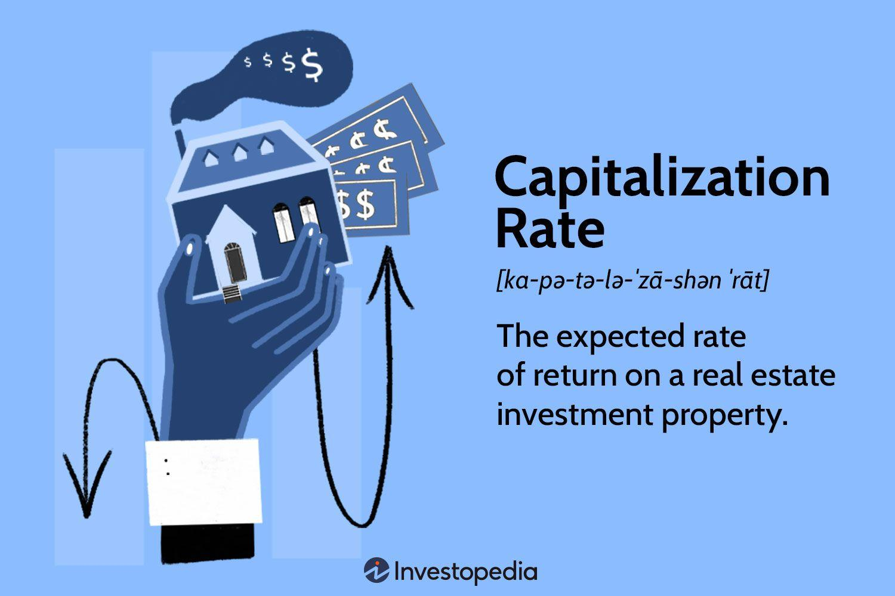

The landscape of real estate investing is continuously evolving, particularly through the integration of sophisticated valuation techniques and the modern methodologies of algorithmic trading. Central to property valuation is the capitalization rate (cap rate), a critical metric that measures the return on investment properties. Understanding the intersection of cap rates, property valuation, and algorithmic trading is key to maximizing investment returns.

Capitalization rates serve as a foundational element in assessing the profitability and risk associated with real estate investments. They provide investors with an insight into potential revenue generation from a property relative to its purchase price. The ability to accurately calculate and interpret cap rates can significantly influence investment decisions and strategies.



The importance of these concepts extends beyond theoretical understanding; practical application is paramount for investors seeking to enhance their portfolio performance. As economic conditions fluctuate, so too do cap rates, and with them, property valuations. For investors, savvy management of these dynamics can mean the difference between achieving desired returns or facing unanticipated losses.

Algorithmic trading, traditionally associated with financial markets, is making its mark on real estate through advanced data analysis and predictive modeling techniques. These algorithmic methods offer tools to refine traditional cap rate calculations by incorporating real-time data and machine learning models, potentially increasing accuracy and efficiency in investment decisions. Algorithms can process vast amounts of data faster than any human analyst, allowing for more responsive and anticipatory decision-making in real estate markets.

Advancements in algorithmic methods, therefore, broaden the horizons for real estate valuation by enhancing traditional practices with quantitative precision. As technology progresses, the integration of artificial intelligence and machine learning provides new opportunities for investors to adapt and thrive in ever-changing market conditions.

In conclusion, understanding property valuation, cap rates, and the transformative potential of algorithmic trading is essential for investors aiming for superior returns. By bridging traditional techniques with modern innovations, one can navigate the complexities of real estate investments more effectively, staying ahead in a competitive and dynamic market.

## Table of Contents

## Understanding Capitalization Rates

Capitalization rates, commonly referred to as cap rates, are a crucial metric in real estate investing that help investors assess the profitability and risk associated with a given property. The cap rate is defined as the ratio of a property's net operating income (NOI) to its current market value or acquisition cost. It is expressed as a percentage and is calculated using the formula:

$$
\text{Cap Rate} = \left(\frac{\text{Net Operating Income (NOI)}}{\text{Current Market Value}}\right) \times 100
$$

The importance of capitalization rates lies in their ability to provide investors with a quick snapshot of a property's potential return on investment. By examining the cap rate, investors can compare the income-generating potential of different properties and make informed decisions about where to allocate their resources.

Several factors influence capitalization rates, leading to variations across property types and economic conditions. Property type plays a significant role, as different types of properties—such as multifamily buildings, office spaces, or retail outlets—exhibit varying levels of risk and return. For instance, multifamily properties generally have lower cap rates due to their stable rental income, while retail properties may have higher cap rates reflecting greater risk.

Economic conditions, including interest rates and market demand, also significantly impact cap rates. During periods of economic growth, increased demand for real estate often leads to higher property values and lower cap rates. Conversely, during economic downturns, declining property values may result in higher cap rates, signaling increased investment risk.

Cap rates are a valuable tool for assessing both profitability and risk. A lower cap rate suggests that a property is likely to generate steady income with relatively low risk, while a higher cap rate may indicate greater potential for returns accompanied by increased risk. Investors often use cap rates to benchmark their investment performance against industry standards and to evaluate the relative attractiveness of various real estate opportunities.

## Calculating Terminal Capitalization Rate

The terminal capitalization rate, often referred to as the terminal cap rate, is an essential tool in real estate investing, particularly for estimating the resale value of a property at the end of a projected holding period. Understanding and accurately calculating this metric helps investors make informed decisions about the potential profitability of a property over time.

### Description and Role in Estimating Future Property Value

The terminal cap rate is used to project the future value of a property by estimating the [exit](/wiki/exit-strategy) or resale price at the end of an investment period. It connects the property's net operating income (NOI) at the end of the holding period to its future market value. By estimating this cap rate, investors can gauge future profitability and risk, enabling them to strategize their investment with insight into potential resale gains or losses.

### Step-by-Step Calculation Process for Terminal Capitalization Rate

Calculating the terminal capitalization rate involves several key steps:

1. **Determine Future Net Operating Income (NOI):**  
   Project the NOI for the property at the end of the holding period. This involves forecasting future rental income and expenses, considering factors like inflation and anticipated market conditions.

2. **Select a Terminal Cap Rate:**  
   Choose an appropriate cap rate to apply to the projected NOI. This rate typically reflects the expected market conditions at the end of the holding period. Often, it is slightly higher than the going-in cap rate due to the property's aging and potential market uncertainties.

3. **Estimate Future Property Value:**  
   Use the formula:
$$
   \text{Future Property Value} = \frac{\text{Future NOI}}{\text{Terminal Cap Rate}}

$$

   This formula calculates the anticipated resale price by dividing the forecasted NOI by the selected terminal cap rate.

Here's a simple Python code snippet demonstrating this calculation:

```python
def calculate_future_value(future_noi, terminal_cap_rate):
    if terminal_cap_rate == 0:
        raise ValueError("Terminal cap rate must be greater than zero")
    return future_noi / terminal_cap_rate

# Example usage:
future_noi = 120000  # Example future NOI in dollars
terminal_cap_rate = 0.06  # Example terminal capitalization rate

future_value = calculate_future_value(future_noi, terminal_cap_rate)
print(f"The estimated future property value is: ${future_value:,.2f}")
```

### Factors Influencing Terminal Cap Rate Estimation

Several factors can impact the estimation of the terminal cap rate:

- **Market Trends:** Future cap rates may be influenced by anticipated changes in the real estate market, such as supply-demand dynamics, interest rate forecasts, and investor sentiment. 

- **Economic Forecasts:** Macroeconomic indicators, including GDP growth, unemployment rates, and inflation expectations, can also affect terminal cap rate estimates. 

- **Property-Specific Considerations:** The condition, location, and type of the property can influence its future marketability and, consequently, the terminal cap rate.

Accurate estimation of the terminal cap rate requires a nuanced understanding of these factors, allowing investors to better anticipate future market scenarios and make well-rounded investment decisions.

## Real Estate Valuation: The Role of Cap Rates

In real estate valuation, capitalization rates, or cap rates, serve as an essential tool to gauge property value. The cap rate is a metric that assesses the potential return on an investment property, expressed as a percentage. It's determined by dividing the property's net operating income (NOI) by its current market value or acquisition cost:

$$
\text{Cap Rate} = \frac{\text{Net Operating Income (NOI)}}{\text{Current Market Value}}
$$

Here, the net operating income is the yield generated from a property after deducting operating expenses but before accounting for taxes and financing costs. By examining the cap rate, investors can evaluate and compare the profitability and risk level across various properties.

Fluctuations in cap rates can significantly influence property values and investment strategies. For instance, a decrease in cap rates often indicates that the property market is becoming more competitive, with higher value placed on properties due to expectations of increasing income or decreasing risk. Conversely, an increase in cap rates might suggest higher perceived risk or a downturn in market expectations, potentially depressing property values.

Understanding cap rate dynamics is critical for investors as they navigate property valuations. For instance, a low cap rate might prompt an investor to question whether the property's income potential justifies its price, whereas a high cap rate might indicate an opportunity for higher returns but with accompanying risks.

Moreover, cap rate data is indispensable for making informed investment decisions. It allows investors to benchmark properties against market standards, assess potential returns relative to risk, and make strategic decisions based on forecasted economic conditions. Accurate cap rate analysis facilitates more robust portfolio positioning, helping investors to exploit market opportunities and mitigate potential losses.

By utilizing cap rates effectively, investors can maximize their potential gains while managing risk, ensuring a balanced and data-driven approach to real estate investment. As such, cap rates play a crucial role not only in determining the value of a property but also in shaping comprehensive investment strategies.

## Integration of Algorithmic Trading in Real Estate Valuation

Algorithmic trading, a technique commonly associated with financial markets, is increasingly finding applications in real estate valuation. This approach leverages complex algorithms and data analytics to predict market trends and optimize investment decisions. The integration of [algorithmic trading](/wiki/algorithmic-trading) in real estate involves using these algorithms to forecast capitalization rates (cap rates) and assess property values, thereby enhancing the decision-making process for investors.

Algorithmic models offer several benefits, particularly in cap rate predictions. By processing large datasets that encompass historical property values, economic indicators, and market dynamics, these models can identify patterns and correlations that may not be readily apparent through traditional analysis methods. This facilitates more accurate predictions of cap rates, allowing investors to assess a property's potential profitability and risk with greater precision.

Additionally, algorithmic trading models can aid in optimizing investment decisions. For instance, an algorithm might be designed to analyze market data continuously and execute trades or investments automatically when certain conditions are met. This capability helps investors respond swiftly to market changes and capitalize on opportunities that could enhance their investment returns.

Several case studies highlight the successful implementation of algorithmic trading in real estate. For example, some real estate investment firms employ proprietary algorithms to analyze vast amounts of data, including property listings, demographic trends, and economic forecasts, to identify undervalued properties with high growth potential. These algorithms can predict future cap rates by factoring in expected economic shifts and localized market developments, providing a competitive edge in a rapidly shifting market landscape.

Moreover, [machine learning](/wiki/machine-learning), a subset of [artificial intelligence](/wiki/ai-artificial-intelligence), plays a crucial role in refining these models. Machine learning algorithms can improve their predictive accuracy over time by learning from new data inputs and historical outcomes. This adaptive capability ensures that the predictive models remain relevant and effective in dynamic market conditions.

In conclusion, the integration of algorithmic trading into real estate valuation signifies a transformative shift towards data-driven investment strategies. By enhancing cap rate predictions and streamlining investment processes, algorithmic models offer substantial potential for improving returns and managing risks in the real estate sector. As the technology evolves, it promises to further refine the precision with which investors can assess and capitalize on market opportunities.

## Challenges and Considerations

Algorithmic trading in real estate valuation presents an array of challenges and considerations that stakeholders must address to harness its full potential effectively. This section explores the limitations, ethical concerns, and the need to balance algorithmic models with traditional valuation methods.

One notable limitation of algorithmic trading in real estate is its dependency on historical data and market conditions. Since real estate markets can be influenced by a myriad of nuanced factors, such as unique property attributes or localized market trends, algorithmic models may not always account for sudden shifts or anomalies. The reliance on quantitative data might overlook qualitative aspects critical to real estate valuation, such as community development plans or pending legislation affecting property values.

Ethical concerns arise primarily from the opacity of algorithmic decision-making. The "black box" nature of many algorithmic systems can lead to a lack of transparency, making it difficult for investors and stakeholders to understand and trust the outcomes. This opaqueness can be particularly concerning when these models are used for high-stakes decisions. Ensuring transparency involves not only opening the decision-making processes but also making these processes comprehensible to non-experts, thus fostering trust and accountability.

Balancing algorithmic models with traditional valuation methods is crucial for creating comprehensive assessment frameworks. Traditional methods incorporate qualitative insights from experienced appraisers and the contextual nuance often missing from algorithmic models. Combining both approaches—leveraging the efficiency of algorithms and the depth of human expertise—can provide a holistic view of market trends and property values. 

Incorporating a hybrid model that uses algorithmic predictions as a tool rather than a replacement for expert judgment can enhance decision-making quality. For instance, while a machine learning algorithm might predict a property's future cap rate based on historical data, a seasoned investor's intuition about emerging local developments can adjust this baseline forecast for greater accuracy.

To achieve this balance, stakeholders should consider developing standardized protocols that guide the integration of algorithmic outputs with traditional assessments. This can involve creating interfaces where machine learning models suggest valuations that experts then review and adapt based on softer market indicators and human experience.

In conclusion, navigating the challenges of algorithmic trading in real estate requires a simultaneous commitment to innovation and ethical responsibility. Stakeholders must remain vigilant to the limitations of algorithmic predictions while also embracing them as tools to supplement traditional real estate valuation practices.

## Future Trends and Opportunities

Emerging technologies such as artificial intelligence (AI) and machine learning (ML) are playing an increasingly prominent role in refining capitalization rate (cap rate) calculations, leading to more accurate and granular real estate valuations. These technologies leverage data-driven insights to enhance the precision of cap rate predictions, enabling investors to better assess property value fluctuations and market dynamics.

**AI and Machine Learning in Cap Rate Calculations**

The integration of AI and ML in real estate valuation is a transformative development. AI algorithms can process vast amounts of data, identifying patterns and trends that human analysts might overlook. Machine learning models learn from historical property data, economic indicators, and demographic information to predict future cap rates with greater accuracy. These tools can also account for non-linear relationships between variables, offering a more nuanced understanding of market factors affecting cap rates.

For instance, a machine learning model could be trained on datasets containing property type, location, interest rates, and local economic activity to predict future cap rates. This predictive analytics capability can optimize investment decisions by forecasting potential profitability and risk more reliably.

**Impact on Real Estate Investment Strategies**

The impact of technological advancements on real estate investment strategies is significant. Enhanced cap rate calculations can inform more strategic investment decisions, allowing investors to identify undervalued properties and time their market entries or exits effectively. AI-driven insights enable investors to adapt quickly to market changes, providing a competitive edge in dynamic real estate markets.

Predictive models can also support scenario analysis, where investors assess the potential impacts of different economic conditions on property values. This allows for the development of more resilient investment strategies that can withstand market [volatility](/wiki/volatility-trading-strategies).

**Opportunities for Precision and Adaptability**

The ongoing evolution of AI and ML technologies presents opportunities for increased precision and adaptability in real estate market assessments. As models become more sophisticated, they can incorporate an ever-expanding array of data points, such as satellite imagery, social media sentiment, and global economic indicators, enhancing their predictive power. 

For example, Python libraries such as TensorFlow or Scikit-learn could be employed to build machine learning models that [factor](/wiki/factor-investing) in a wide variety of datasets. Here's a simple example of how a machine learning model might be structured to predict cap rates:

```python
import pandas as pd
from sklearn.model_selection import train_test_split
from sklearn.ensemble import RandomForestRegressor
from sklearn.metrics import mean_absolute_error

# Load dataset
data = pd.read_csv('real_estate_data.csv')

# Features and target variable
X = data[['property_type', 'location', 'interest_rate', 'economic_activity']]
y = data['cap_rate']

# Train-test split
X_train, X_test, y_train, y_test = train_test_split(X, y, test_size=0.2, random_state=42)

# Model training
model = RandomForestRegressor(n_estimators=100, random_state=42)
model.fit(X_train, y_train)

# Predictions
predictions = model.predict(X_test)

# Evaluate model
mae = mean_absolute_error(y_test, predictions)
print(f'Mean Absolute Error: {mae}')
```

This example illustrates the potential for machine learning to support more data-driven and precise cap rate forecasting, enhancing investment decision-making and adaptability to market shifts. As AI and ML technologies continue to develop, real estate investors can expect these tools to offer even greater refinement in market assessments and valuation methodologies.

## Conclusion

The integration of capitalization rates and algorithmic trading presents a transformative opportunity in real estate investment. Capitalization rates, or cap rates, serve as a fundamental measure, facilitating investors' insight into property profitability and risk management. As a key metric, cap rates allow for evaluating investment returns by assessing current income against market conditions.

Recognizing the influence of cap rates, the advent of algorithmic trading methodologies provides a sophisticated toolset for enhancing traditional real estate valuation practices. These automated systems optimize data analysis, enabling faster and more precise forecasts in property value changes and investment potentials. The use of algorithms aids in adjusting to fluctuating market trends, allowing investors to make data-driven decisions swiftly.

Staying abreast of technological advancements is crucial. Technologies such as artificial intelligence and machine learning are continuously developing, refining cap rate calculations, thus pushing the boundaries of real estate assessment capabilities. Real estate investors who leverage these technologies can gain a competitive edge by anticipating market movements and adjusting their strategies accordingly.

Nonetheless, a balanced approach that combines both algorithmic systems and traditional valuation methods is advised. While algorithms provide enhanced precision, they should complement, not replace, the expert judgment and subjective assessments that seasoned investors bring. Ethical concerns regarding transparency and decision-making must also be actively considered to ensure responsible application of these advanced methods.

In summary, the successful integration of technological innovations with traditional investment practices presents a promising future for real estate valuation. By combining these approaches, investors can achieve a synergetic effect, improving the accuracy of investment decisions and ultimately maximizing returns. As the landscape of real estate continues to evolve, the savvy investor will remain informed and adaptable, embracing both new technologies and time-tested valuation strategies.

## References & Further Reading

1. **"The Income Approach to Property Valuation" by Andrew Baum and David Mackmin**: This book offers comprehensive insights into the methods used for property valuation with a focus on income approaches, which are crucial for understanding capitalization rates.

2. **"Real Estate Investments and Portfolio Management" by David M. Geltner**: This text investigates into modern real estate investment strategies and highlights the role capitalization rates play within investment evaluations.

3. **"Principles of Real Estate Management" by the Institute of Real Estate Management**: This resource provides a solid foundation on managing real estate properties and understanding how cap rates impact management decisions.

4. **"Algorithmic Trading and DMA: An Introduction to Direct Access Trading Strategies" by Barry Johnson**: For readers interested in how algorithmic trading can be integrated within traditional investment frameworks, this book presents practical strategies and applications.

5. **"Commercial Real Estate Analysis and Investments" by David M. Geltner and Norman G. Miller**: The book covers detailed methodologies for real estate investment analysis, including the use of algorithms and cap rates in asset valuation.

6. **"Artificial Intelligence in Real Estate: Applications, Challenges, and Opportunities" by Michael DeGiacomo**: This paper explores the impacts of AI and machine learning on real estate valuations and investment decisions, providing a futuristic perspective on evolving methodologies.

7. **"The Practice of Risk Management in Real Estate Impact on Valuation Performance" by T. French and C. Goodman**: A significant study that correlates risk management with real estate valuation performance, a critical read for those investigating the risks associated with algorithmic integration in real estate.

8. **"Intelligent Real Estate Valuation: Appraisal Techniques in a Changing Market" by P. Harbage**: Offers insight into how intelligent systems and algorithms can improve traditional appraisal techniques in fluctuating markets.

9. **"The Impact of Economic Conditions on Cap Rates and Real Estate Valuation" by C. Wuebker**: This article investigates the relationship between macroeconomic factors and capitalization rates, crucial for understanding market trends & their effect on property value assessment.

These curated materials provide a well-rounded knowledge base for further exploration into real estate investment strategies, particularly emphasizing the intersection between traditional methodologies and technological advancements.