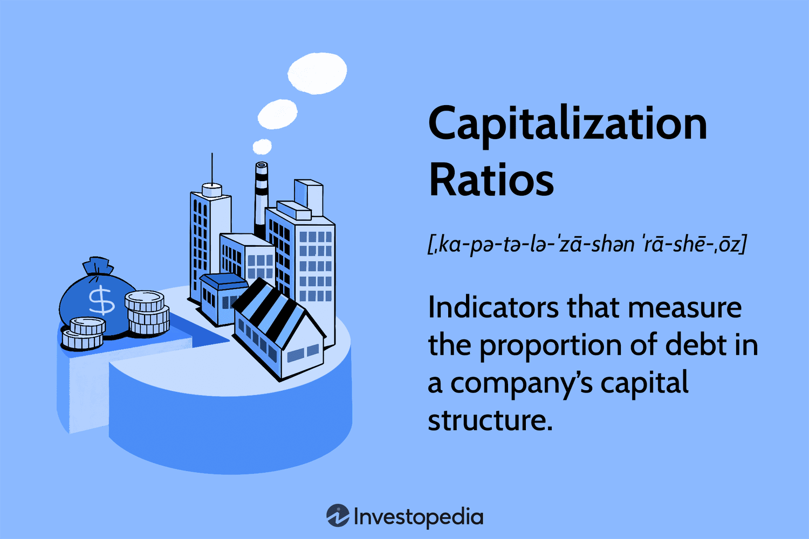

The financial landscape has undergone significant transformation with the integration of data-driven insights and advanced technology. In this dynamic environment, financial metrics have emerged as indispensable tools for evaluating the financial health and risk profile of investments. Among these metrics, capitalization ratios hold particular significance, as they gauge the proportion of debt in a company's capital structure, providing crucial insights into financial leverage and stability.

As technology continues to reshape investment strategies, the role of investment analysis has evolved, incorporating sophisticated methodologies to maximize returns. A key component of modern investment strategy is algorithmic trading (algo trading), which capitalizes on predefined rules and complex algorithms to execute trades autonomously. By integrating quantitative data with algorithmic strategies, investors can optimize their decision-making processes, manage risks effectively, and enhance profitability.

This article explores the inherent connections between financial metrics and algorithmic trading within the context of contemporary investment strategies. Analyzing how these elements influence one another allows market participants to better navigate financial markets. Key financial metrics, including capitalization ratios, provide the backbone for investment analysis, facilitating the evaluation of company performance and risk management. Simultaneously, in the era of precise algorithmic execution, these metrics also play a crucial role in guiding automated trading strategies, ensuring that investments align with both fiscal objectives and market conditions.

We will examine the relevant financial metrics integral to investment analysis and their profound impact on algorithmic trading. These synergies offer promising avenues for crafting robust and adaptive investment strategies, paving the way for informed and strategic portfolio management in an ever-evolving financial landscape.

## Table of Contents

## Understanding Financial Metrics

Financial metrics are quantitative measures essential for evaluating a company's or an investment's financial performance. These metrics serve as key indicators of various aspects of financial health, including profitability, efficiency, liquidity, and solvency. They provide stakeholders with the necessary insights to make informed decisions, manage financial risks, and optimize resource allocation.

Profitability metrics are critical in assessing a company's ability to generate income relative to its revenue, assets, or equity. Key indicators of profitability include Return on Investment (ROI) and Earnings Per Share (EPS). ROI measures the efficiency of an investment by dividing the net profit by the initial investment cost. It is expressed as a percentage, providing a straightforward assessment of an investment's return:

$$
\text{ROI} = \left( \frac{\text{Net Profit}}{\text{Investment Cost}} \right) \times 100
$$

EPS, on the other hand, represents the portion of a company's profit allocated to each outstanding share of common stock. This metric is vital for comparing profitability between companies of different sizes, and it is calculated as:

$$
\text{EPS} = \frac{\text{Net Income} - \text{Preferred Dividends}}{\text{Average Outstanding Shares}}
$$

Efficiency metrics evaluate how well a company utilizes its assets and manages its operations. Efficient companies typically have increased margins and lower costs. Liquidity metrics, such as the current ratio and quick ratio, assess a company's ability to meet its short-term obligations. Solvency metrics focus on long-term financial stability, examining a company's capacity to sustain operations in the long run.

Capitalization ratios are fundamental in assessing financial leverage, which is crucial for evaluating a company's capital structure. The Debt-Equity Ratio is a primary metric, indicating the proportion of debt used in financing relative to equity. A higher ratio suggests more leverage, exposing the company to potential financial risk. The formula for the Debt-Equity Ratio is:

$$
\text{Debt-Equity Ratio} = \frac{\text{Total Liabilities}}{\text{Shareholders' Equity}}
$$

Similarly, the Total Debt to Capitalization Ratio measures the extent of a firm's capital that is obtained through debt. It provides insight into the financial leverage and long-term risk profile of the company:

$$
\text{Total Debt to Capitalization Ratio} = \frac{\text{Total Debt}}{\text{Total Debt} + \text{Shareholders' Equity}}
$$

Coverage ratios, such as the Interest Coverage Ratio, focus on a company's ability to service its debt obligations. A higher ratio indicates that a company can comfortably handle interest expenses, suggesting lower financial risk. This ratio is calculated by dividing earnings before interest and taxes (EBIT) by the interest expense:

$$
\text{Interest Coverage Ratio} = \frac{\text{EBIT}}{\text{Interest Expense}}
$$

Overall, financial metrics are indispensable tools for stakeholders to assess business performance, manage financial risks, and formulate strategic decisions. Utilizing these indicators enables investors and analysts to gain a comprehensive understanding of a company's financial health, thereby aiding in sound investment and management practices.

## Capitalization Ratios and Their Importance

Capitalization ratios are fundamental in evaluating the financial structure of a company by revealing how it uses debt relative to its equity. Among these, the debt-equity ratio is paramount as it highlights the extent to which a company's operations are financed by debt as opposed to shareholders' equity. This ratio is calculated as follows:

$$
\text{Debt-Equity Ratio} = \frac{\text{Total Debt}}{\text{Shareholders' Equity}}
$$

A higher debt-equity ratio indicates a greater reliance on borrowed funds, which can suggest higher financial risk, particularly if a company faces downturns or [liquidity](/wiki/liquidity-risk-premium) issues. Conversely, a lower ratio implies a more conservative capital structure with less dependence on external financing.

Another vital metric is the long-term debt to capitalization ratio. This metric assesses the proportion of a company's total long-term capital that consists of debt. It is calculated by dividing the long-term debt by the sum of long-term debt and shareholders' equity:

$$
\text{Long-term Debt to Capitalization Ratio} = \frac{\text{Long-term Debt}}{\text{Long-term Debt} + \text{Shareholders' Equity}}
$$

This ratio provides insight into the company’s leverage, indicating how much of the company's capital is funded through long-term debt. High values can signify potential over-leverage, possibly leading to financial distress during economic contractions.

Understanding these capitalization ratios is instrumental for investors, as they assist in gauging financial risks and determining a company's financial health. Investors use these metrics to foresee potential difficulties a company might experience in meeting its obligations and to make informed decisions about the risk associated with investing in a company. Balancing these ratios within acceptable industry norms helps ensure sustainable corporate financial strategies and robust risk management.

## Investment Analysis in the Age of Algo Trading

Investment analysis has become increasingly sophisticated with the rise of [algorithmic trading](/wiki/algorithmic-trading), commonly known as algo trading. This method utilizes advanced computing technology to automate the trading process. Algo trading operates based on predefined rules and algorithms, executing trades at speeds and frequencies impractical for human traders. This level of automation enables traders to capitalize on minute changes in market conditions, executing a large number of trades quickly and efficiently.

One of the core components in evaluating the effectiveness of trading algorithms is the set of performance metrics that measure both return potential and associated risks. Among these, the Sharpe ratio is widely respected for assessing risk-adjusted returns. The Sharpe ratio is calculated as:

$$
\text{Sharpe Ratio} = \frac{E[R] - R_f}{\sigma}
$$

where $E[R]$ is the expected return of the investment, $R_f$ is the risk-free rate, and $\sigma$ is the standard deviation of the investment's excess return. This metric provides insight into the efficiency of a trading strategy by elucidating the additional return earned per unit of risk.

Another critical metric is maximum drawdown, which measures the largest single drop from peak to trough in the value of a portfolio before a new peak is achieved. It is used to assess the riskiness of a strategy by determining the potential for significant loss. Lower maximum drawdowns indicate a more resilient strategy under adverse market conditions.

Financial viability and other metrics, such as the profitability ratio and the win-loss ratio, are also integral to gauging a trading algorithm's success. These metrics collectively contribute to understanding how well an algorithm performs over time, varying market conditions, and differing levels of risk exposure.

Integrating these financial metrics within algo trading strategies guides better investment decisions and risk management efforts. By automating the analytical process, investors can optimize strategies, aligning them with predefined financial goals and risk appetites. This synergy between financial analysis and computational expertise is revolutionizing investment strategies, offering precision, speed, and a higher probability of achieving targeted financial outcomes.

## Key Performance Metrics in Algorithmic Trading

In algorithmic trading, assessing performance is crucial for optimizing strategies and managing risk effectively. Performance metrics serve as the foundation for evaluating how well a trading algorithm converts risk into return, manages [volatility](/wiki/volatility-trading-strategies), and achieves its objectives. 

The Sharpe ratio is a widely-used metric that provides a risk-adjusted measure of return. It is calculated as:

$$
\text{Sharpe Ratio} = \frac{R_p - R_f}{\sigma_p}
$$

where $R_p$ is the expected portfolio return, $R_f$ is the risk-free rate, and $\sigma_p$ is the standard deviation of the portfolio's excess return. This ratio helps determine how much excess return a strategy generates for a given level of risk, allowing investors to evaluate efficiency in return relative to volatility.

Volatility metrics, such as standard deviation, quantify the degree of variation or [dispersion](/wiki/dispersion-trading) of returns in a trading strategy. In finance, higher volatility typically indicates greater uncertainty or risk. Standard deviation is given by:

$$
\sigma = \sqrt{\frac{1}{N} \sum_{i=1}^{N} (R_i - \bar{R})^2}
$$

where $R_i$ represents individual return observations, $\bar{R}$ is the average return, and $N$ is the number of observations. By analyzing volatility metrics, traders can assess the stability and risk exposure of their strategies, aiding in determining the risk-return balance.

Winning percentage, another crucial metric, refers to the proportion of successful trades out of the total number of trades executed. It is calculated as:

$$
\text{Winning Percentage} = \left( \frac{\text{Number of Winning Trades}}{\text{Total Number of Trades}} \right) \times 100
$$

This statistic reflects the algorithm's accuracy and the likelihood of generating successful trades, contributing to overall confidence in the trading strategy.

Maximum drawdown measures the largest peak-to-trough decline in a portfolio's value before a new peak is achieved, helping assess the risk of substantial losses. It is expressed as:

$$
\text{Maximum Drawdown} = \frac{\text{Peak Value} - \text{Trough Value}}{\text{Peak Value}} \times 100
$$

A lower maximum drawdown indicates better risk management, as it suggests the strategy is less prone to significant losses.

Together, these key performance metrics furnish algorithmic traders with insights into the effectiveness, stability, and risk management capabilities of their strategies, fostering more informed decision-making and refined trading systems.

## The Interplay Between Financial Metrics and Algorithmic Trading

Successful investment strategies are increasingly dependent on synergizing financial metrics and algorithmic trading. This integration focuses on leveraging key financial insights to enhance trading algorithms, thereby optimizing investment outcomes. Capitalization ratios are instrumental in this process, as they provide a quantitative assessment of a company’s financial leverage and risk profile.

Capitalization ratios such as the debt-equity ratio and long-term debt to capitalization ratio enable investors to analyze the stability and financial health of a company. These ratios calculate the proportion of debt a company uses to finance its assets, which can indicate potential risks. For instance, a higher debt-equity ratio suggests that a company may be over-leveraged, which increases its financial risk in fluctuating economic climates. By understanding these ratios, investors can gauge the risk exposure within specific market sectors or economic conditions, tailoring algorithmic trading strategies accordingly.

Algorithmic trading enhances the application of these financial metrics by offering advanced mechanisms to automate and optimize trading decisions. Unlike traditional trading approaches, algorithms can process vast quantities of data in real time, making swift decisions based on predefined criteria that include financial metrics such as capitalization ratios. This allows for the creation of dynamic trading environments that adapt to changing market conditions. For example, an algorithm could adjust its trading tactics based on thresholds set around the debt-equity ratio, executing trades that minimize risk and maximize returns when favorable financial conditions are detected.

In addition to automation, algorithmic trading offers significant advantages in terms of precision and consistency. By relying on financial indicators, trading systems can identify lucrative opportunities and execute trades with precision that is difficult to achieve manually. For instance, the integration of statistical models with financial metrics can lead to the identification of [arbitrage](/wiki/arbitrage) opportunities that align with an investor's risk tolerance.

The interplay between financial metrics and algorithmic trading has the potential to facilitate more informed trading decisions. By employing algorithms that are informed by detailed financial analysis, investors not only improve their ability to predict market trends but also increase the efficiency of their investment strategies. This complementary relationship enhances an investor’s capability to navigate complex financial landscapes, capitalizing on opportunities while managing risks effectively.

As financial technologies continue to evolve, understanding and applying the dynamics between financial metrics and algorithmic trading will remain essential for investors aiming to achieve sustainable and profitable outcomes in the financial markets.

## Conclusion

The integration of financial metrics, such as capitalization ratios, with algorithmic trading strategies creates new opportunities for enhancing financial analysis. By utilizing these tools, investors can achieve a more comprehensive understanding of market opportunities and risks, allowing for more refined and strategic investment decisions. For example, analyzing capitalization ratios provides insights into a company's financial leverage, which is vital for assessing its risk profile. Such information can be crucial when developing trading algorithms that aim to optimize returns based on market conditions.

A well-rounded investment strategy seamlessly incorporates detailed financial analysis alongside advanced technological solutions. This combination ensures that investment decisions are not only based on historical data but are also dynamically adjusted to account for current market fluctuations and future projections. The adaptability of algorithmic trading allows investors to automate complex decision-making processes, resulting in efficient trading and better risk management.

As the financial landscape continues to evolve rapidly, being informed and adaptable is essential for optimizing investment portfolios. Advances in technology and data analytics mean that investors must remain vigilant and responsive to changes. Regular updates to algorithmic strategies and continuous monitoring of financial metrics can lead to more informed trading decisions and improved investment outcomes.

## References & Further Reading

[1]: ["Advances in Financial Machine Learning"](https://www.amazon.com/Advances-Financial-Machine-Learning-Marcos/dp/1119482089) by Marcos Lopez de Prado

[2]: ["Evidence-Based Technical Analysis: Applying the Scientific Method and Statistical Inference to Trading Signals"](https://www.amazon.com/Evidence-Based-Technical-Analysis-Scientific-Statistical/dp/0470008741) by David Aronson

[3]: ["Machine Learning for Algorithmic Trading"](https://github.com/stefan-jansen/machine-learning-for-trading) by Stefan Jansen

[4]: ["Quantitative Trading: How to Build Your Own Algorithmic Trading Business"](https://www.amazon.com/Quantitative-Trading-Build-Algorithmic-Business/dp/1119800064) by Ernest P. Chan

[5]: Titman, S. & Martin, J.D. (2010). ["Valuation: The Art and Science of Corporate Investment Decisions"](https://www.amazon.com/Valuation-Science-Corporate-Investment-Decisions/dp/0133479528) (2nd Edition). Pearson.

[6]: "Algorithmic and High-Frequency Trading" by Álvaro Cartea, Sebastian Jaimungal, and José Penalva - a comprehensive source on the theoretical and practical aspects of algorithmic trading.

[7]: "Quantitative Finance for Dummies" by Steve Bell - offers insights into the financial concepts and metrics relevant to algorithmic trading strategies.

