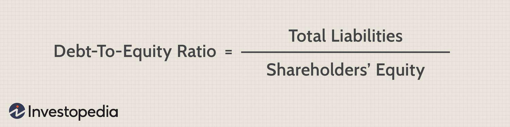

## Table of Contents

## What are capitalization ratios?

Capitalization ratios are financial measures that show how a company uses debt and equity to fund its operations. They help investors understand if a company is using too much debt or if it is financially stable. These ratios are important because they can show how risky it is to invest in a company. If a company has high debt, it might be riskier because it has to pay back more money.

There are different types of capitalization ratios, but some common ones are the debt-to-equity ratio and the equity ratio. The debt-to-equity ratio compares the total debt of a company to its total equity. A higher ratio means the company is using more debt to finance its operations. The equity ratio looks at how much of a company's assets are financed by shareholders' equity. A higher equity ratio means the company relies less on debt, which can be a sign of financial strength.

## Why are capitalization ratios important in financial analysis?

Capitalization ratios are important in financial analysis because they help investors and analysts understand how a company is funding its operations. By looking at these ratios, you can see if a company is using a lot of debt or if it's relying more on money from shareholders. This is important because too much debt can be risky. If a company has a lot of debt, it has to pay back a lot of money, which can be hard if the company isn't doing well. On the other hand, a company with less debt might be safer because it doesn't have to pay back as much.

These ratios also give a quick snapshot of a company's financial health. For example, the debt-to-equity ratio shows the balance between debt and equity. A high ratio might mean the company is taking on too much risk, while a low ratio could mean it's being cautious. The equity ratio tells you how much of the company's assets are owned by shareholders. A higher equity ratio can be a good sign because it means the company is less dependent on borrowed money. By using capitalization ratios, investors can make better decisions about whether to invest in a company or not.

## What is the debt-to-equity ratio and how is it calculated?

The debt-to-equity ratio is a way to see how much a company is using debt compared to money from shareholders to run its business. It tells you if a company is borrowing a lot of money or if it's using more money from its owners. This ratio is important because it helps investors understand how risky it is to invest in the company. If the ratio is high, it means the company has a lot of debt, which can be risky because the company has to pay back a lot of money. If the ratio is low, it means the company is using less debt, which can be safer.

To calculate the debt-to-equity ratio, you take the total amount of debt the company has and divide it by the total amount of equity, which is the money from shareholders. The formula is: Debt-to-Equity Ratio = Total Debt / Total Equity. For example, if a company has $100,000 in debt and $200,000 in equity, the debt-to-equity ratio would be $100,000 / $200,000, which equals 0.5. This means for every dollar of equity, the company has 50 cents of debt. By looking at this ratio, investors can get a quick idea of the company's financial health and how it's balancing debt and equity.

## Can you explain the long-term debt to capitalization ratio?

The long-term debt to capitalization ratio tells you how much of a company's money comes from long-term debt compared to all its money. It's a way to see if a company is using a lot of borrowed money that it has to pay back over a long time. This ratio is important because it helps investors understand if the company is taking on too much risk. If the ratio is high, it means the company has a lot of long-term debt, which can be risky because it has to pay back a lot of money over time. If the ratio is low, it means the company is using less long-term debt, which can be safer.

To calculate the long-term debt to capitalization ratio, you add up all the long-term debt the company has and then add that to the total equity, which is the money from shareholders. This total is called the company's total capitalization. Then, you divide the long-term debt by the total capitalization. The formula is: Long-term Debt to Capitalization Ratio = Long-term Debt / (Long-term Debt + Total Equity). For example, if a company has $50,000 in long-term debt and $150,000 in equity, the total capitalization would be $200,000. The ratio would be $50,000 / $200,000, which equals 0.25. This means 25% of the company's total capitalization comes from long-term debt. By looking at this ratio, investors can get a quick idea of the company's long-term financial health and how it's balancing long-term debt with equity.

## How does the total debt to total assets ratio work?

The total debt to total assets ratio tells you how much of a company's money comes from debt compared to all its money. It helps investors see if a company is using a lot of borrowed money to run its business. If the ratio is high, it means the company has a lot of debt, which can be risky because it has to pay back a lot of money. If the ratio is low, it means the company is using less debt, which can be safer.

To calculate the total debt to total assets ratio, you add up all the debt the company has and then divide that by the total amount of assets the company owns. The formula is: Total Debt to Total Assets Ratio = Total Debt / Total Assets. For example, if a company has $80,000 in debt and $200,000 in assets, the ratio would be $80,000 / $200,000, which equals 0.4. This means 40% of the company's assets are funded by debt. By looking at this ratio, investors can get a quick idea of the company's financial health and how it's balancing debt and assets.

## What are the common benchmarks for capitalization ratios in different industries?

Capitalization ratios can vary a lot between different industries. For example, industries like utilities and telecoms often have high debt-to-equity ratios because they need a lot of money to build and maintain their infrastructure. A debt-to-equity ratio of 1.5 to 2.0 might be common in these sectors. On the other hand, technology companies usually have lower debt-to-equity ratios because they don't need as much money for physical assets. A ratio around 0.5 or less is often seen in tech.

The long-term debt to capitalization ratio also differs by industry. Manufacturing companies might have a higher ratio, around 0.4 to 0.6, because they need to borrow money to buy expensive equipment. In contrast, service industries like consulting or software might have a lower ratio, around 0.2 or less, because they don't need as much long-term debt. Understanding these benchmarks helps investors see if a company is using a normal amount of debt for its industry or if it's taking on too much risk.

## How do capitalization ratios affect a company's credit rating?

Capitalization ratios show how much a company uses debt compared to money from shareholders. This is important for credit ratings because these ratings tell lenders how safe it is to lend money to the company. If a company has high debt-to-equity or total debt to total assets ratios, it might get a lower credit rating. This is because a lot of debt can mean the company is risky. Lenders might think the company will have trouble paying back loans, so they give it a lower rating.

On the other hand, if a company has low capitalization ratios, it might get a higher credit rating. This means the company uses less debt and more money from shareholders, which is seen as safer. Lenders are more likely to trust the company to pay back loans on time. So, by looking at capitalization ratios, credit rating agencies can decide if a company is a good or bad risk for lending money.

## What are the limitations of using capitalization ratios for financial analysis?

Capitalization ratios help us understand how a company uses debt and money from shareholders, but they have some limits. One big limit is that these ratios only show a snapshot of the company's finances at one time. They don't tell us how the company's financial situation might change over time. For example, a company might look safe now, but if it plans to borrow a lot of money soon, the ratios won't show that. Also, these ratios don't tell us anything about the quality of the debt or equity. Some debts might be easier to pay back than others, but the ratios treat all debt the same.

Another limitation is that capitalization ratios can be hard to compare between different companies, especially if they are in different industries. Each industry has its own normal levels of debt and equity. For example, a high debt-to-equity ratio might be normal for a utility company but risky for a tech company. Also, companies can use different accounting methods, which can make their ratios look different even if their financial health is similar. So, while capitalization ratios are useful, they should be used along with other financial measures to get a full picture of a company's health.

## How can capitalization ratios be used to assess a company's financial health?

Capitalization ratios help us see how a company is doing financially by showing how much it uses debt compared to money from its owners. By looking at these ratios, we can tell if a company is taking on too much debt, which can be risky. For example, the debt-to-equity ratio tells us how much debt a company has compared to money from shareholders. A high ratio might mean the company is borrowing a lot, which can be dangerous if it can't pay back the loans. On the other hand, a low ratio might mean the company is being careful and not using too much debt, which can be safer.

These ratios also give us a quick way to compare different companies. If we see that one company has a much higher debt-to-equity ratio than another, we might think the first company is riskier. But we have to remember that what's normal can be different for companies in different industries. For example, a utility company might have a high ratio because it needs a lot of money to build power plants, and that's okay for that industry. So, while capitalization ratios are helpful, we need to use them with other financial measures to really understand a company's financial health.

## What impact do different accounting practices have on capitalization ratios?

Different accounting practices can change how capitalization ratios look for a company. For example, some companies might count certain things as debt while others might not. This can make the debt-to-equity ratio different even if the companies are financially the same. Also, how a company values its assets can affect the total debt to total assets ratio. If one company uses a method that makes its assets look bigger, the ratio will be smaller because the debt is divided by a larger number.

Because of these differences, it can be hard to compare capitalization ratios between companies that use different accounting methods. For example, if one company uses a method that makes its equity look smaller, its debt-to-equity ratio will look higher. This might make the company seem riskier than it really is. So, when looking at capitalization ratios, it's important to know what accounting practices the company is using to get a true picture of its financial health.

## How do capitalization ratios influence investment decisions?

Capitalization ratios help investors decide if they should put money into a company. These ratios show how much a company uses debt compared to money from its owners. If a company has a high debt-to-equity ratio, it means it's borrowing a lot of money. This can be risky because the company has to pay back a lot, and if it can't, it might get into trouble. Investors might think twice before investing in a company with a high ratio because it could mean the company is not financially stable.

On the other hand, a low debt-to-equity ratio might make a company look safer. It means the company is not borrowing as much and is using more money from its owners. This can be a good sign for investors because it shows the company is managing its money well and might be less likely to face financial problems. But investors also need to look at what's normal for the company's industry. A ratio that's high for one industry might be normal for another. So, while capitalization ratios are helpful, investors should use them along with other information to make smart choices about where to put their money.

## Can you discuss advanced applications of capitalization ratios in corporate strategy and restructuring?

Capitalization ratios are important tools in corporate strategy and restructuring because they help companies decide how to manage their money better. For example, when a company is thinking about restructuring, it might look at its debt-to-equity ratio to see if it's using too much debt. If the ratio is high, the company might decide to pay off some debt or bring in more money from shareholders to lower the risk. This can make the company look more stable and attractive to investors. Also, during a merger or acquisition, companies might use these ratios to see if the other company is a good fit. If one company has a lot of debt and the other doesn't, they might need to adjust their financial plans to make the merger work smoothly.

In corporate strategy, capitalization ratios can also help companies plan for the future. For instance, if a company wants to grow and needs money, it might look at its long-term debt to capitalization ratio to decide if it should borrow more or sell more shares. A low ratio might mean the company can safely take on more debt to fund its growth. On the other hand, a high ratio might push the company to find other ways to get money, like selling assets or finding investors. By understanding these ratios, companies can make smart choices about how to use their money to reach their goals and stay financially healthy.

## What is Understanding Financial Metrics?

Financial metrics are quantitative measures essential for evaluating a company's or an investment's financial performance. These metrics serve as key indicators of various aspects of financial health, including profitability, efficiency, liquidity, and solvency. They provide stakeholders with the necessary insights to make informed decisions, manage financial risks, and optimize resource allocation.

Profitability metrics are critical in assessing a company's ability to generate income relative to its revenue, assets, or equity. Key indicators of profitability include Return on Investment (ROI) and Earnings Per Share (EPS). ROI measures the efficiency of an investment by dividing the net profit by the initial investment cost. It is expressed as a percentage, providing a straightforward assessment of an investment's return:

$$
\text{ROI} = \left( \frac{\text{Net Profit}}{\text{Investment Cost}} \right) \times 100
$$

EPS, on the other hand, represents the portion of a company's profit allocated to each outstanding share of common stock. This metric is vital for comparing profitability between companies of different sizes, and it is calculated as:

$$
\text{EPS} = \frac{\text{Net Income} - \text{Preferred Dividends}}{\text{Average Outstanding Shares}}
$$

Efficiency metrics evaluate how well a company utilizes its assets and manages its operations. Efficient companies typically have increased margins and lower costs. Liquidity metrics, such as the current ratio and quick ratio, assess a company's ability to meet its short-term obligations. Solvency metrics focus on long-term financial stability, examining a company's capacity to sustain operations in the long run.

Capitalization ratios are fundamental in assessing financial leverage, which is crucial for evaluating a company's capital structure. The Debt-Equity Ratio is a primary metric, indicating the proportion of debt used in financing relative to equity. A higher ratio suggests more leverage, exposing the company to potential financial risk. The formula for the Debt-Equity Ratio is:

$$
\text{Debt-Equity Ratio} = \frac{\text{Total Liabilities}}{\text{Shareholders' Equity}}
$$

Similarly, the Total Debt to Capitalization Ratio measures the extent of a firm's capital that is obtained through debt. It provides insight into the financial leverage and long-term risk profile of the company:

$$
\text{Total Debt to Capitalization Ratio} = \frac{\text{Total Debt}}{\text{Total Debt} + \text{Shareholders' Equity}}
$$

Coverage ratios, such as the Interest Coverage Ratio, focus on a company's ability to service its debt obligations. A higher ratio indicates that a company can comfortably handle interest expenses, suggesting lower financial risk. This ratio is calculated by dividing earnings before interest and taxes (EBIT) by the interest expense:

$$
\text{Interest Coverage Ratio} = \frac{\text{EBIT}}{\text{Interest Expense}}
$$

Overall, financial metrics are indispensable tools for stakeholders to assess business performance, manage financial risks, and formulate strategic decisions. Utilizing these indicators enables investors and analysts to gain a comprehensive understanding of a company's financial health, thereby aiding in sound investment and management practices.

## What are Capitalization Ratios and Why are They Important?

Capitalization ratios are fundamental in evaluating the financial structure of a company by revealing how it uses debt relative to its equity. Among these, the debt-equity ratio is paramount as it highlights the extent to which a company's operations are financed by debt as opposed to shareholders' equity. This ratio is calculated as follows:

$$
\text{Debt-Equity Ratio} = \frac{\text{Total Debt}}{\text{Shareholders' Equity}}
$$

A higher debt-equity ratio indicates a greater reliance on borrowed funds, which can suggest higher financial risk, particularly if a company faces downturns or [liquidity](/wiki/liquidity-risk-premium) issues. Conversely, a lower ratio implies a more conservative capital structure with less dependence on external financing.

Another vital metric is the long-term debt to capitalization ratio. This metric assesses the proportion of a company's total long-term capital that consists of debt. It is calculated by dividing the long-term debt by the sum of long-term debt and shareholders' equity:

$$
\text{Long-term Debt to Capitalization Ratio} = \frac{\text{Long-term Debt}}{\text{Long-term Debt} + \text{Shareholders' Equity}}
$$

This ratio provides insight into the company’s leverage, indicating how much of the company's capital is funded through long-term debt. High values can signify potential over-leverage, possibly leading to financial distress during economic contractions.

Understanding these capitalization ratios is instrumental for investors, as they assist in gauging financial risks and determining a company's financial health. Investors use these metrics to foresee potential difficulties a company might experience in meeting its obligations and to make informed decisions about the risk associated with investing in a company. Balancing these ratios within acceptable industry norms helps ensure sustainable corporate financial strategies and robust risk management.

## What is the role of investment analysis in the age of algo trading?

Investment analysis has become increasingly sophisticated with the rise of [algorithmic trading](/wiki/algorithmic-trading), commonly known as algo trading. This method utilizes advanced computing technology to automate the trading process. Algo trading operates based on predefined rules and algorithms, executing trades at speeds and frequencies impractical for human traders. This level of automation enables traders to capitalize on minute changes in market conditions, executing a large number of trades quickly and efficiently.

One of the core components in evaluating the effectiveness of trading algorithms is the set of performance metrics that measure both return potential and associated risks. Among these, the Sharpe ratio is widely respected for assessing risk-adjusted returns. The Sharpe ratio is calculated as:

$$
\text{Sharpe Ratio} = \frac{E[R] - R_f}{\sigma}
$$

where $E[R]$ is the expected return of the investment, $R_f$ is the risk-free rate, and $\sigma$ is the standard deviation of the investment's excess return. This metric provides insight into the efficiency of a trading strategy by elucidating the additional return earned per unit of risk.

Another critical metric is maximum drawdown, which measures the largest single drop from peak to trough in the value of a portfolio before a new peak is achieved. It is used to assess the riskiness of a strategy by determining the potential for significant loss. Lower maximum drawdowns indicate a more resilient strategy under adverse market conditions.

Financial viability and other metrics, such as the profitability ratio and the win-loss ratio, are also integral to gauging a trading algorithm's success. These metrics collectively contribute to understanding how well an algorithm performs over time, varying market conditions, and differing levels of risk exposure.

Integrating these financial metrics within algo trading strategies guides better investment decisions and risk management efforts. By automating the analytical process, investors can optimize strategies, aligning them with predefined financial goals and risk appetites. This synergy between financial analysis and computational expertise is revolutionizing investment strategies, offering precision, speed, and a higher probability of achieving targeted financial outcomes.

## What are the Key Performance Metrics in Algorithmic Trading?

In algorithmic trading, assessing performance is crucial for optimizing strategies and managing risk effectively. Performance metrics serve as the foundation for evaluating how well a trading algorithm converts risk into return, manages [volatility](/wiki/volatility-trading-strategies), and achieves its objectives. 

The Sharpe ratio is a widely-used metric that provides a risk-adjusted measure of return. It is calculated as:

$$
\text{Sharpe Ratio} = \frac{R_p - R_f}{\sigma_p}
$$

where $R_p$ is the expected portfolio return, $R_f$ is the risk-free rate, and $\sigma_p$ is the standard deviation of the portfolio's excess return. This ratio helps determine how much excess return a strategy generates for a given level of risk, allowing investors to evaluate efficiency in return relative to volatility.

Volatility metrics, such as standard deviation, quantify the degree of variation or [dispersion](/wiki/dispersion-trading) of returns in a trading strategy. In finance, higher volatility typically indicates greater uncertainty or risk. Standard deviation is given by:

$$
\sigma = \sqrt{\frac{1}{N} \sum_{i=1}^{N} (R_i - \bar{R})^2}
$$

where $R_i$ represents individual return observations, $\bar{R}$ is the average return, and $N$ is the number of observations. By analyzing volatility metrics, traders can assess the stability and risk exposure of their strategies, aiding in determining the risk-return balance.

Winning percentage, another crucial metric, refers to the proportion of successful trades out of the total number of trades executed. It is calculated as:

$$
\text{Winning Percentage} = \left( \frac{\text{Number of Winning Trades}}{\text{Total Number of Trades}} \right) \times 100
$$

This statistic reflects the algorithm's accuracy and the likelihood of generating successful trades, contributing to overall confidence in the trading strategy.

Maximum drawdown measures the largest peak-to-trough decline in a portfolio's value before a new peak is achieved, helping assess the risk of substantial losses. It is expressed as:

$$
\text{Maximum Drawdown} = \frac{\text{Peak Value} - \text{Trough Value}}{\text{Peak Value}} \times 100
$$

A lower maximum drawdown indicates better risk management, as it suggests the strategy is less prone to significant losses.

Together, these key performance metrics furnish algorithmic traders with insights into the effectiveness, stability, and risk management capabilities of their strategies, fostering more informed decision-making and refined trading systems.

## References & Further Reading

[1]: ["Advances in Financial Machine Learning"](https://www.amazon.com/Advances-Financial-Machine-Learning-Marcos/dp/1119482089) by Marcos Lopez de Prado

[2]: ["Evidence-Based Technical Analysis: Applying the Scientific Method and Statistical Inference to Trading Signals"](https://www.amazon.com/Evidence-Based-Technical-Analysis-Scientific-Statistical/dp/0470008741) by David Aronson

[3]: ["Machine Learning for Algorithmic Trading"](https://github.com/stefan-jansen/machine-learning-for-trading) by Stefan Jansen

[4]: ["Quantitative Trading: How to Build Your Own Algorithmic Trading Business"](https://www.amazon.com/Quantitative-Trading-Build-Algorithmic-Business/dp/1119800064) by Ernest P. Chan

[5]: Titman, S. & Martin, J.D. (2010). ["Valuation: The Art and Science of Corporate Investment Decisions"](https://www.amazon.com/Valuation-Science-Corporate-Investment-Decisions/dp/0133479528) (2nd Edition). Pearson.

[6]: "Algorithmic and High-Frequency Trading" by Álvaro Cartea, Sebastian Jaimungal, and José Penalva - a comprehensive source on the theoretical and practical aspects of algorithmic trading.

[7]: "Quantitative Finance for Dummies" by Steve Bell - offers insights into the financial concepts and metrics relevant to algorithmic trading strategies.

