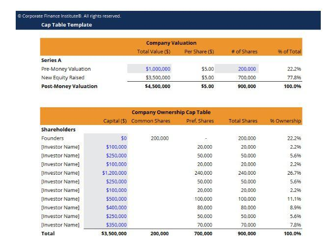

## Table of Contents

## What is a capitalization table?

A capitalization table, often called a cap table, is a chart that shows who owns parts of a company. It lists the shareholders and how many shares each one has. This helps everyone understand the ownership structure of the business.

Cap tables are very important for startups and growing companies. They help keep track of ownership as the company gets investments or issues more shares. This makes it easier to manage and plan for the future of the company.

## Why is a capitalization table important for a company?

A capitalization table is important for a company because it shows who owns what. It lists all the shareholders and how many shares each person or group has. This helps everyone see the ownership structure clearly. When a company is looking for new investors or planning to grow, the cap table helps them understand how new shares will affect current ownership.

It's also useful for making decisions about the future. For example, if a company wants to issue more shares or get a loan, the cap table helps them see how this will change things. It's like a map that guides the company in making smart choices about money and growth. Keeping the cap table up to date is key for a company to stay on the right path.

## How do you create a basic capitalization table?

To create a basic capitalization table, start by listing all the shareholders of the company. This includes founders, investors, and anyone else who owns shares. Next to each name, write down how many shares they own. You can also add a column to show what percentage of the company each shareholder owns. This helps everyone see the ownership structure clearly.

Once you have the list of shareholders and their shares, you can use a simple spreadsheet to organize the information. Make sure to keep the cap table updated whenever there are changes, like when the company issues new shares or someone sells their shares. A well-maintained cap table is a helpful tool for understanding and managing the company's ownership.

## What information should be included in a capitalization table?

A capitalization table, or cap table, should include the names of all the shareholders in the company. This means listing founders, investors, and anyone else who owns shares. Next to each name, you should write down the number of shares they own. It's also helpful to include a column that shows what percentage of the company each shareholder owns. This makes it easy to see who owns what part of the company.

You might also want to include information about different types of shares, like common stock and preferred stock. Sometimes, there are special rights or terms attached to certain shares, and it's good to note these in the cap table. Keeping the cap table updated is important because it helps the company make smart decisions about money and growth, especially when new shares are issued or when someone sells their shares.

## How often should a capitalization table be updated?

A capitalization table should be updated whenever there are changes in the company's ownership. This means updating it when new shares are issued, when someone buys or sells shares, or when there are changes in the types of shares. Keeping the cap table up to date helps the company understand who owns what and makes it easier to make decisions about money and growth.

It's a good idea to review the cap table at least once a year, even if there haven't been any changes. This helps make sure all the information is still correct and that everyone has a clear picture of the company's ownership. Regular updates and reviews keep the cap table accurate and useful for the company.

## What are common mistakes to avoid when creating a capitalization table?

When creating a capitalization table, one common mistake is not including all shareholders. This means forgetting to list everyone who owns shares, like founders, investors, or employees with stock options. Missing even one person can make the cap table wrong and confusing. Another mistake is not updating the cap table when things change. If the company issues new shares or someone sells their shares, the cap table needs to be updated right away. Not keeping it current can lead to problems later on.

Another error to avoid is not showing the different types of shares clearly. Companies often have common stock and preferred stock, and each type might have different rights or terms. If the cap table doesn't show these differences, it can be hard to understand the true ownership structure. Lastly, not double-checking the math can cause big mistakes. Make sure the total number of shares and the percentages add up correctly. Simple errors in calculation can lead to big misunderstandings about who owns what in the company.

## How can software tools assist in maintaining a capitalization table?

Software tools can make it easier to keep a capitalization table up to date. They help by automatically updating the cap table whenever there are changes, like when new shares are issued or someone sells their shares. This means less work for the people in charge and fewer chances for mistakes. The software can also do the math for you, making sure all the numbers add up correctly and showing the right percentages of ownership.

These tools often come with features that make the cap table easier to understand. For example, they can show different types of shares and any special rights or terms that go with them. They can also create reports and charts that help explain the ownership structure to investors or other interested people. Using software to manage a cap table saves time and helps keep everything accurate and clear.

## What are the implications of equity dilution on a capitalization table?

When a company issues new shares, it can lead to equity dilution. This means that the ownership percentage of existing shareholders goes down because there are more shares to divide among everyone. If you own 10% of a company and it issues more shares, your 10% could become a smaller piece of the pie. This is important to show on the capitalization table because it helps everyone see how their ownership changes over time.

Equity dilution can affect how much control shareholders have and how much their shares are worth. If a company needs to raise money by issuing new shares, it might be good for growth, but it also means current shareholders own a smaller part of the company. Keeping the capitalization table updated with these changes helps everyone understand the new ownership structure and make smart decisions about the company's future.

## How do you handle complex scenarios like convertible notes and warrants in a cap table?

Handling complex scenarios like convertible notes and warrants in a cap table can be tricky, but it's important to get it right. Convertible notes are loans that can turn into shares later on. When this happens, you need to add the new shares to the cap table and update everyone's ownership percentages. It's like adding more pieces to the pie and then figuring out who gets what. Warrants are similar because they give people the right to buy shares at a certain price in the future. When someone uses a warrant, you have to add those new shares to the cap table too.

Keeping track of these changes can be hard, but it's really important for understanding the true ownership of the company. If you don't update the cap table correctly, it can lead to confusion and mistakes. For example, if a convertible note turns into shares, you need to make sure the new shares are counted in the right way. The same goes for warrants. When someone exercises a warrant, you need to add those shares and make sure the math is right. Using software can help a lot because it can do the calculations for you and keep everything up to date automatically.

## What role does a capitalization table play during fundraising rounds?

During fundraising rounds, a capitalization table, or cap table, is super important. It shows who owns what part of the company right now. When a company wants to raise money, they need to know how many shares they can offer to new investors. The cap table helps them figure this out. It also shows how giving new shares to investors will change the ownership for everyone else. This is called dilution, and it's something everyone needs to understand before agreeing to new investments.

The cap table also helps the company talk to potential investors. It gives them a clear picture of the company's ownership structure. This makes it easier for investors to decide if they want to put money into the company. By showing the cap table, the company can explain how the new investment will fit into the big picture. Keeping the cap table updated during fundraising rounds helps everyone make smart decisions about money and growth.

## How can a capitalization table be used to forecast future ownership scenarios?

A capitalization table can help a company see what might happen in the future with its ownership. By using the cap table, the company can play out different situations, like if they get more money from investors or if they give shares to employees. They can see how these changes would affect who owns what part of the company. This helps them plan better and make smart choices about raising money or giving out shares.

For example, if a company wants to raise money in the future, they can use the cap table to figure out how many new shares they might need to offer. They can then see how this would change the ownership percentages for everyone else. This way, they can talk to current shareholders about what might happen and make sure everyone is okay with the plan. Using the cap table to forecast future scenarios helps the company stay on track and keep everyone informed about changes in ownership.

## What are best practices for ensuring the accuracy and integrity of a capitalization table?

Keeping a capitalization table accurate and trustworthy is really important for a company. One of the best ways to do this is by updating the cap table every time there's a change in ownership. This means adding new shares when they're issued, removing shares when they're sold, and making sure all the numbers add up right. Using software can help a lot because it can do the math for you and keep everything up to date automatically. It's also a good idea to have someone check the cap table regularly to make sure it's still correct.

Another important thing is to be clear and honest about who owns what. Make sure to include everyone who has shares, like founders, investors, and employees with stock options. Don't forget to show different types of shares and any special rights or terms that go with them. Keeping good records and talking openly with shareholders helps build trust. By following these best practices, a company can make sure their cap table stays accurate and everyone understands the ownership structure.

## What are the core components of a cap table?

A capitalization table (cap table) is a crucial tool for visualizing the equity allocation of a company, particularly during the initial funding rounds. Investors often seek insights into how equity is distributed among various stakeholders to assess their potential return on investment. 

Core components of a cap table typically include the names of all security holders, such as founders, investors, employees, and advisors. These entries are accompanied by the type of equity held, which may include common shares, preferred shares, stock options, and convertible notes. Each entry specifies the number of shares or equity amount associated with each holder, providing a comprehensive view of ownership distribution.

Vesting schedules are an integral part of cap tables that outline when and how equity will be distributed to stakeholders. A typical vesting schedule might include a cliff period, after which a predetermined percentage of shares vests, followed by incremental vesting over time. This ensures that key personnel remain incentivized over the long term.

Stock options and convertible notes are contingencies that affect future equity structure. Stock options give employees and other stakeholders the right to purchase shares at a predetermined price, often contingent on meeting specific conditions or timelines. Convertible notes, on the other hand, are debt instruments that convert into equity, typically upon reaching certain funding milestones or predefined valuation events.

Critical to a cap table is the distinction between pre-money and post-money valuation, which affects both share price and equity percentage. Pre-money valuation refers to the company’s valuation before the current round of investment, while post-money valuation includes the sum of the pre-money valuation and the new equity investment. The calculation of share price post-investment is often done using the formula:

$$
\text{Share Price} = \frac{\text{Post-Money Valuation}}{\text{Total Shares Outstanding}}
$$

This affects the equity percentage held by each stakeholder, as each new round of funding typically involves issuing additional shares, leading to dilution of existing ownership percentages. Effectively managing these components within a cap table is essential for startups to maintain transparency and strategic equity management.

## References & Further Reading

[1]: Metrick, A., & Yasuda, A. (2021). ["Venture Capital and the Finance of Innovation, 2nd Edition."](https://papers.ssrn.com/sol3/papers.cfm?abstract_id=929145) Wiley.

[2]: Kelley, D. (2019). ["Effective Equity: From Startup to High-Growth Stage."](https://www.hbs.edu/ris/Publication%20Files/21-057_0c4f5410-3dcb-4c2f-8c4e-6fcbc358b92f.pdf) Wiley.

[3]: Laloux, F. (2014). ["Reinventing Organizations: A Guide to Creating Organizations Inspired by the Next Stage of Human Consciousness."](https://archive.org/details/reinventingorgan0000lalo_o6p2) Nelson Parker.

[4]: Damodaran, A. (2012). ["Investment Valuation: Tools and Techniques for Determining the Value of Any Asset, 3rd Edition."](https://books.google.com/books/about/Investment_Valuation.html?id=5SRHAAAAQBAJ) Wiley.

[5]: King, M. R., & Maier, P. (2010). ["Algorithms, Complexity Analysis and VLSI Architectures for MPEG-4 Motion Estimation."](https://link.springer.com/book/10.1007/978-1-4757-4474-3) Springer.

[6]: Clause, C., Overbeek, S., & Naumann, F. (2019). ["Automating Algorithm Decisions with Machine Learning."](https://www.science.org/doi/10.1126/science.abe2629) Wirtschaftsinformatik Proceedings 2019.