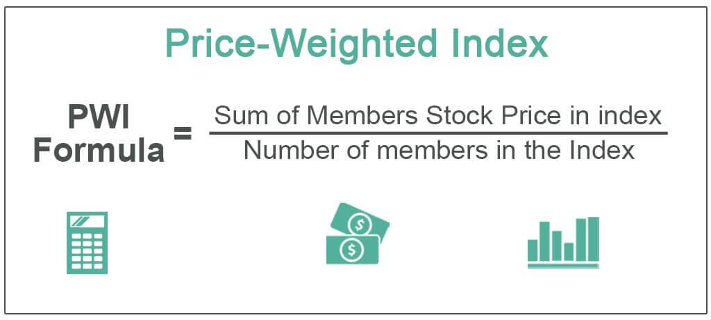

Stock market indices serve as essential instruments for assessing the performance of specific sectors or the broader market. Among the various types of indices, the capitalization-weighted stock market index stands out as one of the most widely used. This type of index assigns weights to its constituent stocks based on their market capitalizations, providing a clear reflection of the market's collective valuation of each company. 

Calculating the capitalization-weighted stock market index is an intricate process, requiring attention to detail in the consideration of each component's market capitalization. This calculation method ensures that larger companies exert a more significant influence on the index than smaller ones. As such, understanding the principles of index calculation is crucial for investors who aim to effectively navigate the complex and ever-changing landscape of financial markets.



The rapid emergence of algorithmic trading has introduced new dynamics into the domain of stock market indices. Algorithms can process vast amounts of data quickly, offering enhanced efficiency and precision in trading based on index movements. Algorithmic trading relies on complex mathematical models to predict market trends and execute trades, thereby integrating deeply with the functionality and calculation of capitalization-weighted indices.

For investors, understanding the mechanics of capitalization-weighted indices and the impact of algorithmic trading is vital to developing informed strategies in today's financial environment. These concepts lay the foundational knowledge required for comprehending market trends and making sound investment decisions in a volatile market landscape.

## Table of Contents

## Understanding Capitalization-Weighted Indexes

A capitalization-weighted index, also known as a market value-weighted index, assigns weight to each component based on its market capitalization. Market capitalization, commonly referred to as market cap, is calculated by multiplying a company's current share price by its total number of outstanding shares. Thus, the formula for market capitalization is:

$$
\text{Market Capitalization} = \text{Share Price} \times \text{Total Outstanding Shares}
$$

The weight of each company within the index is determined by its market capitalization relative to the total market capitalization of all companies in the index:

$$
\text{Weight of Company } i = \frac{\text{Market Cap of Company } i}{\sum \text{Market Caps of all Companies in the Index}}
$$

This weighting method implies that companies with larger market capitalizations have a more significant influence on the index’s performance. Therefore, changes in the stock prices of larger companies result in more substantial shifts in the index's value compared to smaller companies.

This approach mirrors the distribution of market value across different companies, thus providing a realistic representation of the market. The method reflects the aggregated value attributed to companies by the market participants, ensuring that the index aligns with the overall economic sentiment. By focusing on market capitalization, capitalization-weighted indices capture the financial environment in which larger companies play prominent roles, typically indicating broader market movements more effectively than equal-weighted or price-weighted indices.

For investors, the capitalization-weighted model offers an efficient means to gain insights into the market's direction and overall health. The model also naturally adjusts for new stock issues, buybacks, and changes in price, maintaining its relevance without requiring constant manual adjustments.

## Calculation of a Capitalization-Weighted Index

A capitalization-weighted index calculates the weight of each component based on its market capitalization, ensuring that larger companies have more influence on the index's value. To determine each stock's market value, multiply the stock's current market price by its total outstanding shares. This calculation yields the market capitalization for each company included in the index.

The total market value of each stock is summed to calculate the aggregate market value of all the companies in the index. However, to maintain continuity and account for stock splits, dividends, or other market activities, a divisor is employed. The divisor is an arbitrary number that can be adjusted to ensure that changes in the index reflect only the change in market values and not the effects of structural changes.

Consider the calculation's mathematical formula:

$$
M = \sum (P_i \times S_i)
$$

where $M$ is the total market value of the index, $P_i$ represents the stock price of company $i$, and $S_i$ stands for the total number of outstanding shares of company $i$.

The index value $(I)$ is obtained by dividing the total market value by the divisor:

$$
I = \frac{M}{D}
$$

where $D$ is the index divisor, which is adjusted when necessary to maintain continuity after changes like stock splits or dividends.

Weight computation for each component involves determining each company's contribution to the total market capitalization. The weight $w_i$ of stock $i$ can be calculated as follows:

$$
w_i = \frac{P_i \times S_i}{M}
$$

Here's a simple Python example illustrating these computations:

```python
# Sample data for stocks: price and shares
stocks = [
    {'price': 100, 'shares': 1000},  # Company A
    {'price': 200, 'shares': 500},   # Company B
    {'price': 50, 'shares': 2000}    # Company C
]

# Initial divisor value
divisor = 1000

# Calculate total market capitalization
total_market_value = sum(stock['price'] * stock['shares'] for stock in stocks)

# Calculate index value
index_value = total_market_value / divisor

# Calculate weights
weights = [(stock['price'] * stock['shares'] / total_market_value) for stock in stocks]

print("Index Value:", index_value)
print("Weights:", weights)
```

This code snippet calculates the index value and the weight of each stock based on its market capitalization. Components with higher market capitalizations exert a more significant influence on the index, which accurately reflects the market value distribution among companies. Adjustments to the divisor ensure continuity, allowing investors to interpret changes in the index as reflections of market trends rather than mechanical adjustments.

## Advantages and Disadvantages

Capitalization-weighted indices present several advantages and disadvantages for investors and traders considering incorporating them into their strategies.

One primary advantage is their capacity to reflect the market's collective perception of stock value. These indices weigh companies based on their market capitalization, effectively mirroring the proportionate size of each company within a market. This results in a market index that acts as a barometer for the performance of significant market players. Such indices often provide stability and are less volatile than those weighted equally or by other factors, as larger companies typically exhibit more stable price movements due to their established business practices and robust financial metrics.

However, capitalization-weighted indices have notable disadvantages, chiefly their potential to overweight larger companies. This occurs because the index amplifies the influence of companies with higher market capitalization, irrespective of their operational efficiency or growth potential. Consequently, the index might prioritize company size over performance, leading to an unbalanced market view. A significant movement in a handful of large-cap stocks can disproportionately affect the entire index, overshadowing the influence of smaller, yet potentially more dynamically growing, companies. This characteristic might distort the actual market trends and present a skewed picture of overall market health.

The mathematical formulation for calculating the weight $w_i$ of a stock $i$ in a capitalization-weighted index highlights this tendency:

$$

w_i = \frac{\text{Market Cap}_i}{\sum_{j=1}^{n} \text{Market Cap}_j} 
$$

In practical applications, investors must recognize that while capitalization-weighted indices offer clear insights into the market's larger entities, they could inadvertently limit exposure to emerging smaller firms with significant growth prospects. For balanced investment strategies, it may be necessary to supplement these indices with other metrics or indices that can provide a more comprehensive view of the market landscape.

## Example of a Capitalization-Weighted Index

The S&P 500 index, a widely recognized capitalization-weighted index, comprises 500 of the largest publicly traded companies in the United States. Its prominence arises from the method it uses to encapsulate the market dynamics through the market capitalizations of its constituent companies.

The calculation begins by determining the market capitalization for each of the 500 companies within the index. This involves multiplying the company's current stock price by its total number of outstanding shares. Mathematically, it can be expressed as:

$$
\text{Market Capitalization} = \text{Stock Price} \times \text{Outstanding Shares}
$$

For instance, consider two companies, A and B, in the S&P 500, with market capitalizations of $100 billion and $50 billion, respectively. In a capitalization-weighted framework, Company A would have twice the impact on the index compared to Company B, reflecting its larger size and prominence in the market.

The S&P 500 index value is derived from the summation of the market capitalizations of all included companies, which is then divided by a divisor. The divisor was initially established to ensure the index's continuity and is adjusted for stock splits, new listings, or any significant structural market changes to maintain the index's integrity. The formula for the index's value is:

$$
\text{Index Value} = \frac{\sum (\text{Component Market Capitalizations})}{\text{Divisor}}
$$

Daily price fluctuations lead to changes in the market capitalization, which subsequently alters the weighting of each stock in the index. Consider Company A experiences a price increase that raises its market capitalization by 10%. This increase would subsequently increase its weight in the index, underscoring the more significant role such companies have in daily index movements.

Volume changes, while inherently not directly affecting market capitalization, influence stock prices through the dynamics of supply and demand, thus indirectly impacting the capitalization-weighted index. A significant surge in trading [volume](/wiki/volume-trading-strategy) can suggest heightened investor interest or concern, affecting a company's stock price.

Overall, the S&P 500's structure allows it to encapsulate market movements effectively by maintaining a proportional reflection of each company's size. This ensures that larger companies, which hold substantial investor and economic significance, wield greater influence over the index's movements. Understanding how these daily price and volume changes impact the S&P 500 can provide valuable insights for investors and traders alike, allowing them to anticipate index behavior based on individual company performances.

## Algorithmic Trading and Index Calculations

Algorithmic trading has fundamentally transformed the engagement with stock market indices, especially those calculated based on capitalization weighting. This type of trading involves the use of computer algorithms to execute trades at speeds and frequencies that are beyond human capabilities. By leveraging complex mathematical models, algorithms can predict market movements and perform trades based on these predictions. The integration of [algorithmic trading](/wiki/algorithmic-trading) with capitalization-weighted indices is particularly advantageous due to the dynamic nature of these indices.

The use of algorithms in trading allows for the rapid response to changes in market capitalization, which is the product of a stock's current market price and its outstanding shares. These algorithms can be programmed to continuously monitor price, volume, and other relevant data points, recalibrating their trading strategies in real time to reflect the most current market conditions.

For capitalization-weighted indices, the impact of each security is proportional to its market capitalization, necessitating precise calculations for each component stock. An algorithm can perform these calculations efficiently, constantly assessing the index's makeup and adjusting the trade execution accordingly. Here's a basic example of how a Python algorithm might compute a capitalization-weighted index:

```python
import numpy as np

# Example stock data: [price, outstanding shares]
stocks = {
    'CompanyA': [100, 5000],
    'CompanyB': [150, 3000],
    'CompanyC': [200, 2000],
}

# Calculate market cap for each company
market_caps = {company: price * shares for company, (price, shares) in stocks.items()}

# Calculate the total market cap
total_market_cap = sum(market_caps.values())

# Calculate weights for each company
weights = {company: market_cap / total_market_cap for company, market_cap in market_caps.items()}

print("Market Caps:", market_caps)
print("Total Market Cap:", total_market_cap)
print("Weights:", weights)
```

In this script, the market capitalization for each company is calculated, followed by the individual weights, which are the ratios of each company's market capitalization to the total market capitalization. This is a simplified illustration of how an algorithm might calculate weights for a capitalization-weighted index.

Algorithms not only perform computations but also adapt to market [volatility](/wiki/volatility-trading-strategies), thereby optimizing trading strategies. For instance, if a particular stock's market cap increases due to a surge in share price, an algorithm can promptly adjust the portfolio's composition to reflect this change, ensuring that the trade aligns with the index's characteristics. Additionally, these algorithms often incorporate risk management strategies to minimize potential losses, which are essential when dealing with the fluctuations common in financial markets.

As technology continues to advance, the integration of algorithmic trading with capitalization-weighted indices provides traders with enhanced tools for navigating market complexity, improving precision in trading strategies, and ultimately achieving better returns on investments.

## Conclusion

Capitalization-weighted stock market indices play a vital role in the financial markets by providing insights into overall market trends and specific company valuations. This form of index is essential as it associates the weight of each component to its market capitalization, ensuring the index accurately reflects the market's hierarchy. Although these indices have limitations, such as the potential for an outsized influence of larger companies, they offer a meaningful barometer for investors to assess market dynamics.

The accurate calculation and analysis of these indices provide a snapshot of market behavior that can guide investment decisions. By emphasizing larger firms, capitalization-weighted indices offer stability and a realistic benchmark that mirrors the actual flow of funds within the market.

For algorithmic traders, understanding capitalization-weighted indices is crucial in formulating strategies that align with market behavior. Algorithms can leverage the predictability and structure of these indices to optimize trading strategies, thus enhancing their ability to capitalize on market movements. In a market environment increasingly driven by data and technology, mastery of capitalization-weighted indices equips traders with the tools needed to remain competitive and responsive to ever-changing market conditions.

## References & Further Reading

[1]: John C. Bogle. (1999). ["Common Sense on Mutual Funds: New Imperatives for the Intelligent Investor."](https://www.amazon.com/Common-Sense-Mutual-Funds-Imperatives/dp/0471392286) Wiley.

[2]: ["The Little Book of Common Sense Investing: The Only Way to Guarantee Your Fair Share of Stock Market Returns"](https://www.amazon.com/Little-Book-Common-Sense-Investing/dp/1119404509) by John C. Bogle

[3]: ["Market Sense and Nonsense: How the Markets Really Work"](https://www.amazon.com/Market-Sense-Nonsense-Markets-Really/dp/1118494563) by Jack D. Schwager

[4]: Ranganayakulu G. and Anand Kumar M. (2015). ["Capitalization-weighted Versus Equal-weighted Indices: Going Beyond the Market Proxy Challenge."](https://www.iapneochap.org/members.html) SSRN Electronic Journal.

[5]: Linton, Oliver. (2017). ["Algorithmic and High-Frequency Trading."](https://api.pageplace.de/preview/DT0400.9781316455579_A25606943/preview-9781316455579_A25606943.pdf) Cambridge University Press.