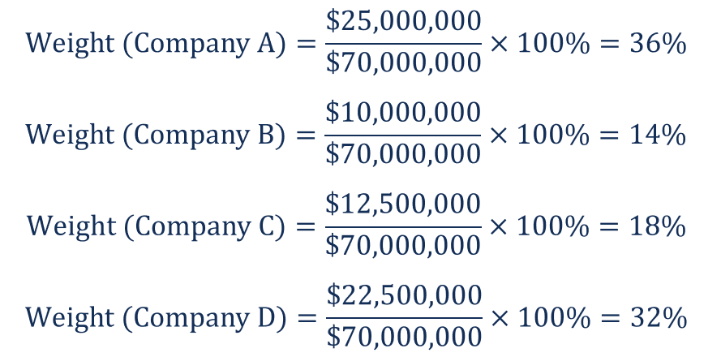

## Table of Contents

## What is a Capitalization-Weighted Index?

A Capitalization-Weighted Index, often called a market-cap weighted index, is a type of stock market index where the companies included are weighted according to their total market value. This means that larger companies have a bigger impact on the index's performance than smaller ones. For example, if a big company's stock price goes up a lot, it will pull the whole index up more than if a small company's stock price goes up by the same amount.

These indexes are popular because they reflect the market's overall performance in a way that matches how most people invest. Many investors buy shares in big companies, so a market-cap weighted index shows what is happening to the stocks that most investors care about. The most famous example of this kind of index is the S&P 500, which includes 500 of the largest companies in the U.S. and is used by many investors to gauge the health of the stock market.

## How does a Capitalization-Weighted Index differ from other types of indices?

A Capitalization-Weighted Index is different from other types of indices mainly in how it decides the importance of each company in the index. In a Capitalization-Weighted Index, the size of the company, measured by its market value, determines how much it affects the index. This means big companies have a bigger say in the index's performance than smaller ones. On the other hand, other types of indices might give equal weight to all companies, regardless of their size. For example, an Equal-Weighted Index treats every company the same, so a small company's stock price change can affect the index just as much as a big company's.

Another type of index is a Price-Weighted Index, where the price of a company's stock, not its market value, decides its impact on the index. In this case, a company with a high stock price will have more influence on the index, even if it's not a very big company overall. This is different from a Capitalization-Weighted Index, where the total value of the company matters more than just the stock price. Each type of index has its own way of showing what's happening in the market, and investors might choose one over the other depending on what they're looking for.

## What are the advantages of using a Capitalization-Weighted Index?

One big advantage of using a Capitalization-Weighted Index is that it matches how most people invest. Many investors put their money into big companies, so an index that gives more weight to these companies shows what's happening to the stocks that most investors care about. This makes it a good way to see how the overall market is doing. For example, the S&P 500, which is a famous Capitalization-Weighted Index, is used by many people to check the health of the stock market because it includes 500 of the biggest companies in the U.S.

Another advantage is that it's easier to manage and keep up to date. Because the index automatically adjusts to give more weight to companies as they grow bigger, there's less need for someone to keep changing the weights of the companies in the index. This saves time and effort. Also, since these indexes often include a lot of big companies, they can be more stable and less risky than indexes that focus on smaller companies, which can be more up and down in their performance.

## Can you explain how the weights of stocks are determined in a Capitalization-Weighted Index?

In a Capitalization-Weighted Index, the weight of each stock is figured out by looking at the total market value of the company, which is called its market capitalization. Market capitalization is found by multiplying the number of a company's shares by the price of one share. So, if a company has a lot of shares and they're worth a lot, it will have a bigger market capitalization and a bigger weight in the index.

For example, if there are two companies in the index, one with a market cap of $100 billion and another with a market cap of $10 billion, the first company will have ten times more impact on the index than the second one. This means that if the stock price of the bigger company goes up or down, it will move the whole index more than if the smaller company's stock price changes by the same amount. This way, the index shows what's happening to the bigger, more important companies in the market.

## What are some examples of well-known Capitalization-Weighted Indices?

Some of the best-known Capitalization-Weighted Indices are the S&P 500 and the NASDAQ Composite. The S&P 500 includes 500 of the biggest companies in the United States. It's used by a lot of people to see how the stock market is doing because it shows what's happening to these big companies. The NASDAQ Composite is another famous index that includes all the companies listed on the NASDAQ stock exchange, with a big focus on technology companies. Both of these indices are important because they give a good picture of the market by giving more weight to bigger companies.

Another well-known Capitalization-Weighted Index is the MSCI World Index. This index includes companies from 23 developed countries around the world. It's a good way to see how the global stock market is doing because it covers so many different places. Like the S&P 500 and the NASDAQ Composite, the MSCI World Index gives more weight to bigger companies, so their performance has a bigger impact on the index. These indices are all used by investors to understand and compare the performance of different markets.

## How does market capitalization affect the performance of a Capitalization-Weighted Index?

Market capitalization, or market cap, is really important for how a Capitalization-Weighted Index performs. In these indexes, bigger companies with a higher market cap have a bigger say in how the index moves. So, if a big company's stock price goes up a lot, it can pull the whole index up more than if a small company's stock price goes up by the same amount. This means that the performance of the index is mostly driven by what happens to the biggest companies in it.

Because of this, if big companies are doing well, the index will likely go up. But if they're not doing so well, the index might go down, even if smaller companies are doing okay. This can make the index a bit less risky because big companies are often more stable, but it also means the index might not show the whole picture of the market. It's more about what's happening to the big players.

## What are the potential drawbacks or criticisms of Capitalization-Weighted Indices?

One big criticism of Capitalization-Weighted Indices is that they can make the market more up and down. Because these indices give more weight to bigger companies, if a lot of investors start buying or selling stocks in these big companies, it can move the whole index a lot. This can make the market seem more unstable than it really is. Also, since big companies have a bigger say in the index, smaller companies can be overlooked, even if they're doing well. This means the index might not show the whole picture of what's happening in the market.

Another problem is that Capitalization-Weighted Indices can create a cycle where stocks that are already doing well keep getting more attention and money from investors. This can make the prices of these stocks go up even more, which can lead to a bubble. If the bubble bursts, it can cause big problems for the market. Critics also say that these indices can be too focused on the past, giving more weight to companies that were big before but might not be doing as well now. This can make it harder for new, growing companies to get the attention they deserve.

## How can an investor use a Capitalization-Weighted Index as part of their investment strategy?

An investor can use a Capitalization-Weighted Index as a key part of their investment strategy by buying index funds or exchange-traded funds (ETFs) that track these indices. For example, if an investor wants to invest in the overall U.S. stock market, they might buy an S&P 500 index fund. This way, they can own a small piece of all the big companies in the index without having to buy each stock one by one. It's a simple and easy way to diversify their investments, which means spreading out the risk by not putting all their money in just one or a few stocks.

Another way to use a Capitalization-Weighted Index is as a benchmark to see how well their own investments are doing. For instance, if an investor is [picking](/wiki/asset-class-picking) their own stocks, they can compare the performance of their portfolio to the S&P 500 or another Capitalization-Weighted Index. If their portfolio is doing better than the index, they might feel good about their choices. If it's doing worse, they might think about changing their strategy. Using the index as a benchmark helps investors keep track of how they're doing compared to the market as a whole.

## What impact does stock price volatility have on a Capitalization-Weighted Index?

Stock price [volatility](/wiki/volatility-trading-strategies) can have a big effect on a Capitalization-Weighted Index. Because these indexes give more weight to bigger companies, if the stock price of a big company goes up and down a lot, it can make the whole index move more. For example, if a big company's stock price jumps a lot in one day, the index will likely go up a lot too. On the other hand, if that same big company's stock price drops suddenly, the index can go down a lot. This means that the index can be more up and down than if it gave equal weight to all companies.

This can be both good and bad for investors. On the good side, it can mean more chances to make money if they can guess which way the big companies' stock prices will go. But on the bad side, it can make the market seem more unstable. If a lot of people are buying or selling stocks in these big companies, it can move the whole index a lot, even if most other stocks are staying pretty steady. So, stock price volatility in big companies can make the index more exciting but also more risky.

## How are Capitalization-Weighted Indices calculated and maintained?

A Capitalization-Weighted Index is calculated by figuring out the total market value of each company in the index. This is done by multiplying the number of shares a company has by the price of one share. Then, the index adds up all these market values and uses them to decide how much each company affects the index. The bigger the company's market value, the more it moves the index. So, if a big company's stock price changes, it will make a bigger difference to the index than if a small company's stock price changes the same amount.

To keep the index up to date, it needs to be adjusted regularly. This is because companies' market values can change as their stock prices go up or down or if they issue more shares. The index is usually updated every day to make sure it still shows the right weights for each company. Sometimes, companies might be added or taken out of the index if they grow bigger or smaller. This way, the index stays a good picture of the market, always giving more weight to the biggest companies.

## What role do Capitalization-Weighted Indices play in financial markets and economic analysis?

Capitalization-Weighted Indices are really important in financial markets because they help people understand how the market is doing overall. They do this by showing what's happening to the biggest companies in the market. For example, the S&P 500 is a famous index that includes 500 of the biggest companies in the U.S. When people want to know if the stock market is going up or down, they often look at this index. It's like a quick way to check the health of the market because it gives more weight to the companies that most investors care about.

In economic analysis, Capitalization-Weighted Indices are used to see how different parts of the economy are doing. For example, if the index goes up a lot, it might mean that the economy is doing well because big companies are making more money. Economists and investors use these indices to compare how different countries' markets are doing or to see how certain industries are performing. This helps them make decisions about where to invest their money or how to plan for the future. By looking at these indices, they can get a good idea of the overall economic picture.

## How might future trends or innovations affect the use and effectiveness of Capitalization-Weighted Indices?

Future trends and innovations could change how people use Capitalization-Weighted Indices. One big change might be the rise of new technology companies that grow really fast. These companies might not be in the index at first because they're small, but if they get big quickly, they could make a big difference to the market. If the index doesn't add these new companies fast enough, it might not show what's really happening in the market. Also, with more people using computers and data to pick stocks, the way these indices are made might need to change to keep up with how people invest now.

Another thing that could affect Capitalization-Weighted Indices is the focus on things like environmental, social, and governance ([ESG](/wiki/esg-investing)) factors. More and more investors want to put their money in companies that are good for the planet and society. If these indices don't include companies that do well in these areas, they might not be as popular with investors. So, they might need to start thinking about ESG when they decide which companies to include and how much weight to give them. This way, the indices can stay useful and important for people who care about these issues.

## What is the understanding of Capitalization-Weighted Indexes?

A capitalization-weighted index, also known as a market value-weighted index, assigns weight to each component based on its market capitalization. Market capitalization, commonly referred to as market cap, is calculated by multiplying a company's current share price by its total number of outstanding shares. Thus, the formula for market capitalization is:

$$
\text{Market Capitalization} = \text{Share Price} \times \text{Total Outstanding Shares}
$$

The weight of each company within the index is determined by its market capitalization relative to the total market capitalization of all companies in the index:

$$
\text{Weight of Company } i = \frac{\text{Market Cap of Company } i}{\sum \text{Market Caps of all Companies in the Index}}
$$

This weighting method implies that companies with larger market capitalizations have a more significant influence on the index’s performance. Therefore, changes in the stock prices of larger companies result in more substantial shifts in the index's value compared to smaller companies.

This approach mirrors the distribution of market value across different companies, thus providing a realistic representation of the market. The method reflects the aggregated value attributed to companies by the market participants, ensuring that the index aligns with the overall economic sentiment. By focusing on market capitalization, capitalization-weighted indices capture the financial environment in which larger companies play prominent roles, typically indicating broader market movements more effectively than equal-weighted or price-weighted indices.

For investors, the capitalization-weighted model offers an efficient means to gain insights into the market's direction and overall health. The model also naturally adjusts for new stock issues, buybacks, and changes in price, maintaining its relevance without requiring constant manual adjustments.

## How is a Capitalization-Weighted Index Calculated?

A capitalization-weighted index calculates the weight of each component based on its market capitalization, ensuring that larger companies have more influence on the index's value. To determine each stock's market value, multiply the stock's current market price by its total outstanding shares. This calculation yields the market capitalization for each company included in the index.

The total market value of each stock is summed to calculate the aggregate market value of all the companies in the index. However, to maintain continuity and account for stock splits, dividends, or other market activities, a divisor is employed. The divisor is an arbitrary number that can be adjusted to ensure that changes in the index reflect only the change in market values and not the effects of structural changes.

Consider the calculation's mathematical formula:

$$
M = \sum (P_i \times S_i)
$$

where $M$ is the total market value of the index, $P_i$ represents the stock price of company $i$, and $S_i$ stands for the total number of outstanding shares of company $i$.

The index value $(I)$ is obtained by dividing the total market value by the divisor:

$$
I = \frac{M}{D}
$$

where $D$ is the index divisor, which is adjusted when necessary to maintain continuity after changes like stock splits or dividends.

Weight computation for each component involves determining each company's contribution to the total market capitalization. The weight $w_i$ of stock $i$ can be calculated as follows:

$$
w_i = \frac{P_i \times S_i}{M}
$$

Here's a simple Python example illustrating these computations:

```python
# Sample data for stocks: price and shares
stocks = [
    {'price': 100, 'shares': 1000},  # Company A
    {'price': 200, 'shares': 500},   # Company B
    {'price': 50, 'shares': 2000}    # Company C
]

# Initial divisor value
divisor = 1000

# Calculate total market capitalization
total_market_value = sum(stock['price'] * stock['shares'] for stock in stocks)

# Calculate index value
index_value = total_market_value / divisor

# Calculate weights
weights = [(stock['price'] * stock['shares'] / total_market_value) for stock in stocks]

print("Index Value:", index_value)
print("Weights:", weights)
```

This code snippet calculates the index value and the weight of each stock based on its market capitalization. Components with higher market capitalizations exert a more significant influence on the index, which accurately reflects the market value distribution among companies. Adjustments to the divisor ensure continuity, allowing investors to interpret changes in the index as reflections of market trends rather than mechanical adjustments.

## What are the advantages and disadvantages?

Capitalization-weighted indices present several advantages and disadvantages for investors and traders considering incorporating them into their strategies.

One primary advantage is their capacity to reflect the market's collective perception of stock value. These indices weigh companies based on their market capitalization, effectively mirroring the proportionate size of each company within a market. This results in a market index that acts as a barometer for the performance of significant market players. Such indices often provide stability and are less volatile than those weighted equally or by other factors, as larger companies typically exhibit more stable price movements due to their established business practices and robust financial metrics.

However, capitalization-weighted indices have notable disadvantages, chiefly their potential to overweight larger companies. This occurs because the index amplifies the influence of companies with higher market capitalization, irrespective of their operational efficiency or growth potential. Consequently, the index might prioritize company size over performance, leading to an unbalanced market view. A significant movement in a handful of large-cap stocks can disproportionately affect the entire index, overshadowing the influence of smaller, yet potentially more dynamically growing, companies. This characteristic might distort the actual market trends and present a skewed picture of overall market health.

The mathematical formulation for calculating the weight $w_i$ of a stock $i$ in a capitalization-weighted index highlights this tendency:

$$

w_i = \frac{\text{Market Cap}_i}{\sum_{j=1}^{n} \text{Market Cap}_j} 
$$

In practical applications, investors must recognize that while capitalization-weighted indices offer clear insights into the market's larger entities, they could inadvertently limit exposure to emerging smaller firms with significant growth prospects. For balanced investment strategies, it may be necessary to supplement these indices with other metrics or indices that can provide a more comprehensive view of the market landscape.

## What is an Example of a Capitalization-Weighted Index?

The S&P 500 index, a widely recognized capitalization-weighted index, comprises 500 of the largest publicly traded companies in the United States. Its prominence arises from the method it uses to encapsulate the market dynamics through the market capitalizations of its constituent companies.

The calculation begins by determining the market capitalization for each of the 500 companies within the index. This involves multiplying the company's current stock price by its total number of outstanding shares. Mathematically, it can be expressed as:

$$
\text{Market Capitalization} = \text{Stock Price} \times \text{Outstanding Shares}
$$

For instance, consider two companies, A and B, in the S&P 500, with market capitalizations of $100 billion and $50 billion, respectively. In a capitalization-weighted framework, Company A would have twice the impact on the index compared to Company B, reflecting its larger size and prominence in the market.

The S&P 500 index value is derived from the summation of the market capitalizations of all included companies, which is then divided by a divisor. The divisor was initially established to ensure the index's continuity and is adjusted for stock splits, new listings, or any significant structural market changes to maintain the index's integrity. The formula for the index's value is:

$$
\text{Index Value} = \frac{\sum (\text{Component Market Capitalizations})}{\text{Divisor}}
$$

Daily price fluctuations lead to changes in the market capitalization, which subsequently alters the weighting of each stock in the index. Consider Company A experiences a price increase that raises its market capitalization by 10%. This increase would subsequently increase its weight in the index, underscoring the more significant role such companies have in daily index movements.

Volume changes, while inherently not directly affecting market capitalization, influence stock prices through the dynamics of supply and demand, thus indirectly impacting the capitalization-weighted index. A significant surge in trading [volume](/wiki/volume-trading-strategy) can suggest heightened investor interest or concern, affecting a company's stock price.

Overall, the S&P 500's structure allows it to encapsulate market movements effectively by maintaining a proportional reflection of each company's size. This ensures that larger companies, which hold substantial investor and economic significance, wield greater influence over the index's movements. Understanding how these daily price and volume changes impact the S&P 500 can provide valuable insights for investors and traders alike, allowing them to anticipate index behavior based on individual company performances.

## References & Further Reading

[1]: John C. Bogle. (1999). ["Common Sense on Mutual Funds: New Imperatives for the Intelligent Investor."](https://www.amazon.com/Common-Sense-Mutual-Funds-Imperatives/dp/0471392286) Wiley.

[2]: ["The Little Book of Common Sense Investing: The Only Way to Guarantee Your Fair Share of Stock Market Returns"](https://www.amazon.com/Little-Book-Common-Sense-Investing/dp/1119404509) by John C. Bogle

[3]: ["Market Sense and Nonsense: How the Markets Really Work"](https://www.amazon.com/Market-Sense-Nonsense-Markets-Really/dp/1118494563) by Jack D. Schwager

[4]: Ranganayakulu G. and Anand Kumar M. (2015). ["Capitalization-weighted Versus Equal-weighted Indices: Going Beyond the Market Proxy Challenge."](https://www.iapneochap.org/members.html) SSRN Electronic Journal.

[5]: Linton, Oliver. (2017). ["Algorithmic and High-Frequency Trading."](https://api.pageplace.de/preview/DT0400.9781316455579_A25606943/preview-9781316455579_A25606943.pdf) Cambridge University Press.