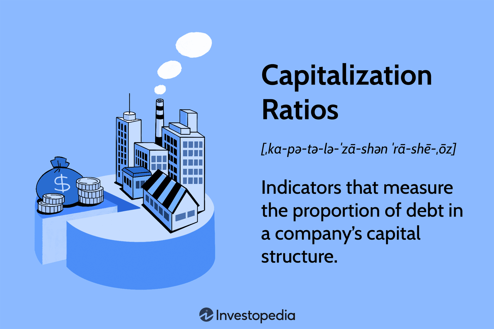

In today's fast-paced digital age, the ability to write effectively and accurately holds significant importance, especially in professional arenas like algorithmic trading. This discipline emphasizes precision and accuracy not only in handling numbers and data but also in communication through various mediums such as reports, documentation, or even automated scripts.

Algorithmic trading, often abbreviated as algo trading, involves using algorithms to automate trading strategies and decisions. The success of these algorithms depends on their precision and how well they are communicated and documented. Thus, writing plays a critical role in ensuring that concepts are clearly expressed and understood, minimizing the risk of errors that could have financial repercussions.



In professional writing, adhering to proper grammar and capitalization rules is essential for maintaining clarity and preventing misunderstandings. Correct grammar ensures that communication remains unambiguous and efficient, a crucial factor when dealing with complex data and instructions inherent in algorithmic trading environments. Capitalization, although sometimes perceived as a minor detail, can influence the interpretation of a document by distinguishing important terms such as company names, specific titles, and technical concepts from the rest of the text.

This article aims to explore strategies that professionals in the financial and tech sectors can employ to enhance their writing skills. Understanding the nuances of grammar and capitalization is not solely about following rules but also about improving the quality and clarity of communication within these fields. This focus on precision in writing complements the rigor required in algorithmic trading, where the smallest mistake can lead to significant consequences. By mastering effective communication practices, professionals can enhance their work quality, ensuring that their algorithms and the accompanying documentation are both accurate and easily understandable.

## Table of Contents

## Understanding Capitalization and Its Importance

Capitalization is a crucial component of grammar that plays a significant role in professional writing, particularly in precision-driven fields like algorithmic trading. It involves starting a word with an uppercase letter followed by lowercase, primarily to distinguish proper nouns, titles, and salient concepts from other words. This differentiation is essential not only for aesthetics but also for clarity and respect in communication. For instance, company names such as "Goldman Sachs", project titles like "Quantum Leap", and personal names all require capitalization to convey significance and respect.

In professional settings, including algorithmic trading, proper capitalization can have tangible implications beyond mere formality. A miscapitalized word in a trading document or algorithm script can lead to misunderstandings that might propagate errors or misinterpretations. For example, in code, proper capitalization is often used to define constants, variables, and function names, adhering to consistent conventions ensures that scripts are both readable and less prone to error.

Several capitalization rules are particularly pertinent in professional writing. These include capitalizing the first word of a sentence, proper nouns, titles when they precede a name, and major words in titles. Additionally, names of specific entities, institutions, and historical events are capitalized, for example, "Federal Reserve Board" or "Black Monday".

In the context of [algorithmic trading](/wiki/algorithmic-trading), clear and precise documentation is indispensable. Algorithms that fail often do so due to overlooked details, some of which might stem from improper capitalization. For instance, in documentation or within a script, if a key term meant to reference a specific entity during trading is not consistently capitalized, it may not trigger the intended functions, leading to potential financial discrepancies.

Consider the following simple Python example to illustrate the significance of consistent capitalization:

```python
def get_price(ticker):
    # Assuming a function that retrieves stock prices
    prices = {"AAPL": 150.00, "MSFT": 250.00}
    return prices.get(ticker.upper(), "Ticker not found")

ticker = "aapl"
price = get_price(ticker)
print(f"The price of {ticker.upper()} is {price}.")
```

In this example, capitalizing the ticker symbol using `.upper()` ensures that the input aligns with the format of the dictionary keys, preventing errors in fetching the correct stock prices.

Therefore, adherence to capitalization rules in algorithmic trading environments is not merely a stylistic choice but a necessary practice to maintain clarity and precision. Errors in capitalization can lead to misunderstandings that escalate into costly trading mistakes, emphasizing the importance of maintaining rigorous standards in professional writing and documentation.

## Key Grammar Rules for Professional Writing

Grammar forms the backbone of effective communication, ensuring that messages are conveyed clearly and accurately, which is particularly critical in professional settings such as finance and technology. These fields often involve complex data and intricate algorithms, making it essential for written communications to be precise and unambiguous. The key grammar rules that underpin effective professional writing include syntax, punctuation, and usage.

Professionals tasked with constructing documentation, reports, or even coding algorithms must ensure that their grammar is flawless. Inconsistencies or errors can lead to misunderstandings, potentially resulting in significant financial losses or technical malfunctions. For instance, subject-verb agreement is crucial. Consider the sentence: "The results of the analysis is conclusive." The mismatch between the singular verb "is" and the plural subject "results" can confuse readers, and in a report or algorithmic context, such disparities could lead to erroneous interpretations.

Punctuation also plays a vital role in maintaining clarity. Misplaced commas or missing periods can alter the intended meaning of a sentence. For example, the absence of a comma in a list may combine separate elements into one ambiguous item, skewing data interpretations or instructions: "Trade, confirm if yes proceed," versus the clearer "Trade, confirm; if yes, proceed."

Syntax, the arrangement of words and phrases to create well-formed sentences, is another crucial component. In algorithmic trading, syntax errors can manifest in programming scripts, leading to bugs or system crashes. Consider the Python code snippet used in trading bots:

```python
if trade_status == "successful":
    execute_trade(amount) 
else amount > threshold     
    halt_operation()
```

This example has a syntax error in the else statement, which lacks the proper conditional expression structure. Instead, it should be structured correctly as follows:

```python
if trade_status == "successful":
    execute_trade(amount)
elif amount > threshold:
    halt_operation()
```

Effective professional writing also requires attention to sentence structure. Long, convoluted sentences can be challenging to follow and decipher, leading to potential misinterpretations. A clear example from financial documentation might be rephrasing a complex compound sentence into separate, simpler sentences to enhance comprehensibility.

Furthermore, understanding and avoiding common grammar pitfalls such as the misuse of homophones (e.g., "their," "there," "they're") ensures that written communication is professional and devoid of errors. 

To illustrate the impact of good grammar in professional settings, consider this excerpt from a trading report: "The software's accuracy rate, which has been improved, leads to higher profitability." Here, proper punctuation and concise sentence structure contribute to clarity, ensuring the reader accurately comprehends the message.

In summary, mastering syntax, punctuation, and sentence structure is essential for professionals, particularly in finance and technology sectors, where the precision of communication can significantly affect operational outcomes. By adhering to these fundamental grammar principles, professionals can enhance their writing clarity, ensuring that their communications are effective and free from ambiguity.

## Writing for Algorithmic Trading

Algorithmic trading, a domain where speed and accuracy are paramount, relies on the precise development and execution of trading algorithms. Writing plays a pivotal role in this process, as it forms the foundation for documenting strategies, writing code, and ensuring clear communication among stakeholders. The writing involved in algorithmic trading is nuanced and requires a deep understanding of various technical and financial terminologies.

Effective documentation is critical in algorithmic trading. This involves creating comprehensive manuals that describe the trading strategies and the logic behind the algorithms. This documentation not only facilitates communication within teams but also acts as an essential reference for future modifications and audits. For example, a well-documented algorithm might include flowcharts or pseudocode, which outline the decision-making process and logic paths. Documents must use precise language to avoid ambiguities that could lead to financial losses or compliance issues.

In addition to documentation, reports generated from trading algorithms need to be clear and detailed. Market analysts, investors, and regulators may rely on these reports to make informed decisions. The language used must express complex data insights in an understandable way. This often involves summarizing algorithm performance, highlighting significant market trends, and explaining any unusual events with clarity.

Writing code for algorithms is another crucial aspect. Code should be written with readability and maintainability in mind to allow other developers to quickly understand and modify trading strategies as needed. For instance, using clear variable names like `moving_average` instead of `ma` can significantly enhance readability:

```python
def calculate_moving_average(prices, window_size):
    return [sum(prices[i:i+window_size])/window_size for i in range(len(prices)-window_size+1)]
```

Furthermore, the language used in writing system specifications must align with industry standards and conventions, ensuring that all stakeholders have a clear understanding of the requirements and functionalities of the trading systems. Precise writing mitigates risks associated with misinterpretations that could result in faulty system behavior and financial loss.

The integration of technical jargon and industry-specific terminology is inevitable in algorithmic trading. Writers must balance the use of technical terms with clarity, ensuring that complex ideas are communicated effectively without sacrificing the precision needed for technical accuracy. It's important to provide definitions or explanations for jargon when writing for a diverse audience, which may include team members with varying expertise.

Ultimately, precision in writing is not just a requisite for effective communication; it is a critical risk management tool in algorithmic trading. By reducing misunderstandings and ensuring that all elements of the trading process are documented and clearly articulated, professionals can enhance performance and avoid costly errors. As the landscape of algorithmic trading evolves, the importance of skilled writing remains a constant, underpinning successful strategy development and execution.

## Tools and Resources for Improving Writing and Grammar

Several tools and resources are available to assist professionals in enhancing their writing and grammar skills, particularly for those engaged in algorithmic trading. One of the most ubiquitous and effective tools is the grammar checker. Software such as Grammarly offers real-time identification and correction of grammatical errors, spelling mistakes, and even style suggestions, providing users with the opportunity to quickly rectify and learn from their writing shortcomings. This tool can be particularly beneficial in crafting concise and precise documentation essential in fast-paced professional settings, like finance and technology.

For professionals in algorithmic trading, the requirements extend beyond general writing to include specialized documentation and algorithm scripting. To meet these demands, specific writing tools and environments have been developed. Integrated Development Environments (IDEs) such as Visual Studio Code offer extensions and plugins that facilitate coding with features like syntax highlighting and auto-complete, which are crucial in minimizing errors while writing scripts for trading algorithms. These tools enable traders to maintain consistency and accuracy, which are vital for the development and operation of trading systems.

Moreover, resources such as the Purdue Online Writing Lab (OWL) provide comprehensive guidance on grammar, punctuation, and style, supporting a deeper understanding of writing mechanics. These resources include extensive examples and exercises to enhance learning.

In algorithmic trading, the importance of standardized documentation cannot be overstated. Templates for system specifications and reports help ensure that essential information is conveyed effectively. For example, LaTeX, a high-quality document preparation system, is often used for creating well-structured and professional documents, aiding in the clear presentation of complex data and algorithmic principles. It allows professionals to incorporate mathematical notations with ease, an essential aspect given the quantitative nature of trading algorithms.

Below is a Python snippet demonstrating the use of syntax highlighting and auto-complete features in an IDE to enhance code readability and reduce errors:

```python
import pandas as pd

# Load trading data
data = pd.read_csv('market_data.csv')

# Calculate moving average
def moving_average(data, window_size):
    return data['price'].rolling(window=window_size).mean()

# Apply moving average function
data['moving_avg'] = moving_average(data, window_size=20)

# Display resulting DataFrame
print(data.head())
```

By utilizing a combination of these tools and resources, professionals in algorithmic trading and finance can significantly improve their writing and documentation. This, in turn, leads to enhanced communication, reduced errors, and overall better performance in their professional endeavors.

## Conclusion

Mastering the nuances of writing, capitalization, and grammar is essential in professional environments, particularly within the fast-paced domain of algorithmic trading. This proficiency supports effective communication, a cornerstone for the development and management of trading algorithms. In such a precise field, clarity and precision in writing are non-negotiable. Proper grammar and capitalization help prevent misinterpretations, ensuring that algorithms are correctly understood and executed, thereby mitigating risks associated with errors.

Leveraging available tools, such as grammar checkers and writing aids, allows professionals to enhance their communication skills. These tools assist in adhering to core grammar rules, which in turn can lead to improved efficiency and accuracy in their work. By utilizing these resources, professionals in algorithmic trading can focus on crafting well-structured documents, reports, and scripts that are free from ambiguities.

Continuous learning and practicing writing skills are also crucial. It ensures that communication across all professional interactions remains clear, precise, and effective. Whether it involves conveying complex strategies in trading reports or documenting algorithmic processes, refined writing skills contribute to more successful outcomes. Ultimately, prioritizing excellent writing and communication enhances the performance and reliability of algorithmic systems, fostering a more robust and efficient trading environment.

## References & Further Reading

[1]: Bergstra, J., Bardenet, R., Bengio, Y., & Kégl, B. (2011). ["Algorithms for Hyper-Parameter Optimization."](https://papers.nips.cc/paper/4443-algorithms-for-hyper-parameter-optimization) Advances in Neural Information Processing Systems 24.

[2]: ["Advances in Financial Machine Learning"](https://www.amazon.com/Advances-Financial-Machine-Learning-Marcos/dp/1119482089) by Marcos Lopez de Prado 

[3]: ["Evidence-Based Technical Analysis: Applying the Scientific Method and Statistical Inference to Trading Signals"](https://www.amazon.com/Evidence-Based-Technical-Analysis-Scientific-Statistical/dp/0470008741) by David Aronson

[4]: ["Machine Learning for Algorithmic Trading: Predictive models to extract signals from market and alternative data for systematic trading strategies with Python, 2nd Edition"](https://www.amazon.com/Machine-Learning-Algorithmic-Trading-alternative/dp/1839217715) by Stefan Jansen

[5]: ["Quantitative Trading: How to Build Your Own Algorithmic Trading Business"](https://www.amazon.com/Quantitative-Trading-Build-Algorithmic-Business/dp/1119800064) by Ernest P. Chan