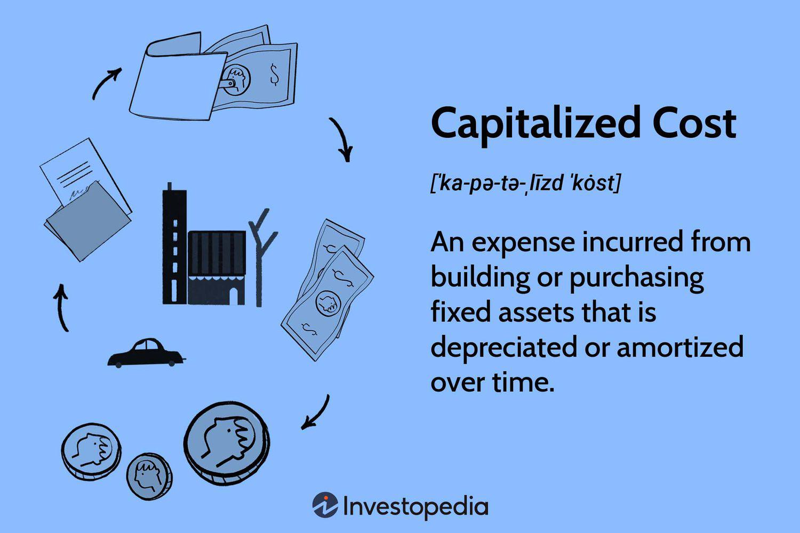

In financial accounting, Capital Expenditure (CapEx) and Operational Expenditure (OpEx) are pivotal in shaping a company's financial strategy and operational decisions. CapEx involves investments in long-term assets that benefit the company over several years, such as equipment and infrastructure. These expenditures are capitalized and depreciated over time. In contrast, OpEx consists of day-to-day expenses necessary for regular business operations, including salaries, rent, and utilities, which are expensed in the period incurred.

Understanding CapEx and OpEx is crucial as they offer distinct implications for financial planning, taxation, and investor perception. Properly categorizing expenditures can optimally impact a company's profitability and cash flow. Businesses, as they adapt to changing economic landscapes, must comprehend these distinctions to effectively manage growth and operational efficiency.

This article examines CapEx and OpEx, giving attention to their role in financial accounting, the capitalizing of costs, and their relevance in algorithmic trading. These expenditure types are integral to business growth and operational efficiency, determining how organizations allocate resources and plan for future investments. As such, a clear understanding of CapEx and OpEx is indispensable for crafting robust financial strategies that ensure long-term success and sustainability.

## Table of Contents

## Understanding CapEx and OpEx

CapEx, or Capital Expenditure, represents the funds utilized by a business to acquire or upgrade physical assets such as property, industrial buildings, or equipment. This type of expenditure is capitalized on the company's balance sheet, meaning it is not immediately expensed on the income statement. Instead, it is depreciated over its useful life, reflecting its ongoing contribution to the company. CapEx is generally associated with large purchases or investments that have benefits extending beyond a single accounting period. For instance, purchasing new machinery or constructing a new factory would be categorized as CapEx, as these assets will contribute to the business's operations for many years.

OpEx, or Operational Expenditure, encompasses the costs necessary for the day-to-day functioning of a business. These include expenses like rent, utilities, wages, and materials required for production. Unlike CapEx, OpEx is fully deducted from the company's revenue during the period in which it is incurred, impacting the net income promptly. This distinction is crucial because OpEx reflects the ongoing costs of running the business, while CapEx is more about long-term investments.

Understanding the differences between CapEx and OpEx is imperative for making informed investment and operational decisions. It affects not only how financial health is reported but also influences decisions on budget allocation, forecasting, and strategy. A company focused on growth might prioritize CapEx to acquire new capabilities and expand its market presence. Conversely, a business looking to maintain steady operations might optimize its OpEx to ensure efficiency and cost-effectiveness. The ability to distinguish these expenditures enables companies to align their financial strategies with overall business goals, ensuring efficient resource utilization and sustainable growth.

## Financial Accounting Implications

Financial accounting differentiates between Capital Expenditure (CapEx) and Operational Expenditure (OpEx), resulting in varied impacts on the preparation of financial statements. CapEx comprises expenses incurred for acquiring or upgrading physical assets, such as property, industrial buildings, or equipment, which are capitalized on the balance sheet. These expenditures are considered long-term investments and are depreciated over their respective useful lives. This treatment implies that instead of expensing the entire cost in the year of purchase, CapEx is allocated across several periods, reducing taxable income over the years through depreciation.

The accounting for CapEx involves recording the initial expense as an asset on the balance sheet and allocating the cost over its useful life using depreciation methods like straight-line or declining balance. Mathematically, the annual depreciation expense (D) using the straight-line method can be calculated as:

$$
D = \frac{{\text{Initial Cost} - \text{Salvage Value}}}{{\text{Useful Life}}}\]

This allocation affects a company’s long-term financial statements, enhancing asset value while gradually impacting profit.

In contrast, OpEx pertains to the immediate expenses necessary for the daily operation of the business, such as utilities, salaries, and rent. These are deducted from the business's revenue in the period they are incurred, directly reducing the net income on the income statement. Since OpEx does not extend benefits beyond the present accounting period, it is not capitalized.

The treatment distinction between CapEx and OpEx has a significant influence on tax liabilities. Capitalized expenses provide tax benefits in the form of depreciation deductions spread out over time, potentially reducing the taxable income through lower reported profits initially. Conversely, OpEx offers immediate tax relief during the period the expense is incurred, affecting the taxable income directly in that year.

Additionally, these expenditures impact key financial metrics such as Earnings Before Interest, Taxes, Depreciation, and Amortization (EBITDA). While OpEx is included in the EBITDA calculation as it affects operating expenses, CapEx is not, since it is accounted as an asset. This leads to EBITDA commonly being utilized as an indicator for operational profitability, given it excludes the effects of CapEx.

Understanding these distinctions helps in strategic financial planning, enabling businesses to optimize their tax strategies and accurately reflect their financial health.

## CapEx vs OpEx in Capitalized Costs

Capitalized costs are significant in financial accounting as they are added to the value of an asset on a company's balance sheet. The determination of whether a cost should be capitalized or expensed is crucial and can significantly impact both reported earnings and the valuation of assets.

When a company incurs costs related to acquiring or producing a long-term asset, such as property, plant, or equipment, these are typically classified as capital expenditures (CapEx) and are capitalized. This process involves recognizing the cost as an asset rather than an expense, subsequently depreciating it over the asset's useful life. This treatment aligns with the matching principle, ensuring that expenses are recorded in the same period as the revenue they help generate.

Operational expenditures (OpEx), in contrast, cover routine operating costs necessary for maintaining a company's day-to-day functionality. These expenses are expensed immediately and deducted from revenues in the period they are incurred, affecting the net income on the income statement.

The choice to capitalize or expense costs can influence a company's financial statements significantly. Capitalizing costs results in higher asset values and deferred expense recognition, which can enhance short-term profitability but may increase tax liabilities over time. Conversely, expensing costs immediately reduces short-term profitability but can lead to tax advantages by decreasing taxable income in the current period.

In the context of software development, for instance, Generally Accepted Accounting Principles (GAAP) specify conditions under which software development costs can be capitalized. During the application development stage, costs such as coding and testing related to specific software functionalities are usually capitalized. However, costs incurred during the preliminary project stage and post-implementation operation stage are typically expensed. Compliance with GAAP ensures that software development costs are appropriately capitalized, enhancing asset valuation and possibly improving financial metrics.

Considering the impact of capitalized and expensed costs on financial metrics, companies need to exercise strategic judgment in their financial reporting processes. This requires a thorough understanding of accounting standards to ensure transparency and maintain investor confidence.

## Algorithmic Trading and Expenditure Types

Algorithmic trading utilizes advanced financial algorithms to execute trading decisions with minimal human intervention. This practice has become increasingly relevant in modern financial markets due to its potential for speed, precision, and the ability to process vast data sets. In developing strategies for [algorithmic trading](/wiki/algorithmic-trading), comprehending the impact of Capital Expenditure (CapEx) and Operational Expenditure (OpEx) is vital.

Investments in trading technologies, such as high-performance computing hardware and sophisticated trading software, are typically classified under CapEx. These investments are considered long-term assets as they provide benefits that extend beyond a single fiscal period. Strategic financial planning is indispensable when allocating substantial capital to these assets, as they often require significant upfront financial commitments. Effective deployment of CapEx in algorithmic trading technology can enhance algorithm execution and data processing efficiency.

Conversely, the day-to-day expenses associated with maintaining and operating these trading systems are categorized as OpEx. These operational costs include system maintenance, data feed subscriptions, and salaries for personnel involved in monitoring and improving algorithmic systems. Expenditures classified as OpEx are deducted from revenue in the financial period they are incurred, directly affecting the company’s profitability in that period.

Balancing CapEx and OpEx is crucial in algorithmic trading firms to maintain operational efficiency and support long-term growth objectives. An optimal financial strategy encompasses investing in cutting-edge technologies while managing operating expenses to enhance overall financial health. Recognizing the implications of CapEx and OpEx in the development and sustainability of algorithmic trading practices enables firms to maintain a competitive edge in rapidly evolving financial markets.

## Strategic Financial Planning for Growth

Efficient allocation of Capital Expenditure (CapEx) and Operational Expenditure (OpEx) is crucial for sustaining and growing a business. Strategic financial decisions regarding these expenditures impact company viability and competitive advantage. By balancing long-term investments with day-to-day operational expenses, companies can ensure optimized resource utilization.

In the context of strategic financial planning, CapEx involves large investments that provide future benefits, such as purchasing machinery, buildings, or technology infrastructure. These expenditures are essential for expansion and modernization efforts. Proper planning and allocation of CapEx allow businesses to leverage emerging technologies and expand operations, leading to increased market share and enhanced competitive positioning.

OpEx, on the other hand, encompasses the regular costs of running a business. Expenses like utilities, salaries, and rent fall under this category. Companies that effectively manage OpEx can maintain efficient operations and ensure a smooth flow of business activities without affecting the company's [liquidity](/wiki/liquidity-risk-premium). Cost-effective management of OpEx is important for sustaining profitability in rapidly changing market environments.

Balancing CapEx and OpEx involves a thorough understanding of the company's financial goals, market dynamics, and investment opportunities. For instance, evaluating the return on investment (ROI) of CapEx projects helps prioritize investments that align with strategic objectives. This often involves leveraging financial metrics such as Net Present Value (NPV) and Internal Rate of Return (IRR) to assess potential projects. Calculating these metrics requires analyzing both the initial outlay and the projected cash flows:

$$
\text{NPV} = \sum \frac{R_t}{(1 + i)^t} - C_0
$$

where $R_t$ is the net cash inflow during period $t$, $i$ is the discount rate, and $C_0$ is the initial investment. Companies use such analyses to make informed decisions about which projects to pursue.

Moreover, businesses can optimize their resource utilization by implementing cost-cutting measures and efficiency improvements in OpEx areas. For example, switching to energy-efficient lighting or outsourcing non-core activities can reduce operational costs while maintaining or improving service levels.

Effective strategic financial planning encompasses not only the efficient allocation of financial resources but also risk management. Companies must consider factors such as economic [volatility](/wiki/volatility-trading-strategies), technological disruptions, and competitive pressures in their planning processes. By adopting a flexible approach to financial planning, businesses can enhance their adaptability to changes and capitalize on growth opportunities.

In conclusion, the strategic allocation of CapEx and OpEx is a foundational element of a company's financial strategy. Organizations that skillfully manage these expenditures can sustain growth, enhance profitability, and maintain a competitive edge in their industries.

## Conclusion

Understanding the nuances between CapEx (Capital Expenditure) and OpEx (Operational Expenditure) is essential for developing a robust financial strategy. These two types of expenditures represent different financial commitments and have distinct impacts on a company’s financial health and long-term objectives. CapEx typically involves significant investments in assets expected to generate benefits over an extended period, while OpEx pertains to the regular expenses incurred during the day-to-day operations of a business.

Companies must adeptly manage these expenditures to maximize profits and achieve sustained success. Effective navigation of CapEx and OpEx involves strategically timing and allocating resources, balancing the need for immediate operational efficiency with the necessity of long-term investment in infrastructure and technology. This balance is crucial in today’s rapidly evolving business environment, where technological advancements can quickly render existing assets obsolete.

Implementing sound financial accounting practices is critical for ensuring transparency and maintaining investor confidence. These practices aid in accurately reflecting CapEx and OpEx on financial statements, which, in turn, influences stakeholders’ perceptions and decisions. Financial statements must clearly delineate capitalized assets from operational costs, as this distinction affects key financial metrics like EBITDA (Earnings Before Interest, Taxes, Depreciation, and Amortization). Furthermore, adherence to accounting standards such as GAAP ensures consistency and comparability in financial reporting.

In conclusion, mastering CapEx and OpEx dynamics allows companies to optimize their resource utilization, improve financial performance, and sustain competitive advantage. By integrating these insights into strategic planning, businesses can bolster their financial resilience and drive long-term growth.

## References & Further Reading

[1]: ["Advances in Financial Machine Learning"](https://www.amazon.com/Advances-Financial-Machine-Learning-Marcos/dp/1119482089) by Marcos Lopez de Prado

[2]: ["Machine Learning for Algorithmic Trading"](https://www.amazon.com/Machine-Learning-Algorithmic-Trading-alternative/dp/1839217715) by Stefan Jansen

[3]: ["Quantitative Trading: How to Build Your Own Algorithmic Trading Business"](https://books.google.com/books/about/Quantitative_Trading.html?id=j70yEAAAQBAJ) by Ernest P. Chan

[4]: ["Financial Accounting Theory"](https://corporatefinanceinstitute.com/resources/accounting/financial-accounting-theory/) by Craig Deegan

[5]: ["Corporate Finance: Theory and Practice"](https://www.amazon.com/Corporate-Finance-Practice-Pierre-Vernimmen/dp/1119424488) by Aswath Damodaran