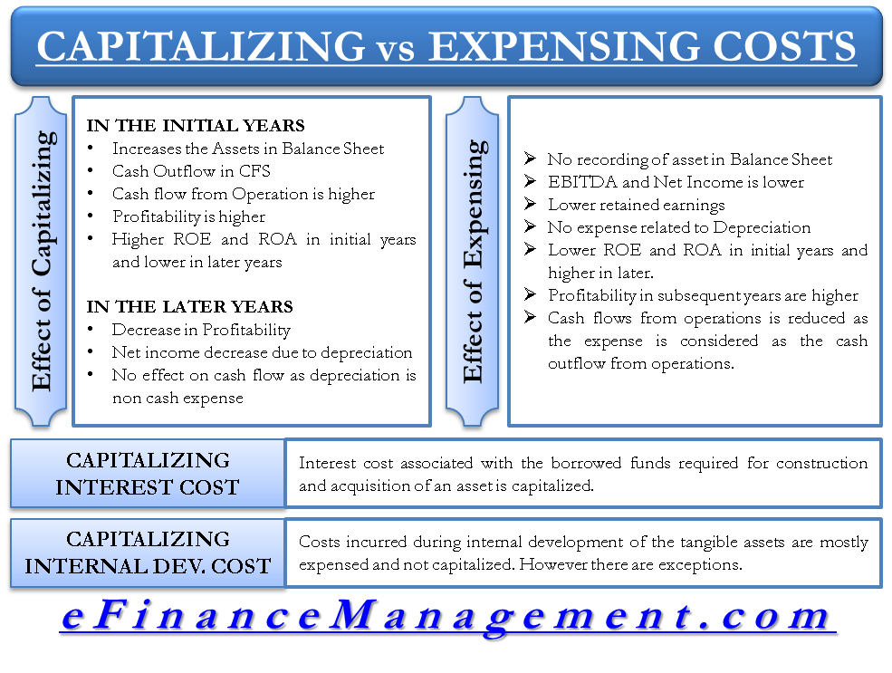

## Table of Contents

## What is capitalized cost?

Capitalized cost is the total amount of money a business spends to buy or create a long-term asset, like a building or a machine. Instead of treating this cost as an expense right away, the business records it as an asset on its balance sheet. This means the cost is spread out over the useful life of the asset, which helps the business manage its finances better.

When a business uses an asset over time, it slowly reduces the value of the asset on its balance sheet through a process called depreciation. This way, the cost of the asset is matched with the income it helps to generate. For example, if a company buys a delivery truck, the cost of the truck is capitalized and then depreciated over several years, reflecting how the truck helps the company earn money over that period.

## How does capitalized cost differ from operating expense?

Capitalized cost and operating expense are two different ways a business handles its spending. A capitalized cost is the money spent on big, long-lasting things like buildings or equipment. Instead of counting this cost as an expense right away, the business adds it to its balance sheet as an asset. Then, over time, the business slowly reduces this asset's value through depreciation, spreading the cost over the years the asset is used. This helps match the cost with the income the asset helps to generate.

On the other hand, an operating expense is the money a business spends on the day-to-day running of the company. This includes costs like rent, utilities, and office supplies. These expenses are recorded immediately on the income statement and reduce the company's profit for that period. Unlike capitalized costs, operating expenses are not spread out over time but are accounted for in the period they occur, reflecting the ongoing costs of keeping the business running.

## Can you provide examples of capitalized costs in a business?

When a business buys a big machine, like a printing press, the cost of that machine is a capitalized cost. Instead of counting the whole cost as an expense right away, the business adds it to its balance sheet as an asset. Over time, as the machine is used, the business slowly reduces its value through something called depreciation. This way, the cost of the machine is spread out over the years it helps the business make money.

Another example is when a company builds a new office building. The money spent on construction, including materials and labor, is a capitalized cost. The company doesn't treat this as an expense all at once but adds it to the balance sheet as an asset. As the building is used over many years, its value is gradually reduced through depreciation, matching the cost with the income the building helps generate.

## What are the advantages of capitalizing costs?

Capitalizing costs helps a business manage its money better. When a company buys something big like a machine or builds a new office, it doesn't have to count the whole cost as an expense right away. Instead, it can spread the cost over many years. This means the business can show more profit in the short term, which can make it look healthier to investors and lenders.

Another advantage is that capitalizing costs matches the expense with the income the asset helps to generate. For example, if a company buys a delivery truck, the cost of the truck is spread out over the years it's used. This way, the business can better see how the truck helps make money over time. It's a fairer way to show how much the truck really costs the business in the long run.

## What are the disadvantages of capitalizing costs?

One downside of capitalizing costs is that it can make a business look more profitable than it really is in the short term. When a company spreads out the cost of a big purchase over many years, it doesn't have to show the full expense right away. This can make the company's profits look bigger at first, but it might give a false picture of how well the business is doing. Investors and lenders might be misled if they don't understand that the real costs are just being delayed.

Another disadvantage is that capitalizing costs can make it harder to manage cash flow. Even though the expense is spread out on paper, the business still has to pay for the big purchase all at once. This can use up a lot of money upfront, which might leave the company short on cash for other important things like paying bills or buying supplies. If the business doesn't plan carefully, it could run into money problems even if it looks good on the balance sheet.

## How does capitalizing costs affect a company's financial statements?

When a company capitalizes costs, it affects its financial statements by showing the cost as an asset on the balance sheet instead of an expense on the income statement right away. For example, if a company buys a big machine, it records the cost of the machine as an asset. This means the company's assets go up, and its immediate expenses go down. As a result, the company's profit looks higher in the short term because the cost of the machine isn't counted as an expense all at once.

Over time, the company slowly reduces the value of the asset through depreciation. This depreciation is then shown as an expense on the income statement, but it's spread out over the years the asset is used. So, while the company's profit might look better at first, the total profit over time will be the same because the cost of the asset is eventually counted as an expense. This way of handling costs can make the company's financial health look better in the short term, but it's important for people looking at the financial statements to understand that the real costs are just being spread out over time.

## What criteria must be met for a cost to be capitalized?

For a cost to be capitalized, it needs to meet certain rules. The cost must be for something that will last a long time, like a building or a machine. These are called long-term assets. The cost should also help the business make money over several years. If the cost is for something that will be used up quickly, like office supplies, it can't be capitalized.

Another rule is that the cost must be big enough to matter. Small costs are usually not worth capitalizing because it's too much work to keep track of them over time. Also, the cost should be something that can be easily measured. This means the business needs to know exactly how much it spent on the asset. If these rules are followed, the cost can be added to the balance sheet as an asset instead of being counted as an expense right away.

## How do tax regulations influence the decision to capitalize costs?

Tax rules can affect whether a business chooses to capitalize costs. When a company capitalizes a cost, it can spread out the expense over many years through something called depreciation. This can lower the company's taxable income each year, which means it pays less tax in the short term. But, tax laws have rules about what costs can be capitalized and how they must be depreciated. If a business doesn't follow these rules, it might have to pay more in taxes or even get in trouble.

On the other hand, if a business chooses to treat a cost as an expense right away, it can reduce its taxable income for that year. This might be better if the business wants to lower its tax bill quickly. But, the tax rules might not let the business expense everything it wants to right away. Sometimes, the tax laws say certain costs have to be capitalized, no matter what the business wants. So, understanding the tax rules is really important for a business when deciding whether to capitalize costs or not.

## What is the impact of capitalizing costs on a company's cash flow?

When a company capitalizes costs, it affects its cash flow right away. Even though the cost is spread out over time on the financial statements, the company still has to pay for the big purchase all at once. This means the business needs a lot of money upfront, which can make it harder to pay for other things like bills or supplies. If the company doesn't have enough cash on hand, it might need to borrow money or use up its savings, which can be risky.

Over time, capitalizing costs can help the company's cash flow look better. Because the cost is spread out through depreciation, the company's expenses are lower each year. This means the business can show more profit on its income statement, which can make it easier to get loans or attract investors. But, it's important for the company to manage its cash carefully because the real money was spent a long time ago, even if the financial statements don't show it all at once.

## How does the choice between capitalizing and expensing costs affect a company's profitability?

When a company chooses to capitalize costs, it shows the money spent on big things like machines or buildings as an asset on its balance sheet. This means the full cost isn't counted as an expense right away. Instead, the cost is spread out over many years through something called depreciation. Because the expense is smaller each year, the company's profit looks higher in the short term. This can make the business look more profitable to investors and lenders, even though the total profit over time stays the same.

On the other hand, if a company decides to expense a cost right away, it counts the full amount as an expense in the year it's spent. This makes the company's profit for that year look lower. But, expensing costs can be good if the business wants to lower its taxable income quickly. It's all about balancing the short-term profit with the long-term financial health of the company. The choice depends on what the business needs at the time and how it wants to manage its money.

## What are the long-term strategic implications of capitalizing costs?

When a company chooses to capitalize costs, it can help them plan better for the future. By spreading out the cost of big purchases like machines or buildings over many years, the company can keep more money in the short term. This can be really helpful if the business wants to invest in new projects or save up for future expenses. It can also make the company look more stable and profitable to investors, which might help them get more money to grow their business.

But, there are also some challenges with capitalizing costs. Even though the cost is spread out on paper, the company still has to pay for the big purchase all at once. This can use up a lot of their cash right away, which might make it hard to pay for other important things. Also, if the company doesn't manage its money carefully, it could run into problems later on. So, while capitalizing costs can help with long-term planning, it's important for the business to think about how it will affect their cash flow and overall financial health.

## How do international accounting standards (like IFRS) differ from local GAAP in treating capitalized costs?

International Financial Reporting Standards (IFRS) and local Generally Accepted Accounting Principles (GAAP) have some differences in how they treat capitalized costs. IFRS tends to be more flexible and focuses on the principle that costs should be capitalized if they are expected to provide future economic benefits. This means that under IFRS, companies might be able to capitalize more types of costs, like development costs, if they meet certain criteria. On the other hand, local GAAP, like the U.S. GAAP, can be more strict and detailed in its rules, often requiring specific conditions to be met before costs can be capitalized.

For example, under U.S. GAAP, research and development costs are usually expensed immediately, while IFRS allows development costs to be capitalized if they meet certain criteria. This difference can lead to different financial statements and profitability measures between companies using IFRS and those using local GAAP. Understanding these differences is important for investors and businesses that operate in different countries, as it affects how they compare financial performance across borders.

## What are the implications of financial accounting?

Financial accounting differentiates between Capital Expenditure (CapEx) and Operational Expenditure (OpEx), resulting in varied impacts on the preparation of financial statements. CapEx comprises expenses incurred for acquiring or upgrading physical assets, such as property, industrial buildings, or equipment, which are capitalized on the balance sheet. These expenditures are considered long-term investments and are depreciated over their respective useful lives. This treatment implies that instead of expensing the entire cost in the year of purchase, CapEx is allocated across several periods, reducing taxable income over the years through depreciation.

The accounting for CapEx involves recording the initial expense as an asset on the balance sheet and allocating the cost over its useful life using depreciation methods like straight-line or declining balance. Mathematically, the annual depreciation expense (D) using the straight-line method can be calculated as:

$$
D = \frac{{\text{Initial Cost} - \text{Salvage Value}}}{{\text{Useful Life}}}\]

This allocation affects a company’s long-term financial statements, enhancing asset value while gradually impacting profit.

In contrast, OpEx pertains to the immediate expenses necessary for the daily operation of the business, such as utilities, salaries, and rent. These are deducted from the business's revenue in the period they are incurred, directly reducing the net income on the income statement. Since OpEx does not extend benefits beyond the present accounting period, it is not capitalized.

The treatment distinction between CapEx and OpEx has a significant influence on tax liabilities. Capitalized expenses provide tax benefits in the form of depreciation deductions spread out over time, potentially reducing the taxable income through lower reported profits initially. Conversely, OpEx offers immediate tax relief during the period the expense is incurred, affecting the taxable income directly in that year.

Additionally, these expenditures impact key financial metrics such as Earnings Before Interest, Taxes, Depreciation, and Amortization (EBITDA). While OpEx is included in the EBITDA calculation as it affects operating expenses, CapEx is not, since it is accounted as an asset. This leads to EBITDA commonly being utilized as an indicator for operational profitability, given it excludes the effects of CapEx.

Understanding these distinctions helps in strategic financial planning, enabling businesses to optimize their tax strategies and accurately reflect their financial health.

## How can strategic financial planning be used for growth?

Efficient allocation of Capital Expenditure (CapEx) and Operational Expenditure (OpEx) is crucial for sustaining and growing a business. Strategic financial decisions regarding these expenditures impact company viability and competitive advantage. By balancing long-term investments with day-to-day operational expenses, companies can ensure optimized resource utilization.

In the context of strategic financial planning, CapEx involves large investments that provide future benefits, such as purchasing machinery, buildings, or technology infrastructure. These expenditures are essential for expansion and modernization efforts. Proper planning and allocation of CapEx allow businesses to leverage emerging technologies and expand operations, leading to increased market share and enhanced competitive positioning.

OpEx, on the other hand, encompasses the regular costs of running a business. Expenses like utilities, salaries, and rent fall under this category. Companies that effectively manage OpEx can maintain efficient operations and ensure a smooth flow of business activities without affecting the company's [liquidity](/wiki/liquidity-risk-premium). Cost-effective management of OpEx is important for sustaining profitability in rapidly changing market environments.

Balancing CapEx and OpEx involves a thorough understanding of the company's financial goals, market dynamics, and investment opportunities. For instance, evaluating the return on investment (ROI) of CapEx projects helps prioritize investments that align with strategic objectives. This often involves leveraging financial metrics such as Net Present Value (NPV) and Internal Rate of Return (IRR) to assess potential projects. Calculating these metrics requires analyzing both the initial outlay and the projected cash flows:

$$
\text{NPV} = \sum \frac{R_t}{(1 + i)^t} - C_0
$$

where $R_t$ is the net cash inflow during period $t$, $i$ is the discount rate, and $C_0$ is the initial investment. Companies use such analyses to make informed decisions about which projects to pursue.

Moreover, businesses can optimize their resource utilization by implementing cost-cutting measures and efficiency improvements in OpEx areas. For example, switching to energy-efficient lighting or outsourcing non-core activities can reduce operational costs while maintaining or improving service levels.

Effective strategic financial planning encompasses not only the efficient allocation of financial resources but also risk management. Companies must consider factors such as economic [volatility](/wiki/volatility-trading-strategies), technological disruptions, and competitive pressures in their planning processes. By adopting a flexible approach to financial planning, businesses can enhance their adaptability to changes and capitalize on growth opportunities.

In conclusion, the strategic allocation of CapEx and OpEx is a foundational element of a company's financial strategy. Organizations that skillfully manage these expenditures can sustain growth, enhance profitability, and maintain a competitive edge in their industries.

## References & Further Reading

[1]: ["Advances in Financial Machine Learning"](https://www.amazon.com/Advances-Financial-Machine-Learning-Marcos/dp/1119482089) by Marcos Lopez de Prado

[2]: ["Machine Learning for Algorithmic Trading"](https://www.amazon.com/Machine-Learning-Algorithmic-Trading-alternative/dp/1839217715) by Stefan Jansen

[3]: ["Quantitative Trading: How to Build Your Own Algorithmic Trading Business"](https://books.google.com/books/about/Quantitative_Trading.html?id=j70yEAAAQBAJ) by Ernest P. Chan

[4]: ["Financial Accounting Theory"](https://corporatefinanceinstitute.com/resources/accounting/financial-accounting-theory/) by Craig Deegan

[5]: ["Corporate Finance: Theory and Practice"](https://www.amazon.com/Corporate-Finance-Practice-Pierre-Vernimmen/dp/1119424488) by Aswath Damodaran