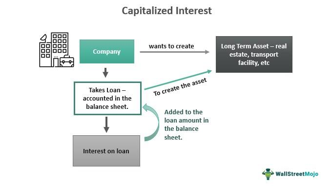

## Table of Contents

## What is capitalized interest?

Capitalized interest is when the interest on a loan or investment is added to the principal amount instead of being paid right away. This happens a lot with student loans or mortgages. When the interest is added to the principal, it increases the total amount of money you owe or have invested. Over time, you will have to pay interest on the new, higher amount, which can make the loan grow even bigger.

This can be good or bad depending on the situation. For students, it might mean their loan gets bigger while they are in school because they aren't paying the interest. But for investments, like when a company uses capitalized interest, it can help the investment grow faster because the interest earned is reinvested. It's important to understand how capitalized interest works so you can make smart choices about loans and investments.

## How does capitalized interest differ from regular interest?

Capitalized interest is different from regular interest because it gets added to the amount you owe or have invested, instead of being paid right away. With regular interest, you pay it as it comes due, so the amount you owe doesn't grow as fast. But with capitalized interest, the interest is added to the principal, making the total amount bigger. This means you'll pay interest on a larger amount in the future.

For example, if you have a student loan with capitalized interest, the interest that builds up while you're in school gets added to your loan. So, when you start paying it back, you're paying interest on a bigger amount than what you originally borrowed. On the other hand, if you pay the interest each month with regular interest, the loan doesn't grow as quickly. Capitalized interest can make your loan grow faster, but it can also help investments grow if the interest earned is reinvested.

## In what situations is interest typically capitalized?

Interest is often capitalized in situations where the borrower isn't making payments on the interest as it comes due. A common example is student loans. When students are in school, they usually don't have to make payments on their loans. Instead, the interest that builds up during this time is added to the loan amount. This means when they finish school and start paying back the loan, they owe more than they originally borrowed because the interest was capitalized.

Another situation where interest is typically capitalized is with construction loans. When a building or a house is being built, the loan interest might be added to the loan balance instead of being paid right away. This helps the borrower because they don't have to pay interest while the project is being completed. Once the construction is finished, the borrower starts paying back the loan, which now includes the capitalized interest. This can be helpful for managing cash flow during the building process.

## Can you explain the process of interest capitalization?

Interest capitalization is when the interest that builds up on a loan gets added to the amount you owe instead of being paid right away. This usually happens when you're not making payments on the interest as it comes due. For example, if you have a student loan and you're still in school, you might not have to pay the interest yet. Instead, that interest gets added to your loan. So, when you finish school and start paying back the loan, you owe more than you originally borrowed because the interest was added to your loan amount.

The process of interest capitalization can make your loan grow faster because you start paying interest on the new, bigger amount. Let's say you borrowed $10,000 and after a year, $500 in interest has built up. If that interest is capitalized, your new loan amount becomes $10,500. Now, you'll be paying interest on $10,500 instead of $10,000. This can happen over and over, making your loan grow even more if you're not careful. It's important to know when interest is being capitalized so you can plan your payments and manage your debt better.

## What are the common financial products where capitalized interest is applied?

Capitalized interest is often used with student loans. When students are in school, they usually don't have to pay the interest on their loans. Instead, the interest that builds up during this time is added to the loan amount. This means when they finish school and start paying back the loan, they owe more than they originally borrowed because the interest was capitalized. This can make the loan grow bigger over time, so it's important for students to understand this process.

Another common financial product where capitalized interest is used is construction loans. When a building or a house is being built, the interest on the loan might be added to the loan balance instead of being paid right away. This helps the borrower because they don't have to pay interest while the project is being completed. Once the construction is finished, the borrower starts paying back the loan, which now includes the capitalized interest. This can be helpful for managing cash flow during the building process.

## How does capitalized interest affect the total amount of debt?

Capitalized interest makes your total debt bigger. When interest is added to the loan instead of being paid right away, it increases the amount you owe. For example, if you have a student loan and you're still in school, the interest that builds up gets added to your loan. So, when you start paying it back, you owe more than what you borrowed at first. This can make your loan grow faster because you're now paying interest on a bigger amount.

This can happen over and over, making your debt even bigger if you're not careful. With construction loans, the interest might be added to the loan while the building is being built. This means when the building is finished, you start paying back a larger loan because the interest was added to it. Understanding how capitalized interest works can help you manage your debt better and plan your payments.

## What are the tax implications of capitalized interest?

Capitalized interest can have different tax effects depending on what kind of loan you have. For student loans, the interest you pay might be tax-deductible, but only the interest you actually pay, not the interest that gets added to your loan. So, if you have capitalized interest on your student loan, you can't claim a tax deduction for that part until you start paying it back.

For construction loans, things can be different. If you're building a home or a rental property, the capitalized interest might be added to the cost of the building. This can affect your taxes when you start using the property. You might be able to deduct the interest as part of the cost of the property over time, but it's a good idea to talk to a tax professional to understand how it works for your situation.

## How can one calculate the impact of capitalized interest over time?

To calculate the impact of capitalized interest over time, you need to understand how often the interest is added to your loan and at what rate. Let's say you have a loan of $10,000 with an annual interest rate of 5%. If the interest is capitalized yearly, at the end of the first year, you'll owe $10,500 because the $500 interest gets added to your loan. In the second year, you'll owe interest on $10,500, so you'll add another $525 in interest, making your new total $11,025. This process keeps going, making your loan grow bigger each year.

You can use a formula to figure this out more easily. The formula for compound interest, which is what capitalized interest is, is A = P(1 + r/n)^(nt). Here, A is the amount of money you owe after time t, P is the principal amount (the original loan), r is the annual interest rate (as a decimal), n is the number of times the interest is compounded per year, and t is the number of years. If you plug in your numbers, you can see how much your loan will grow over time. For example, if you have a $10,000 loan at 5% interest compounded yearly for 5 years, you'd calculate A = 10000(1 + 0.05/1)^(1*5) to find out your new total debt.

## What strategies can be used to minimize the effects of capitalized interest?

One way to minimize the effects of capitalized interest is to make payments on your loan while the interest is building up. For example, if you have a student loan, you can pay the interest each month while you're still in school. This stops the interest from being added to your loan, so your loan doesn't grow as fast. Another strategy is to look for loans that don't capitalize interest or have a lower interest rate. This can make a big difference in how much you end up owing.

It's also a good idea to pay off your loan as quickly as you can once you start making payments. The faster you pay it off, the less time there is for the interest to keep adding up. If you can, try to make extra payments on your loan. This can help you pay down the principal faster, which means less interest will be added to your loan over time. Talking to a financial advisor can also help you find the best way to manage your loans and minimize the effects of capitalized interest.

## How do different compounding frequencies affect capitalized interest?

Different compounding frequencies can change how fast your loan grows with capitalized interest. If the interest is compounded more often, like monthly or daily, it can make your loan grow faster than if it's compounded less often, like yearly. This is because when interest is added to your loan more often, you start paying interest on a bigger amount sooner. For example, if you have a loan with a 5% annual interest rate, and it's compounded monthly, you'll owe more at the end of the year than if it was compounded yearly.

Understanding how often your interest is compounded can help you plan your payments better. If you know your loan is compounded monthly, you might want to make payments more often to keep the interest from growing too fast. On the other hand, if your loan is compounded yearly, you might have a bit more time to save up for a bigger payment once a year. Either way, knowing the compounding frequency can help you manage your debt and minimize the effects of capitalized interest.

## What are the regulatory considerations regarding the disclosure of capitalized interest?

There are rules that say how lenders must tell borrowers about capitalized interest. These rules are made by groups like the Consumer Financial Protection Bureau (CFPB) in the United States. Lenders have to be clear about how capitalized interest works, how often it's added to the loan, and how it can make the total amount of debt grow. This information must be easy to understand so that borrowers know what they're getting into before they take out a loan.

The goal of these rules is to protect people from surprises and help them make good choices about their loans. Lenders have to include details about capitalized interest in the loan agreement and any other important documents. If a lender doesn't follow these rules, they could get in trouble and have to pay fines. So, it's important for borrowers to read all the information carefully and ask questions if they don't understand how capitalized interest might affect their loan.

## How does capitalized interest impact long-term investment strategies?

Capitalized interest can be good for long-term investment strategies because it can make your investment grow faster. When the interest earned on an investment is added back into the investment instead of being taken out, it's like planting more seeds in a garden. Over time, these seeds grow into bigger plants, and the interest keeps building on a bigger amount. This is called compounding, and it can help your investment grow a lot if you leave it alone for a long time.

But you need to be careful with how you use capitalized interest in your investment strategy. Not all investments work the same way, and some might have rules about when and how interest is added back in. It's important to understand these rules so you can choose the right investments for your goals. Talking to a financial advisor can help you figure out the best way to use capitalized interest to make your long-term investments grow.

## What is Capitalized Interest in Financial Accounting?

Capitalized interest is a pivotal concept in financial accounting, representing the incurred cost when borrowing funds to finance the construction or acquisition of long-term assets. Unlike regular interest expenses that are immediately expensed on the income statement, capitalized interest is added to the cost basis of an asset. This accounting treatment ensures that the cost of financing an asset is matched with the period in which the asset generates revenue, aligning with the matching principle under Generally Accepted Accounting Principles (GAAP).

### Accounting Principles Alignment

GAAP mandates that interest incurred during the construction of a long-term asset be capitalized. This approach adheres to the principle of matching costs with revenues, delaying the expense recognition until the asset is put into operational use. By capitalizing the interest, businesses can defer the interest expense, which would otherwise reduce net income in the periods leading up to the asset's productive use.

The formula used to calculate the amount of interest to be capitalized typically involves determining the "weighted average accumulated expenditures" (WAAE) on the asset during its construction and the [interest rate](/wiki/interest-rate-trading-strategies) applicable:

$$
\text{Capitalized Interest} = \text{WAAE} \times \text{Interest Rate}
$$

### Financial Statement Management

By capitalizing interest, firms can maintain asset values on balance sheets accurately, reflecting both the physical and financial investments made. This inclusion enhances the value of fixed assets in the balance sheet, affecting depreciation calculations in future accounting periods. The increased asset base subsequently influences financial ratios like return on assets (ROA) and debt-to-equity, making accurate presentation a critical aspect of financial statement management.

### Tax Implications

Capitalized interest impacts tax calculations by potentially altering the depreciation claims over the life of an asset. The Internal Revenue Service (IRS) allows for the depreciation of both the principal and the capitalized interest portion of an asset's cost. Thus, while businesses do not immediately recognize interest as a tax-deductible expense, they benefit from increased depreciation relief over the asset's useful life, impacting long-term tax planning and cash flows.

### Financial Planning Considerations

In the sphere of financial planning, understanding and managing capitalized interest is essential for accurate cash flow forecasting and asset management. Capitalized interest adds to the capital expenditure, influencing a company's budgeting and investment strategies. Accurate capitalized interest reporting can provide a clearer picture of an entity's capital investment efficiency, offering stakeholders and management crucial insights for strategic decision-making.

In summary, capitalized interest integrates vital financial accounting principles to ensure future financial stability. Its implications stretch beyond immediate cost recognition, influencing long-term asset valuation and tax efficiency, providing a comprehensive lens through which businesses can assess and optimize their financial strategies.

## What is the Amortization of Loan Costs?

Amortization is a fundamental concept in finance that involves the systematic payment of loan costs over time, breaking down payments into principal and interest components. This structured repayment plan provides borrowers with a clear and manageable approach to settling their debts, aiding in efficient financial planning.

### Structure of an Amortization Schedule

An amortization schedule is a detailed table that outlines each periodic payment on an amortizing loan. It specifies the amount of each payment that goes toward interest and the amount that goes toward reducing the principal balance. Over time, the interest component of each payment decreases, while the principal component increases, although the total payment remains constant. This ensures that borrowers pay off the interest early on, when the outstanding principal is higher, allowing them to reduce what they owe effectively as the period progresses.

### Calculation of Amortization

The calculation of amortized loan payments requires understanding the loan amount, the interest rate, and the loan term. The common formula used for computing the monthly payment on a fixed-rate loan is:

$$

M = \frac{P \times r \times (1 + r)^n}{(1 + r)^n - 1}
$$

Where:
- $M$ is the total monthly mortgage payment.
- $P$ is the principal loan amount.
- $r$ is the monthly interest rate, which is the annual rate divided by 12.
- $n$ is the number of payments (the number of months over which the loan is amortized).

Python code can be used to efficiently calculate the amortization schedule:

```python
def calculate_amortization_schedule(principal, annual_rate, years):
    monthly_rate = annual_rate / 12 / 100
    payments = years * 12
    monthly_payment = (principal * monthly_rate) / (1 - (1 + monthly_rate) ** -payments)

    schedule = []
    for n in range(payments):
        interest_payment = principal * monthly_rate
        principal_payment = monthly_payment - interest_payment
        principal -= principal_payment

        schedule.append((monthly_payment, principal_payment, interest_payment, principal))

    return schedule

# Example usage
principal_amount = 100000  # Example principal
annual_interest_rate = 5  # Example interest rate in percentage
loan_years = 15  # Example loan term in years

amortization_schedule = calculate_amortization_schedule(principal_amount, annual_interest_rate, loan_years)
```

### Impact on Financial Obligations

Amortization plays a crucial role in shaping the financial commitments of an individual or business. By having a structured repayment plan, borrowers can anticipate their cash flow needs and plan their financial future more accurately. The regular, predictable payments of an amortized loan help borrowers budget effectively and avoid the surprises of large, lump-sum payments.

### Examples of Amortization Benefits

Consider a 30-year mortgage on a home. Initially, a large portion of the monthly payment goes towards interest, but as the borrower makes payments, the principal decreases, which reduces the amount of interest owed in subsequent months. This front-loading of interest payments means borrowers pay less total interest over the life of a loan by sticking to a consistent payment schedule.

In every case, understanding how amortization schedules work enables borrowers to make informed decisions, helping them select loans that match their financial circumstances and long-term goals. The ability to reduce the interest burden effectively over a loan's life demonstrates the strategic advantage of well-planned amortization.

## References & Further Reading

#