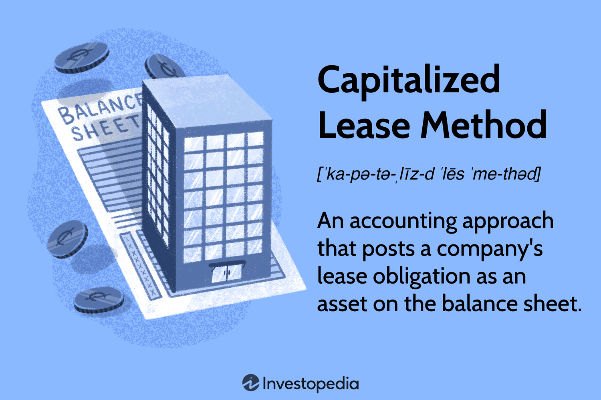

## Table of Contents

## What is a capitalized lease?

A capitalized lease, also known as a finance lease, is a type of lease where the lessee (the person or company renting the asset) records the leased asset as if they own it on their balance sheet. This means they add the value of the leased item to their assets and also record a corresponding liability for the lease payments they owe. This type of lease is used when the lease term is long and the lessee gets most of the benefits and risks of owning the asset.

The main reason companies use capitalized leases is to show the asset and the debt on their financial statements. This can be important for big items like machinery or vehicles that the company will use for a long time. By capitalizing the lease, the company can spread the cost of the asset over its useful life, which can help with budgeting and financial planning. It also means the company can claim depreciation on the asset, which can reduce their taxable income.

## How does the capitalized lease method differ from operating lease?

The main difference between a capitalized lease and an operating lease is how they are treated in a company's financial records. With a capitalized lease, the company adds the leased asset to its balance sheet as if it owns it. This means they also record a liability for the future lease payments. This type of lease is like borrowing money to buy an asset, and it's used for big items that the company will use for a long time. On the other hand, an operating lease is more like renting. The company doesn't record the asset or the lease payments on its balance sheet. Instead, they just list the lease payments as an expense on their income statement each month or year.

Another difference is how the costs are spread out over time. In a capitalized lease, the company spreads the cost of the asset over its useful life. They do this by recording depreciation on the asset and interest on the lease payments. This can help the company manage its budget and plan for the future. In an operating lease, the company simply pays the rent each period and records it as an expense. This can be easier for short-term needs or when the company doesn't want to show a big asset and debt on its balance sheet. So, the choice between a capitalized lease and an operating lease depends on what the company needs and how it wants to manage its finances.

## What are the criteria for classifying a lease as a capital lease?

To classify a lease as a capital lease, it must meet certain criteria set by accounting standards. One key criterion is that the lease term covers most of the asset's useful life. For example, if a machine lasts 10 years and the lease lasts 8 years, it would likely be a capital lease. Another criterion is that the lease allows the lessee to buy the asset at a price lower than its fair market value at the end of the lease. This is called a bargain purchase option. If the lease has this option, it's more likely to be a capital lease.

Another important criterion is that the present value of the lease payments is close to the full value of the asset. If the total of all lease payments, when discounted to today's value, is almost as much as buying the asset outright, then it's treated as a capital lease. Finally, the lease might be a capital lease if it transfers ownership of the asset to the lessee by the end of the lease term. If any of these criteria are met, the lease is classified as a capital lease, and the lessee must record the asset and the lease obligation on their balance sheet.

## What are the financial reporting requirements for a capitalized lease?

When a company has a capitalized lease, it must show the leased asset and the lease obligation on its balance sheet. This means the company adds the value of the leased item to its assets and records a liability for the future lease payments. The asset is then depreciated over its useful life, which means its value is reduced on the balance sheet over time. The liability is also reduced as the company makes lease payments, but the payments are split into two parts: one part reduces the liability, and the other part is recorded as interest expense.

On the income statement, the company records depreciation expense for the leased asset and interest expense for the lease payments. The depreciation expense is spread out over the useful life of the asset, which helps the company manage its costs over time. The interest expense is higher at the beginning of the lease and decreases over time as the lease payments reduce the outstanding liability. This way, the company can show how the lease affects its financial performance and position, giving a clear picture of its obligations and the value it gets from the leased asset.

## How do you calculate the present value of lease payments in a capitalized lease?

To calculate the present value of lease payments in a capitalized lease, you need to know the amount of each lease payment, how often the payments are made, and the interest rate used for the lease. This interest rate is also called the discount rate. You then use a formula to figure out what the total of all future lease payments is worth today. This is important because money in the future is worth less than money today, so you need to adjust the future payments to today's value.

The formula to use is called the present value of an annuity. It takes each lease payment and discounts it back to today's value using the interest rate. You add up all these discounted payments to get the total present value. For example, if you have a lease with payments of $1,000 every month for 5 years, and the interest rate is 5%, you would use the formula to find out what all those future payments are worth today. This total present value is then recorded on the balance sheet as the value of the leased asset and the lease obligation.

## What impact does a capitalized lease have on a company's balance sheet?

When a company has a capitalized lease, it shows the leased asset and the lease obligation on its balance sheet. This means the company adds the value of the leased item to its assets, which makes the total assets go up. At the same time, it adds a liability for the future lease payments, which makes the total liabilities go up too. So, both the assets and liabilities on the balance sheet increase because of the capitalized lease.

Over time, as the company makes lease payments, the value of the leased asset goes down because of depreciation. Depreciation is like spreading out the cost of the asset over its useful life. The lease obligation also goes down as the company pays off the lease. But the payments are split into two parts: one part reduces the liability, and the other part is interest expense. This means the balance sheet keeps changing as the company uses the asset and makes payments on the lease.

## How does the capitalized lease method affect a company's financial ratios?

When a company uses a capitalized lease, it changes the way its financial ratios look. This happens because the company adds the leased asset to its total assets and also adds a lease obligation to its total liabilities. This makes the company's debt-to-equity ratio go up because the liabilities are higher. The debt-to-equity ratio shows how much the company is borrowing compared to what the owners have put in. A higher ratio means the company is using more debt, which can make it look riskier to lenders and investors.

The capitalized lease also affects other ratios like the return on assets (ROA). The ROA shows how well the company is using its assets to make money. When the company adds the leased asset to its total assets, the total assets go up. If the income stays the same, the ROA goes down because the company is now using more assets to make the same amount of money. This can make the company look less efficient at using its assets. So, a capitalized lease can change how investors and lenders see the company's financial health and performance.

## What are the tax implications of using the capitalized lease method?

When a company uses a capitalized lease, it can affect how much tax it pays. With a capitalized lease, the company can claim depreciation on the leased asset. Depreciation is like spreading out the cost of the asset over time. By claiming depreciation, the company can lower its taxable income, which means it pays less tax. The company also records interest expense on the lease payments, and this can be deducted from taxable income too. So, a capitalized lease can help the company save on taxes.

However, the tax rules can be different depending on where the company is and what kind of asset it is leasing. Some places might have special rules for leasing, and the company needs to check these rules to make sure it is doing everything right. If the company does not follow the rules, it might not get the tax benefits it expects. So, it is important for the company to understand the tax laws in its area and how they apply to capitalized leases.

## Can you explain the amortization of a capitalized lease?

When a company uses a capitalized lease, it has to spread out the cost of the leased asset over time. This process is called amortization. Amortization is similar to depreciation, which is when you reduce the value of an asset over its useful life. For a capitalized lease, the company records the leased asset on its balance sheet and then reduces its value over time through amortization. This helps the company match the cost of using the asset with the income it generates.

The company also has to account for the lease payments it makes over time. Each lease payment is split into two parts: one part reduces the lease obligation on the balance sheet, and the other part is recorded as interest expense. As the company makes these payments, the lease obligation gets smaller, and so does the interest expense. Over the life of the lease, the company keeps track of how much of the asset's value has been used up and how much of the lease obligation has been paid off. This way, the company can show a clear picture of its financial situation and how the lease affects its costs and income.

## How do changes in interest rates affect the calculations in a capitalized lease?

When interest rates change, it can affect how a company calculates the present value of lease payments in a capitalized lease. The present value is what all the future lease payments are worth today, and it's calculated using an interest rate called the discount rate. If the interest rate goes up, the present value of the lease payments goes down. This is because future payments are worth less today when the interest rate is higher. On the other hand, if the interest rate goes down, the present value of the lease payments goes up because future payments are worth more today when the interest rate is lower.

Changes in interest rates also affect how the company records interest expense over the life of the lease. When the interest rate is higher, the interest expense is higher at the beginning of the lease and decreases over time as the company pays off the lease obligation. If the interest rate goes down, the interest expense is lower at the start and decreases more slowly. This means the company's financial statements will look different depending on the interest rate, which can affect how investors and lenders see the company's financial health.

## What are the advantages and disadvantages of using the capitalized lease method?

Using a capitalized lease has some good points. It lets a company show the leased asset on its balance sheet, which can be helpful for big items they will use for a long time. This way, the company can spread the cost of the asset over its useful life, making it easier to plan and budget. The company can also claim depreciation on the asset, which lowers its taxable income and saves on taxes. Plus, the company can show the lease obligation on its balance sheet, which gives a clear picture of its debts and helps with financial planning.

However, there are also some downsides to using a capitalized lease. It can make the company's debt-to-equity ratio go up because it adds to the liabilities on the balance sheet. This can make the company look riskier to lenders and investors. Also, the return on assets (ROA) might go down because the total assets go up, but the income stays the same. This can make the company look less efficient at using its assets. So, while a capitalized lease can help with budgeting and taxes, it can also affect how the company's financial health is seen by others.

## How do international accounting standards (IFRS) differ from U.S. GAAP in treating capitalized leases?

International accounting standards, known as IFRS, and U.S. GAAP treat capitalized leases differently, but they have become more similar over time. Under IFRS, a lease is called a finance lease if it transfers most of the risks and rewards of ownership to the lessee. This is like a capitalized lease in U.S. GAAP. But IFRS uses different criteria to decide if a lease is a finance lease. For example, IFRS looks at if the lease term is for most of the asset's life, if the present value of lease payments is close to the asset's value, or if the lease has a bargain purchase option. U.S. GAAP also uses these criteria, but the specific rules and how they are applied can be different.

One big difference is how IFRS and U.S. GAAP handle the lease obligation on the balance sheet. Under IFRS, the lease obligation is split into two parts: the principal and the interest. The principal is reduced over time as the company makes lease payments, and the interest is recorded as an expense. U.S. GAAP also splits the lease payments into principal and interest, but the way it calculates and records these can be different. For example, U.S. GAAP might use a different method to calculate the interest expense over the life of the lease. So, while both standards treat capitalized leases in similar ways, the details and rules can be different, which can affect how a company reports its financials.

## What is Lease Classification Accounting?

Lease classification is a critical process to determine if a lease should be accounted for as a capital lease or an operating lease under the generally accepted accounting principles (GAAP). This determination has a significant impact on how companies report their financial statements. 

Capital leases are recognized by the lessee as both an asset and a liability on the balance sheet, reflecting the leased asset's value and the obligation to make lease payments. This recognition affects key financial metrics and ratios, such as return on assets and debt-to-equity ratio. In contrast, operating leases do not appear on the balance sheet; instead, they are recognized as rental expenses on the income statement, impacting profit and loss but not the balance sheet directly.

The Financial Accounting Standards Board (FASB) introduced significant changes in 2016 with the ASC 842 update. This new standard requires that nearly all leases be recognized on the balance sheet, aiming to enhance financial transparency. Under ASC 842, lessees must recognize a right-of-use asset and a corresponding lease liability for most lease contracts. This shift ensures a comprehensive view of the company's leasing activities and obligations.

The classification hinges on specific criteria, such as the lease term's length, the present value of lease payments, and whether an option to purchase the asset exists at the end of the lease term. These criteria are designed to capture the economic substance of the lease, rather than focusing solely on the form of lease transactions. The present value of lease payments is calculated using a discount rate, which represents the lessee's borrowing cost for a similar term and security. Mathematically, this can be expressed as:

$$
\text{Present Value} = \sum_{t=1}^{n} \frac{\text{Lease Payment}_t}{(1 + r)^t}
$$

Where:
- $\text{Lease Payment}_t$ is the lease payment at time $t$.
- $r$ is the discount rate.
- $n$ is the total number of payment periods.

Accurate lease classification is essential for compliance with accounting standards and ensures that stakeholders receive clear and accurate financial information. It influences the analysis of a company's financial health and risk assessment, as incorrect classification can lead to misleading financial ratios and potentially, to regulatory scrutiny. Providing transparency in lease accounting helps stakeholders and investors make informed decisions, assessing a company's leverage and operational scalability.

## How do you account for capital leases?

Capital lease accounting involves the detailed recognition and management of leased assets and accompanying liabilities on an entity's balance sheet. This accounting treatment arises from the need to acknowledge the financial implications of leases that confer significant ownership-like rights to the lessee. Under this framework, the leased asset is deconstructed into two key components: depreciation and interest expense.

Firstly, the leased asset is subject to depreciation over its useful life. Depreciation is a systematic allocation of the asset's cost over its service period, underpinning the gradual transition from asset cost to expense. The common approach for this process is the straight-line method, where the cost is evenly spread over the asset's lifespan.

Secondly, lease payments are disaggregated into two distinct elements: principal reduction and interest expense. The initial recognition requires setting up the leased asset and liability at the present value of the minimum lease payments. Subsequently, each lease payment is parted into a principal component that reduces the outstanding liability and an interest component that reflects the cost of financing.

The effective interest method is frequently employed to ensure that the interest expense corresponds to the outstanding lease liability, thereby maintaining interest charges proportionate to the remaining principal amount. This method involves calculating the interest expense for a period by applying the implicit [interest rate](/wiki/interest-rate-trading-strategies) to the outstanding lease liability at the beginning of the period. The formula is:

$$
\text{Interest Expense} = \text{Outstanding Lease Liability} \times \text{Implicit Interest Rate}
$$

Industries leverage capital lease accounting to refine financial metrics and strategically adjust tax liabilities, given the ability to deduct both interest and depreciation. These timing differences influence net income and cash flows, providing potential benefits in terms of tax burden management.

Technological advancements have introduced computational tools, such as Python, to facilitate precise calculations involved in capital lease accounting. By employing libraries like NumPy for numerical operations and Pandas for data manipulation, businesses can streamline the process of determining the present value of lease payments and forecasting financial outcomes. Below is a Python snippet illustrating the calculation of the present value:

```python
import numpy as np

# Example data
lease_payments = [1000, 1000, 1000, 1000, 1000]  # annual lease payments
discount_rate = 0.05  # 5% discount rate

# Calculate present value of lease payments
present_value = np.pv(rate=discount_rate, nper=len(lease_payments), pmt=-1000, fv=0)
print("Present Value of Lease Payments:", present_value)
```

This integration of technology not only enhances accuracy and efficiency but also supports well-informed financial decision-making in the complex landscape of capital lease accounting.

## References & Further Reading

For a comprehensive understanding of the intricate aspects of lease classification, capital leases, and [algorithmic trading](/wiki/algorithmic-trading), several resources are highly recommended.

The **Financial Accounting Standards Board (FASB)'s literature on ASC 842** is essential for understanding the updated lease accounting standards. ASC 842 mandates that leases are recognized on the balance sheet, requiring lessees to account for the liability resulting from lease obligations. This guidance fundamentally shifts how leases are reported, aiming to increase transparency and comparability across financial statements.

**Deloitte's overview on new lease accounting standards** provides practical insights into implementing ASC 842. Deloitte's analysis addresses common challenges businesses face during adoption, offering strategic recommendations for compliance and optimization of lease accounting processes.

**Barry Johnson's work on Algorithmic Trading and DMA** sheds light on how technology-driven strategies can influence financial markets, including lease accounting. Johnson extensively discusses the role of direct market access (DMA) and algorithmic innovations in enhancing the speed and precision of transactions, aspects that can also be leveraged in automating lease classification tasks.

The **PwC's guide on fundamentals of lease accounting** serves as a valuable resource for grasping the core principles and applications of lease accounting. It includes detailed explanations of both theoretical and practical elements, aiding in the smooth transition to and maintenance of compliance with new standards like ASC 842.

Lastly, **Gregory Scopino's discourse on Algo Bots and financial regulation** explores the intersection of [artificial intelligence](/wiki/ai-artificial-intelligence), automated systems, and financial oversight. Scopino examines the regulatory challenges posed by algorithmic trading and suggests frameworks for ensuring ethical practices in high-frequency trading environments. This work is critical for understanding the broader implications of algorithm-driven processes in lease management.

These resources collectively offer a robust framework for professionals aiming to enhance their knowledge and practical implementations of lease accounting and algorithmic trading in modern financial systems.

