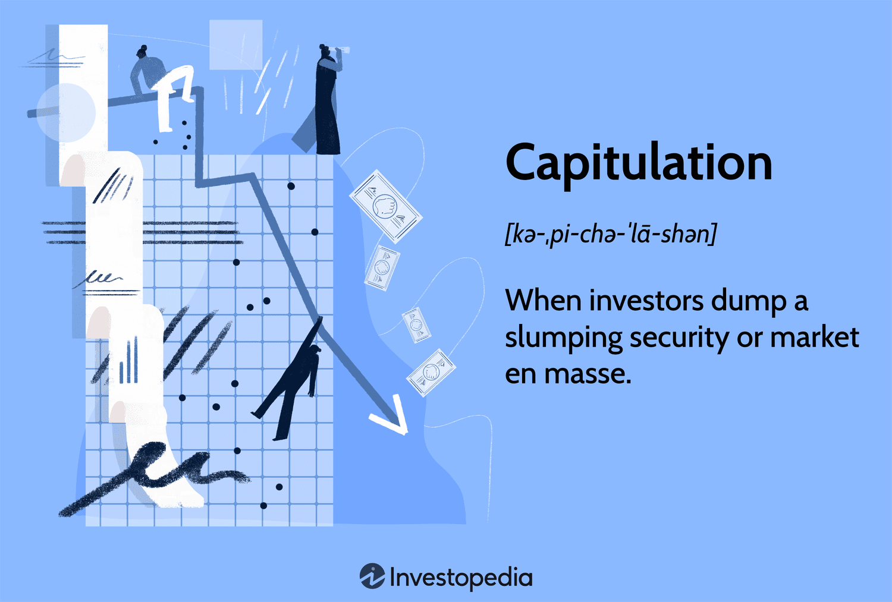

## Table of Contents

## What is capitulation in the context of finance and investing?

Capitulation in finance and investing happens when investors give up hope and sell their investments quickly. This often happens after a long period of falling prices, and it's like a last wave of selling. When people capitulate, they are often selling at a loss because they are scared and want to get out of the market.

This selling can make prices drop even more, but it can also be a sign that the market might start to recover soon. After everyone who wants to sell has sold, there are fewer sellers left, and the market can start to go up again. So, capitulation can be seen as the bottom of a market downturn, and it can be a good time for brave investors to buy.

## How can you identify capitulation in a market?

You can spot capitulation in a market by watching how people are acting and what the numbers show. When lots of people start selling their investments all at once, and they're selling them for less than they're worth, that's a sign of capitulation. It's like everyone is panicking and wants to get out fast. You might see this on the news or hear people talking about how they're selling everything because they're scared.

Another way to see capitulation is by looking at trading numbers. If there's a sudden big jump in the amount of trading, especially when prices are going down fast, that can mean people are capitulating. It's like a rush to the exits. Also, if you see that the price of an investment drops a lot in a short time, that can be another clue that capitulation is happening.

So, to sum it up, capitulation is when a lot of investors sell their investments quickly out of fear, often at low prices. You can spot it by watching for sudden, heavy selling, big jumps in trading [volume](/wiki/volume-trading-strategy), and sharp drops in prices. These signs together can tell you that the market might be reaching its lowest point before it starts to recover.

## What are the common causes of capitulation?

Capitulation often happens because people get scared. When they see their investments losing value for a long time, they start to worry that things will only get worse. This fear can build up until they can't take it anymore and decide to sell everything, even if it means losing money. It's like they're giving up hope that the market will ever get better.

Another reason for capitulation is when bad news comes out suddenly. This could be news about the economy, a company, or the whole market. When people hear this bad news, they panic and start selling their investments quickly. They think it's better to sell now and lose some money than to wait and maybe lose even more later. This rush to sell can make the market drop even faster, leading to capitulation.

## Can capitulation be considered a buying opportunity for investors?

Capitulation can be a good time for investors to buy. When everyone is selling their investments out of fear, it often means that the prices have dropped a lot. This can make investments cheaper than they usually are. If an investor believes that the market will start to go up again after the capitulation, buying during this time could lead to big profits later. It's like buying things on sale; you pay less now and can make more money when prices go back up.

However, buying during capitulation is risky. It's hard to know for sure when the market has hit its lowest point. If an investor buys too early and the market keeps going down, they could lose even more money. It takes a lot of courage and a good understanding of the market to buy when everyone else is selling. But for those who can handle the risk and get the timing right, capitulation can be a great chance to buy low and sell high later on.

## How does capitulation affect market sentiment?

Capitulation makes people feel really scared and worried about the market. When lots of people start selling their investments quickly because they think things will only get worse, it can make other people feel the same way. This fear spreads and makes the overall mood in the market very negative. It's like everyone is panicking and thinking that the market is going to keep falling forever.

But after capitulation happens, the mood can start to change. Once everyone who wants to sell has sold, there are fewer people left to keep pushing the prices down. This can make the market start to recover, and people might begin to feel more hopeful again. It's like the storm has passed, and people can start to see the sun again. So, capitulation can make the market feel very bad at first, but it can also be the start of things getting better.

## What are the psychological factors that lead to capitulation?

Capitulation happens because people get really scared and worried. When they see their investments losing value for a long time, they start to think that things will only get worse. This fear can build up until they can't take it anymore and decide to sell everything, even if it means losing money. It's like they're giving up hope that the market will ever get better. This fear is often made worse by seeing other people panic and sell, which can make them feel like they need to do the same thing to protect themselves.

Another big reason for capitulation is the fear of missing out on a chance to sell before things get even worse. When bad news comes out suddenly, people might think it's better to sell now and lose some money than to wait and maybe lose even more later. This rush to sell can make the market drop even faster, leading to capitulation. It's a mix of fear, worry, and the pressure from seeing others do the same thing that pushes people to give up and sell at a low point.

## How do different types of investors react during periods of capitulation?

During periods of capitulation, different types of investors react in different ways. New or less experienced investors often get very scared and sell their investments quickly. They see prices going down and hear others panicking, so they think it's best to sell before things get worse. These investors might not have a lot of knowledge about the market, so they follow what others are doing and give up hope easily.

On the other hand, experienced investors might see capitulation as a chance to buy. They know that when everyone is selling and prices are low, it could be a good time to invest. These investors have seen market ups and downs before, so they understand that after a big drop, the market might start to go up again. They are willing to take the risk because they believe in the long-term growth of their investments.

Some investors, like those who use a strategy called dollar-cost averaging, might keep their cool during capitulation. They put money into the market at regular times, no matter what the prices are doing. So, even when prices are low because of capitulation, they keep investing. This way, they can buy more shares when prices are down, which can help them in the long run.

## What historical examples illustrate capitulation in financial markets?

One famous example of capitulation happened during the 2008 financial crisis. When Lehman Brothers, a big bank, went bankrupt, it scared a lot of people. They started selling their stocks and other investments because they were afraid the whole market would crash. This led to a big drop in the stock market, and many people lost a lot of money. But after this period of panic and selling, the market started to recover. Investors who were brave enough to buy during the capitulation ended up making good profits as the market went back up.

Another example is the dot-com bubble burst in the early 2000s. Many internet companies had very high stock prices, but when people realized these companies weren't making as much money as they thought, they started selling their stocks. This led to a huge drop in the market, and many investors gave up hope and sold at low prices. After the capitulation, the market slowly started to recover. Investors who waited or bought during the low points were able to benefit from the recovery that followed.

## What are the risks associated with trying to time the market during capitulation?

Trying to time the market during capitulation is very risky. It's hard to know exactly when the market will hit its lowest point. If you buy too early, thinking it's the bottom, the market might keep going down. This means you could lose even more money. It's like trying to catch a falling knife; it's dangerous and you might get hurt.

Also, the fear and panic during capitulation can make it hard to make good decisions. When everyone is selling and the news is full of bad stories, it's easy to get scared and sell too. If you wait too long to buy, you might miss the best time to get in. It takes a lot of courage and understanding of the market to buy when everyone else is selling. So, trying to time the market during capitulation is not easy and can lead to big losses if you get it wrong.

## How can technical analysis tools help in recognizing capitulation?

Technical analysis tools can help spot capitulation by showing big changes in how people are trading. One way to see this is by looking at trading volume. When capitulation happens, there's often a huge jump in the amount of trading. This means a lot of people are selling their investments quickly because they're scared. If you see the volume go way up while prices are dropping fast, it might be a sign that capitulation is happening.

Another tool is looking at price charts. During capitulation, prices can fall very quickly in a short time. You might see big red candles on a chart, which show that the price is going down a lot. If these big drops happen along with high trading volume, it's a good clue that people are giving up hope and selling everything. So, by watching volume and price charts, you can use technical analysis to spot when capitulation might be happening in the market.

## What strategies can investors employ to protect their portfolios during capitulation?

One way investors can protect their portfolios during capitulation is by having a plan and sticking to it. This means deciding ahead of time how much risk you're willing to take and what you'll do if the market goes down. If you have a plan, you won't make quick decisions out of fear when everyone else is panicking. You might decide to keep some of your money in safe investments like bonds or cash, so you have something to fall back on if the market drops a lot.

Another strategy is to keep investing regularly, no matter what the market is doing. This is called dollar-cost averaging. By putting money into the market at regular times, you can buy more shares when prices are low during capitulation. This can help you in the long run because you're buying at a lower price. It's important not to try to time the market perfectly but to stay calm and keep following your plan, even when things look scary.

## How does capitulation impact long-term investment strategies?

Capitulation can make long-term investment strategies hard to follow. When everyone is selling their investments out of fear, it's easy to get scared and want to sell too. But if you have a long-term plan, it's important to stick with it. Long-term investors believe that the market will go up over time, even after big drops. So, during capitulation, they might see it as a chance to buy more at lower prices. This can help their investments grow more in the future.

Sticking to a long-term strategy during capitulation means not making quick decisions based on fear. Instead, you keep investing regularly and don't try to time the market perfectly. This way, you can buy more shares when prices are low, which can lead to bigger gains later. It takes patience and courage to keep your long-term plan going when everyone else is panicking, but it can pay off in the end.

## References & Further Reading

[1]: Bergstra, J., Bardenet, R., Bengio, Y., & Kégl, B. (2011). ["Algorithms for Hyper-Parameter Optimization."](https://papers.nips.cc/paper/4443-algorithms-for-hyper-parameter-optimization) Advances in Neural Information Processing Systems 24.

[2]: ["Advances in Financial Machine Learning"](https://www.amazon.com/Advances-Financial-Machine-Learning-Marcos/dp/1119482089) by Marcos Lopez de Prado

[3]: ["Evidence-Based Technical Analysis: Applying the Scientific Method and Statistical Inference to Trading Signals"](https://www.amazon.com/Evidence-Based-Technical-Analysis-Scientific-Statistical/dp/0470008741) by David Aronson

[4]: ["Machine Learning for Algorithmic Trading"](https://github.com/stefan-jansen/machine-learning-for-trading) by Stefan Jansen

[5]: ["Quantitative Trading: How to Build Your Own Algorithmic Trading Business"](https://www.amazon.com/Quantitative-Trading-Build-Algorithmic-Business/dp/1119800064) by Ernest P. Chan