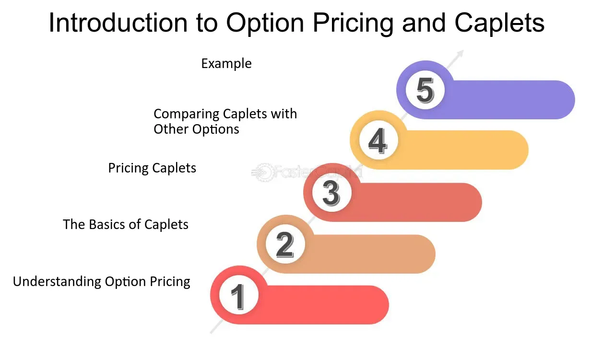

## Table of Contents

## What is a caplet in options trading?

A caplet is a type of financial option used in options trading. It is a part of a larger financial product called an interest rate cap. Think of a caplet as a single piece of a puzzle, where the whole puzzle is the interest rate cap. A caplet gives the buyer the right, but not the obligation, to receive a payment if a specific interest rate, like LIBOR, goes above a certain level, called the strike rate, on a specific date.

Caplets are useful for people or businesses that want to protect themselves from rising interest rates. For example, if you have a loan with a variable interest rate, you might buy a caplet to make sure you don't have to pay more if the interest rate goes up. If the interest rate stays below the strike rate, the caplet expires worthless, and you don't get any payment. But if the interest rate goes above the strike rate, you receive a payment that helps cover the extra cost of your loan.

## How does a caplet differ from a cap?

A caplet and a cap are related but different in options trading. A caplet is like a single ticket that protects you from higher interest rates for one specific period. It's a part of a bigger protection plan. If the interest rate goes above a certain level on that specific date, you get money to help with the extra cost. But if the rate stays low, the caplet is worth nothing.

A cap, on the other hand, is like a whole series of these tickets put together. It's made up of many caplets, each covering a different time period. When you buy a cap, you're getting protection from high interest rates for several periods in the future. So, a cap gives you longer-term protection, while a caplet is just for one moment in time.

## What are the basic components of a caplet?

A caplet has three main parts that you need to know about. The first part is the strike rate. This is the interest rate level that the caplet is based on. If the actual interest rate goes above this strike rate, the caplet starts to have value. The second part is the expiration date. This is the specific date when the caplet's value is checked. If the interest rate is higher than the strike rate on this date, you get a payment. The third part is the notional amount. This is like the size of the loan or the amount of money the caplet is protecting.

These three parts work together to make the caplet useful. Imagine you have a loan with a variable interest rate. You buy a caplet to protect yourself from the interest rate going up too high. The strike rate is set at a level you're comfortable with. On the expiration date, if the interest rate is higher than your strike rate, you get a payment based on the notional amount. This payment helps cover the extra cost of your loan. If the interest rate stays below the strike rate, the caplet expires without any value, and you don't get any payment.

## In what scenarios would an investor use a caplet?

An investor might use a caplet if they have a loan with a variable interest rate and they want to protect themselves from the interest rate going up too high. Imagine you took out a loan to buy a house, and the interest rate on that loan can change over time. If you're worried that the interest rate might go up and make your monthly payments a lot higher, you could buy a caplet. The caplet would give you a payment if the interest rate goes above a certain level on a specific date, helping you cover the extra cost of your loan.

Another scenario where an investor might use a caplet is if they're managing a business that relies on borrowing money. Businesses often take out loans to grow or to cover day-to-day expenses. If the interest rates on these loans go up, it can make running the business more expensive. By buying a caplet, the business can protect itself from higher interest rates. If the interest rate stays low, the caplet doesn't cost anything extra, but if the rate goes up, the business gets a payment to help with the increased loan costs.

## How is the payoff of a caplet calculated?

The payoff of a caplet is calculated based on how much the interest rate goes above the strike rate on the expiration date. If the interest rate is higher than the strike rate, you get a payment. The payment is calculated by taking the difference between the actual interest rate and the strike rate, then multiplying that difference by the notional amount of the caplet. The notional amount is like the size of the loan the caplet is protecting.

Let's say you have a caplet with a strike rate of 5%, a notional amount of $1 million, and the interest rate on the expiration date is 6%. The interest rate is higher than the strike rate, so you get a payment. The difference between the interest rate and the strike rate is 1% (6% - 5%). You multiply this 1% by the notional amount of $1 million, which gives you a payoff of $10,000. If the interest rate had been 4% instead, it would be below the strike rate, and the caplet would expire worthless with no payoff.

## What are the risks associated with trading caplets?

Trading caplets can be risky because the interest rates might not go up as much as you expect. If the interest rate stays below the strike rate on the expiration date, the caplet expires worthless, and you lose the money you spent to buy it. This is like buying insurance that you never end up using. It's a cost that you have to pay, but you don't get anything back if the interest rate doesn't go up.

Another risk is that caplets can be complicated to understand and use. If you don't know exactly how they work, you might make a mistake and lose money. Also, the value of a caplet can change a lot over time, depending on what people think will happen with interest rates. This means the price you pay for a caplet might be different from what it's worth later on, which can be risky if you need to sell it before it expires.

## How do interest rates affect the value of a caplet?

Interest rates play a big role in deciding how much a caplet is worth. When interest rates go up, the value of a caplet usually goes up too. This happens because a caplet gives you money if the interest rate is higher than the strike rate on the expiration date. If people think interest rates will go up, they're more likely to want to buy caplets, which makes the price go up. But if interest rates go down, the value of a caplet usually goes down because it's less likely that you'll get a payment from it.

The value of a caplet can also change based on what people expect interest rates to do in the future. If everyone thinks interest rates will go up a lot, they'll be willing to pay more for a caplet because they think they're more likely to get a big payoff. But if people think interest rates will stay the same or go down, they won't want to pay as much for a caplet because the chance of getting a payoff is lower. So, the value of a caplet is always changing as people's guesses about interest rates change.

## What is the role of caplets in interest rate caps?

Caplets are the building blocks of interest rate caps. An interest rate cap is like a big umbrella that protects you from high interest rates over a long time. It's made up of many smaller pieces called caplets. Each caplet covers you for a short time, like a single month or a few months. When you buy an interest rate cap, you're actually buying a bunch of caplets all at once. They work together to give you protection from high interest rates for the whole time you need it.

Think of it like this: if you're worried about your loan's interest rate going up over the next year, you could buy an interest rate cap. This cap would be made up of 12 caplets, one for each month of the year. If the interest rate goes above a certain level in any of those months, the caplet for that month gives you a payment to help with the extra cost. So, caplets are important because they let you break down a big problem (high interest rates over a long time) into smaller, easier-to-handle pieces.

## How can caplets be used for hedging purposes?

Caplets can be used for hedging to protect against rising interest rates. If you have a loan with a variable interest rate, you might worry that the interest rate will go up and make your payments higher. By buying a caplet, you can set a limit on how high the interest rate can go for a specific time. If the interest rate goes above this limit, the caplet pays you money to help cover the extra cost of your loan. This way, you can keep your loan payments more predictable and manageable, even if interest rates rise.

Hedging with caplets is like buying insurance for your loan. You pay a little bit of money upfront to buy the caplet, but it can save you a lot of money if interest rates go up. If the interest rate stays below the limit you set, the caplet expires without giving you any money, but you don't lose anything more than what you paid for it. This makes caplets a useful tool for people and businesses that want to protect themselves from the risk of higher interest rates without having to predict exactly what will happen in the future.

## What are the pricing models used for valuing caplets?

The main way to figure out how much a caplet is worth is by using something called the Black model. This model is like a special calculator that helps people guess what a caplet might be worth in the future. It looks at things like the current interest rate, how much interest rates might change, and how long until the caplet expires. The Black model is popular because it's pretty good at predicting how much a caplet will be worth, but it's not perfect because it makes some guesses about how interest rates will move.

Another model that people use to value caplets is the Black-Scholes model, which is also used for other types of options. This model is a bit more complicated than the Black model but can be more accurate in some situations. It takes into account things like the time until the caplet expires, the current interest rate, the strike rate, and how much interest rates might change. Both models help people decide if a caplet is a good deal or not, but they rely on guesses about the future, so there's always some risk involved.

## How do market conditions influence the demand for caplets?

Market conditions play a big role in how much people want to buy caplets. When people think interest rates are going to go up a lot, they start to worry about their loans getting more expensive. This makes them want to buy caplets to protect themselves. If everyone is thinking the same way, the demand for caplets goes up, and so does the price. On the other hand, if people think interest rates will stay the same or go down, they don't see the need for caplets as much. This makes the demand for caplets go down, and the price goes down too.

Another thing that can affect the demand for caplets is how much risk people are willing to take. When the economy is doing well and people feel confident, they might not want to spend money on caplets because they think they can handle a little bit of interest rate risk. But if the economy is shaky and people are worried about the future, they might want to buy caplets to feel safer. So, the demand for caplets can go up and down based on what's happening in the market and how people feel about taking risks.

## What advanced strategies involve the use of caplets in portfolio management?

Advanced strategies in portfolio management often involve using caplets to manage risk and enhance returns. One common strategy is to use caplets as part of a dynamic hedging approach. This means that instead of buying a single caplet, investors might buy and sell caplets over time to adjust their protection against rising interest rates. For example, if interest rates start to go up, an investor might buy more caplets to increase their protection. If rates start to fall, they might sell some caplets to reduce their costs. This way, they can keep their portfolio safe from big changes in interest rates while also trying to save money.

Another strategy involves combining caplets with other financial tools like interest rate swaps or floors to create a more customized risk management plan. An investor might use caplets to set a ceiling on how high their interest rates can go, while using an interest rate floor to set a minimum level for their interest rates. By doing this, they can create a range where their interest rates are more predictable. This can be especially useful for businesses that need to plan their budgets carefully and want to avoid surprises from sudden changes in interest rates. These strategies help investors and businesses manage their risks better and make their financial planning more stable.

## What is the understanding of Financial Derivatives and Options?

Financial derivatives are sophisticated financial instruments whose value depends on an underlying asset such as stocks, bonds, commodities, currencies, interest rates, or market indices. These instruments enable investors and corporations to manage risk, enhance returns, and speculate on price movements of the underlying assets without necessarily owning them. Common types of derivatives include futures, forwards, swaps, and options.

Options are a prevalent form of derivative that confers the buyer specific rights concerning the underlying asset while limiting the risk to the cost of the option itself, known as the premium. Specifically, an option provides the holder the right, but not the obligation, to buy (call option) or sell (put option) the underlying asset at a predetermined strike price, within a specified timeframe. This characteristic allows options to be a flexible tool in financial strategies.

The versatility of options is most evident in their application for hedging strategies, where they provide protection against adverse price movements in the underlying asset. For instance, an investor holding a portfolio of stocks may purchase put options to guard against potential declines in stock prices. Alternatively, options can be used for speculative purposes, allowing investors to bet on the direction of market movements without a substantial upfront investment. For example, purchasing call options on a stock is a way to express a bullish view, expecting the stock price to increase, and if the price rises above the strike price, the investor can realize significant profits.

Moreover, option strategies can be designed to enhance returns by leveraging [volatility](/wiki/volatility-trading-strategies) or adjusting risk-reward profiles to suit investor objectives. Strategies such as covered calls, protective puts, and straddles are employed to maximize profits while managing potential losses. For instance, in a covered call strategy, an investor holding a stock sells a call option on the same stock, generating additional income through the option premium while retaining potential for limited capital gains.

Understanding the potential of options requires familiarity with their pricing, which can be modeled using frameworks such as the Black-Scholes-Merton model. This model evaluates the option price considering factors like the current price of the underlying asset, the strike price, time to expiration, volatility, risk-free [interest rate](/wiki/interest-rate-trading-strategies), and dividends (if applicable). The Black-Scholes formula for a European call option is represented as:

$$
C = S_0 \cdot N(d_1) - X \cdot e^{-rT} \cdot N(d_2)
$$

Where:
- $C$ is the call option price
- $S_0$ is the current price of the underlying asset
- $X$ is the strike price
- $T$ is the time to expiration in years
- $r$ is the risk-free interest rate
- $N(d)$ is the cumulative distribution function of the standard normal distribution
- $d_1$ and $d_2$ are calculated using the following formulas:

$$
d_1 = \frac{1}{\sigma\sqrt{T}} \left[ \ln\left(\frac{S_0}{X}\right) + \left(r + \frac{\sigma^2}{2}\right)T \right]
$$

$$
d_2 = d_1 - \sigma\sqrt{T}
$$

In conclusion, options play an indispensable role in modern financial markets, serving a variety of purposes from risk management to capitalizing on market opportunities. Investors and traders who effectively harness options can significantly enhance their financial strategies, realize diverse investment goals, and navigate the complexities of ever-evolving markets.

## What is a Caplet in Options Trading?

A caplet is a financial derivative commonly used in options trading as a risk management tool against rising interest rates. Essentially, a caplet functions as a type of call option that establishes an upper limit, or ‘cap,’ on interest rates, providing protection for the holder. This is particularly important for entities such as corporations and governments that have floating rate debt.

Caplets are typically structured based on interbank interest rates, with the London Interbank Offered Rate (LIBOR) historically being a popular benchmark. When interest rates rise above the cap level, the holder of a caplet receives a payoff that offsets the additional interest expenses incurred due to increased rates. This makes caplets effective financial instruments for insuring against unexpected increases in borrowing costs and maintaining cost predictability.

One of the key characteristics of caplets is their short-term nature. They usually cover periods of approximately 90 days. Despite their short-term coverage, caplets can be strategically combined to form a 'cap', which extends the protection over a longer term. This method allows for flexible hedging strategies that match the cash flow requirements and risk exposures of the holder.

Mathematically, the payoff of a caplet can be represented as:

$$
\text{Payoff} = N \cdot \left( \max(L - K, 0) \right) \cdot \frac{\Delta t}{360}
$$

where:
- $N$ is the notional principal,
- $L$ is the observed interest rate at expiration,
- $K$ is the strike rate or the cap rate,
- $\Delta t$ is the day count fraction for the period.

Caplets, as a type of interest rate option, are integral to managing interest rate exposures. Their careful implementation aids in optimizing debt structures and mitigating adverse financial impacts due to volatile market conditions.

## References & Further Reading

[1]: Black, F., & Scholes, M. (1973). ["The Pricing of Options and Corporate Liabilities."](https://www.cs.princeton.edu/courses/archive/fall09/cos323/papers/black_scholes73.pdf) Journal of Political Economy, 81(3), 637-654.

[2]: Merton, R. C. (1973). ["Theory of Rational Option Pricing."](https://www.jstor.org/stable/3003143)90133-5) The Bell Journal of Economics and Management Science, 4(1), 141-183.

[3]: Chaboud, A., Chiquoine, B., Hjalmarsson, E., & Vega, C. (2014). ["Rise of the Machines: Algorithmic Trading in the Foreign Exchange Market."](https://www.jstor.org/stable/43612951) Journal of Finance, 69(5), 2045-2084.

[4]: Jarrow, R. A., & Turnbull, S. M. (2000). ["Derivatives Securities"](https://archive.org/details/derivativesecuri0000jarr). South-Western College Publishing.

[5]: Lopez de Prado, M. (2018). ["Advances in Financial Machine Learning"](https://www.amazon.com/Advances-Financial-Machine-Learning-Marcos/dp/1119482089). Wiley.

[6]: Chan, E. P. (2013). ["Algorithmic Trading: Winning Strategies and Their Rationale"](https://github.com/ftvision/quant_trading_echan_book). Wiley.

[7]: Hull, J. C. (2018). ["Options, Futures, and Other Derivatives"](https://www.semanticscholar.org/paper/Options%2C-Futures%2C-and-Other-Derivatives-Hull/89bdee500c8623864fc9eb7a471546aa713acc44). Pearson.