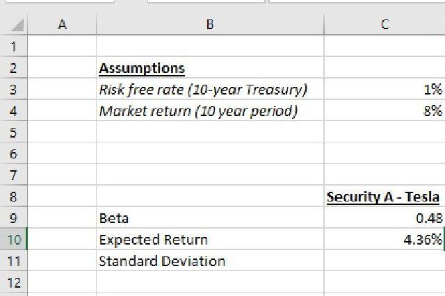

In today's fast-paced financial world, risk analysis has become an indispensable tool for investors and traders alike. As financial markets grow increasingly complex, understanding and managing risk is crucial for minimizing potential losses and maximizing opportunities. One of the most versatile software tools in this endeavor is Microsoft Excel, widely recognized for its powerful capabilities in financial analysis. With its vast array of functions, data visualization tools, and computational strengths, Excel provides financial professionals with an effective platform for conducting comprehensive risk analyses.

This article explores the intersection of several key components integral to effective financial risk analysis: the Capital Asset Pricing Model (CAPM), Excel functionalities, and algorithmic trading. The CAPM, a fundamental element of modern portfolio theory, offers a method for calculating the expected return of an asset based on its risk relative to the market. By integrating this model with Excel's analytical capabilities, professionals can assess and manage investment risks with precision.



Furthermore, the burgeoning field of algorithmic trading, characterized by the use of advanced algorithms to execute trades, offers new dimensions for incorporating risk management strategies. Through the synergy of finance models like CAPM, Excel calculations, and algorithmic insights, finance professionals are empowered to make informed decisions that navigate complex market dynamics effectively.

Understanding these elements equips finance professionals with the tools needed to conduct efficient risk analysis. By examining how these tools and models can be combined, this article aims to provide insights into creating robust strategies for managing financial risk.

## Table of Contents

## Understanding Risk Analysis in Finance

Risk analysis in finance is a process of identifying, assessing, and prioritizing financial risks associated with investment decisions. This analysis helps investors and financial managers to measure potential losses or gains and to strategize accordingly. Financial risk is an inevitable part of investment activities, with several types being particularly significant.

Market risk, also known as systematic risk, involves the possibility of an investor experiencing losses due to factors that affect the overall performance of the financial markets. Market risk cannot be eliminated through diversification, as it is connected to economic changes, political events, natural disasters, or shifts in interest rates that impact the entire market. The volatility of asset prices is a crucial consideration in assessing market risk.

Credit risk refers to the danger that a borrower will default on any type of debt by failing to make required payments. This type of risk affects lenders and bond investors who might experience financial losses as a result of the counterparty's inability to meet obligations.

Operational risk arises from internal failures within an organization, such as system failures, human errors, or fraudulent activities. These risks can have substantial financial impacts, affecting the organization's profitability and reputation.

Accurate risk analysis is essential for effective portfolio management and financial strategy. It allows investors to understand the potential risk-return tradeoff associated with different investment options. This understanding is crucial for making informed decisions about asset allocation, diversification, and financial planning. For portfolio managers, accurately assessing risk enables the formulation of strategies that align with investors’ risk tolerance and investment goals.

Financial models play a pivotal role in risk prediction and investment strategy formulation. They provide a systematic and quantitative approach to evaluating risk factors and potential returns. Models like the Value at Risk (VaR) assess the potential loss in value of a portfolio over a defined period for a given confidence interval, serving as a standard tool for quantifying the level of financial risk. Stress testing is another method that models how extreme conditions can impact portfolios, helping to prepare for adverse scenarios.

In practical applications, financial models assist in simulation and forecasting to provide a more comprehensive understanding of how market dynamics can influence investment outcomes. By utilizing historical data and statistical techniques, these models offer insights that can enhance decision-making in the face of uncertainty.

In summary, risk analysis helps financial professionals to anticipate and mitigate the effects of risk on investment portfolios. Through diligent analysis and utilization of financial models, better-informed decisions are made that can enhance returns while managing exposure to potential losses.

## Leveraging Excel for Financial Risk Analysis

Excel is a cornerstone in financial risk analysis due to its versatility, user-friendliness, and broad accessibility, making it an essential tool for financial analysts. Its robust functionality allows for in-depth analysis and management of financial risks through a variety of built-in functions and customizations.

### Common Excel Functions and Formulas in Risk Analysis

Financial analysts rely on several key Excel functions to perform risk analysis. The *NORM.DIST* and *NORM.INV* functions are used extensively to evaluate probability distributions. The *STDEV.P* and *STDEV.S* functions calculate the standard deviation for populations and samples, respectively, helping analysts measure the variability or risk associated with a set of returns.

For calculating the Value at Risk (VaR), a crucial metric in risk management, the *PERCENTILE.EXC* function is often employed to determine the worst expected loss over a target horizon within a given confidence interval. Additionally, the *CORREL* function assists in assessing the degree to which two securities move in relation to each other, vital for portfolio diversification.

### Scenario Analysis and Stress Testing

Scenario analysis and stress testing are integral to assessing the robustness of investment portfolios under varying conditions. Excel supports these analyses through data tables and solver functionalities. A one-way or two-way data table allows users to observe how changes in input variables affect the outcome, facilitating the examination of different market scenarios.

**Example of Scenario Analysis:**

1. Create a base financial model using assumed variables.
2. Use Excel’s *Data Table* feature to simulate different inputs (e.g., interest rates or stock prices).
3. Analyze the output changes to assess potential impacts on portfolio performance.

Stress testing can be conducted by altering one or more model assumptions to simulate extreme market conditions, thus evaluating the portfolio's resilience.

### Automating Risk Calculations with Excel VBA

Excel’s Visual Basic for Applications (VBA) enhances its functionality by automating repetitive tasks in risk calculation, thereby improving efficiency and accuracy. VBA enables users to write custom macros that perform complex calculations, generate detailed reports, or trigger analysis at scheduled intervals.

**Example of VBA for Automating Risk Calculations:**

```vba
Sub CalculateVaR()
    Dim ws As Worksheet
    Set ws = ThisWorkbook.Sheets("RiskData")

    Dim returns As Range
    Set returns = ws.Range("B2:B101") ' Assuming 100 return entries

    Dim var As Double
    var = Application.WorksheetFunction.Percentile_Exc(returns, 0.05) ' 5% VaR

    ws.Range("C2").Value = var ' Outputting VaR
End Sub
```

This VBA script calculates the 5% Value at Risk (VaR) of a portfolio using returns stored in a specified range. By automating this calculation, analysts can efficiently update risk metrics as new data becomes available.

In conclusion, Excel is a vital tool for financial risk analysis, offering a suite of functions and capabilities that empower analysts to perform detailed risk evaluations and automate complex tasks, enhancing both the precision and efficiency of financial decision-making processes.

## Applying the CAPM Formula in Excel

The Capital Asset Pricing Model (CAPM) is a fundamental concept in modern finance used to determine the expected return on an investment while considering its risk relative to the market. CAPM is integral in assessing the trade-off between risk and return, helping investors make informed decisions. The model is underpinned by the principle that investors need to be compensated for both the time value of money and the risk they assume. 

The CAPM formula is expressed as:

$$
\text{Expected Return} = R_f + \beta \times (R_m - R_f)
$$

where:
- $R_f$ is the risk-free rate, reflecting the return on a risk-free investment, usually government bonds.
- $\beta$ represents the sensitivity of the investment to market movements. It is a measure of the systemic risk of a security relative to the broader market.
- $R_m$ is the expected return of the market portfolio.

### Calculating Expected Return Using Excel

To use the CAPM formula in Excel, follow these steps:

1. **Gather Data**: Ensure you have the necessary data, including the risk-free rate, the beta of the investment, and the expected market return. This data is typically sourced from financial databases or market reports.

2. **Set Up Excel Spreadsheet**:
    - Enter the values for $R_f$, $\beta$, and $R_m$ into separate cells. For instance, use cell A1 for the risk-free rate, B1 for beta, and C1 for the market return.

3. **Apply the CAPM Formula**:
    - In a new cell, enter the formula to calculate the expected return: 
$$
    =A1 + B1 \times (C1 - A1)

$$
    - This formula calculates the expected return by considering both the risk-free rate and the additional risk of investing in the market.

4. **Analyze the Result**:
    - The output provides the expected return, which can be compared to the historical or required return of the asset. This helps evaluate whether the asset is likely to yield a return commensurate with its risk.

### Interpreting CAPM Results

The CAPM model assists in determining whether an investment offers a fair expected return, given its inherent risk compared to the market. If the expected return calculated using CAPM is higher than the investor's required rate of return, the asset may be considered attractive for inclusion in a portfolio. Conversely, if the expected return falls short, it suggests the investment may not adequately compensate for its risk.

Moreover, the beta component in CAPM highlights the [volatility](/wiki/volatility-trading-strategies) relative to the market. A beta greater than 1 implies higher volatility, suggesting that the asset is riskier relative to the market, potentially offering higher returns. Conversely, a beta less than 1 indicates reduced volatility, implying lower risk and, typically, lower potential returns.

Investment decisions grounded in CAPM help investors appraise the risk-return profile of securities, ensuring strategic alignment with their broader financial objectives. This model, especially when applied through Excel, equips investors with a robust mechanism for assessing potential investments.

## Algorithmic Trading and Risk Management

Algorithmic trading refers to the use of computer algorithms to automate trading decisions and execute orders in financial markets. This practice has gained significant traction due to its ability to process large datasets with precision and speed, far surpassing human capabilities. Its influence on financial markets is profound, with an estimated 70-80% of trades executed algorithmically in major stock exchanges, particularly in the United States.

Algorithms in trading systems function by implementing a set of rules governing market activity, such as timing, price, or [volume](/wiki/volume-trading-strategy), to generate trading signals and manage trades. These systems can rapidly adjust orders based on real-time market data, allowing traders to capitalize on price discrepancies or market inefficiencies that may only exist for fleeting moments. This precision and speed result from sophisticated algorithms capable of analyzing multiple variables simultaneously to optimize buying and selling strategies.

Incorporating risk analysis into [algorithmic trading](/wiki/algorithmic-trading) involves several strategies to minimize potential losses while maximizing returns:

1. **Backtesting and Simulation**: Before deploying an algorithm, it undergoes extensive backtesting against historical data to evaluate its potential performance. By simulating trades, traders can assess the algorithm's risk and refine strategies accordingly.

2. **Dynamic Position Sizing**: Algorithms can adjust the size of a trade dynamically based on the risk level of the asset or market conditions. This mitigates potential losses by reducing position sizes in volatile markets and increasing them during more stable conditions.

3. **Risk-Adjusted Returns**: Incorporating models such as the Capital Asset Pricing Model (CAPM) allows traders to assess an asset’s expected return against its systematic risk. CAPM considers the risk-free rate, the asset's beta (measuring volatility relative to the market), and expected market return, offering insights into whether an asset offers adequate compensation for its risk level. The formula for CAPM is:
$$
   \text{Expected Return} = R_f + \beta \times (R_m - R_f)

$$

   where $R_f$ is the risk-free rate, $\beta$ is the asset's beta, and $R_m$ is the expected market return.

   Integrating CAPM into an algorithmic trading strategy can enhance risk management by focusing on trades that offer superior risk-adjusted returns. This involves calculating each potential trade's expected return and aligning it with the investor’s risk appetite and portfolio objectives.

Overall, algorithmic trading systems, with their advanced analytical capabilities, are indispensable for executing trades efficiently. Coupled with rigorous risk analysis, including established financial models like CAPM, these systems can significantly enhance the robustness and profitability of trading strategies in today’s dynamic financial markets.

## Integrating Excel, Finance Models, and Algorithmic Strategies

Excel has long served as an essential tool for financial analysts, offering robust computational power and flexibility that can be effectively combined with sophisticated finance models and algorithmic strategies. This integration allows analysts to enhance risk analysis, optimize trading strategies, and make more informed investment decisions.

In real-world financial scenarios, the successful integration of Excel with finance models and algorithms is evident. For example, a major investment firm may use Excel to manage large datasets and perform initial data cleansing before inputting these datasets into more advanced algorithmic systems. By using Excel's array of built-in functions and pivot tables, analysts can perform preliminary analyses to identify trends and anomalies. These insights are then fed into algorithmic models that execute trades based on the refined data, potentially increasing returns while minimizing risks.

Best practices for combining Excel calculations with algorithmic trading systems are crucial to leverage these tools efficiently. One approach is to modularize the processes: using Excel for data organization and preprocessing, and then exporting the cleaned data to specialized programming environments like Python. Python, with libraries such as pandas for data manipulation and NumPy for numerical computations, can automate complex calculations and execute algorithms at a scale where Excel alone might falter. Here’s an example of how data from Excel can be manipulated in Python:

```python
import pandas as pd

# Load data from an Excel file
data = pd.read_excel('financial_data.xlsx')

# Example transformation: Calculate daily returns
data['Daily Return'] = data['Close Price'].pct_change()

# Example algorithm: Simple moving average crossover
data['SMA_50'] = data['Close Price'].rolling(window=50).mean()
data['SMA_200'] = data['Close Price'].rolling(window=200).mean()

# Generate trading signals
data['Signal'] = 0
data.loc[data['SMA_50'] > data['SMA_200'], 'Signal'] = 1
data.loc[data['SMA_50'] < data['SMA_200'], 'Signal'] = -1

# Export results back to Excel
data.to_excel('processed_financial_data.xlsx', index=False)
```

Looking forward, continuous technological advancements are set to revolutionize risk analysis in finance. Machine learning and [artificial intelligence](/wiki/ai-artificial-intelligence) are progressively being integrated with Excel and traditional financial models, making it possible to handle massive datasets and uncover insights that were previously inaccessible. With the increasing accessibility of cloud computing, computational limitations are diminishing, allowing for real-time data processing and more sophisticated predictive analytics. As technology continues to evolve, finance professionals will need to adapt by developing skills that bridge the gap between traditional financial analysis and modern algorithmic strategies, ensuring that they can harness the full potential of these integrated tools.

## Conclusion

Integrating Excel, the Capital Asset Pricing Model (CAPM), and algorithmic trading constitutes a robust approach to risk analysis in modern finance. Excel's computational capabilities allow for precise financial analysis, making it an essential tool for dissecting complex investment scenarios. When combined with CAPM, Excel empowers analysts to evaluate expected returns relative to risk, enhancing the precision of financial forecasts. Algorithmic trading further extends these capabilities by automating decisions, reducing human error, and executing trades with unmatched speed and efficiency.

As technology continues to evolve, the tools and models used in financial strategies shift as well; advanced algorithms and [machine learning](/wiki/machine-learning) now complement traditional models like CAPM, facilitating more comprehensive risk assessments and dynamic market interactions. Efficient data processing and real-time analysis through Excel and algorithmic frameworks are becoming foundational in constructing adaptive investment strategies.

For financial professionals, adapting to these technological advancements is crucial. Embracing tools such as Excel not only streamlines traditional analysis but also integrates seamlessly with cutting-edge algorithmic methods. This amalgamation is vital for informed decision-making, offering a sophisticated approach to understanding risk and optimizing portfolio performance.

Looking ahead, the future of risk analysis in finance will be shaped by technological advancements such as artificial intelligence and big data analytics. These developments promise more precise predictions and more nuanced insights into market behaviors. Thus, staying abreast of these innovations and incorporating them into existing frameworks will be essential for maintaining competitive advantage in an increasingly technology-driven financial landscape. This dynamic evolution underscores the importance for practitioners to continually update their skill sets to leverage these tools effectively, ensuring sound investment decisions in a rapidly changing environment.

## References & Further Reading

[1]: ["Excel Modeling in Investments"](https://www.pearson.com/en-us/subject-catalog/p/excel-modeling-in-investments/P200000005923/9780205987245) by Craig W. Holden

[2]: ["Modern Portfolio Theory and Investment Analysis"](https://books.google.com/books/about/Modern_Portfolio_Theory_and_Investment_A.html?id=181CEAAAQBAJ) by Edwin J. Elton, Martin J. Gruber, Stephen J. Brown, and William N. Goetzmann

[3]: ["Risk Management and Financial Institutions"](https://www.amazon.com/Management-Financial-Institutions-Wiley-Finance/dp/1119932483) by John C. Hull

[4]: ["The Black-Scholes and Beyond Interactive Toolkit: A Step-by-Step Guide to In-Depth Option Pricing Models"](https://books.google.com/books/about/The_Black_Scholes_and_Beyond_Interactive.html?id=OR4BAAAACAAJ) by Neil A. Chriss

[5]: ["Algorithmic Trading: Winning Strategies and Their Rationale"](https://www.amazon.com/Algorithmic-Trading-Winning-Strategies-Rationale-ebook/dp/B00CY5HC0U) by Ernie Chan

[6]: Sharpe, W. F. (1964). ["Capital Asset Prices: A Theory of Market Equilibrium under Conditions of Risk."](https://onlinelibrary.wiley.com/doi/full/10.1111/j.1540-6261.1964.tb02865.x) The Journal of Finance, 19(3), 425-442.