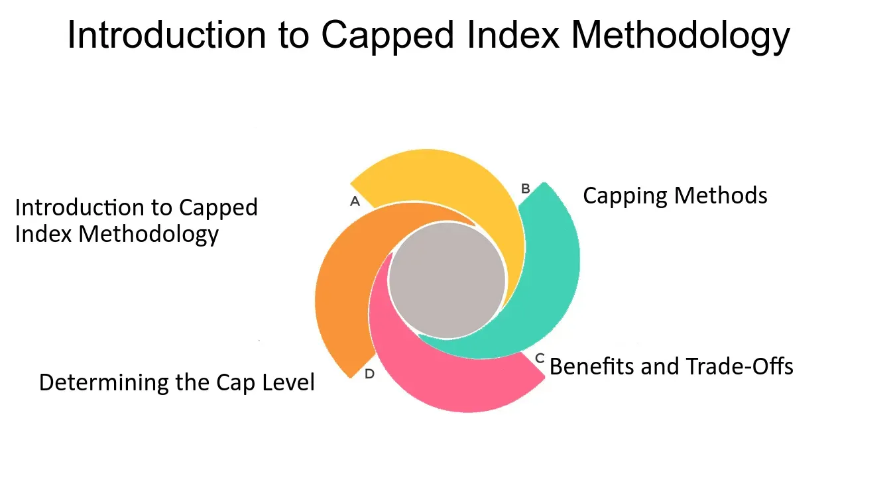

## Table of Contents

## What is a capped index?

A capped index is a type of stock market index where there's a limit on how much any single company can affect the index. This limit, or "cap," means that even if a company grows very big, it won't take over the whole index. This helps keep the index balanced and stops it from being too influenced by just one or a few big companies.

For example, if a company's stock price goes up a lot, in a regular index, that company might start to have a bigger say in how the index moves. But in a capped index, once a company hits its cap, its influence stops growing, even if its stock keeps going up. This way, the index gives a fairer picture of the market as a whole, not just the performance of the biggest companies.

## How does a capped index differ from a regular index?

A capped index and a regular index both track the performance of a group of stocks, but they do it in different ways. In a regular index, the influence of each company can change based on its stock price. If a company's stock price goes up a lot, that company can become a bigger part of the index, which means it has more power over the index's movements. This can make the index less balanced because it might be heavily influenced by just a few big companies.

On the other hand, a capped index puts a limit on how much any one company can affect the index. This cap means that even if a company's stock price grows a lot, its influence on the index won't keep growing past a certain point. This helps keep the index more balanced and gives a fairer view of the overall market, rather than just showing the performance of the biggest companies.

## What are the main benefits of using a capped index?

Using a capped index helps keep things fair. In a regular index, if a company gets really big, it can start to control the whole index. But with a capped index, no single company can take over. This means smaller companies still have a say, and the index shows a better picture of the whole market, not just the biggest companies.

Another benefit is that a capped index can be less risky. Because no one company can have too much power, the index is less likely to go up and down a lot because of just one company's performance. This can make it a safer choice for people who want to invest in the market but don't want to take big risks.

## Can you explain the structure of a capped index?

A capped index is made up of a bunch of companies, just like a regular index. But, there's a special rule in a capped index: no single company can be too important. This rule is called a "cap." It means that even if a company's stock price goes way up, it won't be able to take over the whole index. The cap keeps each company's influence in check, so the index stays balanced.

To set up a capped index, someone decides on the cap, which is usually a percentage. For example, they might say no company can make up more than 10% of the index. When the index is put together, each company starts with a certain weight, but if any company's weight tries to go over the cap, it gets stopped right there. This way, the index keeps showing a fair picture of the market, with no one company having too much power.

## How is the cap determined in a capped index?

The cap in a capped index is decided by the people who make the index. They pick a percentage that no company can go over. This percentage is usually based on what they think will keep the index balanced and fair. For example, they might choose a 10% cap, meaning no company can make up more than 10% of the index.

Once the cap is set, it helps control how much any single company can affect the index. If a company's stock price goes up a lot, its weight in the index might start to grow. But when it hits the cap, its weight stops growing, even if its stock price keeps going up. This way, the index stays balanced and gives a better picture of the whole market, not just the biggest companies.

## What types of assets are typically included in a capped index?

A capped index usually includes stocks from different companies. These companies can be from different industries, like technology, finance, or healthcare. The main thing is that no single company can take over the index because of the cap. This means the index might have stocks from big companies and smaller ones, but none of them can be too important.

The types of assets in a capped index are often chosen to show a good mix of the market. This can mean including stocks from companies in different countries if it's a global index, or from different sectors if it's focused on one country. By keeping a cap on each company, the index stays balanced and gives a fair view of how the market is doing overall.

## How does rebalancing work in a capped index?

Rebalancing in a capped index is like making sure everyone gets a fair turn. It happens when the weights of the companies in the index need to be adjusted. If a company's stock price goes up a lot, it might hit the cap, which means its weight in the index can't grow anymore. But other companies' weights might need to change to keep the total at 100%. So, the index is checked regularly, and the weights are tweaked to make sure no company goes over the cap and the index stays balanced.

This process of rebalancing usually happens at set times, like every three or six months. During rebalancing, the people who manage the index look at all the companies and adjust their weights. If a company's weight has grown too much, it gets brought back down to the cap. If another company's weight has gone down, it might get a little boost. This way, the capped index keeps showing a fair picture of the market, without any one company taking over.

## What are the potential risks associated with investing in a capped index?

Investing in a capped index can have some risks. One risk is that the cap might stop the index from growing as much as it could. If a big company is doing really well, but it hits the cap, the index won't benefit from that company's growth as much as it would without the cap. This means you might miss out on some gains that you could have gotten from a regular index.

Another risk is that the index might not be as diversified as it seems. Even with a cap, if a lot of the companies in the index are from the same industry, the index could still be heavily influenced by what happens in that industry. If that industry has a bad time, the whole index could go down, even with the cap in place. So, it's important to look at what kinds of companies are in the index to understand the risks better.

## How does a capped index impact portfolio diversification?

A capped index helps with portfolio diversification by making sure no single company can take over the whole index. This means your investments are spread out more evenly across different companies. If one company does really badly, it won't hurt your whole portfolio as much because its impact is limited by the cap. This can make your investments safer and more balanced.

But, even with a capped index, you still need to be careful about how diverse your portfolio really is. If a lot of the companies in the index are from the same industry, the index might not be as diverse as it looks. If that industry has problems, the whole index could still go down. So, it's important to check what kinds of companies are in the index to make sure you're really spreading your risk around.

## What are some examples of well-known capped indexes?

One well-known capped index is the S&P/TSX Capped Composite Index in Canada. This index includes the biggest companies listed on the Toronto Stock Exchange, but it puts a cap on how much any single company can affect the index. This way, even if a company like a big bank or an energy company grows a lot, it won't take over the whole index. This helps keep the index balanced and gives a fair view of the Canadian market.

Another example is the MSCI EAFE Index, which tracks stocks from developed markets outside of North America. It's a capped index because it limits how much any one company can influence the index. This helps make sure the index shows a good mix of companies from different countries and industries, not just the biggest ones. By capping the weights, the MSCI EAFE Index stays balanced and gives investors a safer way to invest in international markets.

## How do regulatory requirements affect the management of a capped index?

Regulatory requirements can have a big impact on how a capped index is managed. These rules are made by government agencies to make sure that the index is fair and follows the law. For example, there might be rules about how often the index needs to be rebalanced, or how the weights of the companies are calculated. These rules help keep the index honest and make sure it's doing what it's supposed to do, which is to give investors a fair view of the market.

Sometimes, these regulations can make things a bit harder for the people who manage the index. They might need to spend more time and money to make sure they're following all the rules. This can mean more work to check and adjust the weights of the companies, or to report what they're doing to the regulators. But in the end, these rules help protect investors and make sure the capped index is a good and fair way to invest in the market.

## What advanced strategies can be employed to optimize returns from a capped index?

One advanced strategy to optimize returns from a capped index is to use sector rotation. This means looking at which industries are doing well at different times and putting more money into the sectors that are expected to grow. Since a capped index limits how much any single company can affect the index, you can focus on sectors rather than individual companies. By moving your money around to different sectors based on what's happening in the market, you might be able to get better returns.

Another strategy is to use tactical asset allocation. This means changing how much of your money is in the capped index and how much is in other types of investments, like bonds or cash, based on what's happening in the market. If you think the market is going to go down, you might move some of your money out of the index and into safer investments. When the market looks like it's going to go up again, you can move your money back into the index. This way, you can try to protect your money when the market is risky and take advantage of opportunities when the market is doing well.

## What is a Capped Index Explained?

A capped index is a type of stock market index that applies a limit to the weight of any single security, curbing its influence on the overall index performance. This strategy ensures that no individual stock can dominate the index, enhancing the index's diversification and stability. By capping the weight of each component, capped indexes provide a more representative view of the overall market or a specific market sector by mitigating the risk of overconcentration which can skew performance analysis.

Mathematically, the weight of a security $i$ in a capped index is defined as:

$$
w_i = \min\left(\frac{V_i}{V_t}, C\right)
$$

where $V_i$ is the market value of security $i$, $V_t$ is the total market value of all index components, and $C$ is the maximum allowable weight, or cap, for any single security.

For instance, if the cap is set at 10%, no security can hold more than 10% of the total index's value, regardless of its market capitalization. If a company's weight exceeds this cap due to price increases or structural changes in the index, adjustments are made to align with the capped allocation, redistributing excess weight among other securities.

By implementing such limitations, capped indexes prevent large, influential companies from having outsized effects on index performance, particularly during volatile market conditions. This practice ensures a fairer, more consistent reflection of market movements and allows investors to gain exposure without excessive dependency on a handful of high-cap stocks. Capped indexes are particularly favored in sectors where a few companies tend to dominate, providing a balanced approach that supports long-term investment strategies.

## References & Further Reading

- **Malkiel, B. G.** "A Random Walk Down Wall Street." This book is a classic in financial literature, providing insights on various investment strategies and the concept of market efficiency. It supports the discussion on the benefits and drawbacks of index funds and algorithmic trading by detailing historical stock market trends and the development of investment strategies based on market projections.

- **Bogle, J. C.** "The Little Book of Common Sense Investing." This work emphasizes the importance of low-cost index funds as a means of achieving market returns over the long term. It aligns with the content in the article regarding the cost-effectiveness and diversification benefits associated with index funds, offering a practical guide on how to implement them in portfolio management.

- **Academic and Industry Publications on Financial Markets and Investment Strategies**: 
  - Numerous studies and articles provide foundational knowledge and real-world applicability of investment strategies like capped indexes, index funds, and algorithmic trading. For example, "The Journal of Finance" and "The Review of Financial Studies" regularly publish research on market dynamics, asset pricing, and trading algorithms, enriching the reader's understanding of financial market complexities and strategies.
  - Industry reports and whitepapers from financial institutions such as BlackRock, Vanguard, and Goldman Sachs often include analyses and data on market trends, offering valuable insights into the practical implications of various investment approaches, including those discussed in the article.

Continued engagement with these resources will provide investors and finance professionals with a deeper understanding of how these investment tools and strategies can be effectively harnessed to optimize portfolio performance and achieve specific financial objectives.

