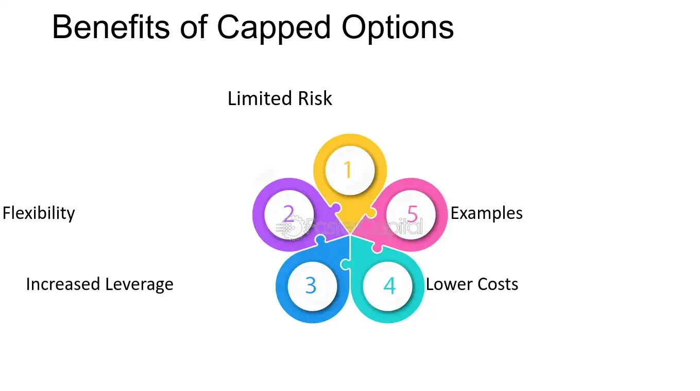

## Table of Contents

## What are capped options?

Capped options are a type of financial tool used in business deals, especially when a company is raising money. They are like regular options but with a limit, or "cap," on how much the option can be worth. This cap is set at the beginning and helps both the company and the investor know the maximum value the option can reach. It gives investors a chance to buy shares at a set price, but they won't have to pay more than the cap, no matter how high the company's value goes.

These options are often used in startup companies to attract investors by offering them a good deal. If the company does really well and its value goes above the cap, the investor still gets to buy shares at the capped price. This can be a big advantage for the investor. On the other hand, if the company's value stays below the cap, the option works just like a regular option. Capped options help balance the risk and reward for both the company and the investor.

## How do capped options differ from traditional options?

Capped options and traditional options are similar because they both give the holder the right to buy something at a set price. But, capped options have a special rule that traditional options don't have. With capped options, there's a limit on how high the value can go. This limit, or "cap," means that no matter how much the value of what you're buying goes up, you won't have to pay more than the cap.

This cap makes a big difference. For example, if you have a capped option to buy shares in a company, and the company's value goes way up, you still only pay up to the cap. This can be a great deal for the person buying the option because they know the most they'll have to pay. Traditional options don't have this cap, so if the value goes up a lot, the buyer has to pay the full new price. Capped options are often used in startup companies to make the deal more attractive to investors by limiting their risk.

## What are the basic components of a capped option?

A capped option has three main parts: the strike price, the cap, and the expiration date. The strike price is what you pay to buy the option. It's like a starting point. The cap is the most you'll ever have to pay, even if the thing you're buying gets more valuable. The expiration date is when the option stops working. If you don't use the option by this date, you lose it.

These parts work together to make the option useful. The strike price lets you know what you're paying upfront. The cap protects you by setting a limit on how much you'll have to pay later. And the expiration date gives you a deadline to make your decision. Together, these parts help both the person selling the option and the person buying it understand the deal better.

## What are the potential benefits of using capped options for beginners?

Capped options can be a good choice for beginners because they limit how much you have to pay. Imagine you want to buy shares in a new company. With a capped option, you know the most you'll ever have to spend, even if the company becomes very successful. This can make you feel safer because you won't lose more money than you planned. It's like having a safety net that helps you try new investments without too much risk.

Another benefit is that capped options can make it easier for beginners to understand what they're getting into. They have a clear limit on the cost, which makes the whole deal simpler. You don't need to worry about the price going up too much because the cap keeps it under control. This can help you learn about investing without getting overwhelmed by complicated rules and big numbers.

## How can capped options be used to manage risk?

Capped options can help manage risk by setting a limit on how much you have to pay. If you buy a capped option, you know the most you will ever spend, even if the value of what you're buying goes up a lot. This is good because it stops you from losing more money than you planned. For example, if you're investing in a startup, the capped option protects you from having to pay a lot more if the startup becomes very successful. This makes it easier for you to decide if the investment is worth it, knowing your risk is under control.

Using capped options also helps you plan better. Because you know the highest price you might pay, you can budget your money more easily. You can invest in more than one thing without worrying about one investment taking all your money if it does really well. This way, you can spread your risk across different investments, which is a smart way to manage your money. Capped options give you peace of mind and help you make safer investment choices.

## What are the common strategies involving capped options?

One common strategy with capped options is to use them to get into new investments without too much risk. Imagine you want to invest in a startup but you're worried the price might go up a lot. With a capped option, you can buy the right to invest at a set price, but you won't have to pay more than the cap, even if the startup becomes very successful. This way, you can try out new investments without being scared of losing too much money if things go really well.

Another strategy is to use capped options to balance your investments. If you have money in different places, you might want to make sure one investment doesn't take all your money if it does really well. Capped options help you do this because you know the most you'll have to pay. This lets you spread your money around more safely and try out different kinds of investments without worrying too much about one of them getting too expensive.

## How do capped options affect the pricing and valuation of options?

Capped options change how options are priced and valued because they add a limit to how much the option can be worth. When you buy a regular option, its value can go up a lot if the thing you're buying becomes more valuable. But with a capped option, there's a maximum price you'll have to pay, no matter how high the value goes. This cap makes the option less risky for the buyer, so it might be cheaper than a regular option. The seller knows they won't get more than the cap, so they might ask for a lower price to make the deal attractive.

Because of the cap, people who value options have to think about how likely it is that the value will go above the cap. If it's very likely, the capped option might be worth a lot because it's a good deal for the buyer. But if it's not likely, the capped option might not be worth much more than a regular option. This means that when you're figuring out how much a capped option is worth, you need to look at the chances of the value going above the cap and how much less risky the option is because of that cap.

## What are the tax implications of trading capped options?

When you trade capped options, you need to think about taxes. If you make money from the option, you might have to pay capital gains tax. This tax depends on how long you held the option before selling it. If you held it for a year or less, it's a short-term capital gain, and you'll pay regular income tax on it. If you held it for more than a year, it's a long-term capital gain, and the tax rate is usually lower. The cap on the option doesn't change how you pay taxes on the profit, but it might affect how much profit you make.

Another thing to remember is that if you use capped options for your job or business, you might be able to deduct some costs. For example, if you paid money to buy the option, that cost might be a business expense you can subtract from your income. But, tax rules can be different depending on where you live, so it's a good idea to talk to a tax expert. They can help you understand exactly how trading capped options will affect your taxes and make sure you're doing everything right.

## How do market conditions influence the effectiveness of capped options?

Market conditions can really change how well capped options work. When the market is doing well and prices are going up, capped options can be very useful. They let you buy something at a set price, but you won't have to pay more than the cap, even if the price goes way up. This is good because it limits how much you have to spend. If the market is booming, and you think prices will keep going up, a capped option can be a smart way to invest without too much risk.

On the other hand, when the market is not doing so well, and prices are going down, capped options might not be as helpful. If the price of what you want to buy stays below the cap, the option works just like a regular option, and you don't get the extra benefit of the cap. In a down market, you might be better off with other kinds of investments that could do better in those conditions. So, it's important to think about what the market is doing when you decide if capped options are the right choice for you.

## What are the advanced techniques for optimizing capped option strategies?

One advanced technique for optimizing capped option strategies is to use them in combination with other financial tools. For example, you might use capped options along with regular options or stocks to create a balanced investment plan. By mixing different kinds of investments, you can spread your risk and take advantage of different market conditions. If you think the market might go up a lot, you can use capped options to limit how much you have to pay, while also using regular options to gain from smaller price changes. This way, you can protect yourself from big losses while still having a chance to make money.

Another technique is to carefully time when you buy and sell your capped options. Pay attention to market trends and news that might affect the price of what you're investing in. If you think a big event or announcement might make prices go up, you can buy capped options before it happens to get a good deal. On the other hand, if you think prices might go down, you might want to sell your options or wait before buying new ones. By timing your moves well, you can make the most of the cap and increase your chances of making a profit.

## How do capped options fit into a broader investment portfolio?

Capped options can be a useful part of a bigger investment plan. They help you try new investments without too much risk. If you want to invest in a startup but are worried about the price going up a lot, a capped option lets you buy at a set price, but you won't have to pay more than the cap, even if the startup does really well. This can be a good way to balance your investments because you know the most you'll have to spend. It helps you spread your money around safely and try different kinds of investments without worrying too much about one of them getting too expensive.

Using capped options in your portfolio also lets you plan better. Because you know the highest price you might pay, you can budget your money more easily. This means you can invest in more than one thing without one investment taking all your money if it does really well. Capped options give you peace of mind and help you make safer investment choices. They can work well with other investments like regular options or stocks, helping you take advantage of different market conditions and manage your risk.

## What are the regulatory considerations and compliance issues related to capped options?

When you use capped options, you need to follow the rules set by financial regulators. These rules can be different depending on where you live. In the United States, for example, the Securities and Exchange Commission (SEC) and the Commodity Futures Trading Commission (CFTC) have rules about options trading. They make sure that people who buy and sell options are doing it fairly and honestly. You might need to register with these agencies or follow certain rules about how you can use capped options. It's important to understand these rules so you don't break any laws.

Another thing to think about is how you report your capped options. You need to keep good records of your trades and report them correctly for taxes and other regulations. If you're using capped options in a business or as part of your job, there might be extra rules about how you can use them and how you need to report them. It's a good idea to talk to a financial advisor or a lawyer to make sure you're doing everything right. They can help you understand the rules and stay compliant with all the regulations.

## What are Capped Options: Their Definition and Mechanism?

Capped options are specialized financial derivatives designed to limit the maximum potential profit that an option holder can realize. These options are structured such that they automatically exercise when the price of the underlying asset reaches a predefined cap level. The cap is a particular price threshold, beyond which the option ceases to gain in value, thereby offering risk-adjusted returns to the investor.

In a capped call option, for example, the holder gains the difference between the asset price and the strike price, up to the capped level. Mathematically, the payoff of a capped call option can be represented as:

$$
\text{Payoff} = \min(\max(S_T - K, 0), \text{Cap})
$$

where $S_T$ is the price of the underlying asset at expiration, $K$ is the strike price, and $\text{Cap}$ is the maximum allowable profit from the option. This mechanism is mirrored in capped put options, where the payoff is:

$$
\text{Payoff} = \min(\max(K - S_T, 0), \text{Cap})
$$

The primary advantage of capped options lies in their ability to provide a boundary for potential financial outcomes. By limiting the upside potential, capped options typically come with reduced premium costs compared to their uncapped counterparts. This cost efficiency makes them an appealing tool for investors seeking to balance risk and reward, particularly in environments characterized by low [volatility](/wiki/volatility-trading-strategies).

Capped options inherently involve the trade-off between capped return potential and reduced cost of entry. While this risk-adjusted return profile may not suit investors looking for unlimited gains, it is particularly beneficial for those aiming to employ strict risk management techniques. This structured approach to investing allows for precise calibration of financial outcomes, aligning with specific investment goals and market conditions.

## References & Further Reading

[1]: Hull, J. C. (2017). ["Options, Futures, and Other Derivatives."](https://www.semanticscholar.org/paper/Options%2C-Futures%2C-and-Other-Derivatives-Hull/89bdee500c8623864fc9eb7a471546aa713acc44) Pearson Education.

[2]: Hasbrouck, J., & Saar, G. (2013). ["Low-latency trading."](https://www.sciencedirect.com/science/article/abs/pii/S1386418113000165) Review of Financial Studies, 26(9), 2869-2909.

[3]: Lopez de Prado, M. (2018). ["Advances in Financial Machine Learning."](https://www.amazon.com/Advances-Financial-Machine-Learning-Marcos/dp/1119482089) Wiley.

[4]: Chan, E. P. (2009). ["Quantitative Trading: How to Build Your Own Algorithmic Trading Business."](https://github.com/ftvision/quant_trading_echan_book) Wiley Trading.

[5]: Aronson, D. (2007). ["Evidence-Based Technical Analysis: Applying the Scientific Method and Statistical Inference to Trading Signals."](https://www.amazon.com/Evidence-Based-Technical-Analysis-Scientific-Statistical/dp/0470008741) Wiley.