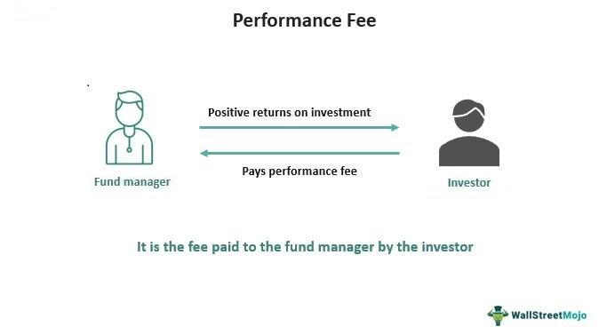

Capula Investment Management LLP stands out as a leading British hedge fund, principally recognized for its influential role in algorithmic trading—a method of executing orders using pre-programmed trading instructions accounting for variables such as time, price, and volume. Established in 2005 by Yan Huo and Masao Asai, Capula has grown from its origins into one of Europe's largest hedge funds, reflecting its pivotal place in the industry. The firm's robust foundation and strategic innovations have enabled it to effectively leverage technological advances, enhancing market dynamics and financial operations.

Capula's emergence in the financial world coincided with a period marked by rapid developments in trading technology and data analytics. The company capitalized on these trends early on, integrating cutting-edge algorithms into its trading practices to optimize outcomes. Algorithmic trading allows Capula to process vast amounts of data at exceptional speeds, enabling the fund to respond to market movements with precision and agility.

This article aims to provide an insight into Capula's influence within the financial markets. By focusing on their algorithmic trading prowess, the discussion will uncover how Capula has not only harnessed these technologies to gain competitive advantage but has also contributed to paradigm shifts in investment management practices. Through detailed examination, the narrative will illustrate how Capula's pioneering strategies and innovative approaches continue to shape the landscape of modern finance.

## Table of Contents

## Background of Capula Investment Management

Capula Investment Management LLP, a formidable entity in the global financial landscape, is primarily based in Mayfair, London. This strategic location positions Capula at the heart of one of the world’s leading financial hubs. Established in 2005, the firm's rapid growth has been bolstered by global affiliations with offices in major financial centers such as Hong Kong, Japan, Singapore, and the United States. This international presence not only enhances Capula's global reach but also enriches its insights into diverse markets, allowing for a well-rounded portfolio of investment strategies.

As of the fourth quarter of 2023, Capula manages over $27 billion in assets. This considerable asset base underscores its status as a significant player within the [hedge fund](/wiki/hedge-fund-trading-strategies) industry. Such capital strength allows Capula to influence market trends and invest in a variety of assets, further pushing its innovative trading methodologies.

Capula's origins trace back to its inception as a spin-off from Mitsubishi UFJ Financial Group, Inc. (UFJ). This heritage is emblematic of the firm's innovative foundations. The transition from UFJ to an independent entity highlights Capula's strategic foresight and its ability to carve out a niche in the competitive hedge fund sector. This historical context provides a window into the firm's ethos—rooted in adopting cutting-edge financial techniques and maintaining a dynamic approach towards market participation. Through employing advanced technologies, Capula continues to evolve, maintaining a sharp competitive edge in a rapidly changing financial environment.

## Algorithmic Trading at Capula

Capula Investment Management employs advanced [algorithmic trading](/wiki/algorithmic-trading) strategies to significantly enhance its investment performance. At the core of these strategies is the utilization of sophisticated mathematical models and complex algorithms, which allow Capula to execute trades at unprecedented speeds and [volume](/wiki/volume-trading-strategy)s. This high-frequency trading approach capitalizes on small price movements in market data to generate profits. The algorithms used by Capula are designed to analyze vast amounts of data, identify patterns, and execute trades based on pre-defined criteria.

Algorithmic trading fundamentally relies on a few key principles: speed, accuracy, and the ability to process massive datasets. For instance, algorithms might utilize statistical [arbitrage](/wiki/arbitrage), where they quickly spot and exploit price inefficiencies across different markets, or mean reversion strategies, which assume that asset prices will revert to their historical averages. This kind of approach necessitates the application of statistical and quantitative analysis, often involving stochastic calculus and time-series analysis to forecast potential future price movements.

Capula's dedication to technology and innovation distinguishes it from more traditional hedge funds. The firm continually invests in cutting-edge technology, enhancing its algorithmic models with machine learning and [artificial intelligence](/wiki/ai-artificial-intelligence) techniques. These technologies help improve prediction models, optimize trading execution, and manage risks more effectively. For instance, [machine learning](/wiki/machine-learning) algorithms could be used to refine trading signals by recognizing complex market patterns that are not immediately apparent to conventional statistical methods.

Capula’s commitment to this advanced technological infrastructure not only boosts its own performance but also reflects a broader trend in the financial sector where data analytics and automated trading are becoming increasingly crucial. By staying at the forefront of algorithmic trading technology, Capula remains a leader in the hedge fund industry, showcasing the potential of merging financial acumen with technological innovation.

## Investment Strategies

Capula Investment Management LLP employs a variety of investment strategies designed to capitalize on different market conditions, thereby consistently generating robust returns. Among these strategies, the absolute return strategy aims for positive returns regardless of market direction. By focusing on alpha generation, Capula seeks to outperform traditional indices, even in turbulent times.

The enhanced fixed income strategy is another significant approach employed by Capula. It emphasizes the optimization of bond portfolios to yield higher returns than standard fixed income investments. This is achieved through a combination of credit analysis, duration management, and yield curve positioning. By leveraging their expertise in fixed income markets, Capula effectively manages [interest rate](/wiki/interest-rate-trading-strategies) risks while capturing superior gains.

Capula's macro strategy focuses on discretionary [global macro](/wiki/global-macro-strategy) trading. This involves analyzing macroeconomic data and global events to take advantage of market dislocations and trends. The macro strategy typically incorporates currency, interest rate, and equity market positions to construct a diversified portfolio capable of withstanding various economic cycles. Such strategic allocations allow Capula to be responsive to shifting economic landscapes.

Crisis alpha is perhaps one of the most intriguing strategies in Capula's arsenal. Amidst periods of market stress and [volatility](/wiki/volatility-trading-strategies), this strategy seeks opportunities that arise from dislocations. By employing systematic trading models and quantitative analysis, Capula can extract alpha during both market upheavals and recoveries. This approach not only mitigates downside risks but also capitalizes on crises as potential opportunities for growth.

Supporting these investment strategies is Capula's robust risk management framework. The firm leverages advanced risk analytics to monitor and manage portfolio exposures. Techniques such as [value at risk](/wiki/var-value-at-risk) (VaR), stress testing, and scenario analysis are integral components of this system, allowing Capula to anticipate and respond to potential threats effectively. Their commitment to maintaining a precise balance between risk and reward underscores Capula's dedication to sustaining long-term investor value through disciplined execution and innovation.

## Impact on Financial Markets

Capula Investment Management's algorithmic trading has a profound impact on financial markets, particularly in terms of [liquidity](/wiki/liquidity-risk-premium) and efficiency. By employing sophisticated algorithms capable of executing trades at high speeds and volumes, Capula enhances market liquidity. This increased volume not only provides better price discovery for market participants but also reduces bid-ask spreads, thus improving the efficiency of financial markets. 

As a prominent hedge fund, Capula serves as a barometer for market trends. Other investment firms often look to Capula's strategies as benchmarks, given its size and influence. The firm's ability to synthesize and act on large datasets swiftly illustrates the symbiotic relationship between technology and modern financial markets. This integration of technology underpins a shift toward data-driven decision-making, becoming a benchmark for evaluating investment performance and strategy.

Furthermore, Capula's success highlights the pivotal role of advanced analytics in contemporary finance. The reliance on algorithmic strategies underscores a broader industry trend where technology, often utilizing machine learning and artificial intelligence, is indispensable for crafting competitive investment strategies. This trend indicates a gradual move away from traditional trading methods, pivoting toward automation, which facilitates faster and more informed trading decisions.

## Conclusion

Capula Investment Management stands out as a key player in the dynamic landscape of hedge funds, particularly in the advancement of algorithmic trading. The firm's consistent emphasis on integrating technology with cutting-edge financial strategies underlines its influential role in this evolution. Capula's robust foundation, characterized by its strategic foresight and commitment to innovation, positions it as a vital force in shaping the future of investment management.

By continually leveraging sophisticated technologies and innovative approaches, Capula has effectively maintained its status as a leader in the hedge fund industry. The firm's ability to adapt to changing market conditions and harness the power of data analytics not only enhances its investment performance but also sets a benchmark for other financial institutions. As technology becomes increasingly integral to finance, Capula's sustained leadership and pioneering spirit will likely continue to influence and guide the trajectory of modern investment strategies.

## References & Further Reading

[1]: Bergstra, J., Bardenet, R., Bengio, Y., & Kégl, B. (2011). ["Algorithms for Hyper-Parameter Optimization."](https://papers.nips.cc/paper/4443-algorithms-for-hyper-parameter-optimization) Advances in Neural Information Processing Systems 24.

[2]: ["Advances in Financial Machine Learning"](https://www.amazon.com/Advances-Financial-Machine-Learning-Marcos/dp/1119482089) by Marcos Lopez de Prado

[3]: ["Evidence-Based Technical Analysis: Applying the Scientific Method and Statistical Inference to Trading Signals"](https://www.amazon.com/Evidence-Based-Technical-Analysis-Scientific-Statistical/dp/0470008741) by David Aronson

[4]: ["Machine Learning for Algorithmic Trading"](https://github.com/stefan-jansen/machine-learning-for-trading) by Stefan Jansen

[5]: ["Quantitative Trading: How to Build Your Own Algorithmic Trading Business"](https://books.google.com/books/about/Quantitative_Trading.html?id=j70yEAAAQBAJ) by Ernest P. Chan