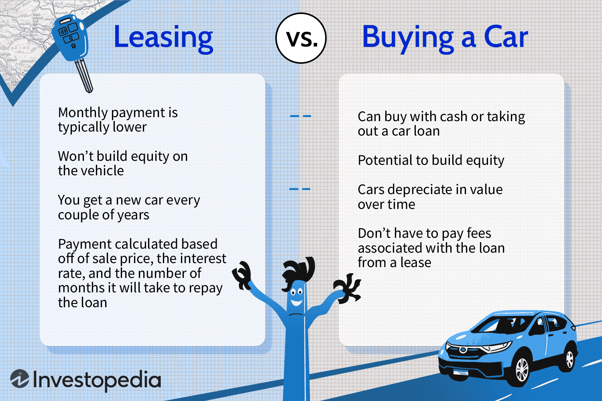

The journey to retirement involves numerous decisions, with transportation representing a crucial aspect of maintaining independence and mobility. As retirees consider their options, the choice between buying and leasing a car often arises as a pivotal decision. Both purchasing and leasing offer distinct advantages and disadvantages that retirees must weigh carefully.

Car buying traditionally provides the benefit of unrestricted ownership, allowing retirees to utilize their vehicle without the limitations typically associated with leases, such as mileage caps. However, the higher initial costs of purchasing a car may not align with all retirees' financial situations, particularly if they aim to preserve capital for other retirement needs.



On the other hand, leasing offers retirees the possibility of more manageable monthly payments while granting access to newer models equipped with the latest safety and technological advancements. This option may appeal to those who prefer driving a modern vehicle without the long-term financial commitment associated with owning a car outright.

Complicating this decision further is the rise of algorithmic trading, a sophisticated method of managing finances that has opened new avenues for funding significant purchases. Algorithmic trading, or "algotrading," involves using mathematical models and computer programs to make automated financial decisions. For retirees who have embraced technology in their investment strategies, algotrading could provide the additional income or financial flexibility needed to optimize their car buying or leasing strategies.

This article will explore the advantages and drawbacks of both car buying and leasing for retirees while examining how algorithmic trading can offer innovative solutions to support these choices. Different retirement lifestyles and financial plans will also be considered to determine which transportation option might best suit individual needs.

## Table of Contents

## Car Buying vs. Leasing for Retirees

When retirees consider acquiring a vehicle, the decision between buying and leasing often hinges on factors such as long-term financial planning, lifestyle preferences, and expected vehicle usage. Each option comes with its unique set of benefits and drawbacks, making it crucial for retirees to evaluate which aligns best with their specific needs.

Buying a car provides the owner with long-term use and the freedom to drive without worrying about mileage restrictions, which is often advantageous for those who anticipate extensive travel or simply value ownership. This option typically involves a higher initial cost, including the full purchase price or a significant down payment. However, once the vehicle is paid off, there are no further monthly payments, and the owner has the freedom to use or sell the vehicle as they please. Over time, the cost of ownership can be more economical, especially if retirees plan to keep the vehicle for many years. The absence of mileage limitations can be particularly appealing for those with an active lifestyle or those residing in rural areas where long distances are common.

On the other hand, leasing offers an alternative with lower monthly payments, which can be more manageable on a fixed retirement income. Leasing agreements often require little to no down payment and enable retirees to drive newer car models more frequently. This means access to the latest safety features and technology upgrades, which can enhance safety and comfort—a critical consideration for many retirees. However, leasing comes with mileage limitations, and exceeding these limits can result in substantial fees. Additionally, since a leased car is not owned, there is no equity built up in the vehicle over time.

Determining which option is more suitable depends largely on the retiree's lifestyle and financial plan. For retirees who drive less or prefer always to have the latest car technology without the commitment of ownership, leasing may be a more appropriate choice. Conversely, buying could be more advantageous for those who drive frequently or wish to eventually eliminate vehicle payments altogether.

Ultimately, the decision to buy or lease should account for the retiree's financial situation, expected vehicle usage, and lifestyle preferences. Tools such as financial calculators can assist in estimating the total cost of ownership versus leasing over a given period, taking into account factors such as depreciation, projected maintenance costs, and potential resale value for purchased vehicles. By thoroughly evaluating these aspects, retirees can make informed decisions that support their overall retirement goals.

## Financial Implications and Tax Considerations

When retirees consider acquiring a vehicle, understanding the financial implications of buying versus leasing is essential. Each option carries distinct costs, benefits, and potential tax considerations that can significantly impact a retiree's financial strategy.

**Financial Implications of Buying a Vehicle**

Purchasing a car involves an upfront payment, which may include a down payment, taxes, and fees. The total cost of buying a car can be represented by the formula:

$$
\text{Total Buying Cost} = \text{Down Payment} + (\text{Monthly Loan Payment} \times \text{Loan Term}) + \text{Taxes and Fees} - \text{Resale Value}
$$

For retirees who plan to keep their car for a longer duration, buying might be a cost-effective option due to the absence of mileage restrictions and potential value retention. However, the higher initial cost is a critical [factor](/wiki/factor-investing) to consider, particularly if liquid cash reserves are essential for other retirement needs.

**Financial Implications of Leasing a Vehicle**

Leasing generally offers lower monthly payments than purchasing, primarily because payments reflect the vehicle's depreciation over a fixed term rather than the entire car cost. The formula for leasing costs usually includes:

$$
\text{Total Leasing Cost} = (\text{Monthly Lease Payment} \times \text{Lease Term}) + \text{Initial Fees} + (\text{End-of-Lease Fees or Excess Mileage Charges})
$$

Leasing can be appealing for retirees interested in driving newer models with updated technology without a substantial financial commitment. However, factors like mileage limits and potential penalties need consideration if the vehicle is driven extensively.

**Tax Benefits and Considerations**

While buying a car typically involves straightforward ownership with few tax implications, leasing may offer tax advantages, particularly for retirees who use their vehicles for business purposes. In some cases, part of the lease payments can be deducted if the vehicle is utilized for generating income. This can be calculated using:

$$
\text{Deductible Amount} = \text{Lease Payment} \times \text{Business Use Percentage}
$$

Consulting with a tax professional is advisable to ensure compliance and optimization of possible tax benefits. 

**Using Financial Calculators and Tools**

To make an informed decision, retirees should leverage financial calculators to compare the total cost of ownership against leasing. Many online tools allow for inputting specific variables such as interest rates, vehicle price, lease terms, and estimated resale values. Here's an example of how Python can be used to calculate and compare these costs:

```python
def total_buying_cost(down_payment, monthly_loan_payment, loan_term, taxes_fees, resale_value):
    return down_payment + (monthly_loan_payment * loan_term) + taxes_fees - resale_value

def total_leasing_cost(monthly_lease_payment, lease_term, initial_fees, end_of_lease_fees):
    return (monthly_lease_payment * lease_term) + initial_fees + end_of_lease_fees

buy_cost = total_buying_cost(5000, 400, 60, 1200, 15000)
lease_cost = total_leasing_cost(350, 36, 1500, 1000)

print(f"Total Buying Cost: ${buy_cost}")
print(f"Total Leasing Cost: ${lease_cost}")
```

By analyzing these data, retirees can better understand which option aligns with their financial situation and goals, ensuring their transportation needs are met without compromising their financial security in retirement.

## Algotrading: A New Frontier for Retiree Finances

Algorithmic trading, commonly referred to as algotrading, is a method of executing trades in the financial markets using automated pre-programmed trading instructions. These instructions account for variables such as time, price, and [volume](/wiki/volume-trading-strategy), allowing for high-speed and systematic trading. For retirees, engaging in algotrading presents a novel opportunity to enhance their financial portfolios by potentially generating additional income, which can be particularly useful for funding large purchases or leases such as vehicles.

Algotrading can be harnessed by retirees to supplement their retirement income. The process involves using algorithms to analyze market data in real-time and executing trades based on criteria set by the user. One significant advantage is the ability to backtest these strategies using historical data, which helps in understanding potential performance and risks before committing actual capital.

To begin with algotrading, retirees should first familiarize themselves with the basics of trading and market analysis. Many online platforms offer educational resources, ranging from beginner courses to advanced algorithmic strategies. Once equipped with foundational knowledge, retirees can choose a trading platform that supports algorithmic strategies. Popular platforms such as QuantConnect or MetaTrader allow users to build and test their trading algorithms using languages like Python or MQL.

A simple algo strategy might look like this in Python using the QuantConnect API:

```python
class BasicAlgorithm(QCAlgorithm):
    def Initialize(self):
        self.SetStartDate(2023, 1, 1)
        self.SetEndDate(2023, 12, 31)
        self.SetCash(10000)
        self.AddEquity("SPY", Resolution.Daily)

    def OnData(self, data):
        if not self.Portfolio.Invested:
            self.SetHoldings("SPY", 1)  # Buy the stock
```

This simple algorithm buys the SPDR S&P 500 [ETF](/wiki/etf-trading-strategies) (SPY), holding it throughout the specified time frame, allowing retirees a basic entry into understanding and employing trading algorithms.

However, algotrading is not without risks. The primary risks include market [volatility](/wiki/volatility-trading-strategies), technical failures, and incorrect strategies that could lead to significant losses. Additionally, retirees must remain aware of the complexity involved in more advanced strategies, as well as the need for continuous monitoring and adjustment of algorithms to adapt to market conditions.

One of the main advantages of algotrading is the elimination of emotional biases and the ability to trade 24/7 in various markets across the globe. This attribute is particularly beneficial for retirees who might not wish to spend significant hours analyzing market trends manually.

In conclusion, while algotrading offers retirees a modern method to potentially supplement their finances, careful consideration of associated risks and benefits is crucial. Beginning with simple strategies and gradually increasing complexity as comfort and understanding grow can offer a balanced approach to maximizing retirement portfolios while ensuring informed and strategic financial decisions.

## Technology and Transportation: The Role of Modern Features

Modern vehicles have rapidly evolved to include advanced safety and technology features that significantly impact the driving experience. For retirees, who may prioritize comfort, safety, and ease of use, these advancements are particularly important.

Safety features such as backup cameras, adaptive cruise control, and advanced navigation systems not only enhance driving efficiency but also contribute to safer road conditions. Backup cameras provide improved visibility, helping drivers more easily navigate tight parking spots or avoid obstacles while reversing. Adaptive cruise control systems automatically adjust the vehicle's speed to maintain a safe distance from the car ahead, reducing the need for constant speed adjustments during long drives. Similarly, modern navigation systems, often equipped with live traffic updates, assist drivers in reaching their destinations more efficiently while potentially avoiding congested routes.

Leasing a vehicle can be a cost-effective way for retirees to access these cutting-edge features. Many leases allow individuals to drive new models regularly, ensuring access to the latest advancements in automotive technology. The structure of leasing agreements typically involves lower monthly payments compared to purchasing a vehicle, which may be beneficial for those on a fixed retirement income. This financial arrangement provides retirees with the ability to utilize the newest safety features without the long-term financial commitment associated with owning a car.

The incorporation of technological advancements in vehicles not only enhances safety but also improves overall quality of life for retirees. Features designed to reduce driver fatigue, such as ergonomic seating with customizable adjustments, heating elements, and entertainment systems, can make longer journeys more comfortable. Moreover, the inclusion of smartphone integration capabilities allows for hands-free communication and media access, contributing to a more connected and informed driving experience.

In conclusion, the integration of modern safety and technology features in vehicles presents a valuable opportunity for retirees to improve both lifestyle and safety. Leasing provides an accessible means to benefit from these advancements, supporting the ability to maintain independence and mobility during retirement.

## Conclusion: Making the Smart Choice in Retirement

Making informed decisions about whether to buy or lease a car in retirement involves careful consideration of several key factors. Retirees should first evaluate their expected vehicle usage, lifestyle preferences, and financial circumstances. Purchasers who prioritize long-term use, potentially higher overall costs, and freedom from mileage caps may lean towards buying. On the other hand, those who appreciate lower upfront costs, the flexibility to switch vehicles periodically, and the benefits of driving newer models might find leasing more advantageous.

Aligning transportation choices with an overall retirement financial strategy is a crucial step. Retirees need to weigh the total costs involved in purchasing versus leasing, including down payments, monthly expenditures, maintenance, insurance, and potential depreciation. Financial calculators can be helpful tools for projecting these costs over time, allowing retirees to match their choice with their long-term financial goals. The decision should factor in not just the monthly budget but also the convenience and comfort that different vehicle options offer.

Algorithmic trading presents a burgeoning opportunity for retirees seeking innovative ways to finance car purchases or leases. By leveraging technology to automate and execute trading strategies, retirees can potentially boost their income streams. To get started with [algorithmic trading](/wiki/algorithmic-trading), retirees should first educate themselves on the risks and benefits associated with this investment strategy. They may choose to use platforms that offer algorithmic trading features or even explore creating simple algorithms themselves if they have technical prowess.

Here is an example of a basic trading algorithm in Python:

```python
import pandas as pd

# Example data for prices
data = {'Price': [120, 125, 130, 128, 132, 135]}
df = pd.DataFrame(data)

# Simple moving average strategy
df['SMA_3'] = df['Price'].rolling(window=3).mean()

# Define buy/sell signals
df['Signal'] = 0
df['Signal'][3:] = [1 if df['Price'][i] > df['SMA_3'][i] else -1 for i in range(3, len(df))]

print(df)
```

This code demonstrates a simple moving average strategy, where a buying signal is generated when the current price exceeds a 3-day moving average, and a selling signal is the opposite. Although basic, such strategies can form the foundation of a retiree's exploration into algorithmic trading.

Ultimately, making the smart choice in retirement about purchasing or leasing a vehicle requires integrating transportation decisions with broader financial objectives. By thoughtfully considering the pros and cons of each option and potentially harnessing algorithmic trading to expand financial resources, retirees can position themselves to enjoy an optimal balance of mobility, comfort, and financial sustainability.

## References & Further Reading

[1]: ["Should You Buy or Lease Your Next New Vehicle?"](https://www.consumerreports.org/money/car-financing/should-you-lease-your-next-car-a3342848831/) - Consumer Reports.

[2]: ["How to Leverage Algorithmic Trading in Your Investment Strategy"](https://nurp.com/wisdom/the-complete-roadmap-to-successful-algorithmic-trading-from-idea-to-implementation/) - Investopedia.

[3]: Lopez de Prado, M. (2018). ["Advances in Financial Machine Learning"](https://www.amazon.com/Advances-Financial-Machine-Learning-Marcos/dp/1119482089). Wiley.

[4]: Aronson, D. (2006). ["Evidence-Based Technical Analysis: Applying the Scientific Method and Statistical Inference to Trading Signals"](https://www.amazon.com/Evidence-Based-Technical-Analysis-Scientific-Statistical/dp/0470008741). Wiley.

[5]: Jansen, S. (2020). ["Machine Learning for Algorithmic Trading"](https://github.com/stefan-jansen/machine-learning-for-trading). Packt Publishing.

[6]: Chan, E. P. (2008). ["Quantitative Trading: How to Build Your Own Algorithmic Trading Business"](https://github.com/ftvision/quant_trading_echan_book). Wiley. 

[7]: ["Understanding the Financial Implications of Car Leases and Purchases"](https://carclarified.com/car-leasing-vs-buying-in-depth-financial-analysis/) - NerdWallet.