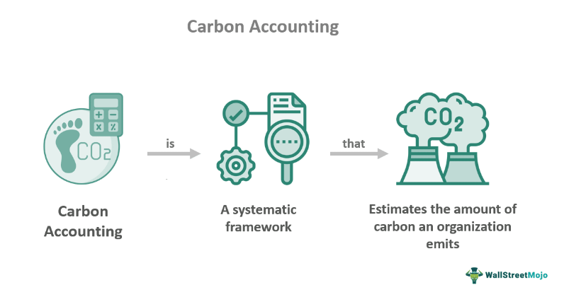

In recent years, the intersection of environmental sustainability and financial systems has become increasingly significant, especially given the escalating concerns over carbon emissions. Carbon emissions, primarily in the form of carbon dioxide (CO₂), are released through various industrial and commercial activities, contributing significantly to global climate change. Understanding and managing these emissions through carbon accounting is pivotal for promoting ecological balance and substantiating efforts toward reducing the global carbon footprint. Carbon accounting provides a standardized methodology to quantify and report greenhouse gas (GHG) emissions, enabling organizations to assess their environmental impact and strategize accordingly.

Simultaneously, the financial industry has witnessed a revolution with the advent of algorithmic trading, which utilizes complex algorithms to execute trades at high frequencies. This technology-driven trading method accounts for a significant portion of trades in the financial markets today and is celebrated for its efficiency and speed. However, algorithmic trading is heavily reliant on vast computational resources and data centers, which consume substantial amounts of energy, thereby contributing indirectly to carbon emissions. This presents a complex challenge where the financial benefits of algorithmic trading must be weighed against its environmental costs.



Given this backdrop, it is imperative to explore how these components—carbon emissions, carbon accounting, and algorithmic trading—interact. At the heart of this discourse is the concept of carbon footprints. To foster more sustainable practices, industries must integrate environmental considerations into their business models, including sophisticated sectors like financial trading. By doing so, financial institutions can align themselves with global sustainability goals, reduce their emissions, and possibly transform algorithmic trading systems into platforms supporting environmentally-friendly projects.

Understanding the relationship between carbon emissions and algorithmic trading is not only essential for mitigating climate change but also for driving innovation and sustainability within financial markets. As we proceed through this article, we will examine how carbon accounting methodologies can be adopted by trading firms, strategies to minimize trading-related emissions, and potential regulatory and market incentives to facilitate these initiatives. Such discussions are crucial as we navigate toward a more sustainable future where finance and sustainability go hand in hand.

## Table of Contents

## Understanding Carbon Emissions

Carbon emissions refer to the release of carbon, primarily in the form of carbon dioxide (CO2), into the atmosphere as a result of human activities. These emissions are a significant contributor to global climate change, a phenomenon characterized by long-term alterations in temperature, precipitation patterns, and other climatic conditions. The primary mechanism by which carbon emissions drive climate change is the greenhouse effect. Carbon dioxide, along with other greenhouse gases (GHGs) such as methane (CH4) and nitrous oxide (N2O), traps heat from the sun in the earth's atmosphere, preventing it from escaping back into space. This leads to a warming effect that disrupts natural climate patterns.

Monitoring and reducing greenhouse gas emissions across various sectors is critical to mitigating the adverse impacts of climate change. Effective monitoring allows for the identification of key emission sources and the development of targeted strategies to reduce emissions. Reducing emissions is essential not only to curb the current rate of climate change but also to comply with international agreements and policies set by governments and organizations globally.

Major sources of carbon emissions span multiple industries. The energy sector is the largest contributor, with power plants burning fossil fuels such as coal, oil, and natural gas to produce electricity. This combustion process is responsible for a substantial share of global CO2 emissions. The transportation sector is another major source, driven by the combustion of gasoline and diesel fuels in cars, trucks, airplanes, and ships. The industrial sector, including cement and steel manufacturing, also generates significant emissions through energy use and industrial processes. Additionally, agriculture and deforestation contribute to methane and carbon dioxide emissions through activities such as livestock farming and land-use changes.

Various global and regional policies aim to curb emissions and promote sustainable practices. One of the most notable international frameworks is the Paris Agreement, adopted in 2015, which sets out a global action plan to limit global warming to well below 2 degrees Celsius above pre-industrial levels, with efforts to limit the temperature increase to 1.5 degrees Celsius. Under the Paris Agreement, countries are required to submit nationally determined contributions (NDCs) outlining their plans to reduce emissions and adapt to climate change.

Net-zero goals have gained prominence as part of the global effort to combat climate change. Achieving net-zero means balancing the amount of greenhouse gases emitted into the atmosphere with the amount removed, effectively reducing a country's net emissions to zero. This can be accomplished through a combination of emission reduction strategies, carbon capture and storage technologies, and enhancing natural carbon sinks such as forests. Companies and countries increasingly commit to net-zero targets, recognizing the urgency of addressing climate change and the opportunities for innovation and economic growth in developing cleaner, more sustainable practices.

Efforts to achieve these goals require collaborative actions from policymakers, industry leaders, and all levels of society to implement and support policies and practices that reduce carbon emissions.

## Carbon Accounting: A Methodology for Measuring Emissions

Carbon accounting, commonly referred to as greenhouse gas (GHG) accounting, is a systematic approach used for quantifying and managing the emissions of carbon dioxide (CO2) and other greenhouse gases produced by an organization, facility, or individual. It plays a vital role in identifying the environmental impact of these entities and helps in formulating strategies to mitigate climate change.

### The Three Scopes of Emissions

Carbon emissions are generally categorized into three distinct scopes as defined by the Greenhouse Gas Protocol, a widely recognized standard for GHG accounting and reporting.

**Scope 1: Direct Emissions**  
These emissions occur from sources that are owned or controlled by the organization. Examples include emissions from combustion in owned or controlled boilers, furnaces, vehicles, and emissions from chemical production in owned or controlled process equipment. Scope 1 is often the most immediate and easy to measure as it involves direct physical processes.

**Scope 2: Indirect Emissions from Energy Purchased**  
These are emissions from the consumption of purchased electricity, steam, heating, and cooling. While an organization may not own the emissions source directly, they contribute to these emissions through their energy consumption practices. Monitoring Scope 2 emissions allows organizations to assess the environmental impact of their energy use and consider greener alternatives like renewable energy.

**Scope 3: Indirect Emissions from Other Sources**  
Scope 3 encompasses all other indirect emissions that occur from the organization’s activities but from sources not owned or directly controlled by the organization. This includes activities such as business travel, procurement, waste disposal, and distribution logistics. Scope 3 is often the most challenging to quantify due to its breadth, yet it can also represent the majority of an entity's total emissions footprint.

### Standardization through the Greenhouse Gas Protocol

The Greenhouse Gas Protocol provides comprehensive global standardized frameworks for measuring and managing emissions. It serves as a critical instrument for both public and private sectors to ensure consistency and transparency in reporting emissions. Companies utilize these protocols to align their sustainability goals with international standards, thus facilitating reliable comparisons across industries and regions. The Protocol helps businesses create inventories of their emissions and provides guidance for setting emissions reduction targets.

### Challenges and Benefits of Implementing Carbon Accounting

**Challenges:**
- **Complexity in Measurement:** Particularly with Scope 3, accurately measuring emissions can be resource-intensive and technically complex, requiring significant data collection and analysis efforts.
- **Data Availability:** Insufficient or incomplete data can hinder the accuracy and comprehensiveness of carbon accounting.
- **Evolving Standards:** As science and policy evolve, the standards for measuring carbon emissions also change, requiring continuous adaptation by businesses.

**Benefits:**
- **Risk Management:** Systematic carbon accounting helps businesses identify risks related to regulatory compliance and resource scarcity.
- **Operational Efficiency:** By understanding their emissions, companies can identify opportunities for efficiency improvements, leading to potential cost savings.
- **Reputation and Trust:** Demonstrating a commitment to transparency and sustainability can enhance brand reputation and build trust among consumers, investors, and other stakeholders.

In conclusion, carbon accounting plays an essential role in equipping organizations with the necessary information to manage their environmental impact and move towards sustainable operations. By adopting systematic approaches such as those laid out in the Greenhouse Gas Protocol, companies can not only meet regulatory requirements but also contribute significantly to global emissions reduction efforts.

## The Role of Algorithmic Trading in Finance

Algorithmic trading, often synonymous with automated or black-box trading, represents a paradigm shift in the way securities are bought and sold in financial markets. It utilizes sophisticated mathematical models and processes to execute orders at speeds and frequencies that are impossible for human traders. This form of trading has seen exponential growth, now accounting for a significant portion of trading activity in major financial markets globally. Algorithmic trading systems are designed to leverage market conditions efficiently, and they particularly thrive in environments characterized by high [liquidity](/wiki/liquidity-risk-premium).

A critical component of [algorithmic trading](/wiki/algorithmic-trading) is high-frequency trading ([HFT](/wiki/high-frequency-trading-strategies)), which involves the execution of numerous orders at incredibly high speeds, often measured in milliseconds. HFT strategies exploit minute price discrepancies and liquidity imbalances, contributing significantly to market liquidity and price discovery. Automated decision-making algorithms play a central role in these strategies, as they can rapidly assess a multitude of market variables to make split-second trading decisions, far beyond human capabilities. These algorithms employ complex statistical and [machine learning](/wiki/machine-learning) techniques to predict market trends and execute trading strategies accordingly.

The environmental impact of algorithmic trading is primarily linked to the substantial energy consumption of the data centers that power these operations. Data centers are the backbone of algorithmic trading, providing the necessary computational power and storage capabilities. They require a constant, high-level energy supply to maintain operations, which predominantly comes from non-renewable sources. This energy usage contributes to the carbon emissions associated with financial markets, raising concerns about sustainability. Recent studies have highlighted that data centers can consume a comparable amount of electricity as mid-sized countries, leading to increased scrutiny over their environmental consequences.

To address the carbon footprint associated with their operations, many algorithmic trading firms are implementing strategies aimed at sustainability. Some firms have started adopting energy-efficient technologies, such as advanced cooling systems and optimizing computational processes to reduce energy usage. There is also a growing trend toward sourcing renewable energy to power data centers, aligning with broader corporate sustainability goals. Additionally, some firms participate in carbon offset programs, investing in projects that mitigate carbon emissions, such as reforestation or renewable energy initiatives, to compensate for their environmental impact.

In pursuit of sustainability, companies are continuously innovating to reduce the carbon intensity of their trading operations. This includes developing more energy-efficient algorithms and participating in initiatives that promote transparency and accountability in carbon emissions reporting. By integrating carbon-conscious practices, algorithmic trading firms not only contribute to reducing their environmental impact but also enhance their reputation and fulfill their corporate social responsibilities.

## Interlinking Carbon Accounting and Algorithmic Trading

Financial firms can effectively integrate carbon accounting into their trading operations by adopting a systematic approach that incorporates both technology and strategic planning. A primary method for achieving this is through the development and implementation of comprehensive carbon accounting systems that enable firms to track their carbon emissions accurately across various operational stages.

### Strategies for Reducing Carbon Emissions within Algorithmic Trading Environments

To reduce carbon emissions in algorithmic trading, financial firms can adopt several strategies:

1. **Optimizing Data Center Efficiency**: Data centers are critical in algorithmic trading, hosting the computing power required for executing trades. Energy efficiency can be enhanced by employing more efficient cooling systems, server virtualization to reduce hardware usage, and transitioning to green energy sources.

2. **Sustainable Algorithm Design**: Developers can write algorithms that are not only efficient in trading performance but also optimized for minimal energy consumption. This involves code optimization and choosing algorithms that require less computational power.

3. **Leveraging Renewable Energy**: Shifting to renewable energy sources for powering trading operations can considerably reduce emissions. This transformation can be facilitated by entering agreements with energy providers to use wind, solar, or hydroelectric power.

4. **Cloud Computing**: Transitioning from physical servers to cloud-based solutions can lead to a reduction in energy consumption, as cloud providers often invest in more sustainable and energy-efficient technologies.

### Case Studies of Companies Implementing Sustainable Trading Practices

Certain financial institutions have already embarked on efforts to integrate sustainability into their trading operations:

- **Company A** has implemented an AI-driven platform that optimizes energy use by dynamically adjusting computing loads and scheduling trading operations during periods of lower grid demand, thereby reducing their carbon footprint.

- **Company B** has invested in a renewable energy supply for its data centers, achieving a balance between performance and environmental impact. This initiative has led to a reduction in operational emissions and a positive impact on their sustainability goals.

### Potential for Algorithmic Trading to Fund Green Projects and Offset Carbon Footprints

Algorithmic trading platforms have the potential not just to minimize carbon emissions internally but also to support external sustainability projects. This can be achieved through:

- **Investment in Carbon Offsets**: Firms can support projects that offset their emissions, such as reforestation or renewable energy projects, providing a balance for emissions generated by their operations.

- **Green Bonds and ESG Investment**: Algorithmic trading can be utilized to trade in green bonds, which fund environmentally friendly projects. Additionally, firms can incorporate Environmental, Social, and Governance (ESG) criteria into their trading algorithms to prioritize investments that align with sustainability objectives.

Financial institutions embracing these strategies and case studies can enhance both their operational efficiency and environmental responsibility, setting a benchmark for sustainability within the financial trading sector.

## Challenges and Opportunities

Measuring and reporting carbon emissions within the trading sector, particularly Scope 3 emissions, present notable complexities. Scope 3 emissions encompass indirect emissions that occur in a company’s value chain. Unlike Scope 1 and Scope 2 emissions, which directly pertain to the firm's operations and energy purchases, Scope 3 requires extensive data collection and analysis across a multitude of business interactions and supply chains.

One of the primary challenges in addressing Scope 3 emissions is data availability and quality. Trading firms often engage with a vast network of suppliers and clients, each contributing varied sources of emissions. This aspect requires intensive coordination to acquire reliable and comprehensive data. Additionally, the variability in emissions accounting standards across regions and sectors further complicates this process. To effectively monitor and report these emissions, trading firms must invest in robust data management systems capable of integrating diverse datasets.

Furthermore, implementing effective carbon reduction strategies in algorithmic trading encounters specific hurdles. The high-frequency nature of trading demands substantial computing power, often leading to significant energy consumption. Transitioning to energy-efficient data centers and utilizing renewable energy sources are among the potential strategies to mitigate carbon footprint. However, these transitions require significant initial investment and a strategic shift in infrastructure planning.

Despite these challenges, there are considerable opportunities for innovation in merging carbon accounting with algorithmic trading. The integration of [artificial intelligence](/wiki/ai-artificial-intelligence) and machine learning in carbon footprint analysis can enhance precision in emission tracking. Moreover, developing algorithms that optimize not only for financial returns but also for carbon efficiency can lead to more sustainable trading practices. For instance, a Python script could be developed to analyze trading patterns and suggest low-carbon alternatives in real-time.

```python
import numpy as np

def optimize_trading_for_carbon(trades, carbon_costs):
    # trades: array of trading options with associated profits
    # carbon_costs: array of carbon costs for each trade

    # Calculate carbon efficiency as profit per carbon unit
    carbon_efficiency = trades / carbon_costs

    # Select trades with highest carbon efficiency
    optimal_trades_indices = np.argsort(-carbon_efficiency)

    return optimal_trades_indices

# Example usage
trades = np.array([100, 150, 200])  # hypothetical profits
carbon_costs = np.array([50, 75, 100])  # hypothetical carbon costs
optimal_trades = optimize_trading_for_carbon(trades, carbon_costs)
print("Optimal trades indices:", optimal_trades)
```

Regulatory frameworks and market incentives play crucial roles in promoting environmentally-friendly trading practices. With increasing global awareness around climate change, regulatory bodies are establishing more stringent reporting requirements and emission reduction targets. This regulatory pressure motivates financial institutions to adopt thorough carbon accounting and develop strategies aligned with environmental goals. Moreover, financial incentives, such as tax breaks or credits for investing in green technologies, can further encourage companies to innovate and transition towards sustainability.

In conclusion, while the integration of carbon accounting into algorithmic trading presents challenges, it simultaneously offers opportunities for significant progress. By leveraging technological advancements and aligning with regulatory expectations, trading firms can not only reduce their environmental impact but also pioneer a new frontier of sustainable financial operations.

## Conclusion

The exploration of the intersection between carbon emissions, carbon accounting, and algorithmic trading reveals a complex yet critical relationship that requires industry-wide attention. Understanding carbon emissions and their impact on climate change is fundamental for recognizing the importance of carbon accounting. This methodology provides a structured approach to measure emissions across various sectors, emphasizing the need for standardized protocols such as the Greenhouse Gas Protocol.

Algorithmic trading, a staple in modern financial markets, presents unique environmental challenges due to its significant energy consumption, particularly in data centers. The role of financial institutions in integrating carbon accounting into trading operations is essential for promoting sustainability. By adopting innovative strategies and leveraging technology to reduce emissions, these firms can set a precedent within the financial industry.

Stakeholders in the algorithmic trading sector are encouraged to adopt sustainable practices, recognizing both the environmental and potentially economic benefits of doing so. Creating an eco-conscious trading framework not only assists in mitigating environmental impact but also aligns with global trends towards sustainability.

Looking forward, the management of carbon emissions in finance will likely become more integral as regulatory frameworks tighten and market incentives for environmentally-friendly practices grow. There lies an opportunity for financial markets to spearhead the transition towards a low-carbon economy, making sustainability a core component of financial operations. This shift will require concerted efforts from all stakeholders, fostering a culture of environmental responsibility and innovation in trading practices.

## References & Further Reading

[1]: Cărbunaru, L. et al. (2020). ["Understanding Carbon Footprints of Algorithmic Trading Strategies."](https://www.sciencedirect.com/science/article/pii/S0959652624020833) Expert Systems with Applications, 159.

[2]: Environmental Protection Agency. (2015). ["The Social Cost of Carbon."](https://www.epa.gov/sites/production/files/2016-07/documents/social-cost-carbon.pdf) Technical Support Document.

[3]: Greenhouse Gas Protocol. (2011). ["Corporate Value Chain (Scope 3) Accounting and Reporting Standard."](https://ghgprotocol.org/corporate-value-chain-scope-3-standard)

[4]: Härdle, W. K., Hautsch, N., & Overbeck, L. (Eds.). (2020). ["Handbook of Computational Finance."](https://link.springer.com/chapter/10.1007/978-3-540-69179-2_13) Springer.

[5]: U.S. Energy Information Administration. (2020). ["Data Centers and Energy Usage."](https://www.eia.gov/outlooks/aeo/pdf/AEO2020%20Full%20Report.pdf)

[6]: World Economic Forum. (2020). ["Fostering Effective Energy Transition."](https://www.weforum.org/publications/fostering-effective-energy-transition-2020/)