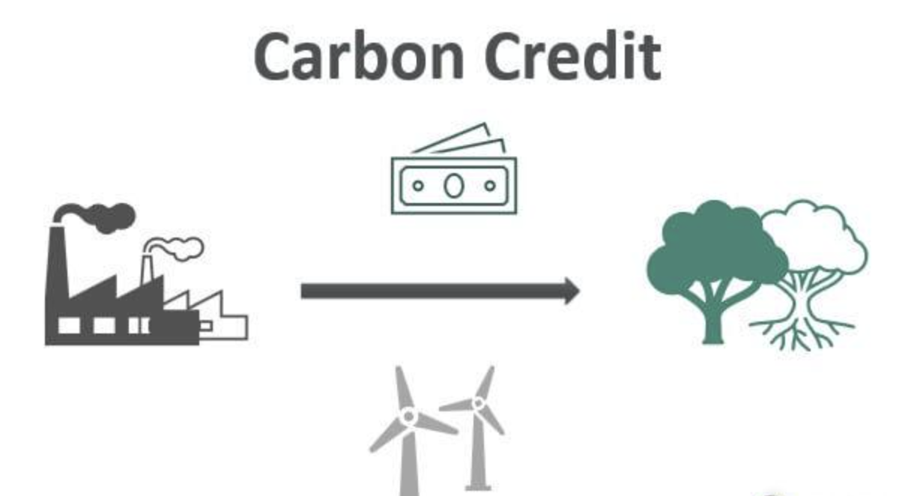

## Table of Contents

## What are carbon credits?

Carbon credits are a way to help the environment by reducing the amount of carbon dioxide and other greenhouse gases in the atmosphere. They work like a trading system where companies or countries can buy and sell credits. Each credit represents a certain amount of greenhouse gas that has been reduced or removed from the atmosphere. This system encourages businesses to pollute less because they can earn money by selling their extra credits.

The idea behind carbon credits is to make it easier and cheaper for companies to reduce their emissions. If a company finds a way to lower its emissions, it can sell the credits it no longer needs to another company that is having a harder time reducing its own emissions. This helps everyone work together to lower the overall amount of greenhouse gases in the atmosphere. It's like a team effort to make the planet cleaner and healthier.

## How do carbon credits work?

Carbon credits are like special tickets that companies can use or trade. Each credit means that one ton of carbon dioxide or other harmful gases has been taken out of the air or not put into it. Companies that make less pollution than they are allowed can get these credits. They can then sell these credits to other companies that make more pollution than they are supposed to. This way, everyone helps to keep the air cleaner.

The whole idea is to make companies want to pollute less. If a company finds a good way to cut down on its pollution, it can sell the extra credits it doesn't need. This can make them money. On the other hand, a company that has a hard time reducing its pollution can buy these credits instead of paying big fines. This system helps everyone work together to lower the amount of harmful gases in the air, making our planet a better place to live.

## Who can purchase carbon credits?

Anyone can buy carbon credits, but usually it's big companies or countries that do it. Companies buy them to meet rules about how much they can pollute. If they make too much pollution, they can buy credits to make up for it. Countries might buy them to reach their goals for reducing greenhouse gases.

Sometimes, regular people or smaller groups can also buy carbon credits. They might do this to help the environment. For example, if you fly a lot, you can buy credits to balance out the pollution from your flights. But mostly, it's big organizations that buy and trade carbon credits to help keep the air clean.

## What are the main mechanisms for trading carbon credits?

There are two main ways to trade carbon credits: the cap-and-trade system and the voluntary carbon market. In the cap-and-trade system, a government sets a limit on how much pollution companies can make. Companies get a certain number of credits, and if they pollute less than their limit, they can sell their extra credits to other companies that need them. This helps everyone work together to lower pollution.

The voluntary carbon market is different. Here, companies or people choose to buy credits even if they don't have to. They do this to help the environment or to look good to their customers. For example, a company might buy credits to show they care about the planet. These credits come from projects that reduce or remove greenhouse gases, like planting trees or using clean energy. Both systems help to make the air cleaner, but they work in different ways.

## How are carbon credits verified and validated?

Carbon credits need to be checked to make sure they are real and doing what they say. This checking is done by special groups called verifiers. These groups look at the projects that make the credits, like tree planting or clean energy projects, to see if they really take carbon out of the air or stop it from going in. The verifiers use rules and methods set by organizations like the United Nations or other big groups to make sure everything is done right. If a project passes the check, it gets a certificate saying it's good, and then the credits can be sold.

After the credits are made, they need to be watched to make sure they keep working. This is called validation. Validators keep an eye on the projects over time to see if they are still taking carbon out of the air. They might check the projects every year or every few years. If a project stops working well, the credits it made might not be worth as much anymore. This helps make sure that the credits people buy are really helping the environment.

## What are the differences between voluntary and compliance carbon markets?

The voluntary carbon market is where people or companies choose to buy carbon credits even though they don't have to. They do this to help the environment or to look good to others. For example, a company might buy credits to show they care about the planet. The credits in this market come from projects that reduce or remove greenhouse gases, like planting trees or using clean energy. The prices in the voluntary market can change a lot because it depends on how much people want to buy credits.

The compliance carbon market is different because it's set up by governments to make sure companies follow rules about pollution. In this market, a government says how much pollution companies can make, and gives them a certain number of credits. If a company makes less pollution than allowed, it can sell its extra credits to other companies that need them. This helps everyone work together to lower pollution. The prices in the compliance market can be more stable because they are tied to rules and laws.

Both markets help to make the air cleaner, but they work in different ways. The voluntary market relies on people wanting to do good, while the compliance market makes sure companies follow the law. Together, they help reduce the amount of harmful gases in the atmosphere, making our planet a better place to live.

## What are the benefits of purchasing carbon credits for businesses?

When businesses buy carbon credits, they help the environment by reducing the amount of harmful gases in the air. This can make them look good to their customers and the public. People like to support companies that care about the planet. By buying carbon credits, businesses show they are doing their part to fight climate change. This can help them build a good reputation and attract more customers who care about the environment.

Buying carbon credits can also help businesses save money. In places where there are strict rules about pollution, companies have to follow limits on how much they can pollute. If they make more pollution than allowed, they can buy credits instead of paying big fines. This can be cheaper and easier than changing their whole way of working. Plus, if a company finds a way to make less pollution, it can sell its extra credits and make some money. This gives businesses a reason to find new ways to be more eco-friendly.

## How do carbon offset projects contribute to carbon credit generation?

Carbon offset projects help make carbon credits by doing things that take carbon out of the air or stop it from going in. These projects can be things like planting trees, using clean energy like wind or solar power, or capturing carbon and storing it underground. When these projects do their job well, they get checked by special groups to make sure they are really helping the environment. If they pass the check, they get to make carbon credits. Each credit means one ton of carbon dioxide or other harmful gases has been taken care of.

These credits can then be sold to companies or people who want to help the environment or need to follow rules about pollution. When someone buys a credit, they are paying for the good work the project did. This money helps the projects keep going and do more to fight climate change. So, carbon offset projects are important because they not only help clean the air but also give businesses and people a way to join in and make a difference.

## What are the challenges and criticisms of the carbon credit system?

The carbon credit system has some big challenges. One problem is that it can be hard to make sure the credits are real and doing what they say. Some projects might not take as much carbon out of the air as they claim, or the carbon they take out might not stay out. This is called "leakage" or "impermanence." Also, it can be tough to check every project carefully because there are so many. Another challenge is that the prices of credits can go up and down a lot, especially in the voluntary market. This can make it hard for businesses to plan and know how much they need to spend.

There are also some criticisms of the carbon credit system. Some people think it lets companies keep polluting as long as they pay for it. They say it's better to just stop polluting instead of buying credits. Others worry that the system can be unfair. Rich countries or big companies can buy a lot of credits and make it harder for poorer places to get them. There's also a problem called "additionality," where a project might get credit for something it would have done anyway, even without the money from credits. These issues make some people think the carbon credit system needs to be fixed or changed to really help the environment.

## How can the effectiveness of carbon credits be measured?

The effectiveness of carbon credits can be measured by looking at how much they help reduce greenhouse gases in the air. Special groups called verifiers check the projects that make the credits, like tree planting or using clean energy, to see if they really take carbon out of the air or stop it from going in. These groups use rules and methods to make sure the projects are doing what they say. If a project passes the check, it gets a certificate, and the credits it makes can be sold. This helps make sure that the credits people buy are really helping the environment.

Another way to measure the effectiveness of carbon credits is by looking at how well they help companies and countries meet their goals for reducing pollution. In places with strict rules, companies have to follow limits on how much they can pollute. If they buy credits to stay within these limits, it means the credits are helping them follow the law and keep the air cleaner. Also, if the price of credits goes up, it can show that more people want to buy them, which means more projects are working to take carbon out of the air. Together, these ways help us see if carbon credits are really making a difference in fighting climate change.

## What role do international agreements play in the carbon credit market?

International agreements are very important for the carbon credit market. They help countries work together to fight climate change. For example, the Paris Agreement is a big deal because it sets goals for countries to lower their greenhouse gas emissions. This agreement makes it easier for countries to trade carbon credits with each other. They can buy and sell credits to help reach their goals. This teamwork makes the carbon credit market stronger and helps make the air cleaner all over the world.

These agreements also set rules for how carbon credits should be made and checked. This helps make sure that the credits are real and doing what they say. For example, the United Nations has rules that say how projects should be checked and how credits should be given out. When countries follow these rules, it makes people trust the carbon credit market more. This trust is important because it makes more people and companies want to buy and sell credits, which helps lower pollution even more.

## What future developments are expected in the carbon credit market?

In the future, the carbon credit market is expected to grow a lot. More countries and companies will start using carbon credits to help fight climate change. New rules and better ways to check if credits are real will make the market stronger. Technology will also help by making it easier to keep track of how much carbon is being taken out of the air. This could mean more people and companies will want to buy and sell credits, making the market bigger and more important.

There might also be new kinds of projects that make carbon credits. For example, more work on capturing carbon and storing it underground could become popular. Also, new ways to use nature, like planting more trees or protecting forests, could be used more often. As people learn more about how to fight climate change, the carbon credit market will keep changing and growing to help make the planet cleaner and healthier.

## References & Further Reading

[1]: Ellerman, D., Joskow, P., & Harrison, D. (2003). ["Emissions Trading in the U.S.: Experience, Lessons, and Considerations for Greenhouse Gases."](https://globalchange.mit.edu/publication/13922) Pew Center on Global Climate Change.

[2]: Stavins, R. (2008). ["A Meaningful U.S. Cap-and-Trade System to Address Climate Change."](https://scholar.harvard.edu/files/stavins/files/helr_cap_trade_stavins.pdf) The Journal of Economic Perspectives, 18(3), 19-32.

[3]: Newell, R. G., Pizer, W. A., & Raimi, D. (2013). ["Carbon Markets 15 Years after Kyoto: Lessons Learned, New Challenges."](https://www.aeaweb.org/articles?id=10.1257/jep.27.1.123) Annual Review of Resource Economics, 5(1), 317-344.

[4]: European Union, (2020). ["The EU Emissions Trading System (EU ETS)."](https://www.eea.europa.eu/publications/the-eu-emissions-trading-system-1/download) European Commission.

[5]: Bushnell, J., Chong, H., & Mansur, E. (2013). ["Profiting from Regulation: Evidence from the European Carbon Market."](https://www.aeaweb.org/articles?id=10.1257/pol.5.4.78) American Economic Journal: Economic Policy, 5(4), 78-106.

[6]: California Air Resources Board. ["Cap-and-Trade Program."](https://ww2.arb.ca.gov/our-work/programs/cap-and-trade-program) 

[7]: United Nations Climate Change. ["Article 6 of the Paris Agreement."](https://unfccc.int/files/meetings/paris_nov_2015/application/pdf/paris_agreement_english_.pdf) 

[8]: Nakamoto, S. (2008). ["Bitcoin: A Peer-to-Peer Electronic Cash System."](https://nakamotoinstitute.org/library/bitcoin/) White Paper. (Blockchain relevance in carbon markets)

[9]: Narula, N., Schnabl, P., & Shin, H. S. (2022). ["Digital Currencies: A Battle for Balance."](https://pubmed.ncbi.nlm.nih.gov/32216125/) (Insight into digital advancements such as blockchain in trading systems)