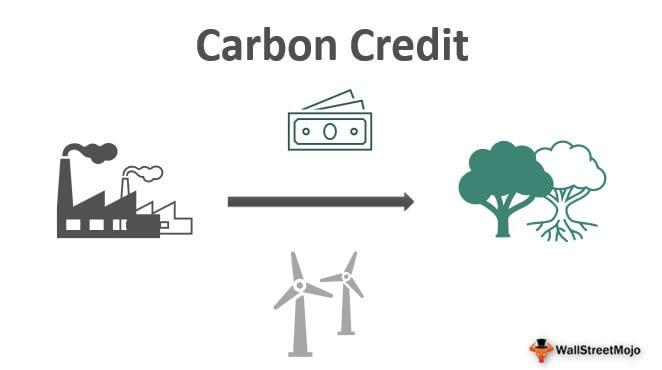

Emission reduction, carbon credits, and carbon trading are pivotal components in the global effort to mitigate climate change. Emission reduction refers to efforts to decrease the output of greenhouse gases (GHGs), primarily carbon dioxide (CO2), which are a significant driver of global warming. To achieve substantial emission reductions, various initiatives, technologies, and regulatory frameworks are employed across different sectors of the economy.

Carbon credits are tradable certificates representing the right to emit one ton of carbon dioxide or the equivalent amount of another greenhouse gas. These credits are earned by organizations that engage in practices or technologies that reduce carbon emissions below a specified baseline. Companies that exceed their emission limits can purchase carbon credits from those who have successfully reduced their emissions, thereby incentivizing environmentally friendly practices.

Carbon trading, often facilitated through a cap-and-trade system, is a market-driven approach to controlling pollution by providing economic incentives for reducing emissions. In a cap-and-trade system, a regulatory authority sets a limit or cap on the amount of pollution allowable. Companies then receive or purchase emission allowances, which they can trade with one another as needed. This approach encourages companies to innovate and invest in clean technologies, as they can profit from selling excess allowances if they reduce emissions.

These mechanisms play a crucial role in addressing climate change by creating financial incentives for emission reductions and encouraging the development of cleaner technologies. By putting a price on carbon, carbon trading helps to internalize the environmental cost of carbon emissions, thereby promoting more sustainable industrial practices.

Algorithmic trading, an advanced form of trading in various financial markets, is emerging as a transformative force within carbon markets. It involves using computer programs with complex algorithms to execute trades at high speeds and volumes. In carbon markets, algorithmic trading can enhance efficiency by improving liquidity, reducing transaction costs, and providing greater market transparency. This technological application facilitates smoother market operations and more accurate price discovery, which can lead to more effective carbon pricing and trading strategies.

Overall, emission reduction, carbon credits, and carbon trading are interlinked tools that play a fundamental role in global climate change mitigation strategies. Integrating sophisticated technologies such as algorithmic trading into carbon markets has the potential to boost their effectiveness, paving the way for a more sustainable future.

## Table of Contents

## Understanding Emission Reduction and Carbon Credits

Emission reduction refers to the process of curbing the amount of greenhouse gases (GHG) released into the atmosphere. These reductions are crucial in mitigating the effects of climate change, which is primarily driven by increased levels of GHGs such as carbon dioxide (CO2), methane (CH4), and nitrous oxide (N2O). Various strategies, including enhancing energy efficiency, transitioning to renewable energy sources, and adopting sustainable agricultural practices, contribute to emission reductions.

Carbon credits are a key mechanism in controlling GHG emissions. A carbon credit represents a permit that allows the holder to emit one tonne of carbon dioxide or an equivalent amount of other GHGs. These credits are awarded to entities that engage in activities that reduce emissions or enhance carbon sequestration, such as afforestation or implementing clean technology projects. The fundamental purpose of carbon credits is to create a financial incentive for companies and organizations to reduce their emissions. This system operates on the principle that the cost of purchasing carbon credits should encourage the reduction of emissions at the source, thereby contributing to overall environmental conservation efforts.

One of the most prominent systems involving carbon credits is the cap-and-trade system. Introduced in the 1990s as a market-based approach to controlling pollution, cap-and-trade sets a maximum permissible limit ("cap") on emissions for certain sectors or regions. Companies or entities receive or purchase emission allowances that equal the cap, and can then trade these allowances in the market. The cap is typically reduced over time, promoting a gradual decrease in total emissions. Emissions trading under this system allows companies that can reduce emissions more cheaply to sell their excess allowances to those facing higher costs, achieving an overall cost-efficient reduction in emissions. The European Union Emissions Trading System (EU ETS), launched in 2005, is a notable example of a cap-and-trade program and represents one of the first large-scale attempts to price carbon.

Cap-and-trade has expanded globally, becoming a pivotal component in efforts to limit climate change. Its historical background is rooted in the 1997 Kyoto Protocol, where market-based mechanisms were first formally recognized as tools for emission reduction on an international scale. Despite its widespread adoption, cap-and-trade systems face challenges such as setting appropriate caps and preventing market manipulation, requiring continuous refinement and oversight. However, their ability to harness market dynamics to achieve environmental goals makes cap-and-trade and carbon credits essential instruments in the global strategy to combat climate change.

## Mechanics of Carbon Trading

Carbon trading, a pivotal element in carbon markets, operates by allowing entities to buy and sell permits to emit carbon dioxide or other greenhouse gases. This system provides a market-driven approach to controlling emissions by setting a cap on allowable emissions. Entities that reduce their emissions below the cap can sell their excess allowances to companies that exceed theirs, thus incentivizing reduction efforts.

### Framework of Carbon Markets

The framework of carbon markets is predominantly built around the cap-and-trade system. This mechanism involves setting a limit, or cap, on total emissions allowed from all participating entities. The government or a governing body issues a finite number of permits corresponding to the cap total, which companies can then trade as needed.

Moreover, carbon markets can be voluntary or compliance-based. Compliance markets are established by national or international regulations, requiring organizations in certain industries to obtain allowances or credits to compensate for their emissions. Voluntary markets, on the other hand, cater to companies and individuals seeking to offset their carbon footprint beyond regulatory requirements. 

### Economic Incentives for Companies

The economic incentives for companies to engage in carbon trading are considerable. By participating, companies potentially lower their operational costs through either trading or reducing emissions to sell excess credits. This adaptability to varying economic conditions fosters a cost-effective method of meeting regulatory requirements. Furthermore, companies that actively reduce emissions may improve their brand image and align better with shareholder and consumer expectations concerning environmental responsibility.

Carbon trading instills a financial perspective into emission reductions, effectively converting carbon savings into financial gains or costs. Let's consider an example: 

If a company generates 100,000 tons of CO₂ emissions annually and the cap is set at 90,000 tons, the company must either buy credits for 10,000 tons or reduce their emissions. Suppose the market price for credits is $25 per ton, potentially costing $250,000. However, if emission reduction measures cost less than this, it becomes financially favorable for the company to invest in such measures.

### Successful Examples of Carbon Trading Systems

The European Union Emissions Trading System (EU ETS) and California's Cap-and-Trade Program exemplify successful implementations of carbon trading systems. 

**European Union Emissions Trading System (EU ETS)**: Launched in 2005, the EU ETS is the world's first and largest carbon market. It covers more than 11,000 power stations and industrial plants in 31 countries, as well as airlines. The system has successfully reduced emissions in the covered sectors by about 35% between 2005 and 2019.

**California's Cap-and-Trade Program**: Initiated in 2012, California's program is a central element of its climate policy, aiming to reduce greenhouse gas emissions to 1990 levels by 2020, a goal met four years early. The program covers approximately 85% of the state's emissions, setting a precedent for sub-national carbon trading systems.

Both systems demonstrate how regional and collaborative approaches to carbon trading can drive meaningful environmental change, providing a model for other regions and countries aiming to implement similar strategies.

Through carbon trading, companies are encouraged to view emission reductions not just as a regulatory burden but as an economic opportunity, thereby fostering innovative eco-friendly practices and contributing to broader climate change mitigation efforts.

## The Role of Algorithmic Trading in Carbon Markets

Algorithmic trading, sometimes known as algo trading, refers to the use of computer programs and algorithms to execute trades based on predefined strategies. It is widely used in financial markets, including equities, commodities, and foreign exchange, for its ability to process large volumes of data at speeds unattainable by human traders. Algorithms can evaluate multiple market conditions simultaneously, optimizing the execution of trades by determining optimal timing, price, and [volume](/wiki/volume-trading-strategy). These algorithms capitalize on minor market fluctuations and can be designed to perform a variety of trading strategies, such as [arbitrage](/wiki/arbitrage), [market making](/wiki/market-making), and [trend following](/wiki/trend-following).

Incorporating [algorithmic trading](/wiki/algorithmic-trading) into carbon markets can potentially enhance [liquidity](/wiki/liquidity-risk-premium) and transparency. Carbon markets are structured as cap-and-trade systems, where carbon credits are bought and sold. The use of algorithms can facilitate real-time pricing by consistently matching buyers and sellers, enhancing market efficiency. Algorithmic trading can enable market participants to act swiftly on new information, thereby reducing bid-ask spreads and improving market depth. Additionally, it can help manage the [volatility](/wiki/volatility-trading-strategies) which often characterizes carbon markets, especially during periods of regulatory change or rapid shifts in supply and demand dynamics.

The integration of algorithmic trading in carbon trading systems offers several notable benefits. By increasing market liquidity, algorithms help stabilize prices, making the carbon credits more appealing to a broader range of investors. Improved transparency through visible and recorded trades instills greater confidence among market participants. Moreover, the automation aspect reduces the likelihood of human error, thereby minimizing transaction costs and operational risks. In terms of scalability, algorithmic platforms can handle increased trading volumes efficiently, crucial for the expanding global carbon markets.

However, the implementation of algorithmic trading in carbon markets is not without challenges. One significant concern is the risk of market manipulation through high-frequency trading ([HFT](/wiki/high-frequency-trading-strategies)) strategies, which could lead to 'flash crashes'—rapid, deep, and volatile price changes detrimental to market stability. The complexity of developing algorithms that accurately respond to dynamic market conditions necessitates significant investment in technology and skills. Furthermore, ensuring robust regulatory frameworks is essential to prevent potential misuse and maintain market integrity. Regulatory bodies face the challenge of crafting rules that strike a balance between fostering innovation and ensuring market protection.

Adopting algorithmic trading in carbon markets requires careful consideration of these challenges. Nonetheless, the potential benefits such as improved efficiency and market expansion underscore the importance of integrating advanced technological solutions into environmental and financial strategies. As carbon markets continue to evolve, algorithmic trading will likely play a pivotal role in shaping their future dynamics.

## Case Studies and Current Initiatives

Case studies of carbon trading initiatives worldwide provide invaluable insights into the operational dynamics of this market-based approach to reducing greenhouse gas emissions. Two standout examples include the European Union Emissions Trading System (EU ETS) and the California Cap-and-Trade Program. Both initiatives have been instrumental in shaping global carbon markets and offer significant lessons for future endeavors.

The EU ETS, established in 2005, is one of the world's largest carbon trading systems, covering more than 11,000 power stations and industrial plants across Europe. It sets a cap on the total amount of greenhouse gases that can be emitted by the covered installations. Companies receive or buy emission allowances which they can trade with one another as needed. A crucial success [factor](/wiki/factor-investing) of the EU ETS is its ability to deliver emissions reductions at a minimal cost. According to a 2020 report by the European Environment Agency, emissions covered by the EU ETS fell by 35% between 2005 and 2019[^1^]. However, the system has faced criticisms, such as excessive allocation of free allowances and the volatility of allowance prices, which have sometimes undermined its effectiveness[^2^].

In the United States, the California Cap-and-Trade Program, launched in 2013, serves as a robust model for regional carbon markets. It covers approximately 450 businesses that account for about 85% of California’s total greenhouse gas emissions[^3^]. A distinctive feature of this program is its linkage with other markets, notably Quebec, which facilitates a broader, more integrated approach to emissions reduction. As of 2021, the program has been successful in reducing emissions by over 6% per year, on average. However, policymakers continue to grapple with challenges such as leakage, where emissions reductions within the state may lead to increases in other states[^4^].

On the international stage, the Glasgow COP26 agreements reflected the global consensus for enhancing climate action through mechanisms such as carbon markets. One notable outcome was the completion of Article 6 of the Paris Agreement, which establishes the rules for international carbon trading. This agreement is expected to foster transparency and integrity in carbon markets by preventing double-counting of emissions reductions and encouraging greater involvement from the private sector[^5^].

Innovative use cases where technology intersects with carbon markets include blockchain applications for enhancing transparency and efficiency. Blockchain can provide a decentralized ledger that improves tracking of carbon credits, thus reducing fraud and ensuring the credibility of transactions. Companies like IBM and Energy Blockchain Labs have collaborated on projects that utilize blockchain to manage carbon asset transactions, signaling a trend towards technology-driven solutions in enhancing market operations[^6^].

In conclusion, these case studies underline both the successes and ongoing challenges that characterize carbon trading initiatives globally. The integration of technological innovations, like blockchain, along with international efforts to standardize trading rules, could further enhance the effectiveness of carbon markets. Such developments are crucial in ensuring these markets not only contribute significantly to emission reductions but also operate efficiently and transparently.

[^1^]: European Environment Agency. "Trends and projections in the EU ETS in 2020."
[^2^]: European Court of Auditors. “The EU's Emissions Trading System: free allocation of allowances needed better targeting.”
[^3^]: California Air Resources Board. "Overview of ARB Emissions Trading Program."
[^4^]: Bushnell, J., Chong, H., & Mansur, E. "Profiting from Regulation: Evidence from the EU ETS."
[^5^]: United Nations Climate Change. "The Paris Agreement and related instruments."
[^6^]: "Blockchain Applications in Energy Trading: Risk and Countermeasure - IEEE Conference Publication."

## Challenges and Criticisms

Carbon credits and trading systems have been pivotal in the fight against climate change by providing economic incentives to reduce greenhouse gas emissions. However, they are subject to substantial criticisms, which undermine their credibility and effectiveness. One of the foremost concerns is the potential for greenwashing, where companies may purchase carbon credits to appear environmentally responsible without significant efforts to reduce their actual carbon emissions. Greenwashing can dilute the impact of carbon markets and lead to skepticism regarding their efficacy in achieving genuine environmental benefits.

In addition to greenwashing, carbon markets face challenges related to regulation and enforcement. The complexity and fragmentation of international carbon trading systems make it difficult to standardize regulations and ensure compliance. This inconsistency can lead to loopholes, where companies exploit regulatory discrepancies between regions to minimize their financial liabilities while failing to make real contributions to emission reductions. For example, differences in verification standards can result in inconsistency in emissions data, complicating the tracking and enforcement of carbon credit usage.

Enhancing the credibility and effectiveness of carbon trading requires a multi-faceted approach. One solution is the establishment of a robust international regulatory framework that harmonizes standards and practices across carbon markets. Such a framework could include standardized methodologies for measuring emissions, transparent reporting requirements, and consistent verification processes to ensure that carbon credits represent genuine reductions in emissions.

Furthermore, the integration of advanced technological tools could aid in overcoming these challenges. Blockchain technology, for instance, can enhance transparency and traceability in carbon markets by providing a secure and immutable ledger of transactions. This can help prevent fraudulent activities such as double counting of carbon credits and ensure that credits are unique and legitimate.

Investments in monitoring, reporting, and verification (MRV) systems are also crucial. Advanced MRV systems can provide real-time, accurate data on emissions and credit usage, facilitating better oversight and enforcement. Additionally, fostering stakeholder collaboration and sharing best practices across regions can lead to more effective implementation of carbon trading systems.

In conclusion, while carbon credits and trading systems present substantial opportunities for emission reduction, addressing criticisms such as greenwashing, and challenges in regulation and enforcement, is essential. Through the harmonization of regulations, adoption of technology-driven solutions, and improved MRV systems, the credibility and effectiveness of carbon markets can be significantly enhanced.

## Future Outlook

The carbon markets are poised for significant evolution, driven by technological advancements and policy shifts aimed at curbing climate change. As digitalization pervades this sector, it is anticipated that algorithmic trading will become a cornerstone of carbon credit markets, offering enhanced efficiency, liquidity, and transparency. Algorithmic trading, which employs complex algorithms to automate trading decisions, has already transformed traditional financial markets. Its application in carbon markets could optimize price discovery processes, reduce transaction costs, and provide real-time data analytics, making carbon credit trading more accessible to a broader range of participants.

The expansion of algorithmic trading is expected to attract increased participation from institutional and retail investors, thereby enhancing market depth. Algorithms can process vast datasets on emissions, historical trading data, and regulatory news, allowing traders to make more informed decisions. For instance, [machine learning](/wiki/machine-learning) algorithms could be developed to predict carbon credit price movements based on historical trends and climate policy updates, offering traders a competitive edge.

To prepare for these advancements, businesses and investors should focus on integrating technology with sustainability efforts. Companies can invest in carbon accounting software to better track emissions and manage carbon credits. Becoming proficient in data analytics and embracing [artificial intelligence](/wiki/ai-artificial-intelligence) solutions will be crucial to staying ahead in this rapidly evolving market. Investors should seek to understand the intricacies of carbon pricing mechanisms and the regulatory framework governing carbon markets, positioning themselves to capitalize on new trading opportunities.

Moreover, policy developments will play a vital role in shaping the future of carbon markets. Governments and international bodies are likely to enforce stricter emissions targets and enhance regulatory oversight, influencing the demand and supply dynamics of carbon credits. Successful implementation of market-based mechanisms, such as carbon taxes and cap-and-trade systems, will further spur the growth of carbon markets. Collaborative international efforts will be essential to standardize carbon market regulations, ensuring integrity and credibility.

In summary, the future outlook for carbon markets is promising, with technology serving as a catalyst for growth. Both businesses and investors need to strategically position themselves to leverage these advancements, fostering a more sustainable and efficient carbon marketplace.

## Conclusion

Emission reduction, carbon credits, and carbon trading are pivotal mechanisms in the battle against climate change. These tools serve to mitigate greenhouse gas emissions by creating financial incentives and regulatory frameworks designed to encourage sustainable practices among industries. Carbon credits allow entities to quantify and monetize their emission reductions. This system encourages emissions to be kept below a predefined cap, aligning economic interests with environmental imperatives.

The carbon trading market, through mechanisms such as cap-and-trade, allocates emission permits that can be traded, offering flexibility and cost-effective solutions for companies striving to meet their targets. These markets have seen substantial implementation in regions like the European Union and California, illustrating their viability and effectiveness in reducing emissions.

Algorithmic trading has emerged as a promising enhancement to carbon markets. By leveraging automated trading systems, liquidity, market efficiency, and transparency in carbon markets can be significantly improved. While the integration of such sophisticated trading mechanisms introduces challenges, particularly in regulation and systemic complexity, the potential benefits in terms of accuracy and scalability present a compelling case for their adoption.

Despite the progress made, carbon markets face criticisms such as the risk of greenwashing and challenges related to rigorous regulation and enforcement. Overcoming these will require continuous innovation, robust policymaking, and stringent control measures.

The future of carbon markets, supported by technological advancements and progressive policies, seems promising. Widespread implementation and acceptance offer substantial potential for the growth of both conventional and algorithmic trading within carbon credit markets, encouraging businesses and investors to adapt and evolve. Ongoing refinements in both the mechanisms and regulatory structures of carbon markets will be essential to ensure their credibility and effectiveness, securing a sustainable future in the global effort against climate change.

## References & Further Reading

[1]: Ellerman, D., Joskow, P., & Harrison, D. (2003). ["Emissions Trading in the U.S.: Experience, Lessons, and Considerations for Greenhouse Gases."](https://globalchange.mit.edu/publication/13922) Pew Center on Global Climate Change.

[2]: Stavins, R. (2008). ["A Meaningful U.S. Cap-and-Trade System to Address Climate Change."](https://scholar.harvard.edu/files/stavins/files/helr_cap_trade_stavins.pdf) The Journal of Economic Perspectives, 18(3), 19-32.

[3]: Newell, R. G., Pizer, W. A., & Raimi, D. (2013). ["Carbon Markets 15 Years after Kyoto: Lessons Learned, New Challenges."](https://www.aeaweb.org/articles?id=10.1257/jep.27.1.123) Annual Review of Resource Economics, 5(1), 317-344.

[4]: European Union, (2020). ["The EU Emissions Trading System (EU ETS)."](https://www.eea.europa.eu/publications/the-eu-emissions-trading-system-1/download) European Commission.

[5]: Bushnell, J., Chong, H., & Mansur, E. (2013). ["Profiting from Regulation: Evidence from the European Carbon Market."](https://www.aeaweb.org/articles?id=10.1257/pol.5.4.78) American Economic Journal: Economic Policy, 5(4), 78-106.

[6]: California Air Resources Board. ["Cap-and-Trade Program."](https://ww2.arb.ca.gov/our-work/programs/cap-and-trade-program) 

[7]: United Nations Climate Change. ["Article 6 of the Paris Agreement."](https://unfccc.int/files/meetings/paris_nov_2015/application/pdf/paris_agreement_english_.pdf) 

[8]: Nakamoto, S. (2008). ["Bitcoin: A Peer-to-Peer Electronic Cash System."](https://nakamotoinstitute.org/library/bitcoin/) White Paper. (Blockchain relevance in carbon markets)

[9]: Narula, N., Schnabl, P., & Shin, H. S. (2022). ["Digital Currencies: A Battle for Balance."](https://pubmed.ncbi.nlm.nih.gov/32216125/) (Insight into digital advancements such as blockchain in trading systems)