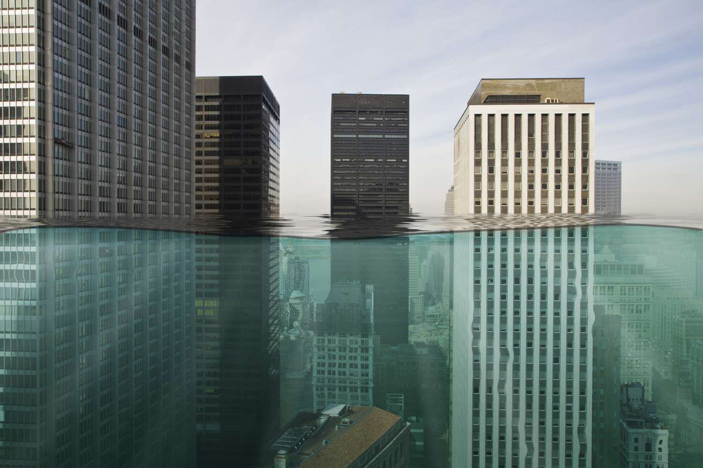

## Table of Contents

## What is a Carbon Disclosure Rating?

A Carbon Disclosure Rating is a score that shows how well a company is doing in telling people about its carbon emissions. It looks at how much a company shares about its greenhouse gas emissions and what it is doing to lower them. This rating helps investors and others see if a company is serious about fighting climate change.

Companies get their Carbon Disclosure Rating from organizations like the Carbon Disclosure Project (CDP). The CDP asks companies to fill out a questionnaire about their emissions and climate efforts. Based on the answers, the CDP gives a score. A high score means the company is open and doing a lot to reduce its carbon footprint. A low score means the company might not be doing enough or not sharing enough information.

## Why is Carbon Disclosure important for businesses?

Carbon Disclosure is important for businesses because it helps them show everyone how they are dealing with climate change. By sharing information about their carbon emissions and what they are doing to reduce them, businesses can build trust with customers, investors, and the public. People today care a lot about the environment, and they want to support companies that are doing their part to help the planet.

Also, Carbon Disclosure can help businesses find ways to save money and be more efficient. When companies look closely at their emissions, they often find areas where they can cut costs, like using less energy or finding cheaper, greener materials. Plus, being open about their efforts can attract investors who want to put their money into sustainable companies. This can lead to more business opportunities and growth.

## How is a Carbon Disclosure Rating calculated?

A Carbon Disclosure Rating is calculated by organizations like the Carbon Disclosure Project (CDP). They send a questionnaire to companies asking about their greenhouse gas emissions and what they are doing to reduce them. Companies answer these questions and send back the information. The CDP then looks at the answers and gives a score based on how much information the company shared and how good their plans are to lower emissions.

The score can be high if a company shares a lot of detailed information and has strong plans to reduce its carbon footprint. A low score means the company might not be sharing enough or their plans to reduce emissions are not very good. The rating helps people see how serious a company is about fighting climate change.

## What are the key components of a Carbon Disclosure Rating?

A Carbon Disclosure Rating looks at how well a company shares information about its greenhouse gas emissions and its plans to reduce them. This rating is given by organizations like the Carbon Disclosure Project (CDP). They send a questionnaire to companies, asking them to report on their emissions and what they are doing to lower them. The more detailed and honest the company's answers are, the higher the score they can get.

The key parts of a Carbon Disclosure Rating include how much information a company shares about its emissions. This means telling about all the greenhouse gases they produce. Another important part is the company's plans to reduce these emissions. This includes what steps they are taking and how effective these steps are. A good rating shows that a company is open about its emissions and has strong plans to fight climate change.

## Who uses Carbon Disclosure Ratings and for what purposes?

Carbon Disclosure Ratings are used by a lot of different people and groups. Investors are one big group that uses these ratings. They want to know if a company is serious about fighting climate change because they want to put their money into businesses that are good for the planet. Customers also look at these ratings because they want to buy from companies that care about the environment. Governments and non-profit organizations use these ratings too. They want to see if companies are doing their part to help with climate goals.

These ratings help people make smart choices. For investors, a high Carbon Disclosure Rating can mean a company is a good investment because it is working to lower its emissions and be more sustainable. Customers might choose to buy from a company with a good rating because they feel better about supporting businesses that are trying to help the environment. Governments and non-profits can use these ratings to push for more action on climate change and to reward companies that are doing well.

## How can a company improve its Carbon Disclosure Rating?

A company can improve its Carbon Disclosure Rating by being more open about its greenhouse gas emissions. This means sharing detailed information about how much carbon it produces and where it comes from. The more a company tells about its emissions, the better its rating can be. It's also important for the company to answer all the questions in the Carbon Disclosure Project (CDP) questionnaire carefully and completely. If the company is honest and gives a lot of information, it will likely get a higher score.

Another way to improve the rating is by having strong plans to reduce emissions. Companies should show what they are doing to lower their carbon footprint, like using less energy or switching to cleaner energy sources. These plans should be clear and show real progress. If a company can prove it is working hard to reduce emissions, its Carbon Disclosure Rating will go up. It's all about being open and showing a commitment to fighting climate change.

## What are the common standards and frameworks used for Carbon Disclosure?

The most common standard for Carbon Disclosure is the Carbon Disclosure Project (CDP). The CDP asks companies to fill out a questionnaire about their greenhouse gas emissions and what they are doing to lower them. Companies share this information, and the CDP gives them a score. A high score means a company is open about its emissions and has good plans to reduce them. Many big companies around the world use the CDP to show how they are fighting climate change.

Another important framework is the Global Reporting Initiative (GRI). The GRI helps companies report on all kinds of sustainability issues, including carbon emissions. It gives companies a set of guidelines to follow when they report their environmental impact. By using GRI standards, companies can show they are serious about being sustainable and helping the planet. Both the CDP and GRI help companies be more open about their efforts to fight climate change.

## How does Carbon Disclosure Rating impact investor decisions?

Investors look at Carbon Disclosure Ratings to see if a company is doing a good job with the environment. A high rating means a company is open about its carbon emissions and has good plans to lower them. This makes investors feel good about putting their money into that company. They think it is a smart choice because the company is working on being sustainable and helping the planet. This can make the company more attractive to investors who care about climate change.

On the other hand, a low Carbon Disclosure Rating can make investors worried. It might mean the company is not sharing enough information or not doing enough to reduce its emissions. Investors might think this company is a riskier choice because it is not taking climate change seriously. So, they might decide to invest their money in other companies that have better ratings and are doing more to help the environment.

## What are the challenges faced in achieving a high Carbon Disclosure Rating?

Getting a high Carbon Disclosure Rating can be hard for companies. One big challenge is collecting all the right information about their carbon emissions. It takes a lot of work to track and measure all the greenhouse gases a company produces. They need to look at every part of their business, from factories to offices, and even their supply chain. If they miss something or get it wrong, it can hurt their rating. Plus, they need to be very honest and open about what they find, which can be tough if the numbers are not good.

Another challenge is coming up with strong plans to lower emissions. Companies need to show they are doing something real to fight climate change. This means setting goals to reduce their carbon footprint and actually making progress towards those goals. It can be hard to find the right ways to cut emissions and to prove that what they are doing is working. If their plans are weak or they are not making enough progress, their rating will suffer. So, companies have to work hard to be both open about their emissions and effective in reducing them.

## How do Carbon Disclosure Ratings vary across different industries?

Carbon Disclosure Ratings can be different for companies in different industries. Some industries, like energy and transportation, make a lot more carbon emissions than others. These industries might have a harder time getting a high rating because their emissions are so big. They need to work extra hard to show they are trying to reduce their carbon footprint. On the other hand, companies in industries like tech or finance might find it easier to get a good rating because they usually have lower emissions to start with.

Even within the same industry, ratings can vary a lot. This depends on how open a company is about its emissions and how good its plans are to lower them. For example, two car companies might have very different ratings. One might be doing a lot to switch to electric cars and be very open about its emissions, so it gets a high rating. The other might not be doing as much and might not share as much information, so it gets a lower rating. So, it's not just about the industry, but also about what each company is doing to fight climate change.

## What role do regulatory bodies play in Carbon Disclosure Ratings?

Regulatory bodies help make sure companies are honest about their carbon emissions. They set rules that companies have to follow when they report their emissions. This means companies have to share information in a certain way and be clear about what they are doing to lower their carbon footprint. If companies don't follow these rules, they can get in trouble. So, regulatory bodies make it harder for companies to hide or lie about their emissions, which helps keep Carbon Disclosure Ratings fair and trustworthy.

Regulatory bodies also push companies to do better with their emissions. They might set goals for how much companies need to reduce their emissions over time. This can make companies work harder to get a high Carbon Disclosure Rating because they know they need to meet these goals. By setting these standards, regulatory bodies help make sure that Carbon Disclosure Ratings are not just about what companies say, but also about what they actually do to help the planet.

## How can advancements in technology enhance Carbon Disclosure Rating processes?

Technology can make it easier for companies to track and report their carbon emissions. New tools and software help companies keep better records of their greenhouse gas emissions. These tools can automatically collect data from different parts of a company, like factories and offices, and put it all together in one place. This makes it easier for companies to see where their emissions are coming from and how they can reduce them. With better data, companies can give more detailed and accurate information when they fill out the Carbon Disclosure Project (CDP) questionnaire, which can lead to a higher rating.

Also, technology can help companies find new ways to lower their emissions. For example, smart sensors can show where a company is using too much energy, so they can fix it. Artificial intelligence (AI) can look at all the data and suggest the best ways to cut emissions. These tech tools make it easier for companies to come up with strong plans to fight climate change. When companies use technology to improve their emissions data and reduction plans, it shows in their Carbon Disclosure Rating, making it easier for them to get a higher score.

## References & Further Reading

[1]: CDP. (n.d.). ["Carbon Disclosure Project."](https://www.cdp.net/en)

[2]: MSCI Inc. (n.d.). ["MSCI ESG Ratings."](https://www.msci.com/our-solutions/esg-investing/esg-ratings-climate-search-tool)

[3]: S&P Global. (n.d.). ["Dow Jones Sustainability Indices."](https://www.spglobal.com/spdji/en/indices/sustainability/dow-jones-sustainability-world-index/)

[4]: Global Reporting Initiative. (n.d.). ["Global Reporting Initiative (GRI)."](https://www.globalreporting.org/)

[5]: Task Force on Climate-related Financial Disclosures. (n.d.). ["Recommendations of the Task Force on Climate-related Financial Disclosures."](https://www.fsb.org/2017/06/recommendations-of-the-task-force-on-climate-related-financial-disclosures-2/)

[6]: Lopez de Prado, M. (2018). ["Advances in Financial Machine Learning."](https://www.amazon.com/Advances-Financial-Machine-Learning-Marcos/dp/1119482089) Wiley.

[7]: Chan, E. P. (2013). ["Algorithmic Trading: Winning Strategies and Their Rationale."](https://github.com/ftvision/quant_trading_echan_book) Wiley.

[8]: Jansen, S. (2020). ["Machine Learning for Algorithmic Trading."](https://github.com/stefan-jansen/machine-learning-for-trading) Packt Publishing.

[9]: Sustainability Accounting Standards Board. (n.d.). ["SASB Standards."](https://sasb.ifrs.org/standards/download/)

[10]: United Nations. (2015). ["Paris Agreement."](https://unfccc.int/process-and-meetings/the-paris-agreement)

[11]: Aronson, D. R. (2006). ["Evidence-Based Technical Analysis: Applying the Scientific Method and Statistical Inference to Trading Signals."](https://www.amazon.com/Evidence-Based-Technical-Analysis-Scientific-Statistical/dp/0470008741) Wiley.