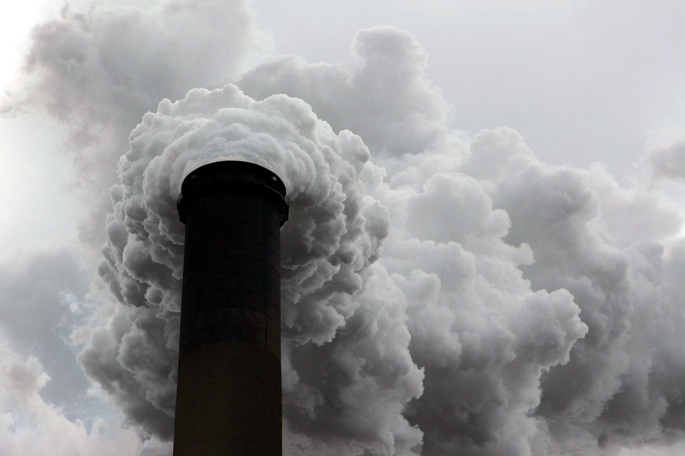

## Table of Contents

## What is a carbon tax?

A carbon tax is a fee that governments put on the burning of coal, oil, and gas. These are called fossil fuels. When people or companies burn these fuels, they release carbon dioxide into the air. Carbon dioxide is a gas that can make the Earth warmer. This is called global warming. The idea of a carbon tax is to make it more expensive to use these fuels. This can encourage people and companies to use cleaner energy instead.

The money collected from a carbon tax can be used in different ways. Some governments use it to help the environment. They might invest in renewable energy like wind or solar power. Other governments might give the money back to citizens. This is called a carbon dividend. The goal is to help people pay for the higher costs of energy. A carbon tax can help fight climate change by reducing the use of fossil fuels and encouraging greener choices.

## How does a carbon tax aim to reduce carbon emissions?

A carbon tax works by making it more expensive to burn fossil fuels like coal, oil, and gas. When these fuels are burned, they release carbon dioxide into the air. Carbon dioxide is a gas that makes the Earth warmer, which is a problem called global warming. By putting a tax on these fuels, the price to use them goes up. This means that people and companies have to pay more money if they want to keep using them. The idea is that when the price goes up, people will choose to use less of these fuels and look for cleaner options instead.

The higher cost from the carbon tax encourages people to find other ways to do things without using as much fossil fuel. For example, they might drive less, use more public transportation, or switch to electric cars. Companies might invest in renewable energy like wind or solar power to save money on the tax. By making fossil fuels more expensive, a carbon tax pushes everyone to reduce their carbon emissions and helps slow down global warming.

## What are the basic principles behind implementing a carbon tax?

The basic idea behind a carbon tax is to make it more expensive to use fossil fuels like coal, oil, and gas. These fuels release carbon dioxide when they are burned, and carbon dioxide is a gas that makes the Earth warmer. By putting a price on carbon emissions, the tax encourages people and companies to use less of these fuels. The higher cost pushes them to find cleaner ways to do things, like using renewable energy or improving energy efficiency.

The money collected from the carbon tax can be used in different ways. Some governments use it to help the environment, like investing in wind or solar power. Other governments might give the money back to citizens as a carbon dividend, which helps them pay for the higher energy costs. The main goal of a carbon tax is to reduce the use of fossil fuels and lower carbon emissions, which helps fight climate change.

## Can you explain the difference between a carbon tax and a cap-and-trade system?

A carbon tax and a cap-and-trade system are both ways to reduce the use of fossil fuels and lower carbon emissions, but they work differently. A carbon tax is simple: it puts a direct price on each ton of carbon dioxide that is released into the air when fossil fuels are burned. This makes it more expensive to use these fuels, so people and companies are encouraged to use less of them and switch to cleaner energy sources. The tax is the same for everyone, and the government decides how much to charge.

On the other hand, a cap-and-trade system sets a limit, or "cap," on the total amount of carbon emissions that are allowed. The government issues permits for each ton of carbon dioxide that can be emitted, and the total number of permits is equal to the cap. Companies can buy and sell these permits among themselves. If a company can reduce its emissions easily, it might sell its extra permits to another company that finds it harder to cut emissions. This system allows the market to decide the price of carbon, and it can be more flexible than a carbon tax.

Both systems aim to reduce carbon emissions, but they have different ways of doing it. A carbon tax is straightforward and easy to understand, but it might not guarantee a specific reduction in emissions. A cap-and-trade system can ensure a certain level of emissions reduction because of the cap, but it can be more complicated to set up and manage. Both approaches have their advantages and challenges, and different countries might choose one over the other based on their specific needs and goals.

## How are carbon tax revenues typically used by governments?

Carbon tax revenues are used by governments in different ways. One common way is to invest the money in environmental projects. This can include funding for renewable energy like wind or solar power, which helps to reduce the use of fossil fuels. Governments might also use the money to improve public transportation, plant trees, or support research into green technology. The goal is to help the environment and make it easier for people to choose cleaner options.

Another way governments use carbon tax revenues is to give the money back to citizens. This is called a carbon dividend. When people get this money, it can help them pay for the higher costs of energy that come from the carbon tax. Some governments believe that giving money back to citizens is fair because it helps everyone, especially those who might struggle with the higher costs. This approach can also make the carbon tax more popular with the public.

In some cases, governments might use the money to lower other taxes or to fund general public services. This can include things like education, healthcare, or infrastructure. The idea is that the carbon tax can help the government raise money without increasing other taxes. How the money is used can depend on what the government thinks is most important and what will help the most people.

## What are carbon offsets and how do they relate to a carbon tax?

Carbon offsets are ways to reduce or remove carbon dioxide from the air to make up for the carbon dioxide that is released by burning fossil fuels. They are like a trade-off. For example, if a company can't reduce its own emissions, it can pay for someone else to plant trees or use renewable energy instead. This helps balance out the carbon emissions that the company can't avoid.

Carbon offsets can be used along with a carbon tax. A carbon tax makes it more expensive to use fossil fuels, which encourages people and companies to use less of them. But sometimes, it's hard to cut emissions completely. That's where carbon offsets come in. Companies can pay for offsets to meet their goals for reducing carbon emissions, even if they still have to pay the carbon tax. This way, the carbon tax and carbon offsets work together to help fight climate change.

## What challenges are faced when implementing a carbon tax?

One big challenge of putting in a carbon tax is making sure it's fair. Some people worry that a carbon tax will make life harder for those who don't have a lot of money. When the price of energy goes up, it can be tough for them to pay their bills. Governments try to help by giving money back to people, but figuring out the best way to do this can be tricky. Another problem is that different countries might not agree on how much to tax carbon. If one country has a high carbon tax and another doesn't, companies might move to the country with lower taxes, which can hurt the economy.

Another challenge is making sure the carbon tax really helps the environment. If the tax is too low, it might not make a big difference in how much fossil fuel people use. But if it's too high, it could cause big problems for businesses and people. Governments have to find the right balance. Also, keeping track of who is paying the tax and making sure everyone follows the rules can be hard. This means the government needs good systems to watch over everything and make sure the carbon tax works the way it's supposed to.

## How do different countries approach the regulation of carbon taxes?

Different countries have their own ways of dealing with carbon taxes. Some countries, like Sweden, have had a carbon tax for a long time and set it pretty high. They use the money to help the environment and give some back to people. Other countries, like Canada, have a carbon tax that's different in each part of the country. If a part of Canada doesn't have its own plan to lower carbon, the country's government steps in with a set tax and gives the money back to people as a carbon dividend. This helps make sure everyone is trying to lower carbon emissions.

In some places, like the United States, there's no national carbon tax, but some states have their own. For example, California has a cap-and-trade system instead of a carbon tax, which is a different way to lower emissions. Other countries, like China, have started using a mix of carbon taxes and other rules to fight climate change. They might start with a small tax in some areas and then grow it over time. Each country tries to find a way that works best for them, thinking about what's good for the environment and what's fair for people and businesses.

## What are some successful examples of carbon tax implementation around the world?

Sweden is a good example of a country that has done well with a carbon tax. They started their tax in 1991 and set it at a high rate. This made people and businesses use less fossil fuel and switch to cleaner energy. Sweden uses the money from the tax to help the environment and gives some back to people to make it fair. Because of the tax, Sweden has lowered its carbon emissions a lot and is seen as a leader in fighting climate change.

Another successful example is British Columbia in Canada. They started their carbon tax in 2008 and made sure it was fair by giving the money back to people as a carbon dividend. This helped people pay for the higher energy costs. The tax has worked well to lower emissions without hurting the economy too much. British Columbia's approach shows that a carbon tax can be good for the environment and still be fair to everyone.

## How can the effectiveness of a carbon tax be measured?

The effectiveness of a carbon tax can be measured by looking at how much it reduces carbon emissions. Scientists and governments keep track of how much carbon dioxide is released into the air over time. If the amount goes down after a carbon tax is put in place, it shows that the tax is working. They also look at how people and companies change their behavior. If more people start using electric cars or if companies switch to renewable energy, it's a sign that the tax is encouraging cleaner choices.

Another way to measure the effectiveness is by looking at the economy. A good carbon tax should lower emissions without hurting the economy too much. Governments check if businesses are still doing well and if people can afford their energy bills. If the tax is fair and helps the environment without causing big problems, it's considered effective. Sometimes, they also look at how the money from the tax is used, like if it's helping with environmental projects or being given back to people to help them pay for the higher costs.

## What are the potential economic impacts of a carbon tax on different sectors?

A carbon tax can have different effects on different parts of the economy. For industries that use a lot of fossil fuels, like coal power plants or oil refineries, a carbon tax can make their costs go up a lot. This might make them less profitable, and they might have to raise prices or find new ways to make energy. But it can also push these industries to use cleaner energy, like wind or solar power, which could help them in the long run. For example, car makers might start making more electric cars because gas cars will cost more to run.

On the other hand, some sectors might benefit from a carbon tax. Companies that make or sell renewable energy, like solar panels or wind turbines, could see more business because people and other companies want to use less fossil fuel. Also, businesses that help people save energy, like those making better insulation or energy-efficient appliances, might do better. The government might use the money from the carbon tax to help these green industries grow, which can create new jobs and help the economy in different ways.

## What advanced strategies can be used to optimize the impact of carbon offsets within a carbon tax framework?

To make carbon offsets work better with a carbon tax, one strategy is to make sure the offsets are real and lasting. This means choosing projects that really take carbon out of the air, like planting trees or protecting forests. Governments can set up rules to check that these projects are doing what they say they will. They can also make sure that the offsets last a long time, so the carbon stays out of the air. By doing this, carbon offsets can help lower overall emissions and make the carbon tax more effective.

Another strategy is to use technology to track and improve carbon offsets. This can include using satellites or drones to watch over forest projects and make sure they are working. Smart technology can also help find new ways to remove carbon, like using machines to capture it from the air. By combining these technologies with a carbon tax, governments can make sure that the offsets are helping as much as possible. This can lead to a bigger drop in emissions and help fight climate change more effectively.

## References & Further Reading

[1]: ["Norway Energy Policy Review 2020"](https://www.oecd.org/en/publications/norway-2022-energy-policy-review_7411c642-en.html) by International Energy Agency

[2]: ["CO2 Levy and Emissions Trading Scheme"](https://en.wikipedia.org/wiki/Carbon_emission_trading) by Federal Office for the Environment, Switzerland

[3]: ["New Trends in CO2 Emissions Trading: Achievements and New Developments"](https://www.worldbank.org/en/news/press-release/2024/05/21/global-carbon-pricing-revenues-top-a-record-100-billion) edited by Wolfgang Buchholz and Dirk Rübbelke

[4]: ["Carbon Tax vs. Cap-and-Trade: Which is Better for Carbon Markets?"](https://www.lse.ac.uk/granthaminstitute/explainers/which-is-better-carbon-tax-or-cap-and-trade/) by John Holburn

[5]: ["Algorithmic and High-Frequency Trading"](https://assets.cambridge.org/97811070/91146/frontmatter/9781107091146_frontmatter.pdf) by Álvaro Cartea, Sebastian Jaimungal, and José Penalva

[6]: ["Blockchain for Climate Action and Carbon Management"](https://www.weforum.org/publications/blockchain-for-scaling-climate-action/) by Intergovernmental Panel on Climate Change (IPCC) Report

[7]: ["The Basics of Bitcoins and Blockchains"](https://bitsonblocks.net/wp-content/uploads/2018/07/the-basics-contents-draft.pdf) by Antony Lewis

[8]: ["The Value of Carbon Pricing"](https://www.worldbank.org/en/news/press-release/2024/05/21/global-carbon-pricing-revenues-top-a-record-100-billion) by The World Bank

[9]: ["Artificial Intelligence in Financial Markets"](https://link.springer.com/article/10.1007/s43546-023-00618-x) by Christian L. Dunis, Peter W. Middleton, Andreas Karathanasopolous, and Mete Feridun