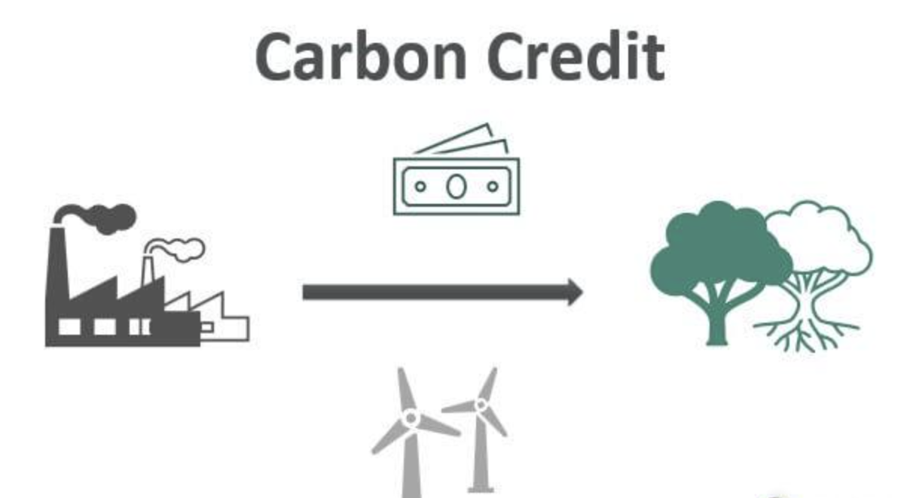

## Table of Contents

## What is carbon trading and why is it important?

Carbon trading is a system where countries or companies can buy and sell the right to emit carbon dioxide. It works like a market where the total amount of carbon that can be released into the air is limited. If a company can reduce its emissions, it can sell its unused allowances to another company that needs to emit more carbon. This helps to keep the overall amount of carbon in the atmosphere under control.

Carbon trading is important because it helps to fight climate change. By setting a limit on how much carbon can be emitted, it encourages companies to find ways to pollute less. If they can reduce their emissions, they can make money by selling their extra allowances. This system motivates everyone to work towards a cleaner environment, which is good for the planet and future generations.

## How does the basic mechanism of carbon trading work?

Carbon trading works like a game where everyone gets a certain number of tickets, called allowances, that let them release carbon into the air. The total number of tickets is set by the government or an international group, and it's less than what everyone used to use. If a company can find a way to use less carbon than what their tickets allow, they can sell the extra tickets to another company that needs more. This way, the total amount of carbon going into the air stays the same or goes down, but companies can still do business.

The idea behind carbon trading is to make it easier for everyone to help the environment. If a company can't reduce its carbon quickly, it can buy tickets from another company that has already made changes to use less carbon. This helps the planet because it encourages companies to find new ways to be cleaner and more efficient. Over time, the total number of tickets can be reduced, which means less carbon in the air overall.

## What are the main types of carbon markets?

There are two main types of carbon markets: compliance markets and voluntary markets. Compliance markets are set up by governments or international agreements. They make companies follow certain rules about how much carbon they can release. If a company goes over its limit, it has to buy more allowances from other companies that have extra. This helps keep the total amount of carbon down.

Voluntary markets are different. They are not controlled by laws. Instead, companies or people choose to buy and sell carbon credits because they want to help the environment. For example, a company might buy credits to show they care about the planet, even if they don't have to. These credits often come from projects that reduce carbon, like planting trees or using clean energy. Both types of markets help fight climate change, but in different ways.

## What is the difference between a cap-and-trade system and a carbon tax?

A cap-and-trade system and a carbon tax are two different ways to reduce carbon emissions, but they work differently. In a cap-and-trade system, the government sets a limit, or cap, on the total amount of carbon that can be released by companies. Companies get allowances to emit a certain amount of carbon, and if they emit less, they can sell their extra allowances to other companies that need more. This creates a market where the price of carbon allowances goes up and down based on supply and demand. The goal is to keep the total amount of carbon emissions under control while letting companies trade allowances to find the best way to reduce their emissions.

On the other hand, a carbon tax is simpler and more direct. The government puts a tax on each ton of carbon that companies emit. The more carbon a company releases, the more tax it has to pay. This makes it more expensive to pollute, which encourages companies to find ways to reduce their emissions to save money. Unlike cap-and-trade, a carbon tax doesn't set a limit on total emissions, but it does make companies think about the cost of their carbon emissions and try to lower them. Both systems aim to reduce carbon in the air, but they do it in different ways.

## How are carbon credits created and verified?

Carbon credits are created when someone does something to reduce or remove carbon from the air. This could be planting trees, using clean energy instead of fossil fuels, or capturing carbon and storing it underground. Each project that reduces carbon gets a certain number of credits based on how much carbon it keeps out of the air. These projects need to follow strict rules to make sure they are really helping the environment. Once a project is approved, the credits are created and can be sold to companies or people who want to offset their own carbon emissions.

To make sure carbon credits are real and effective, they need to be verified by special organizations called verifiers. These verifiers check if the projects are doing what they say they are doing and if they are really reducing carbon. They look at the project's plans, how it's being run, and the results it's getting. If everything checks out, the verifiers give the project a thumbs-up, and the carbon credits become official. This process helps make sure that when someone buys a carbon credit, it's actually helping the planet.

## What are some of the key international agreements that support carbon trading?

One important international agreement that supports carbon trading is the Kyoto Protocol. This agreement was made in 1997 and set rules for countries to reduce their greenhouse gas emissions. It created something called the Clean Development Mechanism (CDM), which lets countries in the developed world invest in projects that reduce emissions in developing countries. These projects earn carbon credits that can be traded. The Kyoto Protocol helped start the idea of carbon trading on a global scale.

Another key agreement is the Paris Agreement, which was made in 2015. It's a big deal because almost every country in the world agreed to work together to fight climate change. The Paris Agreement doesn't force countries to use carbon trading, but it encourages them to use it as a way to meet their goals for reducing emissions. It also created a system called the Sustainable Development Mechanism, which is like the CDM but is meant to help even more with sustainable development and fighting climate change. Both of these agreements have helped make carbon trading a bigger part of the fight against climate change.

## How do businesses participate in carbon trading?

Businesses participate in carbon trading by either buying or selling carbon allowances or credits. In a cap-and-trade system, a business gets a certain number of allowances from the government, which let them release a set amount of carbon into the air. If a business can find ways to use less carbon than what their allowances allow, they can sell their extra allowances to other businesses that need more. This helps the business make money and also helps the environment because it encourages everyone to find ways to pollute less.

In the voluntary market, businesses choose to buy carbon credits even if they don't have to. They do this to show they care about the environment or to meet their own goals for reducing carbon. These credits come from projects that reduce or remove carbon from the air, like planting trees or using clean energy. By buying these credits, businesses help fund projects that fight climate change, and they can tell their customers and partners that they are working to be more eco-friendly.

## What are the challenges and criticisms associated with carbon trading?

Carbon trading faces many challenges and criticisms. One big problem is that it can be hard to make sure that carbon credits are real and effective. Some projects that earn credits might not actually reduce carbon as much as they say. This is called "additionality," which means the project should do more than it would have without the credits. If projects don't meet this standard, the whole system can lose trust. Also, the rules for carbon trading can be different in different places, which makes it hard to have one big global market.

Another criticism is that carbon trading might let big polluters keep polluting if they can just buy more allowances or credits. This could slow down the fight against climate change because it doesn't push companies to change their ways as fast. Some people also worry that carbon trading focuses too much on numbers and not enough on helping the environment in other ways, like protecting nature or helping communities. These concerns show that while carbon trading can be a useful tool, it's not perfect and needs to be watched carefully to make sure it's really helping the planet.

## How has technology impacted the functionality of carbon markets?

Technology has made carbon markets work better by making it easier to keep track of carbon emissions and trade carbon credits. With computers and the internet, companies can quickly see how much carbon they are using and how many credits they have. They can also buy and sell credits online, which makes the market faster and easier to use. Special software helps check if projects that earn credits are really helping the environment, which makes the whole system more trustworthy.

Another way technology helps is by making it possible to use new tools to measure and reduce carbon. For example, satellites and sensors can keep an eye on forests and other places that store carbon. This helps make sure that projects like planting trees are working well. Also, technology like blockchain can make carbon trading more open and safe, so people can trust that the credits they buy are real and that the money goes to the right places. Overall, technology has made carbon markets more efficient and reliable.

## What recent developments have occurred in global carbon trading policies?

In recent years, there have been some big changes in global carbon trading policies. One big change happened in 2021 when the European Union made its carbon market stricter. They set a plan to lower the total number of carbon allowances each year until 2030. This means companies in the EU have to work harder to cut their emissions. Also, more countries are starting their own carbon markets. For example, China started a national carbon market in 2021, which is the biggest in the world. This shows that more places are using carbon trading to fight climate change.

Another important development is that countries are trying to connect their carbon markets. This would make it easier to trade carbon credits across different countries, which could make the whole system work better. In 2021, the United Nations started a new program called the Article 6.4 mechanism under the Paris Agreement. This program helps countries work together on carbon trading projects. These changes show that carbon trading is becoming a bigger part of how the world tries to lower carbon emissions and fight climate change.

## How do carbon trading strategies vary by region and what are the implications?

Carbon trading strategies differ a lot from one region to another because each place has its own rules and goals. In Europe, the European Union's Emissions Trading System (EU ETS) is one of the oldest and biggest carbon markets. It covers a lot of industries and has strict rules to make sure companies cut their emissions. In contrast, the United States has a mix of different state and regional systems, like California's cap-and-trade program, but there's no big national system yet. In Asia, China started its own national carbon market in 2021, which is now the biggest in the world. Each region's approach depends on its own laws, how much it wants to fight climate change, and what kind of industries it has.

These differences have big effects on how well carbon trading works around the world. When regions have different rules, it can be hard to trade carbon credits between them, which can slow down the global fight against climate change. For example, a company in Europe might find it hard to use credits from a project in Asia if the rules don't match up. But when regions work together and make their systems more similar, it can help the whole world reduce carbon emissions faster. The Paris Agreement is trying to help with this by encouraging countries to link their carbon markets and work together on projects. This could make carbon trading a stronger tool in the fight against climate change.

## What future trends and innovations are expected in carbon trading?

In the future, we might see more countries and regions joining together to make their carbon trading systems work better. This could mean setting up rules that are the same everywhere, so it's easier to buy and sell carbon credits between different places. Technology will play a big role too. For example, blockchain could make carbon trading safer and more open, so everyone can trust that the credits they buy are real. Also, new ways of measuring carbon, like using satellites, could help make sure projects are doing what they say they're doing.

Another trend might be more use of nature to fight climate change. This means more projects like planting trees or protecting wetlands, which can take carbon out of the air. These projects could earn more carbon credits, which would help the environment and give companies more ways to offset their emissions. As people learn more about how to use carbon trading to fight climate change, we might see new ideas and ways to make it work even better. This could help the world cut down on carbon faster and keep our planet healthier.

## References & Further Reading

[1]: Ellerman, A. D., & Buchner, B. K. (2007). ["The European Union Emissions Trading Scheme: Origins, Allocation, and Early Results"](https://globalchange.mit.edu/publication/14525). Review of Environmental Economics and Policy.

[2]: Sandbag. (2023). ["Understanding Carbon Markets."](https://www.msci.com/www/research-report/understanding-carbon-markets-an/05185802792)

[3]: Buttonwood, M. (2021). ["The evolution and future of carbon trading systems."](https://www.sciencedirect.com/org/science/article/pii/S1756869220000368) Economist

[4]: MacKenzie, D. (2009). ["Making things the same: Gases, emission rights and the politics of carbon markets"](https://www.sciencedirect.com/science/article/pii/S036136820800010X). Accounting, Organizations and Society.

[5]: ["Carbon Trading: How It Works and Why It Fails"](https://www.tni.org/en/publication/carbon-trading-how-it-works-and-why-it-fails) by Tamra Gilbertson and Oscar Reyes.

[6]: Benz, E., & Trück, S. (2009). ["CO2 emission allowances trading in Europe – Specifying a new class of assets"](https://www.researchgate.net/publication/27479711_CO2_Emission_Allowances_Trading_in_Europe_-_Specifying_a_New_Class_of_Assets). Springer.

[7]: ["The End of Stationarity: Searching for the New Normal in the Age of Carbon Trading"](https://books.google.com/books/about/The_End_of_Stationarity.html?id=fesrDAAAQBAJ) by Mark Schapiro