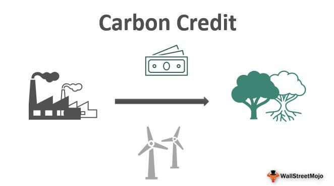

The evolving landscape of environmental policy is increasingly intertwined with market-based strategies like carbon trading, a response to the urgent need for effective tools to mitigate climate change. The concept of carbon trading, often referred to as emissions trading, lies at the heart of global efforts to reduce greenhouse gas emissions. By assigning a monetary value to carbon emissions, this mechanism incentivizes companies and countries to lower their greenhouse gas output, thus aligning economic activities with environmental objectives.

Carbon trading operates on the fundamental principle of cap-and-trade systems, where a cap is set on allowable emissions and permits are distributed that represent the right to emit a specific amount. Market participants can trade these permits, providing flexibility and economic efficiency in meeting reduction targets. This approach not only encourages the reduction of emissions but also stimulates investment in greener technologies, fostering innovation and sustainability.

In recent years, carbon trading has expanded alongside other advanced trading mechanisms, such as voluntary emissions reduction markets and algorithmic trading (algo trading). Algo trading enhances the efficiency of carbon markets by enabling rapid execution of trades and optimizing trade strategies through data management. Such integration of technology is crucial in maintaining market stability and responsiveness to environmental policies and economic signals.

Understanding these components of carbon trading, from market structures to technological involvement, is essential for navigating the complexities of climate change mitigation. By exploring the intersection of economic incentives and regulatory frameworks, this article aims to inform strategic decisions that promote sustainability and environmental stewardship in the face of global ecological challenges.

## Table of Contents

## Understanding Carbon Trading

Carbon trading, a mechanism pivotal to global climate change mitigation efforts, was established as part of the Kyoto Protocol, which came into effect in 2005. The essential idea behind carbon trading is to cap total carbon dioxide (CO2) emissions and assign specific emission allowances, commonly referred to as permits or credits, to governments and businesses. This mechanism involves the buying and selling of these permits, enabling entities to emit a predetermined amount of carbon dioxide. 

The premise of carbon trading is founded on assigning a monetary value to carbon, thereby turning emissions reduction into an economically advantageous activity. By pricing carbon, the market incentivizes companies and countries to cut down emissions, as reducing more than the allocated amount allows them to sell leftover permits for profit. This economic incentive is crucial in steering investments toward greener technologies and practices. 

There are two primary types of carbon trading systems: cap-and-trade systems and voluntary carbon markets. 

**Cap-and-Trade Systems**  
Cap-and-trade systems, formally established through regulatory frameworks, set a limit or 'cap' on the total greenhouse gas emissions allowed. Governments issue a finite number of permits equal to the cap, which can either be distributed freely or auctioned. Each permit authorizes the emission of a specific quantity of CO2 (e.g., one ton). Businesses that can reduce their emissions below their allotted level can sell their excess permits to others that need them. Over time, the cap is usually reduced, compelling overall emissions to fall and driving the demand for reduction technologies to meet more stringent limits.

**Voluntary Carbon Markets**  
In contrast, voluntary carbon markets operate outside regulatory requirements, where entities participate primarily to demonstrate climate commitment or for corporate social responsibility reasons. Here, both companies and individuals can purchase carbon credits to offset their carbon footprint voluntarily. The credits in these markets typically come from projects aimed at reducing or sequestering emissions, such as renewable energy projects, reforestation, or methane capture projects at landfills.

In summary, carbon trading stands as a significant financial incentive mechanism, fostering a transition toward lower emissions and green technology investment. By effectively placing a price on carbon, it positions economic and environmental goals in alignment, propelling societies towards sustainable advancement.

## The Functioning of Emissions Trading Programs

Emissions trading programs are pivotal in regulating and reducing greenhouse gas emissions by setting a cap on allowable emissions. This cap establishes a quantitative limit on emissions, thereby instigating demand for emission reduction strategies. By placing a monetary value on carbon, these programs create an economic framework that incentivizes companies and nations to reduce their emissions and invest in cleaner technologies.

The cornerstone of these programs is the distribution of allowances, representing the right to emit a specific amount of carbon dioxide or equivalent greenhouse gases. Allowances can be distributed using various methods, including auctions, where permits are sold to the highest bidder, and free allocation, where permits are granted based on historical emissions or specific criteria. A mixed approach may be employed, balancing economic efficiency with fairness and political acceptability.

Once distributed, these allowances can be traded in the market. Companies that emit less than their allocated amount can sell their excess allowances to other companies that exceed their emissions cap, providing a financial incentive to reduce emissions. Conversely, companies needing more permits can purchase them to comply with their emissions obligations, fostering a market-driven solution to meet environmental goals.

A key feature enhancing the appeal of emissions trading is the banking of allowances. This mechanism allows companies to save unused permits for future use, adding flexibility and encouraging long-term investment in emissions reduction technologies. However, limitations on banking may be imposed to maintain market integrity and ensure that short-term reductions are not overly deferred, which could undermine the environmental goals of the program.

The flexibility intrinsic to emissions trading programs is crucial for their success. By providing various compliance options and adapting to evolving environmental targets, these programs align economic incentives with environmental priorities. This adaptability helps ensure that emissions targets remain ambitious yet achievable, facilitating progress towards reducing global greenhouse gas emissions.

In summary, emissions trading programs offer a robust framework for managing greenhouse gas emissions through a combination of cap setting, allowance distribution, market trading, and banking mechanisms. Their success hinges on maintaining a balance between economic efficiency, equity, and environmental effectiveness, thereby supporting the transition to a more sustainable future.

## Global Agreements and the Future of Carbon Markets

International frameworks, such as the commitments made during the Glasgow Climate Change Summit, have played a pivotal role in enhancing the structure and transparency of carbon markets worldwide. These frameworks aim to build a standardized system for carbon credits, which is fundamental for fostering bilateral emissions reduction deals and establishing a United Nations-supervised marketplace. By developing these systems, international agreements facilitate the comparability and legitimacy of carbon credits across different regions, thereby promoting wider participation and trust in the market.

A universal carbon market holds vast potential for reducing emissions while simultaneously promoting sustainable economic growth. By allowing countries and companies to trade emissions permits, financial resources are channeled towards the most cost-effective reduction strategies globally, ensuring that emission reductions are achieved where they are the least expensive. This cost efficiency can stimulate broader climate mitigation investments by aligning environmental goals with economic incentives, encouraging both public and private sectors to invest in cleaner technologies and practices.

However, despite the promising advantages of a global carbon market, several challenges persist. Ensuring that these markets are fair and efficient is a complex task, compounded by the need to enforce stringent emissions reduction standards. One challenge is the potential for market manipulation or exploitation, where certain entities might gain undue advantage due to inequitable distribution of emissions permits or credits. Furthermore, the precision in measuring and verifying emissions reductions continues to be a significant concern, requiring robust mechanisms and technologies for accurate compliance and accountability.

The future of carbon markets also depends on tackling these challenges through innovative solutions and strong international cooperation. As these markets grow, there is a pressing need for more comprehensive regulatory frameworks and transparent monitoring systems to sustain their integrity and efficacy. Through collaborative efforts, it is hoped that the global carbon market will not only contribute to substantial emissions reductions but also align with broader sustainability targets, thereby offering a tangible pathway to mitigate climate change on a global scale.

## The Role of Algo Trading in Carbon Markets

Algorithmic trading, commonly referred to as algo trading, is increasingly being adopted within carbon markets due to its efficiency and speed. This advanced form of trading involves the use of algorithms to automate and optimize the trading of carbon credits, thus enhancing market operations. By handling large volumes of data and executing trades based on pre-set rules, algo trading improves [liquidity](/wiki/liquidity-risk-premium) and market stability, which are crucial for the efficient functioning of carbon markets.

Algo trading's ability to process vast datasets allows traders to respond quickly to market fluctuations, optimizing trade strategies in a dynamic environment. For example, traders can use algorithms to predict price movements and execute trades instantly, reducing the lag time associated with manual trading. This capability is particularly beneficial in carbon markets, where prices can be volatile due to policy changes or shifting environmental priorities.

Moreover, algo trading promotes market stability by facilitating the execution of numerous small trades instead of a few large ones, thereby minimizing price impact and maintaining a smoother price formation process. This feature is important for maintaining the trust of market participants and ensuring that the market remains attractive for new entrants.

Despite its advantages, the integration of algo trading in carbon markets is not without challenges. The potential for heightened market [volatility](/wiki/volatility-trading-strategies) due to high-frequency trading is a concern, as rapid trading can exacerbate price swings. Furthermore, ethical considerations also arise, such as ensuring that trading strategies do not unfairly disadvantage certain market participants or perpetuate existing inequalities.

To address these challenges, it is essential to establish a robust regulatory framework that can govern the application of algo trading in carbon markets. This framework should emphasize transparency, fairness, and the minimization of systemic risks. In addition, advancements in financial technology (fintech) play a pivotal role in refining carbon trading operations. Technologies such as [machine learning](/wiki/machine-learning) and [artificial intelligence](/wiki/ai-artificial-intelligence) can enhance the predictive accuracy of trading algorithms, leading to more informed decision-making processes and better environmental outcomes.

In conclusion, while [algorithmic trading](/wiki/algorithmic-trading) offers significant benefits for carbon markets by enhancing efficiency and liquidity, its successful integration requires careful consideration of associated risks and ethical implications. Continuing to advance fintech and strengthening the regulatory framework will be critical in leveraging algo trading's full potential to achieve more sustainable and effective carbon market operations.

## Challenges and Criticisms of Carbon Trading

Carbon trading, while a critical mechanism for reducing greenhouse gas emissions, is not without its challenges and criticisms. Despite its potential to incentivize emission reductions, the system can be exploited by certain countries or companies, leading to several significant concerns.

One primary criticism is the inequality in permit distribution. The allocation of carbon permits or allowances often varies significantly between countries and industries, leading to disparities. Wealthier nations or companies may obtain a larger share of permits, allowing them to continue emitting while smaller or developing entities struggle with stricter limits. This imbalance can undermine the original intention of equitable emissions reductions worldwide.

Another critical issue is the complexity of accurately measuring and verifying emissions reductions. The integrity of carbon trading systems relies heavily on precise and transparent tracking of carbon credits. However, discrepancies can arise due to the methodologies used in calculating emissions, which may lead to inaccurate reporting. This complexity is exacerbated by the lack of standardized protocols across different regions and sectors, casting doubt on the effectiveness of the system in achieving genuine emissions cuts.

Critics also argue that carbon trading can lead some entities to prioritize profit over genuine environmental benefits. The commodification of carbon allows some market participants to focus on trading carbon credits solely for financial gain rather than implementing substantial changes to reduce emissions. This phenomenon can create a situation where emissions reductions exist more in theory than in practice, as companies exploit loopholes to meet compliance without making meaningful operational changes.

Addressing these issues requires robust regulatory frameworks and transparent monitoring systems. Governments and organizations must work together to establish clear rules and standards that ensure fair and efficient market operations. Effective regulation should aim to prevent abuse and ensure that emissions reductions are both verifiable and impactful. This involves not only improving measurement techniques but also enhancing accountability and enforcement measures.

Ongoing debates highlight the necessity of balancing economic incentives with meaningful ecological impact. The success of carbon trading depends on creating a system where economic growth and environmental sustainability coexist. Policymakers must focus on refining market mechanisms to enhance their effectiveness and integrity, ensuring that carbon trading contributes significantly to the fight against climate change.

## Conclusion

Carbon trading serves as a critical instrument in the global effort to curb emissions and promote sustainable practices. It occupies a central role by aligning economic incentives with environmental objectives, enabling industries and nations to reduce their carbon footprint effectively. However, to fully realize its potential, carbon trading systems must navigate a complex landscape of regulatory challenges and opportunities for innovation. 

As the world progresses toward more ambitious climate targets, the future of carbon trading hinges on the successful integration of advanced technologies and international collaboration. Such advancements can improve market efficiency, transparency, and scalability, thus facilitating more significant emissions reductions. The incorporation of blockchain technology, for instance, offers promising enhancements in traceability and verification of carbon credits, thereby addressing issues related to fraud and misreporting. Moreover, algorithmic trading could streamline operations, allowing for quicker and more informed trading decisions.

Engagement with carbon and emissions trading mechanisms is essential for stakeholders aiming to contribute to a sustainable future. Educational initiatives, transparent governance, and effective policy frameworks can foster greater understanding and participation across sectors. By leveraging these tools, stakeholders can make informed strategic decisions that align with both economic and ecological benefits.

Ultimately, the success of carbon trading in combating climate change will depend on society's collective commitment to refining these systems. Continuous improvement through innovative practices and regulatory oversight will be necessary to balance economic growth with ecological preservation. This collaborative effort is vital to achieving the broader goal of sustainable development and ensuring a healthier planet for future generations.

## References & Further Reading

[1]: Ellerman, A. D., & Buchner, B. K. (2007). ["The European Union Emissions Trading Scheme: Origins, Allocation, and Early Results"](https://globalchange.mit.edu/publication/14525). Review of Environmental Economics and Policy.

[2]: Sandbag. (2023). ["Understanding Carbon Markets."](https://www.msci.com/www/research-report/understanding-carbon-markets-an/05185802792)

[3]: Buttonwood, M. (2021). ["The evolution and future of carbon trading systems."](https://www.sciencedirect.com/org/science/article/pii/S1756869220000368) Economist

[4]: MacKenzie, D. (2009). ["Making things the same: Gases, emission rights and the politics of carbon markets"](https://www.sciencedirect.com/science/article/pii/S036136820800010X). Accounting, Organizations and Society.

[5]: ["Carbon Trading: How It Works and Why It Fails"](https://www.tni.org/en/publication/carbon-trading-how-it-works-and-why-it-fails) by Tamra Gilbertson and Oscar Reyes.

[6]: Benz, E., & Trück, S. (2009). ["CO2 emission allowances trading in Europe – Specifying a new class of assets"](https://www.researchgate.net/publication/27479711_CO2_Emission_Allowances_Trading_in_Europe_-_Specifying_a_New_Class_of_Assets). Springer.

[7]: ["The End of Stationarity: Searching for the New Normal in the Age of Carbon Trading"](https://books.google.com/books/about/The_End_of_Stationarity.html?id=fesrDAAAQBAJ) by Mark Schapiro