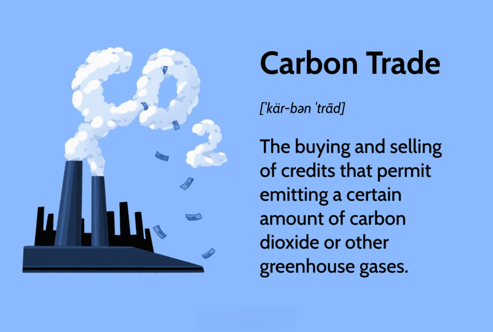

Climate change is an urgent global issue that affects ecosystems across the planet. This environmental challenge has heightened the pressing need for effective mechanisms to manage and reduce greenhouse gas emissions. In response, carbon markets and carbon trading have become pivotal strategies for mitigating the impact of climate change.

Carbon trading, also known as emissions trading, is a market-based approach devised to control pollution by providing economic incentives for reducing emissions. This system operates on the principle of assigning a monetary value to carbon emissions, encouraging companies and organizations to adopt cleaner practices. By integrating emissions allowances within a market framework, carbon trading aims to create a fiscal reward system that motivates entities to limit their environmental footprint.

This article aims to provide a comprehensive examination of carbon markets, carbon trading, and emissions trading, emphasizing the emerging role of algorithmic trading (algo trading) in these systems. We'll explore how carbon trading functions, assess the advantages and criticisms it faces, and understand how technology can enhance the efficiency of trading practices. These insights are essential for evaluating the potential of carbon markets to effectively combat climate change and encourage sustainable development.

Understanding these concepts is crucial not only for policymakers but also for businesses and stakeholders in the environmental sector. By adopting a market-based approach, carbon trading endeavors to align economic growth with environmental responsibility, promoting a future where sustainable practices are integral to global economic systems. As technology increasingly influences market dynamics, its role in shaping carbon markets is expected to become even more significant, reinforcing the transition towards greener economies.

## Table of Contents

## Understanding Carbon Markets and Carbon Trading

Carbon markets serve as platforms for the exchange of carbon credits, which are permits allowing entities to emit a specific amount of carbon dioxide or other greenhouse gases (GHGs). These markets are instrumental in the global strategy to mitigate climate change by establishing a monetary value on carbon emissions, thereby offering financial incentives for emission reductions. 

The primary working principle of carbon trading is known as the cap-and-trade system. Under this system, a governing body sets a cap on the total allowable emissions for a certain period. Companies are allotted or can purchase emission permits or credits. If a company emits less than its share, it can sell its remaining allowances to other companies requiring more, creating a financial reward for those who pollute less. 

This market-based approach to controlling emissions was initially successful in the 1990s when emissions trading schemes contributed to a significant reduction in sulfur dioxide emissions, leading to the development of similar frameworks for carbon emissions control. The formula guiding cap-and-trade can be visualized as:

$$
\text{Total Emissions} = \sum (\text{Allowed Emissions}_i - \text{Permit Sales}_i + \text{Permit Purchases}_i)
$$

Emissions trading systems have been bolstered by international agreements such as the Kyoto Protocol and the Paris Agreement, which have drawn global attention to climate change and the need for cooperative action. The Kyoto Protocol introduced the concept of binding emission reduction targets for industrialized countries, setting the stage for a global carbon market. The Paris Agreement further emphasized voluntary commitments and introduced mechanisms for crediting reductions across borders, underscoring a collective movement towards sustainable development.

In essence, carbon markets and trading mechanisms incorporate economic and environmental strategies designed to make pollution control efforts more efficient and cost-effective. Through these systems, firms are motivated not only by regulatory compliance but also by the prospect of financial gain through responsible environmental stewardship.

## Advantages and Disadvantages of Carbon Trading

Carbon trading is often promoted as an efficient market-driven mechanism to motivate companies to reduce their greenhouse gas emissions. One significant advantage is its ability to provide a cost-effective means for emissions reduction. By assigning a price to carbon emissions, companies are financially incentivized to invest in cleaner technologies and improve their energy efficiency. This economic incentive can drive innovation and lead to the development of sustainable practices that might not otherwise be economically viable.

Additionally, carbon trading systems can generate substantial revenue for governments. Funds collected from auctioning emission permits can be reinvested into further climate mitigation endeavors, research, and development of green technologies. This creates a cyclical benefit, where the gains from carbon trading feed back into further reducing emissions, thereby promoting a greener economy.

However, this approach is not without criticisms. Opponents argue that carbon trading schemes might offer only a limited solution to reducing emissions. The caps set on emissions within these schemes can sometimes be too lenient, resulting in negligible impact on actual emissions reductions. This leniency might create a scenario where companies opt to purchase additional allowances rather than invest in reducing their emissions.

Monitoring and transparency are also significant concerns within carbon trading systems. Effective oversight is crucial to ensure accurate reporting of emissions reductions and prevent the misreporting or manipulation of data. Without stringent checks and balances, companies might exploit loopholes, undermining the goals of emission control measures.

Furthermore, the effectiveness of carbon trading is contingent on broad and active participation across industries and regions. Variability in standards and regulations can lead to inconsistencies in how emissions reductions are implemented and measured globally. Harmonizing these standards is challenging but necessary to ensure that carbon trading serves its intended purpose effectively. These discrepancies highlight the challenges faced in creating a cohesive and universally effective carbon market framework. 

In summary, while carbon trading offers notable economic and environmental benefits, addressing its criticisms will be crucial for it to realize its potential as a tool for combating global climate change.

## Regional Carbon Trading Markets

Various regions globally have initiated carbon markets, each employing distinct mechanisms and regulations to manage carbon credit trading effectively. Such markets play a crucial role in reducing greenhouse gas emissions and transitioning towards sustainable economic models.

The European Union Emissions Trading System (EU ETS) stands as one of the most established frameworks globally, setting a benchmark for carbon markets. Launched in 2005, it covers power and heat generation, energy-intensive industry sectors, and intra-EU aviation. The EU ETS follows a cap-and-trade principle, where a cap is set on the total amount of certain greenhouse gases that can be emitted by installations covered by the system. Companies receive or buy emission allowances, which they can trade with one another as needed. This system aims to reduce emissions cost-effectively and serves as a critical tool for the EU to meet its climate goals under international agreements[1].

In Asia, China's national emissions trading scheme, which commenced operations in 2021, is poised to become the largest globally. It initially targets the power sector, covering over 2,200 power plants and accounting for more than 4 billion tonnes of carbon emissions annually. China's scheme is a critical component of the country's strategy to achieve carbon neutrality by 2060. It is expected to expand to include other sectors, thus contributing significantly to global emissions reduction efforts[2].

North America presents diverse examples of regional carbon trading systems. California's cap-and-trade system, established in 2012, is a prominent initiative that integrates with the Western Climate Initiative. This collaboration between California and Canadian provinces like Quebec demonstrates an inter-state and cross-border approach to emissions reduction. The program sets a statewide limit on greenhouse gas emissions and allows trading of emission permits. By fostering cooperation across regions and leveraging market-based solutions, these initiatives underscore the strategic importance of carbon markets in addressing climate challenges[3].

These regional initiatives illustrate a growing recognition of the essential role carbon markets play in enabling the transition to greener economies. They reflect a collective commitment to integrating economic and environmental considerations to address climate change effectively.

### References
1. European Commission. (n.d.). EU Emissions Trading System (EU ETS). Retrieved from https://ec.europa.eu/clima/policies/ets_en
2. International Energy Agency. (2021). China’s emissions trading scheme takes shape – Analysis. Retrieved from https://www.iea.org/articles/china-s-emissions-trading-scheme-takes-shape
3. California Air Resources Board. (n.d.). California Cap-and-Trade Program. Retrieved from https://ww2.arb.ca.gov/our-work/programs/cap-and-trade-program

## Carbon Trading Post Glasgow COP26

The Glasgow COP26 summit represented a significant milestone for global carbon trading initiatives, primarily through the finalization of Article 6 of the Paris Agreement. This article put in place a structured framework that allows for the establishment of both centralized and bilateral systems for trading carbon offset credits. Such systems are designed to foster international collaborations and facilitate countries in meeting their emissions reduction targets more efficiently.

The framework established under Article 6 articulates provisions for creating a standardized market and non-market mechanisms that enable countries to trade emissions reductions or removals. One of its key elements is the centralized mechanism, often referred to as the "Sustainable Development Mechanism," which consolidates the purchase and sale of carbon credits under unified international standards. Additionally, it allows for bilateral agreements, which provide flexibility for countries to engage in direct exchange of credits, thus enhancing cooperative action across borders.

Furthermore, the Glasgow summit introduced mechanisms that ensure equitable sharing of benefits derived from carbon trading, specifically targeting the inclusion of developing nations. A predetermined portion of revenues from carbon credit transactions is now earmarked for climate adaptation initiatives in less economically developed regions. This allocation is intended to address the climate impacts that disproportionately affect these countries, thereby promoting sustainable development and equity on a global scale.

Despite these advancements, challenges persist, notably concerning the potential oversaturation of the carbon market with older credits. These older credits, often characterized by their non-additionality or lack of stringent environmental criteria, could undermine price stability and affect the integrity of new carbon credits. Consequently, there is a pressing need to ensure robust regulatory systems that scrutinize the quality and additionality of carbon credits entering the market.

The COP26 summit also underscored the importance of technological innovation as a critical component for enhancing carbon trading systems. Establishing incentive structures that encourage the development and implementation of new technologies is integral to achieving more substantial emissions reductions. These innovations could range from advanced monitoring systems that increase transparency to digital platforms that streamline carbon trading processes.

Overall, the developments at COP26 reinforce a commitment to evolving carbon trading mechanisms that not only support emissions mitigation but also drive technological progress and economic cooperation across nations.

## The Role of Algo Trading in Carbon Markets

Algorithmic trading, often abbreviated as algo trading, utilizes computer algorithms to automate trading processes. Its application has significantly transformed financial markets by enabling the swift execution of trades, and its integration into carbon markets is beginning to show similar effects. As carbon markets grow in complexity and scale, algo trading offers notable enhancements in trading efficiency by allowing high-[volume](/wiki/volume-trading-strategy) trades to be executed at incredible speeds without human intervention.

One of the primary benefits of algo trading in carbon markets is improved price discovery. By swiftly processing and reacting to market information, algo trading systems can adjust pricing more accurately, reflecting real-time market conditions. This advanced capability ensures that carbon markets become more liquid and efficient, thus providing clearer market signals which are vital for both buyers and sellers of carbon credits.

In addition to enhanced price discovery, algo trading also brings increased [liquidity](/wiki/liquidity-risk-premium) to the carbon markets. Higher liquidity facilitates smoother transactions and reduces the cost of trading. Market participants, ranging from corporations looking to offset emissions to investors seeking new financial opportunities, can optimize their trading strategies through the use of sophisticated algorithms. These strategies include [arbitrage](/wiki/arbitrage), [market making](/wiki/market-making), and [trend following](/wiki/trend-following), all of which rely on identifying patterns and exploiting them faster than humanly possible.

However, the growth of algo trading in carbon markets does not come without challenges. One major concern is the potential for increased market [volatility](/wiki/volatility-trading-strategies). The speed at which trades are executed by algorithms can sometimes exacerbate market fluctuations, particularly if multiple algorithms react to the same market signals simultaneously. This phenomenon can lead to sudden spikes or drops in carbon credit prices, sometimes deterring traders looking for stable investment opportunities.

Moreover, the automation of trading strategies through algorithms necessitates stringent regulatory oversight. Regulatory bodies must ensure that trading practices do not manipulate market conditions or lead to unfair advantages among participants. The design and implementation of transparent and dynamic regulatory frameworks could mitigate risks associated with algorithm-driven market activities.

As carbon markets continue their evolution, the integration of algo trading is expected to become even more critical. The technology's ability to streamline market operations and adapt to the rapidly changing landscape makes it a key component in managing market dynamics. With the increasing demand for efficient and transparent trading systems, algo trading will likely play an essential role in the future development of carbon markets, helping to balance economic growth with the urgent need for emissions reduction.

## The Future of Carbon Markets and Trading

As climate change concerns intensify, carbon markets are poised to expand, incorporating more economic sectors and regions worldwide. This anticipated expansion underscores the need for innovative solutions to address existing challenges and improve the efficacy of carbon markets. A key technological development in this regard is the adoption of blockchain technology. Blockchain offers the potential to enhance transparency and efficiency in tracking and verifying carbon credit transactions. By providing an immutable and distributed ledger, blockchain can ensure the authenticity of carbon credits and eliminate the risk of double counting, which has been a significant issue in carbon trading.

For carbon markets to function effectively, a holistic approach is necessary. This involves not only technological innovation but also policy harmonization and stakeholder engagement. Harmonized policies across regions can minimize discrepancies and promote a level playing field, making it easier for companies to participate in carbon markets regardless of their geographic location. Simultaneously, engaging key stakeholders—such as governments, corporations, and NGOs—can help align interests and goals, fostering collaborations that are crucial for the success of carbon markets.

The balance between serving as an effective emissions reduction tool and sustaining economic growth is critical for the success of global carbon markets. This balance requires the careful calibration of market mechanisms to ensure that they provide sufficient incentives for emissions reductions without imposing excessive costs on businesses. 

As the landscape of carbon trading evolves, its role in combating climate change remains significant. The continued development and refinement of carbon markets and trading systems, bolstered by technological advances and policy support, will be pivotal in reducing greenhouse gas emissions globally and promoting sustainable development. The integration of advanced technologies and collaborative policies represents the future of carbon markets and trading, with the potential to significantly contribute to global climate objectives.

## References & Further Reading

[1]: European Commission. (n.d.). ["EU Emissions Trading System (EU ETS)."](https://climate.ec.europa.eu/eu-action/eu-emissions-trading-system-eu-ets_en) Retrieved from European Commission.

[2]: International Energy Agency. (2021). ["China’s emissions trading scheme takes shape – Analysis."](https://www.iea.org/reports/global-energy-review-2021) Retrieved from International Energy Agency.

[3]: California Air Resources Board. (n.d.). ["California Cap-and-Trade Program."](https://ww2.arb.ca.gov/our-work/programs/cap-and-trade-program) Retrieved from California Air Resources Board.

[4]: Stokes, L.C., & Mildenberger, M. (2020). ["The Politics of Carbon Markets: Climate Change and Finance."](https://direct.mit.edu/glep/article/20/4/4/95068/Prisoners-of-the-Wrong-Dilemma-Why-Distributive) Cambridge University Press.

[5]: Ellerman, A.D., Joskow, P.L., & Harrison, D. (2003). ["Emissions Trading in the U.S.: Experience, Lessons, and Considerations for Greenhouse Gases."](https://globalchange.mit.edu/publication/13922) Pew Center on Global Climate Change.