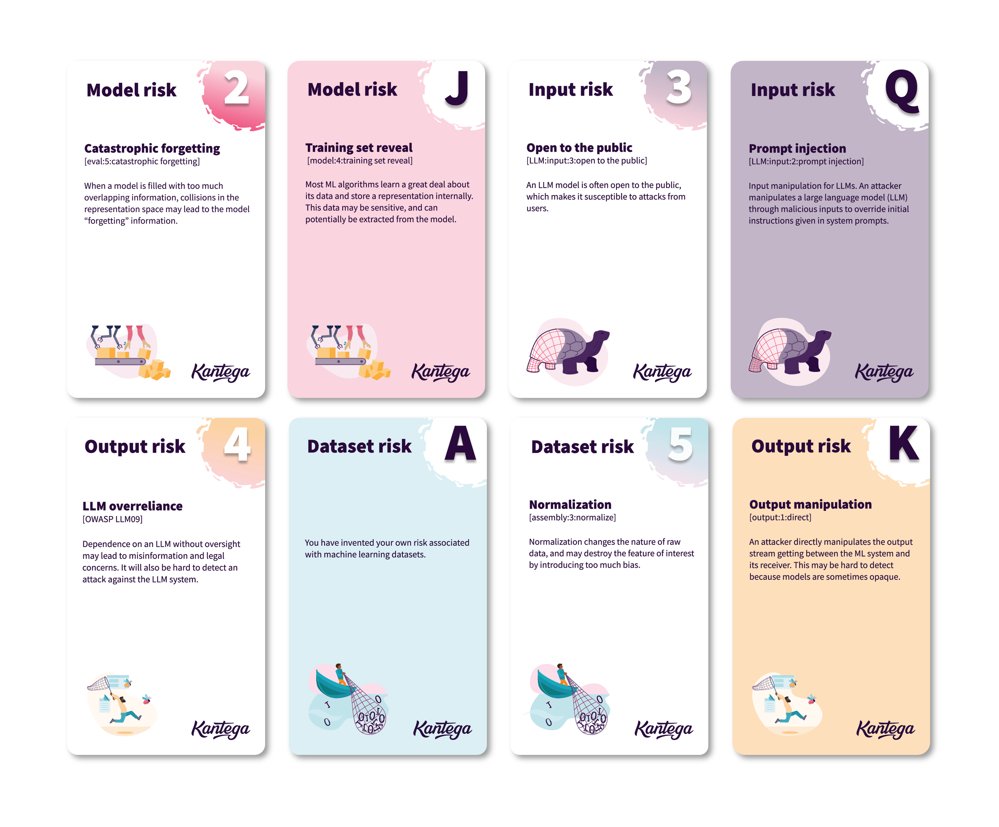

## Table of Contents

## What is a card game model in the context of machine learning?

In the context of machine learning, a card game model refers to a type of simulation or algorithm designed to mimic the strategies and outcomes of playing card games. These models use machine learning techniques to predict the best moves or outcomes based on the current state of the game. For example, a model might analyze the cards in a player's hand, the cards that have been played, and the rules of the game to decide the next best move. This can be useful for creating AI opponents in video games or for studying game theory and strategy.

To build such a model, data scientists typically use reinforcement learning, where the model learns by playing many games and receiving feedback on its performance. Over time, the model improves its strategy by adjusting its actions based on the rewards or penalties it receives. For instance, if the model makes a move that leads to a win, it will learn to favor similar moves in the future. This process can be represented mathematically, where the goal is to maximize a reward function $$R(s, a)$$ that depends on the current state $$s$$ and the action $$a$$ taken by the model.

## How does a beginner start learning about card game models?

To start learning about card game models, a beginner should first get familiar with the basics of card games and their rules. Playing different card games can help you understand the strategies involved and what makes a good move. Once you have a good grasp of these games, you can begin to think about how a computer might play them. This involves learning about algorithms and basic programming. You might start with simple games like Blackjack or War, which have fewer rules and are easier to model.

Next, you should learn about [machine learning](/wiki/machine-learning), especially [reinforcement learning](/wiki/reinforcement-learning), which is commonly used in card game models. Reinforcement learning is a type of [artificial intelligence](/wiki/ai-artificial-intelligence) where the computer learns by trying different actions and getting feedback. For example, if the computer makes a move that leads to winning, it will learn to do that move more often. You can find many online courses and tutorials that explain reinforcement learning in simple terms. Once you understand the basics, you can start experimenting with small projects. For instance, you might write a simple program that plays a card game and improves its strategy over time. This will help you see how the theory works in practice.

To get hands-on experience, you can use programming languages like Python, which has many libraries that make it easier to build and train machine learning models. Libraries like TensorFlow or PyTorch can be useful for more advanced projects. As you practice, you'll learn how to use formulas like the reward function $$R(s, a)$$ to guide the computer's decisions. The reward function helps the model know if it's doing well or not. By combining your knowledge of card games with these programming skills, you'll be on your way to understanding and creating card game models.

## What are the basic components of a card game model?

A card game model in machine learning has several basic components that work together to mimic how the game is played. The first component is the game state, which includes all the information about the current situation, like the cards each player has and the cards that have been played. The model uses this information to decide what move to make next. Another important part is the action space, which is all the possible moves the model can choose from. For example, in a game of Poker, the action space might include actions like "bet," "call," or "fold." The model looks at the game state and picks the best action from the action space.

The second key component is the reward function, which tells the model if it's doing well or not. The reward function $$R(s, a)$$ depends on the current game state $$s$$ and the action $$a$$ the model takes. If the action leads to winning the game, the reward is high, and if it leads to losing, the reward is low. The model learns by trying different actions and seeing which ones lead to higher rewards. Over time, it gets better at choosing actions that help it win. The last component is the learning algorithm, which is usually a type of reinforcement learning. This algorithm helps the model update its strategy based on the rewards it gets. By adjusting its actions to maximize the reward function, the model improves its gameplay.

To put these components into practice, you might write a simple program that plays a card game. Here's a basic example in Python using reinforcement learning:

```python
import random

class CardGameModel:
    def __init__(self):
        self.state = None
        self.action_space = ['play', 'pass']
        self.q_table = {}

    def get_state(self):
        # This function would return the current game state
        return self.state

    def choose_action(self, state):
        if state not in self.q_table:
            self.q_table[state] = {action: 0 for action in self.action_space}
        return max(self.q_table[state], key=self.q_table[state].get)

    def update_q_table(self, state, action, reward, next_state):
        if next_state not in self.q_table:
            self.q_table[next_state] = {action: 0 for action in self.action_space}
        current_q = self.q_table[state][action]
        next_max_q = max(self.q_table[next_state].values())
        new_q = current_q + 0.1 * (reward + 0.9 * next_max_q - current_q)
        self.q_table[state][action] = new_q

    def play_game(self):
        state = self.get_state()
        action = self.choose_action(state)
        # Simulate the game and get the next state and reward
        next_state, reward = self.simulate_game(state, action)
        self.update_q_table(state, action, reward, next_state)
        self.state = next_state

    def simulate_game(self, state, action):
        # This function would simulate the game and return the next state and reward
        next_state = random.choice(['win', 'lose'])
        reward = 1 if next_state == 'win' else -1
        return next_state, reward

model = CardGameModel()
for _ in range(1000):  # Train the model over many games
    model.play_game()
```

This example shows how the model uses the game state, action space, reward function, and a learning algorithm to improve its gameplay over time.

## How do card game models use reinforcement learning?

Card game models use reinforcement learning to get better at playing the game. In reinforcement learning, the model learns by trying different moves and seeing what happens. If a move helps the model win, it remembers that move and tries it more often. If a move leads to losing, the model learns to avoid it. The model keeps playing many games, and each time it gets a little better. This is done using a reward function, which is like a score that tells the model how well it did. The reward function $$R(s, a)$$ depends on the current game state $$s$$ and the action $$a$$ the model takes. If the action leads to winning, the reward is high, and if it leads to losing, the reward is low.

To make this work, the model uses a learning algorithm that updates its strategy based on the rewards it gets. This algorithm helps the model figure out which moves are good and which are bad. Over time, the model adjusts its actions to maximize the reward function, which means it gets better at choosing moves that help it win. For example, in a simple card game model, the model might start by choosing moves randomly. But as it plays more games and gets feedback, it learns to choose better moves. This process continues until the model becomes very good at the game.

## What is DouZero and how does it relate to card game models?

DouZero is a computer program that plays card games really well. It was made by some smart people at a company called ByteDance. DouZero is good at playing games like Dou Dizhu, which is a popular card game in China. What makes DouZero special is that it uses a type of machine learning called reinforcement learning to get better at the game. This means it learns by playing the game over and over, trying different moves, and figuring out which ones work best. It keeps track of how well it does with something called a reward function, which is like a score that tells it if it's winning or losing. The reward function helps the model know if it's doing well or not. For example, if the model makes a move that leads to winning, the reward is high, and if it leads to losing, the reward is low. This helps DouZero get better at the game over time.

DouZero is a good example of how card game models work. These models use the same kind of reinforcement learning to play games like Poker or Blackjack. They look at the cards they have and the cards that have been played, and then they choose the best move based on what they've learned. Just like DouZero, these models use a reward function to guide their decisions. The reward function $$R(s, a)$$ depends on the current game state $$s$$ and the action $$a$$ the model takes. If the action leads to winning, the reward is high, and if it leads to losing, the reward is low. By playing many games and adjusting their actions based on the rewards they get, these models can become very good at playing card games.

## How can one implement a simple card game model using Python?

To implement a simple card game model in Python, you can use reinforcement learning. Start by creating a class that represents the game. This class should have methods to get the current game state, choose an action, update the model's knowledge based on the reward, and play the game. The game state could be something simple like the cards each player has, and the actions might be things like "play" or "pass." You'll also need a reward function to tell the model if it's doing well or not. The reward function $$R(s, a)$$ depends on the current game state $$s$$ and the action $$a$$ the model takes. If the action leads to winning, the reward is high, and if it leads to losing, the reward is low.

Here's a basic example of how you might write this in Python:

```python
import random

class SimpleCardGameModel:
    def __init__(self):
        self.state = None
        self.action_space = ['play', 'pass']
        self.q_table = {}

    def get_state(self):
        # This function would return the current game state
        return self.state

    def choose_action(self, state):
        if state not in self.q_table:
            self.q_table[state] = {action: 0 for action in self.action_space}
        return max(self.q_table[state], key=self.q_table[state].get)

    def update_q_table(self, state, action, reward, next_state):
        if next_state not in self.q_table:
            self.q_table[next_state] = {action: 0 for action in self.action_space}
        current_q = self.q_table[state][action]
        next_max_q = max(self.q_table[next_state].values())
        new_q = current_q + 0.1 * (reward + 0.9 * next_max_q - current_q)
        self.q_table[state][action] = new_q

    def play_game(self):
        state = self.get_state()
        action = self.choose_action(state)
        # Simulate the game and get the next state and reward
        next_state, reward = self.simulate_game(state, action)
        self.update_q_table(state, action, reward, next_state)
        self.state = next_state

    def simulate_game(self, state, action):
        # This function would simulate the game and return the next state and reward
        next_state = random.choice(['win', 'lose'])
        reward = 1 if next_state == 'win' else -1
        return next_state, reward

model = SimpleCardGameModel()
for _ in range(1000):  # Train the model over many games
    model.play_game()
```

This code shows a simple card game model that uses reinforcement learning to improve its gameplay over time. The model starts by choosing actions randomly, but as it plays more games and gets feedback, it learns which actions lead to winning and tries those more often. By adjusting its actions to maximize the reward function, the model gets better at choosing moves that help it win.

## What are the challenges in training card game models?

Training card game models can be tricky because there are so many different things the model needs to think about. For example, the model has to keep track of all the cards in the game, what each player has, and what has been played. It also needs to guess what other players might do next. This makes the game state really complicated, and it can be hard for the model to figure out the best move. Plus, card games often have rules that change depending on what's happening, so the model has to learn to adapt to these changes. All of these things together make it a challenge to train the model to play well.

Another challenge is that card games can take a long time to play, and the model needs to play many, many games to learn well. Each game gives the model a little bit of feedback through the reward function $$R(s, a)$$, which tells it if it's doing well or not. But because each game can be different, it can take a lot of time for the model to see all the possible situations and learn from them. Also, the model needs to balance exploring new moves to see if they work and sticking with moves it knows are good. This balance is important but hard to get right, and it can slow down the learning process.

## How do advanced techniques like Monte Carlo Tree Search enhance card game models?

Monte Carlo Tree Search (MCTS) helps card game models get better by looking at many possible moves and [picking](/wiki/asset-class-picking) the best one. It does this by building a tree of all the possible game states and then using random playouts to see which moves lead to winning more often. This way, the model can explore a lot of different paths without having to play out every single game. MCTS is really good at handling the uncertainty in card games, like not knowing what cards other players have. By simulating many games, the model can make smarter choices and improve its strategy over time.

Using MCTS can make a big difference in how well a card game model plays. For example, in games like Poker, where you need to guess what other players might do, MCTS can help the model figure out the best move based on what it thinks might happen next. The model uses the reward function $$R(s, a)$$ to see how well it did in each simulation. If a move leads to winning in many simulations, the model will choose that move more often. This helps the model learn faster and play better, even in complex games where there are a lot of different things to think about.

## What role does neural networking play in card game models like DouZero?

Neural networks help card game models like DouZero get better at playing games. They do this by learning patterns from lots of game data. In DouZero, the [neural network](/wiki/neural-network) looks at the current state of the game, like the cards each player has, and decides what move to make next. It does this by figuring out which moves have worked well in the past and trying to use that knowledge to make smart choices. The neural network uses the reward function $$R(s, a)$$ to see how well it did. If a move leads to winning, the reward is high, and if it leads to losing, the reward is low. This helps the neural network learn which moves are good and which are bad.

In DouZero, the neural network is trained using reinforcement learning. This means it plays the game over and over, trying different moves and seeing what happens. Each time it plays, it gets a little better at choosing the right moves. The neural network helps DouZero understand the game better by recognizing patterns and making predictions about what might happen next. This makes DouZero very good at playing card games like Dou Dizhu, because it can use what it has learned to make smart decisions during the game.

## How can card game models be evaluated and compared?

To evaluate and compare card game models, you can look at how well they play the game. One way to do this is by running many games and seeing how often each model wins. You can also check how quickly the model learns to play better. This can be done by tracking the model's performance over time and seeing how fast it improves. Another important thing to look at is how the model handles different situations in the game. For example, you might see how well it does when it has a good hand versus a bad hand. By comparing these things, you can figure out which model is better at playing the game.

Another way to compare card game models is by looking at how they use their reward function $$R(s, a)$$. The reward function tells the model if it's doing well or not, based on the game state $$s$$ and the action $$a$$ it takes. If one model has a better reward function, it might learn faster and make better choices. You can also compare how the models use techniques like reinforcement learning or neural networks. For example, a model like DouZero uses neural networks to learn patterns and make predictions, which can help it play better. By looking at all these things, you can see which model is the best at playing card games.

## What are the latest advancements in card game models beyond DouZero?

Since the development of DouZero, there have been several advancements in card game models. One notable advancement is the use of more sophisticated neural network architectures, such as deep neural networks, to better understand and predict game dynamics. These models can process more complex game states and make more accurate predictions about future moves. For instance, researchers have started using techniques like deep reinforcement learning, which combines [deep learning](/wiki/deep-learning) with reinforcement learning to improve the model's ability to learn from large amounts of data. This approach has led to models that can play a wider variety of card games and adapt to new situations more effectively.

Another advancement is the integration of advanced search algorithms like Monte Carlo Tree Search (MCTS) with neural networks. This combination, known as AlphaZero-style algorithms, has shown promising results in games like Poker and Bridge. These models use the reward function $$R(s, a)$$ to guide their decision-making, where $$s$$ represents the current game state and $$a$$ is the action taken by the model. By simulating many possible game scenarios and learning from the outcomes, these models can improve their strategies more quickly and make better decisions during gameplay. These advancements have significantly enhanced the performance of card game models, making them more competitive and versatile.

## How can experts contribute to the field of card game models in machine learning?

Experts can contribute to the field of card game models in machine learning by developing new algorithms and techniques that improve the models' performance. They can work on refining reinforcement learning methods, like using more advanced neural network architectures to better understand game dynamics. For example, they might explore deep reinforcement learning to process complex game states and make more accurate predictions about future moves. Experts can also experiment with integrating search algorithms like Monte Carlo Tree Search (MCTS) with neural networks, which has shown great success in games like Poker and Bridge. By doing this, they help the models learn faster and make better decisions during gameplay, using the reward function $$R(s, a)$$ to guide their choices based on the current game state $$s$$ and the action $$a$$ taken by the model.

Another way experts can contribute is by sharing their findings and collaborating with others in the field. They can publish research papers, participate in conferences, and contribute to open-source projects to spread knowledge and foster innovation. For instance, they might develop and share new code libraries or tools that others can use to build and test their own card game models. By working together, experts can push the boundaries of what's possible in card game models, making them more competitive and versatile. This collaborative effort helps the entire field move forward, leading to better models that can play a wider variety of card games and adapt to new situations more effectively.

## References & Further Reading

[1]: Sutton, R. S., & Barto, A. G. (2018). ["Reinforcement Learning: An Introduction."](https://web.stanford.edu/class/psych209/Readings/SuttonBartoIPRLBook2ndEd.pdf) MIT Press.

[2]: Silver, D., Schrittwieser, J., Simonyan, K., Antonoglou, I., Huang, A., Guez, A., ... & Hassabis, D. (2017). ["Mastering the game of Go without human knowledge."](https://www.nature.com/articles/nature24270) Nature, 550(7676), 354-359.

[3]: Mnih, V., Kavukcuoglu, K., Silver, D., Rusu, A. A., Veness, J., Bellemare, M. G., ... & Hassabis, D. (2015). ["Human-level control through deep reinforcement learning."](https://www.nature.com/articles/nature14236) Nature, 518(7540), 529-533.

[4]: Brown, N., & Sandholm, T. (2017). ["Libratus: The Superhuman AI for No-Limit Poker."](https://www.science.org/doi/10.1126/science.aao1733) In Proceedings of the Twenty-Sixth International Joint Conference on Artificial Intelligence (IJCAI-18), 5226-5233.

[5]: ["Introduction to Machine Learning in Python: A Guide for Data Scientists"](https://www.amazon.com/Introduction-Machine-Learning-Python-Scientists/dp/1449369413) by Andreas C. Müller and Sarah Guido.

[6]: Tesauro, G. (1995). ["Temporal difference learning and TD-Gammon."](https://dl.acm.org/doi/10.1145/203330.203343) Communications of the ACM, 38(3), 58-68.

[7]: ["Deep Learning"](https://en.wikipedia.org/wiki/Deep_learning) by Ian Goodfellow, Yoshua Bengio, and Aaron Courville.

[8]: ["Playing Atari with Deep Reinforcement Learning"](https://arxiv.org/abs/1312.5602) by Mnih et al. (NIPS 2013).

[9]: ["Artificial Intelligence: A Modern Approach"](https://en.wikipedia.org/wiki/Artificial_Intelligence:_A_Modern_Approach) by Stuart Russell and Peter Norvig.

[10]: ["Reinforcement Learning: State-of-the-Art"](https://link.springer.com/book/10.1007/978-3-642-27645-3) edited by Marco Wiering and Martijn van Otterlo.