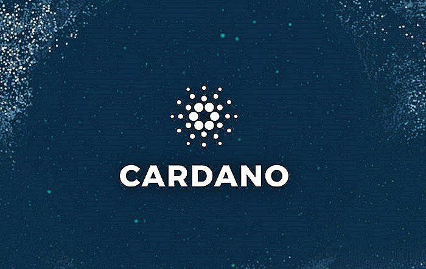

## Table of Contents

## What is Cardano and who created it?

Cardano is a type of digital money, also known as a cryptocurrency. It works on a special computer system called a blockchain, which keeps track of all the money transactions. People use Cardano to buy things or trade it like any other money. One thing that makes Cardano different is that it tries to be very safe and fair for everyone who uses it.

Cardano was created by a man named Charles Hoskinson. He used to help make another cryptocurrency called Ethereum, but then he wanted to start his own. Charles and his team worked hard to make Cardano a good and trustworthy place for people to use their money. They keep updating it to make it better and better.

## How does Cardano's blockchain technology differ from Bitcoin's?

Cardano's blockchain technology is different from Bitcoin's in a few key ways. One big difference is how they make sure transactions are safe and fair. Bitcoin uses a system called Proof of Work, where computers have to solve hard math problems to add new transactions to the blockchain. This takes a lot of energy and can be slow. Cardano, on the other hand, uses a system called Proof of Stake, which is faster and uses less energy. With Proof of Stake, people who own Cardano can help add new transactions based on how much Cardano they hold, not by solving math problems.

Another difference is how they update and improve their systems. Bitcoin's changes need to be agreed upon by most of its users, which can be hard and take a long time. Cardano has a group of experts called the Cardano Foundation, IOHK, and Emurgo who work together to make updates. They use a scientific approach, which means they do a lot of research and testing before making changes. This helps Cardano keep improving and stay safe for its users.

## What are the key features of Cardano that set it apart from other cryptocurrencies?

Cardano has a few special things that make it different from other cryptocurrencies. One big thing is how it keeps its blockchain safe and fair. Instead of using a lot of energy like Bitcoin, Cardano uses a system called Proof of Stake. This means that people who own Cardano can help add new transactions based on how much Cardano they have. It's faster and uses less energy, which is good for the environment. Another special thing is how Cardano updates and improves. It has a group of experts who do a lot of research and testing before making changes. This helps Cardano stay safe and keep getting better.

Another key feature of Cardano is its focus on being fair and inclusive. It wants to help people all over the world, even those who don't have easy access to banks. Cardano is working on ways to help with things like voting and making sure everyone can use it easily. This is different from many other cryptocurrencies that might only focus on being used for buying and selling things. Cardano also tries to work well with other systems and technologies, so it can be used in many different ways. This makes it a good choice for people who want to use [cryptocurrency](/wiki/cryptocurrency) for more than just trading.

## How does Cardano's consensus mechanism, Ouroboros, work and how does it compare to Bitcoin's Proof of Work?

Cardano's consensus mechanism is called Ouroboros, and it's a type of Proof of Stake system. In Ouroboros, people who own Cardano can become "slot leaders" and help add new transactions to the blockchain. Slot leaders are chosen randomly, but the more Cardano you own, the better your chances of being picked. This system is much faster and uses less energy than Bitcoin's Proof of Work. In Ouroboros, you don't need to solve hard math problems to add new transactions, which makes it easier on the environment and quicker for everyone.

Bitcoin's Proof of Work is different because it relies on computers solving complex math problems to add new transactions. This process, called mining, takes a lot of energy and can be slow. Miners compete to solve these problems, and the first one to solve it gets to add a new block of transactions to the blockchain and earn some Bitcoin. Because it's so competitive and energy-intensive, Proof of Work can be expensive and not very good for the environment. Ouroboros, on the other hand, is designed to be more efficient and fair, making it a big difference from Bitcoin's approach.

## What is the Cardano roadmap and what stages has it completed?

The Cardano roadmap is a plan that shows how Cardano will grow and improve over time. It is split into different stages, each with its own goals and things to do. The roadmap helps everyone see what Cardano is working on and what will happen next. It's like a big to-do list for making Cardano better and adding new features. The roadmap has five main stages: Byron, Shelley, Goguen, Basho, and Voltaire.

Cardano has already finished the first two stages of its roadmap. The Byron stage was all about getting Cardano started and making it possible for people to use it. During this stage, Cardano set up the basics of its blockchain and made it so people could buy and sell Cardano. The next stage, Shelley, was about making Cardano more decentralized. This means more people can help run the blockchain, not just a few. Shelley made it possible for anyone to become a "stake pool operator" and help add new transactions to the blockchain.

Cardano is now working on the Goguen stage, which is about adding smart contracts to the blockchain. Smart contracts are like digital agreements that can do things automatically, like moving money when certain things happen. After Goguen, the next stages will be Basho, which will focus on making Cardano faster and better, and Voltaire, which will be about letting the community help make decisions about Cardano's future. Each stage builds on the last one to make Cardano more useful and powerful.

## How does Cardano handle smart contracts and what is its programming language, Plutus?

Cardano handles smart contracts by using a special part of its blockchain called the Goguen stage. Smart contracts are like digital agreements that can do things automatically, like moving money when certain things happen. Cardano wants to make sure these smart contracts are safe and easy to use. That's why they are adding them carefully, step by step. This helps make sure everything works well and people can trust the system.

The programming language that Cardano uses for smart contracts is called Plutus. Plutus is designed to be easy for developers to use, even if they are new to making smart contracts. It's based on a language called Haskell, which is good for writing safe and reliable code. With Plutus, developers can create smart contracts that work on Cardano's blockchain. This makes it easier for people to use Cardano for all sorts of things, like running businesses or making deals with each other.

## What are the scalability solutions implemented by Cardano and how do they compare to Bitcoin's?

Cardano is working on making its blockchain faster and able to handle more transactions at the same time. This is called scalability. One way Cardano is doing this is by using something called Hydra. Hydra is like a special tool that lets the blockchain split into smaller parts, called "heads." Each head can handle its own transactions, which makes everything faster. Cardano is also looking at other ways to make things even better, like using something called sharding, which is another way to split up the work so more transactions can happen at once.

Bitcoin, on the other hand, has been working on its own ways to improve scalability. One of the main ways is by using something called the Lightning Network. The Lightning Network is like a shortcut that lets people send Bitcoin to each other quickly and cheaply without having to wait for the main blockchain to process every transaction. This helps Bitcoin handle more transactions, but it's a bit different from what Cardano is doing. While Cardano is focusing on making the main blockchain itself faster and more efficient, Bitcoin is adding an extra layer on top to help with speed. Both approaches have their own pros and cons, but they're both trying to solve the same problem of making their blockchains work better for more people.

## How does Cardano's approach to governance and decentralization differ from Bitcoin?

Cardano's approach to governance and decentralization is different from Bitcoin's because it wants to involve more people in making decisions. Cardano is working on a stage called Voltaire, which will let the community vote on changes and updates to the blockchain. This means that instead of just a few people deciding what happens, everyone who owns Cardano can have a say. This is more like a democracy, where everyone's voice matters. Cardano also uses a group of experts called the Cardano Foundation, IOHK, and Emurgo to help make sure these changes are good and safe for everyone.

Bitcoin, on the other hand, relies on a different kind of system for governance and decentralization. Bitcoin's decisions are made by a group of developers and miners who have to agree on changes. This can sometimes be slow and hard because everyone has to agree, and not everyone always wants the same thing. Bitcoin's blockchain is decentralized because many different people and computers around the world help run it, but the way they make decisions is not as open to everyone as Cardano's plan. Bitcoin's approach is more like a group of experts making choices, while Cardano wants to let everyone have a say.

## What are the environmental impacts of Cardano in comparison to Bitcoin?

Cardano is better for the environment than Bitcoin. This is because Cardano uses a system called Proof of Stake, which doesn't need a lot of energy to work. In Proof of Stake, people who own Cardano can help add new transactions to the blockchain based on how much Cardano they have. This is different from Bitcoin, which uses Proof of Work. In Proof of Work, computers have to solve hard math problems to add new transactions, and this uses a lot of energy. So, Cardano is more eco-friendly because it uses less power.

Bitcoin's high energy use comes from mining, where computers compete to solve math problems. This competition uses a lot of electricity, which can be bad for the environment. Some people even use coal or other dirty energy sources to power their mining computers, which makes it worse. Cardano doesn't have this problem because it doesn't need mining. By using less energy, Cardano helps reduce the impact on the environment and makes it a greener choice for people who care about the planet.

## How do transaction fees and processing times on Cardano compare to those on Bitcoin?

Cardano's transaction fees are usually lower than Bitcoin's. On Cardano, the fees are based on how much space your transaction takes up on the blockchain. This means you might pay just a few cents for a simple transaction. Bitcoin's fees can be higher because lots of people want to use the blockchain at the same time, and they have to pay more to get their transactions processed quickly. So, if you're sending money, Cardano is often cheaper.

Cardano's transactions also happen faster than Bitcoin's. With Cardano, a transaction can be confirmed in just a few seconds to a minute. Bitcoin's transactions can take much longer, sometimes up to an hour or more, because of the way it processes transactions. This is because Bitcoin's blockchain can get crowded, and it takes time for miners to solve the math problems needed to add new transactions. So, if you need your money to move quickly, Cardano is a better choice.

## What are the current and potential future use cases for Cardano, and how do they differ from Bitcoin's?

Cardano is designed to do more than just be a digital money like Bitcoin. It wants to help with things like voting, tracking where things come from, and making sure everyone can use it easily, even if they don't have a bank. Cardano is working on adding smart contracts, which are like digital agreements that can do things automatically. This means people can use Cardano to run businesses or make deals with each other in new ways. Cardano is also trying to help people in places where it's hard to get bank services, so it can be a tool for making the world more fair and inclusive.

Bitcoin, on the other hand, is mostly used as a digital money that people can buy, sell, and trade. Some people use it to buy things online or send money to others without needing a bank. Bitcoin is also seen as a way to store value, like gold, because people think it might be worth more in the future. While Bitcoin can be used for some smart contracts, it's not as focused on them as Cardano. Bitcoin's main job is to be a currency that works all over the world, without needing to trust banks or governments. So, while Cardano is trying to do many different things, Bitcoin is more about being a reliable digital money.

## How do expert analyses and market predictions for Cardano compare to those for Bitcoin?

Experts and market predictions often see Bitcoin as the leader in the world of cryptocurrencies. Many people think Bitcoin will keep being important because it was the first and is widely used. They say Bitcoin is like digital gold and could be worth a lot more in the future. Some experts also worry about Bitcoin's high energy use and slow transaction times, but they think these problems might be solved with new technology. Overall, Bitcoin is seen as a safe bet for people who want to invest in cryptocurrencies.

Cardano, on the other hand, is seen as a newer and more innovative cryptocurrency. Experts like that Cardano uses less energy and can handle transactions faster than Bitcoin. They also think Cardano's focus on smart contracts and helping people without bank services could make it very useful in the future. However, some experts say Cardano is riskier because it's not as well-known or used as Bitcoin. They think Cardano has a lot of potential, but it might take time for it to grow and become as popular as Bitcoin.

## References & Further Reading

[1]: Ouroboros: A Provably Secure Proof-of-Stake Blockchain Protocol - Aggelos Kiayias, Alexander Russell, Bernardo David, Roman Oliynykov (2017). [Link](https://link.springer.com/chapter/10.1007/978-3-319-63688-7_12)

[2]: Nakamoto, S. (2008). ["Bitcoin: A Peer-to-Peer Electronic Cash System."](https://nakamotoinstitute.org/library/bitcoin/)

[3]: Antonopoulos, A. M. (2017). ["Mastering Bitcoin: Unlocking Digital Cryptocurrencies"](https://books.google.com/books/about/Mastering_Bitcoin.html?id=IXmrBQAAQBAJ). O'Reilly Media.

[4]: Narayanan, A., Bonneau, J., Felten, E., Miller, A., & Goldfeder, S. (2016). ["Bitcoin and Cryptocurrency Technologies."](https://press.princeton.edu/books/hardcover/9780691171692/bitcoin-and-cryptocurrency-technologies) Princeton University Press.

[5]: ["Cardano: The Research-Driven Cryptocurrency"](https://en.wikipedia.org/wiki/Cardano_(blockchain_platform)) - IOHK research library

[6]: Lopez de Prado, M. (2018). ["Advances in Financial Machine Learning."](https://www.amazon.com/Advances-Financial-Machine-Learning-Marcos/dp/1119482089) Wiley.

[7]: Chan, E. P. (2009). ["Quantitative Trading: How to Build Your Own Algorithmic Trading Business"](https://github.com/ftvision/quant_trading_echan_book). Wiley.

[8]: Jansen, S. (2020). ["Machine Learning for Algorithmic Trading."](https://github.com/stefan-jansen/machine-learning-for-trading) Packt Publishing.