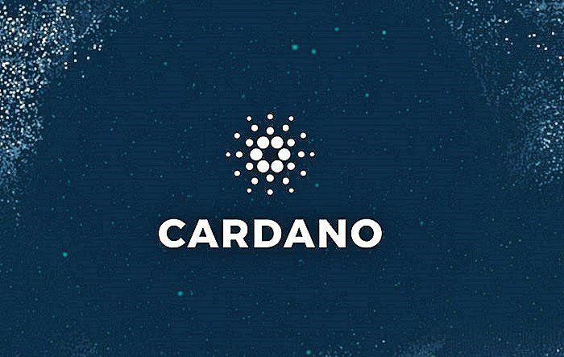

In recent years, the world of cryptocurrency has witnessed significant developments, with Cardano emerging as a key player. As a third-generation blockchain, Cardano is designed to tackle issues such as scalability, interoperability, and sustainability. This article explores the Cardano ecosystem focusing on stablecoins and algorithmic trading, crucial components in decentralized finance (DeFi). By addressing the limitations of earlier blockchain platforms through a layered architecture, Cardano offers enhanced functionality and a strong foundation for innovations in the financial sector. The platform's robust framework facilitates seamless transactions and diverse financial applications, positioning it as a versatile tool in cryptocurrency networks. As Cardano gains traction within the digital currency community, understanding its impact on stablecoins and algorithmic trading unveils its potential for influencing modern financial systems and shaping the future of digital transactions.

## Table of Contents



## Understanding Cardano: A Third-Generation Blockchain

Cardano was founded by Charles Hoskinson, who played a crucial role as a co-founder of Ethereum. This third-generation blockchain aims to address the limitations observed in previous blockchain generations, focusing on providing a more balanced and efficient ecosystem for cryptocurrencies. The primary goal is to overcome issues related to scalability, interoperability, and sustainability, which are vital for fostering a robust blockchain environment.

At the core of Cardano's technology is its unique proof-of-stake (PoS) consensus mechanism known as Ouroboros. Unlike proof-of-work (PoW) systems, which rely on energy-intensive computations for securing the network, PoS systems like Ouroboros enhance efficiency by allowing stakeholders to validate block transactions based on the number of ADA tokens they own and are willing to "stake" as collateral. This setup significantly reduces energy consumption while maintaining high-security standards.

Cardano's development is underpinned by a scientific philosophy and rigorous peer-reviewed processes. This academic approach ensures that every protocol and update undergoes thorough vetting by experts in computer science and cryptography before implementation. Such meticulous practices serve to enhance the reliability and security of the blockchain, making Cardano a forerunner in blockchain innovation.

The native cryptocurrency of the Cardano ecosystem, ADA, plays a pivotal role in maintaining the stability and operation of the platform. Holders of ADA can participate in the staking process, which not only secures the network but also offers them staking rewards as an incentive. Additionally, ADA facilitates various operations within the Cardano ecosystem, including transaction fees, financial applications, and participating in governance through voting on protocol updates and proposals.

In summary, Cardano's carefully crafted ecosystem, backed by scientific rigor and innovative consensus mechanisms, positions it as a leading platform in the cryptocurrency space, meeting modern demands with its sustainable and scalable solutions.

## The Role of Stablecoins in the Cardano Ecosystem

Stablecoins are pivotal components within the Cardano ecosystem, providing a stable asset reference point in the otherwise highly volatile [cryptocurrency](/wiki/cryptocurrency) market. They are essential for decentralized finance (DeFi) applications, where the need for price stability is critical. The Cardano platform offers several stablecoin varieties, catering to different user preferences and requirements.

One prominent offering in Cardano's stablecoin portfolio is DJED, an algorithmically overcollateralized stablecoin. DJED is designed to maintain stability through smart contracts and predefined algorithmic operations. It leverages overcollateralization, meaning it holds more collateral value than the stablecoin it generates, to cushion against price fluctuations and ensure stability. This approach mitigates the need for traditional reserve holdings, relying instead on collateral and automatic protocol adjustments to uphold its peg.

In addition to DJED, synthetic stablecoins also play a significant role in the Cardano ecosystem. One example is iUSD, developed by the Indigo Protocol. Synthetic stablecoins like iUSD are created by locking up collateral in smart contracts, allowing users to mint tokens that track USD's value. These assets enable users to gain exposure to the stability of fiat currencies while interacting with a decentralized blockchain network.

USD-backed stablecoins, such as USDM and USDA, are gaining traction among Cardano users, offering additional stability and reliability. These stablecoins are typically backed by USD held in reserve, providing a one-to-one peg with the dollar. This model offers users a familiar financial instrument's security and trust while benefiting from Cardano’s efficient blockchain infrastructure.

In summary, stablecoins are integral to Cardano's ecosystem, providing the stability needed for DeFi applications to thrive. Through a variety of approaches, including algorithmic mechanisms and explicit USD backing, Cardano's stablecoins deliver secure, reliable solutions to users, fostering a robust financial environment in an otherwise turbulent crypto landscape.

## Algorithmic Stablecoins: Innovation and Challenges

Algorithmic stablecoins have become a pivotal element in the cryptocurrency space, offering innovative solutions to achieve price stability without the necessity of traditional asset backing. Unlike conventional stablecoins, which are typically backed by reserves of fiat currency or other tangible assets, algorithmic stablecoins such as DJED utilize predefined algorithms and smart contracts to regulate the supply of the token, ensuring that it remains at a stable value relative to a reference asset, often the U.S. dollar.

The underlying mechanism of algorithmic stablecoins is centered on market incentives and supply-demand balances. Through these mechanisms, they attempt to maintain their peg by dynamically adjusting the supply of the stablecoin, either increasing or decreasing it in response to market conditions. For example, if the stablecoin's price rises above its target, the algorithm increases the supply to push the price back down, and conversely decreases the supply if the price falls below the target. These automatic adjustments are designed to occur without the need for manual intervention, providing an efficient and hands-off approach to maintain stability. This can be represented by a simple supply adjustment formula:

$$
\Delta S = k \times (P_t - P_{target})
$$

where $\Delta S$ is the change in supply, $k$ is a constant, $P_t$ is the current price, and $P_{target}$ is the target price.

While the concept and execution of algorithmic stablecoins are sophisticated, they are not without their challenges. Maintaining stable value during periods of high market [volatility](/wiki/volatility-trading-strategies) remains one of the most significant hurdles. This challenge is compounded by the impact of large-scale trading activities, speculative attacks, or unexpected market shocks, which can lead to extreme price fluctuations that are difficult for algorithmic mechanisms to stabilize swiftly and effectively.

The collapse of TerraUSD (UST) serves as a poignant example of these vulnerabilities. Despite its innovative approach, TerraUSD's failure was due in large part to a loss of confidence among users and investors, triggering a panic sell-off that overwhelmed the algorithm's ability to maintain the peg. This event underscored the importance of building robust, well-tested mechanisms and the need for comprehensive risk management strategies.

In summary, while algorithmic stablecoins like DJED offer a forward-thinking approach to digital currency stability, their success is heavily dependent on meticulous algorithm design and the ability to withstand unforeseen market circumstances. The ongoing development of these systems continues to be crucial to their future viability and acceptance in the broader financial ecosystem.

## The State of Algorithmic Trading on Cardano

Algorithmic trading on the Cardano blockchain is characterized by the deployment of sophisticated computational algorithms to execute trades at high speeds and on a large scale. This method of trading benefits substantially from Cardano's infrastructure, which is designed to offer efficiency and scalability through its unique blockchain technology.

Cardano operates on a proof-of-stake consensus mechanism known as Ouroboros, which is pivotal in enhancing transaction processing speed without compromising security. This infrastructure is particularly advantageous for [algorithmic trading](/wiki/algorithmic-trading), wherein rapid execution and minimal latency are crucial for capitalizing on market opportunities. The Cardano blockchain's layered architecture separates the computational layer from the settlement layer, enabling better handling of smart contracts and complex transactions, which are fundamental in algorithmic trading.

The tools and techniques utilized within the Cardano ecosystem for algorithmic trading are diverse. At the core are smart contracts, which automate processes and enable the execution of complex trading strategies with minimal human intervention. Cardano's native programming language, Plutus, alongside Marlowe, a specialized language for financial contracts, provides developers with robust tools to design and deploy these algorithms efficiently.

One common approach in algorithmic trading involves [arbitrage](/wiki/arbitrage), where traders attempt to profit from price discrepancies of the same asset across different markets. The low transaction fees and quick settlement times on Cardano make this strategy viable and potentially profitable. Additionally, [machine learning](/wiki/machine-learning) and statistical models are frequently employed to analyze market trends and predict future price movements, allowing traders to optimize their strategies further.

For example, a Python script using a machine learning model such as a Long Short-Term Memory (LSTM) network might be implemented to forecast the future prices of ADA, Cardano's native cryptocurrency, based on historical data and market indicators. Such models can be continuously trained on real-time data, adjusting to new conditions and refining their predictions, thereby improving the strategy's accuracy.

```python
import numpy as np
import pandas as pd
from keras.models import Sequential
from keras.layers import LSTM, Dense, Dropout
from sklearn.preprocessing import MinMaxScaler

# Load historical price data
data = pd.read_csv('ada_price_history.csv')
prices = data['Close'].values
prices = prices.reshape(-1, 1)

# Scale prices to be between 0 and 1
scaler = MinMaxScaler()
prices_scaled = scaler.fit_transform(prices)

# Prepare data for LSTM
def prepare_data(prices, time_step=60):
    X, y = [], []
    for i in range(len(prices)-time_step-1):
        X.append(prices[i:(i+time_step), 0])
        y.append(prices[i + time_step, 0])
    return np.array(X), np.array(y)

time_step = 60
X, y = prepare_data(prices_scaled, time_step)
X = X.reshape(X.shape[0], X.shape[1], 1)

# Define the LSTM model
model = Sequential()
model.add(LSTM(units=50, return_sequences=True, input_shape=(X.shape[1], 1)))
model.add(Dropout(0.2))
model.add(LSTM(units=50, return_sequences=False))
model.add(Dropout(0.2))
model.add(Dense(units=1))

# Compile and train the model
model.compile(optimizer='adam', loss='mean_squared_error')
model.fit(X, y, epochs=100, batch_size=32)

# Predict future prices
price_predictions = model.predict(X)
price_predictions = scaler.inverse_transform(price_predictions)
```

This script demonstrates the basic framework of developing a predictive model, training it with historical data, and using it to make future price predictions, thereby assisting traders in making informed decisions.

Overall, Cardano's advanced technological infrastructure, combined with cutting-edge computational methods and tools, positions it as a promising platform for sophisticated algorithmic trading operations. As the ecosystem continues to grow, more traders and developers are likely to leverage its capabilities to innovate and refine their trading strategies.

## Case Studies: Successful Stablecoins and Algorithmic Trading Strategies on Cardano

Several stablecoins have demonstrated notable resilience and functionality within the Cardano ecosystem, providing users with reliable and stable financial tools crucial for engaging in decentralized finance (DeFi). One prominent example is DJED, an algorithmic overcollateralized stablecoin developed in collaboration with COTI. This stablecoin employs a dual-coin mechanism involving a reserve coin, SHEN, to ensure price stability. DJED exemplifies how algorithmic models can offer stability without direct fiat backing, with its design allowing automatic adjustments based on smart contract protocols to maintain its peg to a specific target value, typically a fiat currency like USD.

Another significant stablecoin in the Cardano ecosystem includes iUSD, offered by Indigo, which uses synthetic assets to mirror traditional stablecoins' stability. These synthetic stablecoins leverage Cardano’s smart contract capabilities to ensure that iUSD maintains its value through overcollateralization and algorithmic adjustments. By replicating the characteristics of fiat-backed stablecoins, iUSD provides an alternative method for users seeking stability within the volatile crypto market.

Algorithmic trading strategies on Cardano have capitalized on its robust infrastructure, characterized by efficient transaction speed and scalability, thanks largely to its proof-of-stake consensus mechanism, Ouroboros. This infrastructure supports high-frequency trading applications, which require rapid execution of trades to capitalize on small price discrepancies across various trading pairs. Traders have utilized algorithmic strategies employing Cardano’s unique features, such as staking and native tokens, to optimize operations and reduce transaction costs.

A notable case study in algorithmic trading on the Cardano blockchain involves the use of smart contract-based trading bots. These bots execute trades automatically based on predefined strategies, such as arbitrage or market-making. For instance, Python libraries like CCXT (Cryptocurrency Exchange Trading Library) allow developers to programmatically access Cardano-based exchanges, enhancing efficiency and responsiveness in trading activities.

```python
import ccxt

# Example of initializing a connection to a Cardano-based exchange
exchange = ccxt.binance({
    'apiKey': 'YOUR_API_KEY',
    'secret': 'YOUR_SECRET',
})

# Generating an order book for ADA/USD
def fetch_order_book():
    order_book = exchange.fetch_order_book('ADA/USD')
    return order_book

# Example usage of the function
order_book = fetch_order_book()
print(order_book)
```

Through strategic implementation of these techniques, traders have managed to harness Cardano’s capabilities, thus increasing trading [volume](/wiki/volume-trading-strategy) and [liquidity](/wiki/liquidity-risk-premium). The success of these strategies is evident in the growing user adoption and the increasing number of trading platforms incorporating Cardano’s native assets.

In summary, Cardano’s stablecoin and algorithmic trading initiatives showcase the blockchain's potential to offer secure, efficient, and innovative financial solutions. As the ecosystem continues to flourish, these success stories provide valuable lessons and insights into leveraging Cardano's technological advancements for improved financial operations.

## Future Prospects: Stablecoins and Algo Trading in the Cardano Ecosystem

The future of stablecoins and algorithmic trading on Cardano holds significant potential as the blockchain platform continues to enhance its capabilities and attract a growing user base. As the cryptocurrency ecosystem evolves, Cardano is poised to leverage several key areas that could drive further success for stablecoins and algorithmic trading on its network.

One significant area of potential growth lies in the development of innovative stablecoin models. Cardano could lead the way in creating next-generation stablecoins that are more robust and resistant to market shocks. The incorporation of advanced algorithmic stabilization mechanisms, possibly integrating machine learning techniques to predict and adjust for market fluctuations, could offer improved stability. For example, neural networks could be employed to analyze market data trends, enabling more precise collateral adjustments and price stability.

```python
import numpy as np
from sklearn.linear_model import LinearRegression

# Example: Predictive model for stablecoin collateral adjustments
# Historical data for collateral ratio and market volatility
X = np.array([[0.1], [0.2], [0.3], [0.5], [0.6]])
y = np.array([1.5, 1.8, 2.0, 2.3, 2.7])

# Fit linear regression model
model = LinearRegression()
model.fit(X, y)

# Predict collateral adjustment for future market volatility
future_volatility = np.array([[0.4]])
predicted_collateral = model.predict(future_volatility)
print(f"Predicted Collateral Adjustment: {predicted_collateral}")
```

As regulatory frameworks develop, particularly those targeting stablecoins, Cardano may benefit from increased legitimacy and confidence among institutional investors. Clear regulatory guidelines will be essential for driving broader adoption, as they can mitigate risks associated with compliance while encouraging innovation and investment. Engaging proactively with regulators and aligning Cardano's development with evolving legal standards will likely be crucial for maintaining a competitive edge.

Growing user adoption of Cardano's ecosystem can also positively impact algorithmic trading. As more participants engage with the platform, there will be increased liquidity and opportunities for more sophisticated trading strategies. The development of tools that facilitate seamless algorithmic trading within Cardano can enhance user experiences and attract developers to create efficient bots and custom strategies.

Challenges such as ensuring scalability and interoperability will continue to be focal points for Cardano's success. The platform's ongoing research and upgrades aimed at enhancing throughput and cross-chain compatibility will be critical. Successfully addressing these challenges will allow Cardano to support the increasing demands of algorithmic trading and stablecoin transactions without compromising performance.

Lastly, the integration of emerging technologies, such as decentralized [artificial intelligence](/wiki/ai-artificial-intelligence), could amplify Cardano's role in DeFi. By incorporating AI-driven insights into trading algorithms or stablecoin mechanisms, Cardano could offer unique advantages that differentiate it from other blockchain solutions.

In conclusion, the future prospects for stablecoins and algorithmic trading on Cardano will be shaped by the platform's capacity to innovate and adapt to both technological and regulatory advancements. As Cardano continues to develop, it holds the potential to redefine the standards for stablecoin stability and algorithmic trading efficiency in the broader cryptocurrency landscape.

## Conclusion

Cardano's commitment to building a sustainable ecosystem positions it prominently within the cryptocurrency industry. The platform's focus on resolving core issues such as scalability, interoperability, and sustainability has paved the way for its unique approach to decentralized finance (DeFi). Central to this ecosystem are stablecoins and algorithmic trading, which collectively facilitate more secure and efficient financial transactions on the Cardano blockchain.

Stablecoins on Cardano offer robust solutions for market volatility, providing reliable and stable asset references crucial for DeFi applications. These stablecoins, ranging from algorithmic to fiat-backed options, enhance financial accessibility and liquidity within the ecosystem, enabling users to engage in decentralized applications with greater confidence and minimized risk.

Algorithmic trading, leveraging Cardano's scalable and efficient infrastructure, delivers high-speed and high-volume trading capabilities. The platform's state-of-the-art mechanisms support complex trading strategies, ensuring competitive advantage and optimal execution in the rapidly evolving crypto markets.

The continued success of Cardano in this competitive landscape hinges upon constant innovation and adaptation. As technological advancements and regulatory frameworks evolve, Cardano must remain agile, embracing new opportunities and addressing emerging challenges. This ongoing commitment will be crucial to sustaining its trajectory of growth and maintaining its position as a leading platform in the cryptocurrency industry.

## References & Further Reading

[1]: Hoskinson, C. (n.d.). ["Cardano: The Third-Generation Blockchain."](https://coinpedia.org/beginners-guide/what-is-cardano/)

[2]: Castro, M., & Liskov, B. (1999). ["Practical Byzantine Fault Tolerance."](https://dl.acm.org/doi/10.5555/296806.296824) OSDI.

[3]: Garratt, R., & Lee, M. (2021). ["Stablecoins: Risks, Potential Uses, and Regulation."](https://papers.ssrn.com/sol3/papers.cfm?abstract_id=3979495)

[4]: Kharif, O. (2021). ["Inside Cardano, the Blockchain That Deserves the Hype."](https://finance.yahoo.com/news/cardano-blockchain-heads-chang-hard-110000460.html)

[5]: Djed Whitepaper. (n.d.). ["A formally verified crypto-backed pegged algorithmic stablecoin."](https://eprint.iacr.org/2021/1069.pdf)

[6]: Rochard, P. (2023). ["Scalability and Technical Challenges of Blockchain Protocols."](https://www.codementor.io/blog/blockchain-scalability-5rs5ra8eej)

[7]: Christodorescu, D. & Neiger, G. (2022). ["Algorithmic Trading and Blockchain Technologies: Challenges and Opportunities."](https://www.mdpi.com/1999-5903/14/11/341)