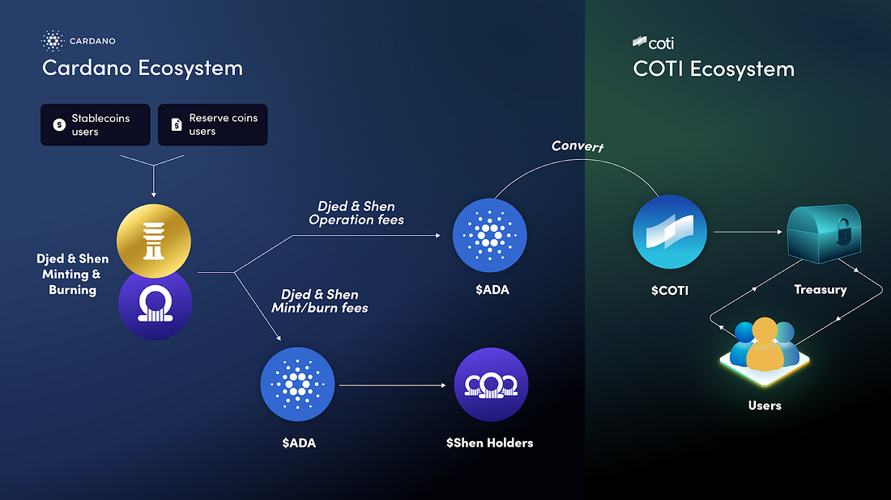

## Table of Contents

## What is Cardano and why is it important in the cryptocurrency world?

Cardano is a type of cryptocurrency, similar to Bitcoin or Ethereum, but it has some unique features that set it apart. It was created by a team led by Charles Hoskinson, one of the co-founders of Ethereum. Cardano uses a special technology called the Ouroboros protocol, which is a way to keep the network secure and running smoothly. This technology is different from the ones used by Bitcoin and Ethereum, making Cardano more energy-efficient and scalable.

Cardano is important in the cryptocurrency world because it focuses on being a platform for smart contracts and decentralized applications, much like Ethereum. However, Cardano aims to be more secure and scalable, which could make it a better choice for businesses and developers. It also puts a strong emphasis on academic research and peer-reviewed development, which means that its technology is carefully studied and improved over time. This approach could help Cardano become a leading platform for financial and other applications in the future.

## What are the main goals of Cardano in establishing a stable cryptocurrency ecosystem?

Cardano's main goals are to create a stable and secure cryptocurrency ecosystem that can be used by many people around the world. One of the key aims is to make sure that the platform is scalable, which means it can handle a lot of users and transactions without slowing down. Cardano also wants to be energy-efficient, so it uses a special technology called the Ouroboros protocol. This helps the network stay secure and work well without using too much power.

Another important goal for Cardano is to support smart contracts and decentralized applications. This means that people can use Cardano to create and run programs and services that are managed by the community, not by a single company. Cardano wants these tools to be safe and easy to use, so it focuses a lot on research and testing. By working closely with academics and experts, Cardano hopes to build a trustworthy platform that can help with things like financial services, voting systems, and more.

## How does Cardano's approach to development differ from other cryptocurrencies?

Cardano's approach to development is different from other cryptocurrencies because it focuses a lot on research and making sure everything is carefully checked. Many other cryptocurrencies might rush to add new features, but Cardano takes its time. They work with scientists and researchers to study their ideas before adding them to the platform. This means that when Cardano makes changes or adds new things, they are usually well-tested and thought out.

Another way Cardano is different is how they build their technology. They use a method called the Ouroboros protocol, which helps the network stay secure and use less energy. This is different from other cryptocurrencies like Bitcoin, which use a lot of power. Cardano also wants to make sure their platform can grow and handle many users without problems. They spend a lot of time making sure the system can scale up, which is important for a [cryptocurrency](/wiki/cryptocurrency) that wants to be used by lots of people around the world.

## What is the role of the Cardano Foundation in promoting stability?

The Cardano Foundation plays a big role in making sure Cardano stays stable and trustworthy. They help to guide the project and make sure everything is done right. The Foundation works to keep the community happy and involved. They also make sure that Cardano follows all the rules and laws, which helps to build trust with users and businesses.

Another way the Cardano Foundation promotes stability is by working with other groups and organizations. They help to spread the word about Cardano and show how it can be used in different ways. By building strong partnerships, the Foundation helps to make Cardano more reliable and widely accepted. This teamwork is important for keeping the whole system stable and growing over time.

## What are Cardano's key technological features that contribute to ecosystem stability?

Cardano uses a special technology called the Ouroboros protocol to keep its network safe and running well. This protocol is different from what other cryptocurrencies like Bitcoin use. It helps Cardano be more energy-efficient and work smoothly even when many people are using it. By using less power and being able to handle more users, Cardano can stay stable and reliable, which is important for a cryptocurrency that wants to be used by lots of people.

Another key feature of Cardano is its focus on research and testing. Before adding new things to the platform, Cardano's team works with scientists and experts to make sure everything is well thought out. This careful approach helps to avoid problems and keep the system stable. By taking their time and making sure everything is tested, Cardano can build trust with users and businesses, which is crucial for a stable ecosystem.

## How does Cardano address scalability issues to ensure a stable network?

Cardano works on making its network bigger and better so it can handle more people using it at the same time. They use something called the Ouroboros protocol, which helps the network stay strong and work well even when lots of people are using it. This is important because if too many people try to use a cryptocurrency at once, it can slow down or stop working. Cardano's way of doing things helps make sure this doesn't happen, so the network stays stable and everyone can use it easily.

To make sure the network can grow without problems, Cardano also spends a lot of time on research and testing. They work with scientists and experts to check and improve their ideas before adding them to the platform. This careful way of working helps Cardano avoid mistakes that could cause the network to have trouble. By taking their time and making sure everything is tested, Cardano can keep the network running smoothly and be ready for more people to use it in the future.

## What is Cardano's approach to governance and how does it impact ecosystem stability?

Cardano's approach to governance is all about making sure everyone in the community has a say in how things are run. They use a system called Voltaire, which lets people vote on important decisions. This means that changes to the platform are not just decided by a small group of people, but by the whole community. By letting everyone have a voice, Cardano makes sure that the decisions are fair and that people feel involved and happy with how things are going.

This way of making decisions helps keep Cardano's ecosystem stable. When people feel like they are part of the process, they are more likely to stick around and keep using the platform. It also means that any changes or new ideas are carefully thought out and supported by the community. This helps avoid big problems or disagreements that could shake things up. By having a strong and fair governance system, Cardano can keep its network running smoothly and stay a reliable place for people to use.

## How does Cardano's staking mechanism contribute to the stability of its ecosystem?

Cardano's staking mechanism helps keep its ecosystem stable by letting people earn rewards for helping to secure the network. Instead of using a lot of energy like some other cryptocurrencies, Cardano uses a system called Proof of Stake. In this system, people can "stake" their Cardano coins, which means they lock up their coins to help run the network. By doing this, they help make sure the network stays safe and works well. This way, more people can be involved without using too much power, which helps keep everything running smoothly.

When people stake their coins, they also have a say in how Cardano is run. This is part of Cardano's governance system, where people can vote on important decisions. By giving people a reason to keep their coins in the Cardano ecosystem, staking makes the network more stable. People are more likely to stick around and keep using Cardano if they can earn rewards and have a say in its future. This helps build a strong and loyal community, which is important for keeping the whole system stable and trustworthy.

## What are the current projects or initiatives by Cardano aimed at enhancing ecosystem stability?

Cardano is working on several projects to make its ecosystem even more stable. One big project is the rollout of smart contracts through the Alonzo upgrade. This allows people to create and use special programs on Cardano, like financial apps or voting systems. By carefully testing and rolling out these smart contracts, Cardano makes sure they work well and don't cause problems, which helps keep the whole network stable and trustworthy.

Another important initiative is the development of the Voltaire system, which is all about letting the community make decisions. This means that everyone who uses Cardano can vote on important changes and new ideas. By involving the community in this way, Cardano makes sure that decisions are fair and supported by everyone. This helps avoid big disagreements or problems that could shake things up, keeping the ecosystem stable and strong.

## How does Cardano handle regulatory compliance to maintain a stable environment?

Cardano works hard to follow all the rules and laws to keep its environment stable. They have a group called the Cardano Foundation that makes sure everything is done right. This group talks to governments and other important people to make sure Cardano is doing what it needs to do. By following the rules, Cardano builds trust with users and businesses, which is important for keeping the whole system stable and reliable.

Another way Cardano handles regulatory compliance is by being open and clear about what they are doing. They share information about their plans and how they are working to meet the rules. This openness helps people feel more comfortable using Cardano because they know it is trying to do things the right way. By being careful and clear about following the rules, Cardano helps make sure its ecosystem stays stable and can grow in the future.

## What are the potential risks and challenges Cardano faces in achieving a stable ecosystem?

Cardano faces some challenges in keeping its ecosystem stable. One big risk is that people might not want to use it if they think it's too complicated or if they don't trust it. Cardano tries to be very careful and do a lot of research, but this can take a long time. If new ideas or changes take too long to happen, people might get bored or start using other cryptocurrencies instead. Also, if there are big problems with the smart contracts or other parts of the platform, it could make people lose trust in Cardano.

Another challenge is making sure Cardano follows all the rules and laws in different countries. If Cardano doesn't do this right, it could get in trouble and make people worried about using it. The Cardano Foundation works hard to make sure everything is done correctly, but it's still a big job. Keeping the community happy and involved is also important. If people feel left out or if there are disagreements about how things should be run, it could cause problems and make the ecosystem less stable.

## How does Cardano measure and evaluate the stability of its ecosystem?

Cardano keeps an eye on its ecosystem's stability by looking at how well its network is working. They check things like how fast transactions are happening and if the network can handle a lot of users without slowing down. They also look at how many people are using Cardano and staking their coins. If more people are involved and the network is running smoothly, it's a good sign that the ecosystem is stable.

Another way Cardano measures stability is by listening to its community. They pay attention to what people are saying and how they feel about the platform. If the community is happy and trusts Cardano, it helps keep the ecosystem stable. Cardano also uses feedback from the community to make decisions and improve things, which is part of their governance system. By keeping everyone involved and happy, Cardano can better evaluate and maintain the stability of its ecosystem.

## What are the innovations and challenges of algorithmic stablecoins?

Algorithmic stablecoins have become a pivotal element in the cryptocurrency space, offering innovative solutions to achieve price stability without the necessity of traditional asset backing. Unlike conventional stablecoins, which are typically backed by reserves of fiat currency or other tangible assets, algorithmic stablecoins such as DJED utilize predefined algorithms and smart contracts to regulate the supply of the token, ensuring that it remains at a stable value relative to a reference asset, often the U.S. dollar.

The underlying mechanism of algorithmic stablecoins is centered on market incentives and supply-demand balances. Through these mechanisms, they attempt to maintain their peg by dynamically adjusting the supply of the stablecoin, either increasing or decreasing it in response to market conditions. For example, if the stablecoin's price rises above its target, the algorithm increases the supply to push the price back down, and conversely decreases the supply if the price falls below the target. These automatic adjustments are designed to occur without the need for manual intervention, providing an efficient and hands-off approach to maintain stability. This can be represented by a simple supply adjustment formula:

$$
\Delta S = k \times (P_t - P_{target})
$$

where $\Delta S$ is the change in supply, $k$ is a constant, $P_t$ is the current price, and $P_{target}$ is the target price.

While the concept and execution of algorithmic stablecoins are sophisticated, they are not without their challenges. Maintaining stable value during periods of high market [volatility](/wiki/volatility-trading-strategies) remains one of the most significant hurdles. This challenge is compounded by the impact of large-scale trading activities, speculative attacks, or unexpected market shocks, which can lead to extreme price fluctuations that are difficult for algorithmic mechanisms to stabilize swiftly and effectively.

The collapse of TerraUSD (UST) serves as a poignant example of these vulnerabilities. Despite its innovative approach, TerraUSD's failure was due in large part to a loss of confidence among users and investors, triggering a panic sell-off that overwhelmed the algorithm's ability to maintain the peg. This event underscored the importance of building robust, well-tested mechanisms and the need for comprehensive risk management strategies.

In summary, while algorithmic stablecoins like DJED offer a forward-thinking approach to digital currency stability, their success is heavily dependent on meticulous algorithm design and the ability to withstand unforeseen market circumstances. The ongoing development of these systems continues to be crucial to their future viability and acceptance in the broader financial ecosystem.

## References & Further Reading

[1]: Hoskinson, C. (n.d.). ["Cardano: The Third-Generation Blockchain."](https://coinpedia.org/beginners-guide/what-is-cardano/)

[2]: Castro, M., & Liskov, B. (1999). ["Practical Byzantine Fault Tolerance."](https://dl.acm.org/doi/10.5555/296806.296824) OSDI.

[3]: Garratt, R., & Lee, M. (2021). ["Stablecoins: Risks, Potential Uses, and Regulation."](https://papers.ssrn.com/sol3/papers.cfm?abstract_id=3979495)

[4]: Kharif, O. (2021). ["Inside Cardano, the Blockchain That Deserves the Hype."](https://finance.yahoo.com/news/cardano-blockchain-heads-chang-hard-110000460.html)

[5]: Djed Whitepaper. (n.d.). ["A formally verified crypto-backed pegged algorithmic stablecoin."](https://eprint.iacr.org/2021/1069.pdf)

[6]: Rochard, P. (2023). ["Scalability and Technical Challenges of Blockchain Protocols."](https://www.codementor.io/blog/blockchain-scalability-5rs5ra8eej)

[7]: Christodorescu, D. & Neiger, G. (2022). ["Algorithmic Trading and Blockchain Technologies: Challenges and Opportunities."](https://www.mdpi.com/1999-5903/14/11/341)