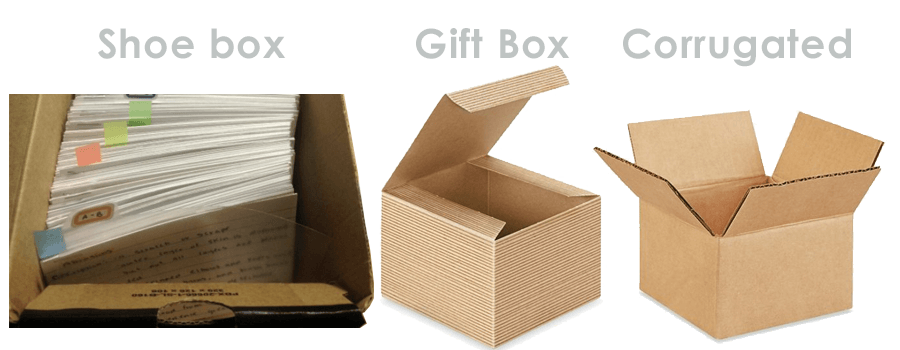

## Table of Contents

## What is the Cardboard Box Index?

The Cardboard Box Index is a way to measure how well the economy is doing by looking at how many cardboard boxes are being used. Cardboard boxes are important because they are used to pack and ship things. When more products are being made and sold, more cardboard boxes are needed. So, if the number of cardboard boxes being used goes up, it might mean that the economy is growing.

This index is useful because it gives a quick and simple view of economic activity. Businesses that make and sell cardboard boxes keep track of how many they produce and sell. By watching these numbers, economists can get an idea of how busy factories and stores are. If fewer boxes are being used, it might mean that people are buying less, which could be a sign that the economy is slowing down.

## How does the Cardboard Box Index measure economic activity?

The Cardboard Box Index measures economic activity by looking at how many cardboard boxes are being used. Cardboard boxes are important because they are used to pack and ship things. When more products are being made and sold, more cardboard boxes are needed. So, if the number of cardboard boxes being used goes up, it might mean that the economy is growing.

This index is useful because it gives a quick and simple view of economic activity. Businesses that make and sell cardboard boxes keep track of how many they produce and sell. By watching these numbers, economists can get an idea of how busy factories and stores are. If fewer boxes are being used, it might mean that people are buying less, which could be a sign that the economy is slowing down.

## What industries are most closely related to the Cardboard Box Index?

The Cardboard Box Index is closely related to the packaging industry. This industry makes and sells cardboard boxes. When more boxes are needed, it means the packaging industry is doing well. The packaging industry works with many other businesses that need boxes to ship their products.

Another industry closely related to the Cardboard Box Index is the manufacturing industry. This industry makes products like electronics, clothes, and food. When these products are made, they need to be packed in boxes to be shipped to stores or customers. So, if the manufacturing industry is busy, more cardboard boxes are used.

The retail industry is also connected to the Cardboard Box Index. Retail businesses sell products to customers. When people buy more things, stores need more boxes to ship those products. So, a high number of cardboard boxes being used can show that the retail industry is doing well.

## How is data for the Cardboard Box Index collected?

Data for the Cardboard Box Index is collected by looking at how many cardboard boxes are made and sold. Companies that make cardboard boxes keep track of how many they produce every month. They also keep records of how many boxes they sell to other businesses. This information is important because it shows how many boxes are being used.

Economists and researchers gather this data from these companies. They might use surveys or look at company reports to get the numbers. By putting all this information together, they can see if the number of cardboard boxes being used is going up or down. This helps them understand how the economy is doing.

## Can the Cardboard Box Index predict economic trends?

The Cardboard Box Index can help predict economic trends by showing how many boxes are being used. When more boxes are used, it means more products are being made and sold. This can be a sign that the economy is growing. If the number of boxes goes up for a few months, it might mean that good times are coming for the economy.

On the other hand, if fewer boxes are being used, it could mean that the economy is slowing down. When people buy less, factories make less, and fewer boxes are needed. By watching the Cardboard Box Index, economists can see these changes early and try to guess what will happen next in the economy.

## What are the limitations of using the Cardboard Box Index as an economic indicator?

The Cardboard Box Index can give a good idea of how the economy is doing, but it has some limits. One big limit is that it only looks at one part of the economy - the need for cardboard boxes. It doesn't tell us about other important things like how many people have jobs, how much money people are making, or how much they are spending on things that don't need boxes, like services.

Another limit is that the Cardboard Box Index can be affected by things that don't have much to do with the overall economy. For example, if a new law makes it easier or harder to recycle boxes, that could change how many boxes are used without really showing what's happening in the economy. Also, big changes in one industry, like a sudden boom in online shopping, could make it look like the whole economy is doing better or worse than it really is.

## How has the Cardboard Box Index been used historically to forecast economic changes?

The Cardboard Box Index has been used by economists for many years to get a quick look at how the economy is doing. They watch how many cardboard boxes are being made and sold because it can tell them if factories are busy making things and if stores are selling a lot of products. For example, in the early 2000s, when the economy was growing, the Cardboard Box Index showed that more boxes were being used. This was a sign that businesses were making and selling more stuff, which meant the economy was doing well.

However, the Cardboard Box Index isn't perfect. It has been less helpful during times when big changes happen in just one industry. For instance, when online shopping grew a lot in the 2010s, the number of cardboard boxes used went up a lot, but this didn't always mean the whole economy was doing better. It just meant more people were buying things online. So, while the Cardboard Box Index can give a good hint about the economy, it needs to be used with other information to really understand what's going on.

## What are some case studies where the Cardboard Box Index successfully predicted economic shifts?

One case where the Cardboard Box Index successfully predicted an economic shift was in the late 1990s. During this time, the U.S. economy was growing a lot. The number of cardboard boxes being used went up a lot, too. This showed that factories were making more things and stores were selling more products. Economists saw this and guessed that the economy was going to keep growing. They were right, and the economy did well for a few more years.

Another case was in the early 2000s, just before the Great Recession. The Cardboard Box Index started to go down. This meant fewer boxes were being used, which showed that factories were making less and stores were selling less. Economists who watched the index saw this as a warning sign that the economy might be slowing down. Soon after, the economy did go into a big recession. The Cardboard Box Index helped some people see this coming.

## How do fluctuations in the Cardboard Box Index correlate with stock market trends?

Fluctuations in the Cardboard Box Index can sometimes show what might happen with the stock market. When the Cardboard Box Index goes up, it means more boxes are being used. This usually means that businesses are making and selling more stuff. When businesses do well, their stock prices often go up, too. So, if the Cardboard Box Index is going up, it might mean the stock market will go up soon, too.

But the Cardboard Box Index doesn't always match what happens in the stock market. Sometimes, the stock market can go up even if the Cardboard Box Index goes down. This can happen if people are buying more things that don't need boxes, like services, or if they are just feeling good about the future and buying more stocks. So, while the Cardboard Box Index can give a hint about what might happen in the stock market, it's not perfect and should be used with other information to make good guesses about the future.

## What advanced statistical methods are used to analyze the Cardboard Box Index?

To analyze the Cardboard Box Index, economists use some advanced statistical methods. One common method is time series analysis. This helps them see how the number of cardboard boxes used changes over time. They look at patterns, like if the number of boxes goes up and down in a regular way, or if there are big changes that happen suddenly. By understanding these patterns, economists can make better guesses about what might happen next with the economy.

Another method they use is regression analysis. This helps them see how changes in the Cardboard Box Index relate to other things, like how many people have jobs or how much money people are spending. By looking at these relationships, economists can see if the Cardboard Box Index is a good way to predict what will happen with the economy. Sometimes, they use more complex models like ARIMA (AutoRegressive Integrated Moving Average) to make even better predictions based on past data.

## How does the Cardboard Box Index compare to other leading economic indicators?

The Cardboard Box Index is one way to guess how the economy is doing, but it's different from other leading economic indicators like the Purchasing Managers' Index (PMI) or the Consumer Confidence Index. The Cardboard Box Index looks at how many cardboard boxes are being used, which shows if factories are busy making things and stores are selling a lot. Other indicators, like the PMI, look at things like how many new orders businesses are getting or how fast they are making things. The Consumer Confidence Index asks people how they feel about the economy and if they think it will get better or worse. Each indicator gives a different piece of the puzzle about what's happening with the economy.

Even though the Cardboard Box Index is simple and can show how busy factories and stores are, it doesn't tell the whole story. For example, it might not show what's happening with jobs or how much money people are making. Other indicators, like the Unemployment Rate or the Gross Domestic Product (GDP), give a bigger picture of the economy. The Cardboard Box Index is good for quick guesses, but it works best when used with these other indicators to really understand what's going on and what might happen next with the economy.

## What future developments might affect the reliability of the Cardboard Box Index?

Future changes in how we shop and use things might change how well the Cardboard Box Index works. If more people start buying things online, they might use more cardboard boxes. But if people start buying less stuff that needs boxes, like if they buy more services or digital things, the Cardboard Box Index might not show the whole picture of the economy. Also, if new laws make companies use less cardboard or recycle more, the number of boxes used might go down even if the economy is doing well.

New ways to package things could also affect the Cardboard Box Index. If companies start using different materials instead of cardboard, like plastic or reusable containers, the index might not show how busy factories and stores really are. So, economists might need to look at other things along with the Cardboard Box Index to understand what's happening with the economy.

## How do Supply Chain Metrics Impact Economics?

Supply chain metrics serve as essential indicators of both the efficiency and effectiveness of goods' movement and storage within an economy. These metrics include measures such as freight tonnage, metal production, and mass transit usage, each of which provides critical insights that complement traditional economic indicators like the Cardboard Box Index.

Freight tonnage, for instance, measures the [volume](/wiki/volume-trading-strategy) of goods transported over a specific period. An increase in freight tonnage often signals robust economic activity, as higher volumes of goods movement indicate active trade and manufacturing processes. Conversely, a decrease may flag potential economic slowdowns, prompting businesses and policymakers to investigate underlying causes.

Metal production [statistics](/wiki/bayesian-statistics) reveal trends in industrial activity, given metals' use across various manufacturing sectors. High levels of metal production are typically associated with increased construction and manufacturing activities, driving economic growth. Conversely, diminished output may reflect contraction in these areas, serving as a precursor to broader economic challenges.

Mass transit usage offers insights into urban economic health and labor market activity. High utilization rates can indicate a thriving economy with significant employment activity, whereas declining numbers might suggest decreased economic participation or efficiencies in remote working arrangements.

Together, these metrics enable businesses to engage in strategic planning and optimize operations. By analyzing patterns, companies can anticipate supply chain disruptions and adapt their logistics and inventory strategies accordingly, thereby enhancing competitiveness.

Efficient supply chains are pivotal to a nation's Gross Domestic Product (GDP) and overall economic stability. They minimize costs associated with transportation and warehousing, improve service levels, and reduce time-to-market, thus boosting a country's economic productivity. Enhanced supply chain performance can contribute directly to GDP growth, as illustrated by the equation:

$$
\text{GDP} = C + I + G + (X - M)
$$

where $C$ is consumption, $I$ is investment, $G$ is government spending, $X$ is exports, and $M$ is imports. An efficient supply chain affects $C$, $I$, and $(X - M)$, particularly by boosting exports and reducing imports through domestic production efficiencies.

In practice, companies utilize data analytics tools to harness these metrics for forecasting demand and managing supply chain risks. For instance, Python-based data analysis frameworks can efficiently process large datasets from freight and production statistics to derive actionable insights. Here is a sample Python snippet that demonstrates how businesses might analyze freight data:

```python
import pandas as pd

# Sample dataset
data = {'Month': ['Jan', 'Feb', 'Mar', 'Apr'],
        'FreightTonnage': [2000, 2400, 2300, 2500]}

# Creating a DataFrame
df = pd.DataFrame(data)

# Calculating percentage change month-over-month
df['PercentageChange'] = df['FreightTonnage'].pct_change() * 100

print(df)
```

This example illustrates how freight data can be monitored over time to inform decision-making and strategic adjustments. By leveraging such metrics, businesses and policymakers can significantly enhance forecasting accuracy and economic strategy, ultimately contributing to the nation's economic well-being.

## References & Further Reading

[1]: ["The Signal and the Noise: Why So Many Predictions Fail—but Some Don't"](https://www.amazon.com/Signal-Noise-Many-Predictions-Fail-but/dp/0143125087) by Nate Silver

[2]: ["Economic Indicators: A Beginner's Guide"](https://www.thoughtco.com/beginners-guide-to-economic-indicators-1145901) by The Economist

[3]: ["Logistics and Supply Chain Management"](https://www.netsuite.com/portal/resource/articles/erp/supply-chain-management-vs-logistics.shtml) by Martin Christopher

[4]: ["Algorithmic Trading and DMA: An Introduction to Direct Access Trading Strategies"](https://archive.org/details/algorithmictradi0000john) by Barry Johnson

[5]: ["Packaging and the Environment"](https://www.sciencedirect.com/science/article/pii/B9781845696658500056) by Susan Selke, Ruth F. Hurley, and Julia J. Law

[6]: ["Supply Chain Metrics That Matter"](https://www.amazon.com/Supply-Chain-Metrics-Matter-Corporate/dp/1118858115) by Lora M. Cecere

[7]: ["Machine Learning for Finance: Data Algorithms for the Markets & Finance Industry"](https://www.coursera.org/articles/machine-learning-in-finance) by Yves Hilpisch

[8]: ["The Little Book That Still Beats the Market"](https://www.amazon.com/Little-Book-Still-Beats-Market/dp/0470624159) by Joel Greenblatt

[9]: McCully, C. P., & Moyer, B. C. (2009). ["A Reconciliation Between the Consumer Price Index and the Personal Consumption Expenditures Price Index"](https://www.bea.gov/system/files/papers/P2007-4.pdf). Journal of Economic and Social Measurement.