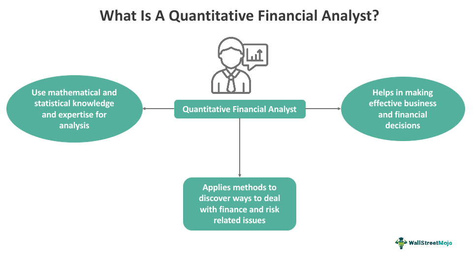

Quantitative finance plays a pivotal role in modern trading by leveraging mathematical models and computational techniques to analyze financial markets and inform decision-making processes. It involves the application of mathematical finance, statistics, and computer science to design and manage financial instruments and strategies. As the financial markets have become increasingly complex and data-driven, the practice of using quantitative methods has expanded significantly, leading to enhanced accuracy and efficiency in executing trades and managing portfolios.

Algorithmic trading, a component of quantitative finance, revolutionizes stock trading by using automated pre-programmed trading instructions to account for variables such as timing, price, and volume. The significance of algorithmic trading lies in its ability to execute trades at speeds and frequencies that are impossible for human traders, thus capturing market opportunities more efficiently. Algorithms are able to process vast amounts of market data and execute trades in milliseconds, providing a strategic advantage over traditional methods. This technological approach not only improves market liquidity and reduces costs but also enables systematic trading strategies that are less prone to human error.



The financial sector has witnessed a growing demand for professionals skilled in quantitative finance, particularly within the algorithmic trading space. This demand is driven by the industry's need for individuals who can develop and implement sophisticated models and algorithms to harness data for profitable trading strategies. As financial institutions and hedge funds increasingly rely on data-driven insights, there is a continuous call for quantitative analysts, traders, and developers who possess strong analytical skills and technical expertise.

The purpose of this article is to guide readers through the various job roles available in this dynamic field, offering insights into the skills and qualifications required, as well as the challenges and opportunities these roles present. Understanding the intersection of finance and technology is crucial for anyone looking to pursue a career in algorithmic trading. As the financial landscape continues to evolve with technological advancements, the ability to blend financial acumen with technical prowess will become increasingly valuable. This exploration seeks to illuminate the paths one can take in quantitative finance, empowering aspiring professionals to pursue rewarding careers in this ever-changing domain.

## Table of Contents

## Understanding Quantitative Finance

Quantitative finance is an interdisciplinary field that focuses on the application of mathematical models, statistics, and computational techniques to analyze financial markets and securities. Its primary aim is to facilitate data-driven decision-making in finance, thereby improving investment strategies, risk management, and pricing of complex financial instruments.

The scope of quantitative finance is broad and includes several key areas, such as derivative pricing, risk management, portfolio management, and algorithmic trading. By employing sophisticated models and algorithms, quantitative finance seeks to measure and manage risk, identify pricing inefficiencies, and automate trading processes.

Key skills and tools in quantitative finance are critical to the field's success. Statistical analysis is fundamental, allowing professionals to interpret market data and identify patterns. These analyses often involve advanced [statistics](/wiki/bayesian-statistics) and probability theories. Programming is another crucial skill, with languages such as Python, R, and C++ being commonly used. These languages help in developing algorithms, conducting simulations, and processing large datasets. Mathematics forms the backbone of quantitative finance, providing the necessary frameworks for modeling and problem-solving. Concepts from calculus, linear algebra, and differential equations are frequently applied.

Data-driven decision-making is a core component of quantitative finance, enabling practitioners to leverage historical data and real-time information to inform financial strategies. By analyzing trends and simulations, quantitative analysts can forecast future market behaviors and make informed decisions that align with investment objectives and risk tolerance.

The connection between quantitative finance and financial modeling is intrinsic, as financial modeling provides a structured approach to representing a company's financial performance. Quantitative models are used to assess potential investment opportunities, evaluate the financial impact of decisions, and devise strategies to maximize returns. These models often incorporate variables such as interest rates, stock prices, and economic indicators, allowing for a comprehensive analysis.

Quantitative analysts play a vital role in interpreting and utilizing financial data. Their expertise in mathematical models and computational tools allows them to uncover insights that may not be immediately apparent through traditional analysis. They translate complex datasets into actionable information, assisting traders, portfolio managers, and risk analysts in making strategic choices. Moreover, quantitative analysts continually refine their methods and assumptions to adapt to evolving market conditions, ensuring the relevance and accuracy of their analyses.

## What is Algorithmic Trading?

Algorithmic trading refers to the use of computer algorithms to manage the entire trading process, from data collection to order execution, in financial markets. This method revolutionizes stock trading by enabling the execution of orders based on pre-defined criteria, such as timing, price, or [volume](/wiki/volume-trading-strategy), with minimal human intervention. The core advantage lies in its ability to execute trades at optimal times, leveraging speed and efficiency that are unattainable through traditional trading methods.

Algorithms are programmed to analyze various market parameters and signals to detect potential trading opportunities. For example, a simple algorithm might be programmed in Python to buy a stock if its 50-day moving average exceeds its 200-day moving average, a common technical indicator known as the golden cross:

```python
import pandas as pd

def get_trading_signals(data):
    data['50_MA'] = data['Close'].rolling(window=50).mean()
    data['200_MA'] = data['Close'].rolling(window=200).mean()
    data['Signal'] = 0
    data['Signal'][50:] = np.where(data['50_MA'][50:] > data['200_MA'][50:], 1, 0)
    data['Positions'] = data['Signal'].diff()
    return data

# Assuming 'data' is a DataFrame with a 'Close' column
trading_signals = get_trading_signals(data)
```

Algorithmic trading offers unparalleled speed and efficiency by facilitating high-frequency trading ([HFT](/wiki/high-frequency-trading-strategies)), allowing hundreds or thousands of trades per second. This speed translates to increased chances of capturing market opportunities that emerge and vanish within milliseconds. Efficiency is further realized in reduced transaction costs, as algorithms can optimize the timing and batching of orders, minimizing market impact and slippage.

The strategic advantage of employing algorithms over traditional methods is underscored by their capacity to process vast amounts of market data swiftly and execute a range of complex trading strategies simultaneously. Automated trading strategies, such as [market making](/wiki/market-making), statistical [arbitrage](/wiki/arbitrage), and [trend following](/wiki/trend-following), can be deployed based on real-time analysis of streaming data.

The advancement of technology plays a crucial role in shaping the future of trading. Technologies such as [machine learning](/wiki/machine-learning) and [artificial intelligence](/wiki/ai-artificial-intelligence) empower traders to develop algorithms that adapt to changing market conditions. The integration of big data analytics allows for the processing of large volumes of unstructured data, enhancing predictive accuracy and decision-making capabilities.

Overall, [algorithmic trading](/wiki/algorithmic-trading) has transformed the landscape of financial markets by enhancing trading performance through automation, speed, and precision, paving the way for a more technologically driven future in finance.

## Key Job Roles in Algo Trading

Algo trading, also known as algorithmic trading, encompasses various job roles that are integral to its operation and success. These roles often require a blend of financial acumen and technical prowess.

### Quantitative Analyst

Quantitative analysts, or quants, are pivotal in algo trading. They are responsible for developing mathematical models that help in pricing securities, managing risk, and identifying trading opportunities. The essential skills for this role include proficiency in statistical analysis, mathematical modeling, and programming languages such as Python or R. 

Python, due to its extensive libraries like NumPy and pandas, allows quants to efficiently manipulate large datasets and perform complex computations. An example formula a quant might work with is the Black-Scholes model for option pricing:

$$
C = S_0 N(d_1) - X e^{-rT} N(d_2)
$$

where:
- $C$ is the call option price,
- $S_0$ is the current stock price,
- $X$ is the strike price,
- $r$ is the risk-free interest rate,
- $T$ is the time to expiration,
- $N$ is the cumulative distribution function of the standard normal distribution,
- $d_1$ and $d_2$ are calculated intermediaries.

### Trader

Traders in algo trading firms are tasked with executing the strategies developed by quants. They must have a keen understanding of market dynamics and the operational aspects of algorithmic systems. While deep programming knowledge might not be as critical for traders as for quants, competency in platforms that facilitate algorithmic execution and a strong grasp of financial markets are vital.

### Developer

Developers are essential for building and maintaining the software systems that underpin algo trading strategies. They need strong skills in coding languages such as C++ and Python, with C++ being preferred for its performance efficiency in low-latency trading systems. Developers collaborate with quants and traders to integrate models into a seamless execution platform.

An example of a basic Python script that might be used in algo trading is:

```python
import pandas as pd

# Load market data
data = pd.read_csv('market_data.csv')

# Simple moving average
data['SMA50'] = data['Close'].rolling(window=50).mean()
data['SMA200'] = data['Close'].rolling(window=200).mean()

# Generate buy/sell signals
data['Signal'] = 0
data['Signal'][50:] = np.where(data['SMA50'][50:] > data['SMA200'][50:], 1, -1)

# Signal changes
data['Position'] = data['Signal'].diff()
```

### The Importance of Teamwork

In the algo trading industry, collaboration is crucial. Quants, traders, and developers must work in synchrony to ensure strategies are not only theoretically sound but also practically executable and efficient. Cross-functional teamwork facilitates the rapid iteration and deployment of strategies, allowing firms to adapt to market changes swiftly.

### Career Paths and Growth Opportunities

The algo trading sector offers numerous growth paths. A quantitative analyst might progress to lead a team of researchers or become a portfolio manager overseeing multiple trading strategies. Developers can advance to system architect roles or lead technology teams. Traders may move into [hedge fund](/wiki/hedge-fund-trading-strategies) management or strategic roles within financial institutions.

The burgeoning integration of artificial intelligence and machine learning in trading strategies also opens new avenues for professionals in this field. Mastery of these technologies is increasingly sought after, creating diverse opportunities for career growth and specialization in areas such as AI-driven predictive modeling and automated strategy development.

Overall, the convergence of finance and technology in algo trading promises a dynamic and rewarding career landscape for professionals equipped with the relevant skills and ambitions.

## Essential Skills and Qualifications

Quantitative finance in algorithmic trading requires a unique blend of skills and qualifications, ranging from technical prowess to a deep understanding of financial principles. These skills ensure that professionals can develop, implement, and maintain complex trading algorithms effectively.

**Critical Skills:**

1. **Programming**: Proficiency in programming languages is fundamental for creating and optimizing trading algorithms. Python is particularly favored due to its robust libraries for data analysis and machine learning, such as NumPy, pandas, and scikit-learn. Languages like C++ are also valued for their execution speed.

   ```python
   import numpy as np
   prices = np.array([100, 102, 101, 105])
   returns = np.diff(prices) / prices[:-1]
   ```

2. **Mathematics**: A strong foundation in mathematics, especially in statistics, calculus, and linear algebra, is crucial. These mathematical concepts are often employed in modeling financial data and risk management. For instance, the Black-Scholes model for options pricing utilizes differential equations.

3. **Financial Knowledge**: Understanding financial markets, instruments, and their behaviors is essential. This knowledge helps in designing strategies that account for market conditions and regulatory requirements.

**Educational Background**:

An educational background in finance, computer science, mathematics, or related fields provides a solid foundation. Degrees in these areas cover the theoretical and practical aspects required for roles in algorithmic trading. Advanced degrees, such as a Master's or Ph.D., can be advantageous.

**Certifications and Courses**:

Certifications like the Chartered Financial Analyst (CFA) or Financial Risk Manager (FRM) can enhance employability. Courses focusing on data science, machine learning, and blockchain technology are increasingly relevant. Online platforms like Coursera and edX offer specialized courses that can help professionals stay updated with the latest trends and skills.

**Continuous Learning**:

Algorithmic trading is driven by rapid technological advances and evolving market dynamics. Thus, continuous learning and staying informed about market trends, new technologies, and regulatory changes are imperative. This can be achieved through webinars, workshops, and reading financial journals.

**Soft Skills**:

While technical skills are paramount, soft skills such as problem-solving and communication are equally important. Problem-solving involves critical thinking and the ability to troubleshoot and optimize algorithms under various market conditions. Communication skills facilitate effective collaboration within teams, ensuring that complex strategies and findings are well understood across different stakeholders.

In summary, a successful career in quantitative finance within algorithmic trading requires a balance of advanced technical abilities, a strong educational background, and the willingness to continuously learn and adapt. These skills collectively enable professionals to navigate and contribute to this dynamic field effectively.

## Challenges and Opportunities in Algo Trading

Quantitative finance and algorithmic trading bring numerous challenges and opportunities to professionals in the field. One of the primary challenges is market [volatility](/wiki/volatility-trading-strategies), which can introduce significant unpredictability into trading strategies. Algorithms must be designed to handle sudden market shifts, as highlighted by the dramatic market fluctuations during financial crises, such as the 2008 collapse.

Regulatory concerns present an additional layer of complexity. The financial industry is heavily regulated, and compliance requirements can influence algorithm design and implementation. Adhering to standards set by bodies such as the Securities and Exchange Commission (SEC) in the United States is crucial to avoid substantial penalties. Regulations are evolving, especially concerning high-frequency trading, necessitating constant vigilance and adaptation.

Technological advancements offer significant impacts on job roles within algo trading. Machine learning and artificial intelligence are increasingly integrated into trading algorithms, allowing for the analysis of vast datasets to identify nuanced trading patterns. For professionals, this means an ongoing need to upgrade technical skills and adapt to new tools and technologies. For instance, familiarity with Python libraries like TensorFlow and Scikit-learn is becoming increasingly valuable.

Despite these challenges, the sector is rife with opportunities for innovation and growth. The continuous evolution of financial markets calls for novel trading strategies and the enhancement of existing algorithms. Innovations such as quantum computing, though still in nascent stages, hold promise for future transformations in computational capabilities and algorithm efficiency.

The potential for high earnings in algo trading is significant, attracting many professionals to the sector. Those capable of developing and executing successful trading strategies can receive substantial financial rewards, often linked to performance metrics. Moreover, the career advancement pathways in this sector are robust, with opportunities to progress from entry-level quantitative roles to senior positions, such as lead quant or chief technology officer.

Future trends in the industry point towards a greater convergence of technology and finance. The rise of decentralized finance (DeFi) and blockchain technologies may further redefine trading paradigms, offering chances for integrating new types of assets and financial instruments into trading strategies. Staying abreast of these developments will be critical for professionals aiming to capitalize on emerging opportunities in the evolving landscape of algorithmic trading.

## Conclusion

Quantitative finance plays a pivotal role in the world of algorithmic trading, significantly transforming how financial markets operate. Careers in this sector are exceptionally promising for professionals with a diverse skill set, encompassing strong mathematical prowess, programming expertise, and financial acumen. The demand for quantitative finance jobs in algorithmic trading continues to rise, driven by the need for sophisticated data analysis and automated decision-making processes.

Aspiring quants are highly encouraged to pursue careers in this dynamic and lucrative field. The landscape is continuously evolving, and those who possess the required technical skills coupled with a keen understanding of financial markets will find substantial opportunities for advancement. By harnessing the power of technology, finance jobs are becoming more innovative, offering potential for growth and development.

To succeed in this sector, it is crucial to remain informed about the latest technological developments and market trends. Continuous learning and professional development are essential to maintain a competitive edge. Aspiring practitioners should seek further resources, such as specialized courses, certifications, and industry conferences, to enhance their knowledge and skills. By taking proactive steps, individuals can effectively navigate their way into this exciting and ever-evolving world of quantitative finance and algorithmic trading.

## References & Further Reading

[1]: Bergstra, J., Bardenet, R., Bengio, Y., & Kégl, B. (2011). ["Algorithms for Hyper-Parameter Optimization."](https://papers.nips.cc/paper/4443-algorithms-for-hyper-parameter-optimization) Advances in Neural Information Processing Systems 24.

[2]: ["Advances in Financial Machine Learning"](https://www.amazon.com/Advances-Financial-Machine-Learning-Marcos/dp/1119482089) by Marcos Lopez de Prado

[3]: ["Evidence-Based Technical Analysis: Applying the Scientific Method and Statistical Inference to Trading Signals"](https://www.amazon.com/Evidence-Based-Technical-Analysis-Scientific-Statistical/dp/0470008741) by David Aronson

[4]: ["Machine Learning for Algorithmic Trading"](https://github.com/PacktPublishing/Machine-Learning-for-Algorithmic-Trading-Second-Edition) by Stefan Jansen

[5]: ["Quantitative Trading: How to Build Your Own Algorithmic Trading Business"](https://books.google.com/books/about/Quantitative_Trading.html?id=j70yEAAAQBAJ) by Ernest P. Chan