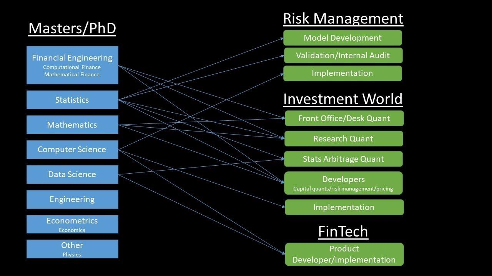

## Table of Contents

## What is quantitative finance and why is it important?

Quantitative finance is a field that uses math and computer science to solve problems in finance. It helps people make better decisions about things like investing money, managing risk, and pricing financial products. People who work in quantitative finance, called quants, use numbers and data to predict how markets will behave and to find the best ways to make money or reduce losses.

Quantitative finance is important because it helps make the financial world more efficient and stable. By using math and computers, quants can find patterns and trends that might be hard to see otherwise. This can lead to better investment strategies and more accurate pricing of financial products. As a result, it helps investors and financial institutions make smarter choices, which can benefit the economy as a whole.

## What are the basic educational requirements for a career in quantitative finance?

To start a career in quantitative finance, you usually need a strong background in math, statistics, and computer science. Most people in this field have at least a bachelor's degree in a related subject like mathematics, finance, economics, or engineering. These degrees help you learn the basic skills you need, like how to solve complex problems and use computer programs to analyze data.

Many jobs in quantitative finance also require a higher level of education, like a master's degree or a PhD. These advanced degrees can give you deeper knowledge and make you more competitive in the job market. Courses in financial engineering, quantitative analysis, or computational finance are common and can prepare you for specific roles in the industry.

In addition to formal education, it's important to keep learning and stay up-to-date with new tools and methods. Many quants also get certifications like the CFA (Chartered Financial Analyst) or FRM (Financial Risk Manager) to show they have the skills needed for the job. Internships and practical experience can also be very helpful in building your career in quantitative finance.

## What skills are essential for someone starting in quantitative finance?

To start in quantitative finance, you need to be good at math and [statistics](/wiki/bayesian-statistics). These are the core skills that help you understand and solve financial problems. You should know how to use calculus, linear algebra, and probability. Being able to work with numbers and data is very important. You also need to learn programming, especially languages like Python, R, or C++. These skills help you write code to analyze data and build models.

Besides math and programming, you need to understand finance and economics. Knowing how markets work and how to value financial products is key. You should also be able to think critically and solve problems creatively. Good communication skills are important too, because you will need to explain complex ideas to others. Being able to work in a team and manage your time well will help you succeed in this field.

## What are the common entry-level positions in quantitative finance?

Entry-level jobs in quantitative finance often start with roles like junior quantitative analyst or data analyst. In these jobs, you help gather and analyze data. You might work on building models or checking how well they work. These positions need you to use math and computer skills to solve problems. You'll work with more experienced quants and learn a lot about the financial world.

Another common entry-level job is a financial analyst. In this role, you look at financial data to help make decisions about investments. You might create reports and help come up with strategies. This job also uses math and data skills, but you need to understand finance and economics more deeply. Both of these jobs can lead to more advanced roles in quantitative finance as you gain experience and learn more.

## How does one progress from an entry-level to a mid-level position in quantitative finance?

To move from an entry-level to a mid-level position in quantitative finance, you need to show that you can do more than just the basic tasks. At first, you might be gathering data and helping with simple models. But to get to a mid-level job, you need to take on more responsibility. This means you should start leading small projects, coming up with your own ideas, and showing that you can solve harder problems. It's important to keep learning and get better at using advanced tools and methods. This can help you stand out and show that you are ready for a bigger role.

Another key part of moving up is to build a good network. Talk to more experienced people in your company and go to industry events. This can help you learn from others and find new opportunities. Also, think about getting more education or certifications like the CFA or FRM. These can show that you have the skills needed for a mid-level job. With hard work, continuous learning, and a strong network, you can move from an entry-level to a mid-level position in quantitative finance.

## What are the typical responsibilities of a quantitative analyst?

A quantitative analyst, often called a quant, uses math and computers to help with financial decisions. They work on building models that predict how markets will move or how to price financial products. This involves gathering a lot of data and using it to find patterns and trends. They also test their models to make sure they work well and can be trusted. Sometimes, they need to explain their findings to other people in the company, so good communication skills are important.

Besides building and testing models, quants also help manage risk. They look at how different investments might affect the company and try to find ways to reduce losses. This can involve creating strategies to balance risk and reward. Quants need to keep learning new methods and tools because the field is always changing. They often work in teams, so being able to work well with others and manage time effectively is key to their job.

## What advanced mathematical and statistical techniques are used in quantitative finance?

In quantitative finance, people use advanced math and stats to understand and predict how markets will move. They use things like stochastic calculus to model how prices change over time. This helps them figure out the best times to buy or sell. They also use time series analysis to look at past data and see patterns that can help predict the future. Another important technique is Monte Carlo simulation, which lets them test different scenarios to see how they might affect their investments.

Another key part of quantitative finance is using [machine learning](/wiki/machine-learning) and [artificial intelligence](/wiki/ai-artificial-intelligence). These methods help quants find hidden patterns in big sets of data. For example, they might use neural networks to predict stock prices or cluster analysis to group similar investments together. They also use optimization techniques to find the best ways to invest money or manage risk. These advanced techniques help quants make smarter decisions and give them a better understanding of the financial world.

## How do professionals in quantitative finance use programming and data analysis tools?

Professionals in quantitative finance use programming to write code that helps them solve problems and make decisions. They often use languages like Python, R, or C++ to build models and analyze data. These programs can take in a lot of information and find patterns that might be hard to see otherwise. For example, they might write a program to predict how stock prices will change or to test different investment strategies. Programming also helps them automate tasks, so they can work faster and spend more time thinking about big ideas.

Data analysis tools are also very important in quantitative finance. These tools help quants look at large sets of data and find useful information. They might use software like Excel, MATLAB, or specialized financial software to do things like time series analysis or risk management. These tools can create charts and graphs to help explain complex ideas to others. By using data analysis tools, quants can make better decisions and help their companies make more money or reduce losses.

## What are the differences between working in a quantitative role at a bank versus a hedge fund?

Working in a quantitative role at a bank is often more structured than at a hedge fund. At a bank, you might work on things like pricing financial products, managing risk, or helping with trading strategies. Banks have a lot of rules and regulations to follow, so your job might involve a lot of reporting and making sure everything is done correctly. You'll work in a big team, and there might be more levels of management to go through before your ideas are used. The work can be steady, but it might also feel a bit slower because of all the checks and balances.

At a hedge fund, the work can be more fast-paced and less structured. Hedge funds are focused on making money, so you might work on finding new ways to invest or trade. You could have more freedom to try out your own ideas and take more risks. The teams are often smaller, so you might have a bigger impact on what the fund does. But this can also mean more pressure to perform well, and the job might be less stable if the fund doesn't make money. Both places need strong math and computer skills, but the day-to-day work and the feel of the job can be quite different.

## What are some of the advanced career paths available in quantitative finance?

In quantitative finance, one advanced career path is to become a portfolio manager. This job involves using math and computer skills to pick the best investments for a fund. You would work with a lot of data and use models to decide where to put money. Portfolio managers need to understand markets well and be good at managing risk. This job can be very rewarding because you have a big impact on how well the fund does.

Another advanced path is to become a risk manager. In this role, you use math and stats to find out how much risk the company is taking. You help make sure the company doesn't lose too much money. Risk managers look at all kinds of risks, like market risks or credit risks. They use models to predict what might happen and come up with plans to reduce risk. This job is important for keeping the company safe and stable.

A third path is to become a financial engineer. Financial engineers design new financial products and find ways to make them work better. They use advanced math and computer skills to create models and test new ideas. This job can be very creative because you get to come up with new ways to help people invest or manage money. Financial engineers need to keep learning because the field is always changing with new technology and ideas.

## How can one stay updated with the latest trends and technologies in quantitative finance?

To stay updated with the latest trends and technologies in quantitative finance, it's important to keep learning all the time. You can read [books](/wiki/algo-trading-books) and articles about new methods and tools. Websites like Quantopian and Wilmott have lots of information about what's new in the field. You can also join online groups or forums where people talk about the latest ideas. Going to conferences and workshops is another good way to learn. These events let you hear from experts and meet other people who work in quantitative finance.

Another way to stay updated is to use new technology yourself. Try out new programming languages and data analysis tools. For example, you might learn how to use machine learning to predict stock prices. Many companies offer free courses online, like Coursera or edX, where you can learn about the latest techniques. It's also helpful to talk to other people in the field. They might know about new trends or technologies that you haven't heard about yet. By staying curious and always learning, you can keep up with the fast-changing world of quantitative finance.

## What are the ethical considerations and challenges faced by professionals in quantitative finance?

Professionals in quantitative finance often face ethical challenges because their work can have a big impact on people and markets. One big challenge is making sure their models are fair and don't hurt certain groups of people. For example, if a model is used to decide who gets a loan, it should not treat people differently because of their race or gender. Quants need to check their models carefully to make sure they are not biased. They also need to be honest about how well their models work and not make them seem better than they are.

Another ethical issue is managing risk in a way that is responsible. Quants have to balance making money with keeping the company and the market safe. Sometimes, there might be pressure to take big risks to make more money, but this can lead to big losses or even harm the economy. Quants need to think about the long-term effects of their decisions and not just focus on short-term gains. Being open about how they manage risk and following the rules can help them make ethical choices.

## What are the key job roles in algo trading?

Algo trading, also known as [algorithmic trading](/wiki/algorithmic-trading), encompasses various job roles that are integral to its operation and success. These roles often require a blend of financial acumen and technical prowess.

### Quantitative Analyst

Quantitative analysts, or quants, are pivotal in algo trading. They are responsible for developing mathematical models that help in pricing securities, managing risk, and identifying trading opportunities. The essential skills for this role include proficiency in statistical analysis, mathematical modeling, and programming languages such as Python or R. 

Python, due to its extensive libraries like NumPy and pandas, allows quants to efficiently manipulate large datasets and perform complex computations. An example formula a quant might work with is the Black-Scholes model for option pricing:

$$
C = S_0 N(d_1) - X e^{-rT} N(d_2)
$$

where:
- $C$ is the call option price,
- $S_0$ is the current stock price,
- $X$ is the strike price,
- $r$ is the risk-free interest rate,
- $T$ is the time to expiration,
- $N$ is the cumulative distribution function of the standard normal distribution,
- $d_1$ and $d_2$ are calculated intermediaries.

### Trader

Traders in algo trading firms are tasked with executing the strategies developed by quants. They must have a keen understanding of market dynamics and the operational aspects of algorithmic systems. While deep programming knowledge might not be as critical for traders as for quants, competency in platforms that facilitate algorithmic execution and a strong grasp of financial markets are vital.

### Developer

Developers are essential for building and maintaining the software systems that underpin algo trading strategies. They need strong skills in coding languages such as C++ and Python, with C++ being preferred for its performance efficiency in low-latency trading systems. Developers collaborate with quants and traders to integrate models into a seamless execution platform.

An example of a basic Python script that might be used in algo trading is:

```python
import pandas as pd

# Load market data
data = pd.read_csv('market_data.csv')

# Simple moving average
data['SMA50'] = data['Close'].rolling(window=50).mean()
data['SMA200'] = data['Close'].rolling(window=200).mean()

# Generate buy/sell signals
data['Signal'] = 0
data['Signal'][50:] = np.where(data['SMA50'][50:] > data['SMA200'][50:], 1, -1)

# Signal changes
data['Position'] = data['Signal'].diff()
```

### The Importance of Teamwork

In the algo trading industry, collaboration is crucial. Quants, traders, and developers must work in synchrony to ensure strategies are not only theoretically sound but also practically executable and efficient. Cross-functional teamwork facilitates the rapid iteration and deployment of strategies, allowing firms to adapt to market changes swiftly.

### Career Paths and Growth Opportunities

The algo trading sector offers numerous growth paths. A quantitative analyst might progress to lead a team of researchers or become a portfolio manager overseeing multiple trading strategies. Developers can advance to system architect roles or lead technology teams. Traders may move into [hedge fund](/wiki/hedge-fund-trading-strategies) management or strategic roles within financial institutions.

The burgeoning integration of artificial intelligence and machine learning in trading strategies also opens new avenues for professionals in this field. Mastery of these technologies is increasingly sought after, creating diverse opportunities for career growth and specialization in areas such as AI-driven predictive modeling and automated strategy development.

Overall, the convergence of finance and technology in algo trading promises a dynamic and rewarding career landscape for professionals equipped with the relevant skills and ambitions.

## References & Further Reading

[1]: Bergstra, J., Bardenet, R., Bengio, Y., & Kégl, B. (2011). ["Algorithms for Hyper-Parameter Optimization."](https://papers.nips.cc/paper/4443-algorithms-for-hyper-parameter-optimization) Advances in Neural Information Processing Systems 24.

[2]: ["Advances in Financial Machine Learning"](https://www.amazon.com/Advances-Financial-Machine-Learning-Marcos/dp/1119482089) by Marcos Lopez de Prado

[3]: ["Evidence-Based Technical Analysis: Applying the Scientific Method and Statistical Inference to Trading Signals"](https://www.amazon.com/Evidence-Based-Technical-Analysis-Scientific-Statistical/dp/0470008741) by David Aronson

[4]: ["Machine Learning for Algorithmic Trading"](https://github.com/PacktPublishing/Machine-Learning-for-Algorithmic-Trading-Second-Edition) by Stefan Jansen

[5]: ["Quantitative Trading: How to Build Your Own Algorithmic Trading Business"](https://books.google.com/books/about/Quantitative_Trading.html?id=j70yEAAAQBAJ) by Ernest P. Chan