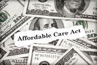

The COVID-19 pandemic instigated unprecedented economic challenges globally, necessitating swift legislative responses to mitigate its impact. With massive disruptions across industries and surging unemployment rates, economies worldwide faced turmoil that required immediate intervention to prevent further decline. In the United States, the Coronavirus Aid, Relief, and Economic Security (CARES) Act emerged as a critical legislative measure designed to provide substantial economic relief. Enacted in March 2020, the CARES Act introduced a $2.2 trillion stimulus package aimed at assisting individuals, businesses, and healthcare providers severely affected by the pandemic.

The CARES Act encompassed several key components, including direct payments to individuals, expanded unemployment benefits, and provisions for small business relief, such as the Paycheck Protection Program (PPP). These initiatives sought to stabilize the economy by ensuring liquidity and confidence within the financial system. The overarching goal was to cushion the economic blow to households and businesses, ultimately fostering a more resilient economic environment during the crisis.



As the pandemic-induced disruptions reverberated through global financial markets, algorithmic trading played a crucial role in navigating the heightened economic uncertainties. Algorithmic trading, defined as the use of computer algorithms to automate trading decisions, became an essential tool for investors and traders to manage risks and capitalize on market opportunities amidst volatile conditions. The integration of data-driven trading strategies allowed for swift adaptation to rapidly shifting market trends, thereby increasing efficiency and improving decision-making processes during the tumultuous period.

This article explores the intersection between the economic relief measures facilitated by the CARES Act, the subsequent stabilization initiatives, and the opportunities created for algorithmic trading. By examining these aspects, we aim to elucidate how legislative actions and sophisticated trading methodologies coalesce to address economic challenges and capitalize on market dynamics. Through this exploration, the article sheds light on the crucial interplay between policy-driven relief efforts and the strategic exploitation of trading opportunities in crisis scenarios.

## Table of Contents

## Understanding the CARES Act

The Coronavirus Aid, Relief, and Economic Security (CARES) Act, enacted in March 2020, was a significant legislative response to the economic disruptions caused by the COVID-19 pandemic. It was designed to mitigate the financial impact on individuals and businesses and to stabilize the U.S. economy. The Act constituted a $2.2 trillion economic stimulus package integrating various forms of assistance, including direct payments, small business relief, and expanded unemployment benefits.

One of the central components of the CARES Act was the provision of direct payments to individuals and families. Eligible Americans received Economic Impact Payments of up to $1,200 per individual, with an additional $500 per qualifying dependent child. This provision aimed to directly inject liquidity into the hands of consumers, encouraging spending and providing a safety net for those facing income disruptions.

Small businesses, severely affected by lockdowns and social distancing measures, were supported through the Paycheck Protection Program (PPP). This initiative allocated approximately $349 billion initially, with subsequent replenishments, to offer forgivable loans to small businesses maintaining their payroll. The PPP played a crucial role in retaining employees and stabilizing business operations during a time of heightened uncertainty.

Further, the CARES Act enhanced and expanded unemployment benefits. It established the Pandemic Unemployment Assistance (PUA) program, extending unemployment benefits to self-employed and gig economy workers traditionally ineligible for such support. Additionally, it increased the unemployment benefit amount by $600 per week through the Federal Pandemic Unemployment Compensation (FPUC) program.

The CARES Act's economic impact was multifaceted, reinforcing economic activity at multiple levels. The $2.2 trillion infusion represented substantial fiscal intervention by the federal government, designed to counteract the steep decline in economic output. By extending financial support to individuals and businesses, the Act helped maintain consumer demand, supported employment, and sought to avert further deterioration of the economy. 

Overall, the CARES Act was pivotal in providing immediate financial relief to those adversely affected by the pandemic, aiming to stabilize the economy during an unprecedented global crisis.

## Economic Relief and Market Stability

The Coronavirus Aid, Relief, and Economic Security (CARES) Act was a cornerstone in the United States' legislative response to the profound economic disruptions caused by the COVID-19 pandemic. Its goal was to provide urgent economic relief and stabilize markets that had been significantly affected by the sudden halt in economic activities. The act allocated $2.2 trillion towards various sectors to inject [liquidity](/wiki/liquidity-risk-premium), sustain employment, and catalyze economic activity. 

Directly, the CARES Act impacted healthcare by allocating $100 billion to hospitals and healthcare providers struggling with the surge in COVID-19 cases and related operational costs. These funds were intended to enhance capacity, procure necessary health supplies, and support front-line workers. By ensuring the healthcare system was equipped to manage the pandemic, the CARES Act helped restore public confidence, which indirectly stabilized related sectors, including insurance and pharmaceuticals.

In education, the CARES Act provisioned approximately $30 billion to support education institutions now tasked with adapting to new learning models and technologies. This funding aimed to minimize disruptions in the education sector and support students and staff transitioning to remote learning environments. The indirect stabilization of the education sector had further economic implications, as it reduced potential economic fallout from workforce disruptions and preserved future workforce competencies. 

Transportation saw a critical infusion of funds to prevent collapse in the face of plummeting demand and halted operations. The act included $25 billion in grants for public transportation systems, ensuring continuity of essential services. This assistance helped maintain transportation infrastructure stability, critical for other sectors relying on the movement of goods and services, thereby sustaining employment and invigorating ancillary industries.

Fiscal policy adjustments under the CARES Act included broad monetary support measures, such as expanding unemployment benefits to cover not just full-time employees but also freelancers and gig workers, thereby addressing a key strain on personal incomes. The enhanced unemployment benefits played a significant role in sustaining consumer spending, which is vital for the broader economic stability.

The Paycheck Protection Program (PPP) was another fiscal intervention that directly supported market stability by providing small businesses with forgivable loans to retain employees on payroll, cover rent, and maintain operations. This support bolstered market confidence, preserving consumer spending power and enabling smaller entities to withstand the prolonged market uncertainties.

In conclusion, the CARES Act orchestrated a comprehensive set of relief and fiscal measures to secure economic stability amid the sheer unpredictability of the pandemic. By targeting critical pillars of the economy, from healthcare to transportation, and fortifying fiscal policies through unemployment aid and small business support, it enabled a modicum of stability that facilitated gradual market recovery.

## Algorithmic Trading during COVID-19

Algorithmic trading, often referred to as algo-trading, involves the use of computer algorithms to automate trading decisions in financial markets. These algorithms execute orders based on predefined criteria such as timing, price, and [volume](/wiki/volume-trading-strategy), aiming to optimize trading efficiency and minimize manual intervention. The importance of [algorithmic trading](/wiki/algorithmic-trading) in financial markets is underscored by its ability to analyze vast amounts of data at high speeds, execute trades with precision, and exploit market inefficiencies that manual traders may miss.

The COVID-19 pandemic induced significant [volatility](/wiki/volatility-trading-strategies) in financial markets as investors reacted to rapidly changing economic conditions and uncertainty. This increased volatility presented both challenges and opportunities for market participants. For algorithmic traders, the frequent price swings and liquidity fluctuations created multiple trading opportunities. Algorithms that employed strategies such as mean reversion, [momentum](/wiki/momentum) trading, and statistical [arbitrage](/wiki/arbitrage) were particularly effective in capitalizing on these conditions. The ability of these algorithms to operate at [high frequency](/wiki/high-frequency-trading) allowed them to quickly adapt to market movements, enter and [exit](/wiki/exit-strategy) positions with agility, and manage large volumes of trades with reduced human error.

Algorithmic trading also played a crucial role in risk management during the pandemic. As traditional trading methods faced the challenge of rapidly evolving markets, algo-trading systems were able to incorporate complex risk models that adjusted dynamically to market volatility. Some algorithms utilized [machine learning](/wiki/machine-learning) techniques to refine predictive accuracy for asset pricing and risk assessment. An example of such an algorithm is a volatility [breakout](/wiki/breakout-trading) strategy, which identifies potential profit opportunities by monitoring price movements that exceed a certain volatility threshold:

```python
def volatility_breakout(data, threshold):
    breakout_points = []
    for index in range(1, len(data)):
        if abs(data[index] - data[index-1]) > threshold:
            breakout_points.append(index)
    return breakout_points

# Example usage:
market_data = [100, 102, 105, 107, 110, 104, 99]  # Sample market price data
breakout_threshold = 3
breakout_indices = volatility_breakout(market_data, breakout_threshold)
print("Breakout points:", breakout_indices)
```

This Python function identifies points in the market data where the price changes exceed a specified threshold, indicating potential trading opportunities.

Overall, the pandemic underscored the importance of algorithmic trading in maintaining liquidity and facilitating market stability. Furthermore, as market dynamics shifted due to economic interventions like the CARES Act, algorithmic trading systems were pivotal in capturing gains and managing investment risks efficiently. These systems provided a strategic advantage by processing complex datasets and executing trades with the speed and precision necessary in an era of heightened volatility.

## Impact of CARES Act on Financial Markets

The Coronavirus Aid, Relief, and Economic Security (CARES) Act, enacted in March 2020, had a notable influence on financial markets. As a large-scale fiscal intervention, its provisions were pivotal in shaping market operations and trends during a period of heightened economic uncertainty.

The CARES Act injected significant liquidity into the economy, primarily through mechanisms such as direct payments to individuals, expanded unemployment benefits, and loan programs for businesses. These measures, aggregating to approximately $2.2 trillion, served to stabilize consumer demand and bolster market confidence. The infusion of liquidity helped alleviate immediate financial distress, fostering a more stable economic environment.

Market trends experienced marked shifts post-implementation of the CARES Act. Equity markets witnessed an initial recovery following a precipitous decline in early March 2020, influenced by increased liquidity and investor optimism about potential economic recovery. The fiscal stimulus contributed to a rebound in various sectors, notably technology and consumer goods, which saw significant gains as consumer spending was sustained by relief measures.

Liquidity was significantly enhanced, as evidenced by increased market participation and trading volumes. The Federal Reserve, complementing the CARES Act, introduced measures to ensure adequate liquidity in financial markets, including lowering interest rates and purchasing bonds. These actions further supported market stability and facilitated smoother financial operations during the volatile period.

Investor confidence, albeit shaky during the initial phases of the pandemic, gradually improved as the effects of the CARES Act became apparent. The assurances provided by fiscal and monetary support led to a resurgence in risk appetite among investors, contributing to the stabilization of asset prices. The psychological impact of governmental support cannot be understated, as it played a crucial role in maintaining market equilibrium.

In summary, the CARES Act significantly impacted financial markets by providing immediate financial relief, enhancing liquidity, and restoring investor confidence. These factors contributed to stabilizing market operations during one of the most uncertain periods in recent history, underscoring the effectiveness of large-scale economic interventions in managing crises.

## Algorithmic Trading as a Tool for Exploiting Opportunities

Algorithmic trading systems have shown remarkable adaptability in response to shifting market conditions triggered by the COVID-19 pandemic and legislative measures such as the CARES Act. These systems, which use computer algorithms to automatically execute trades based on predefined criteria, capitalized on the market fluctuations brought about by the economic stimulus.

### Adaptation to New Market Conditions

During the COVID-19 pandemic, market volatility increased significantly, providing both challenges and opportunities for traders. Algorithmic trading systems adapted by recalibrating their models to account for heightened volatility and volume. These systems leveraged advancements in machine learning and [artificial intelligence](/wiki/ai-artificial-intelligence) to continuously update their strategies in response to real-time market data. For example, algorithms were able to incorporate news sentiment analysis, using natural language processing techniques to gauge market sentiment from social media and news outlets. This allowed them to quickly identify trends and execute trades based on the perceived impact of the CARES Act and other economic measures.

### Trading Strategies Leveraging CARES Act-Induced Market Movements

Several trading strategies emerged that took advantage of the CARES Act-induced market conditions. Trend-following strategies, for instance, were particularly effective. These strategies involve algorithms that identify and capitalize on upward or downward movements in asset prices over specific periods. Given the substantial liquidity injected into the market by the CARES Act, along with stimulus checks bolstering consumer spending, there was an observable impact on certain sectors like retail and technology. Algorithms were programmed to recognize these trends and adjust their buy or sell signals accordingly. 

Another strategy that gained traction was [statistical arbitrage](/wiki/statistical-arbitrage), which uses quantitative models to detect price inefficiencies between correlated assets. With changes in fiscal policy and market dynamics, discrepancies in asset valuations became more pronounced, providing opportunities for profit through algorithmic trading strategies designed to exploit these inefficiencies.

### Regulatory Considerations

Amid increased market activity and the proliferation of algorithmic trading, regulatory bodies have imposed stricter oversight to ensure market integrity. The heightened activity brought to the forefront concerns about market manipulation, systemic risks, and the fairness of high-frequency trading. Regulators have emphasized the need for algorithmic traders to maintain transparency in their operations and ensure their algorithms comply with existing market regulations.

As a response, algorithmic trading firms have enhanced their compliance frameworks. This includes implementing rigorous testing of trading algorithms to ensure they behave predictably under stress conditions and establishing fail-safes to prevent potential market disruptions. Moreover, algorithmic trading firms are required to maintain detailed records of their strategies and the rationale behind trading decisions, providing a trail for regulatory review if necessary.

In summary, algorithmic trading systems demonstrated significant agility in adapting to market changes brought about by the CARES Act and the pandemic. By employing sophisticated strategies and adhering to regulatory standards, these systems effectively navigated the complexities of the financial markets during this tumultuous period.

## Future of Economic Relief and Trading

The ongoing ramifications of the COVID-19 pandemic have sparked a dynamic evolution in economic legislative frameworks. Future legislative measures are likely to focus on sustainable economic recovery, resilience, and the integration of digital technologies. Key areas of focus are expected to include the enhancement of digital infrastructure, support for clean energy transitions, and continued safeguarding of public health.

One potential legislative measure might include increased government support for technological advancements in financial markets. This could involve stimulus packages directed at digital innovation, particularly in fintech sectors, where algorithmic trading plays a pivotal role. Enhanced regulatory frameworks for digital trading platforms may also emerge, offering a dual focus on promoting innovation while ensuring market stability and transparency.

Algorithmic trading stands to benefit from these developments by leveraging legislative measures to capitalize on novel investment opportunities. As financial markets increasingly adopt digital technologies, traders utilizing algorithmic techniques may find more efficient ways to process and analyze vast data sets to predict market trends. Machine learning and artificial intelligence could become more integral to trading strategies, potentially leading to the development of sophisticated algorithms that can adapt to new market conditions set by economic legislation.

The evolving legislative landscape underscores the importance of remaining informed about government policies for traders and investors. Decisions concerning fiscal policy, taxation, and financial regulation will have direct implications for market conditions and investment strategies. For example, changes in interest rates or taxation could alter market liquidity and asset valuations, influencing algorithmic trading strategies.

Investment professionals should prioritize continuous education and adapt quickly to policy changes. Monitoring policy announcements and employing data analytics to assess their potential market impact will be crucial in maintaining a competitive edge. This strategy not only prepares traders and investors to react promptly to market changes but also enables them to anticipate government actions that could shape trading environments.

In conclusion, future economic legislation will likely continue to shape the financial markets profoundly. Algorithmic traders are encouraged to pay attention to these policy developments, as they could significantly affect trading opportunities and market dynamics. Staying informed and adaptable can provide traders with the necessary tools to thrive amid ongoing economic transformations.

## Conclusion

The Coronavirus Aid, Relief, and Economic Security (CARES) Act played a pivotal role in stabilizing the U.S. economy during the COVID-19 pandemic by injecting $2.2 trillion into various sectors. This legislative measure demonstrated the critical impact that well-timed and comprehensive economic policies can have in mitigating the financial repercussions of widespread economic disruptions. As the pandemic introduced unprecedented volatility to financial markets, the intersection of such policies with sophisticated trading techniques, particularly algorithmic trading, provided investors with unique opportunities to both mitigate risks and capitalize on market fluctuations.

Algorithmic trading, characterized by utilizing computer systems to execute complex trading strategies at high speeds, was instrumental in navigating the turbulent financial landscape induced by the pandemic. As market volatility surged, these systems allowed traders to adapt rapidly, exploiting temporary liquidity and pricing inefficiencies caused by the CARES Act's economic interventions. This period underscored the necessity for traders to continually adapt their strategies, integrating new data and insights derived from ongoing policy changes and market conditions.

Looking to the future, it is clear that the synergy between comprehensive economic legislative measures and adaptive trading strategies will remain crucial in crisis management. As government policies continue to evolve in response to economic challenges, traders and investors must remain vigilant and informed, ensuring their strategies are aligned with the latest legislative and economic developments. This dynamic relationship highlights the importance of agility and learning in both policymaking and trading, underscoring the need for continual adaptation to thrive in ever-changing financial markets.

## References & Further Reading

[1]: ["Coronavirus Aid, Relief, and Economic Security (CARES) Act"](https://www.congress.gov/bill/116th-congress/house-bill/748) - Official documentation from the U.S. Congress.

[2]: Chetty, R., Friedman, J. N., Hendren, N., Stepner, M., & The Opportunity Insights Team. (2020). ["The Economic Impacts of COVID-19: Evidence from a New Public Database Built Using Private Sector Data."](https://www.nber.org/papers/w27431) National Bureau of Economic Research.

[3]: ["Federal Reserve Actions to Support the Flow of Credit to Households and Businesses"](https://www.federalreserve.gov/newsevents/pressreleases/monetary20200315b.htm) - A Federal Reserve Press Release detailing financial measures in response to COVID-19.

[4]: Lopez de Prado, M. (2018). ["Advances in Financial Machine Learning."](https://www.amazon.com/Advances-Financial-Machine-Learning-Marcos/dp/1119482089) Wiley & Sons, Inc.

[5]: McMillan, R. E. (2020). ["Algorithmic Trading in Financial Markets"](https://www.researchgate.net/publication/378287610_Machine_learning_in_financial_markets_A_critical_review_of_algorithmic_trading_and_risk_management). The European Journal of Finance.

[6]: Baker, M., Farrokhnia, R. A., Meyer, S., Pagel, M., & Yannelis, C. (2020). ["How Does Household Spending Respond to an Epidemic? Consumption During the 2020 COVID-19 Pandemic."](https://www.nber.org/papers/w26949) National Bureau of Economic Research.