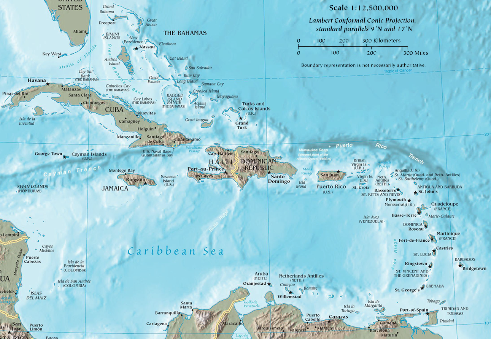

## Table of Contents

## What is the Caribbean Free Trade Association (CARIFTA)?

The Caribbean Free Trade Association, or CARIFTA, was a group formed by Caribbean countries to help them trade more easily with each other. It started on May 1, 1968, and was made up of countries like Jamaica, Trinidad and Tobago, and others. The main goal of CARIFTA was to reduce trade barriers, like tariffs, so that goods could move freely between these countries. This was important because it helped the economies of these countries grow by making it easier for them to buy and sell things with each other.

CARIFTA worked well for a while, but soon the member countries realized they needed more than just free trade. They wanted to work together more closely in other areas too, like industry and agriculture. So, in 1973, CARIFTA was replaced by a new group called the Caribbean Community (CARICOM). CARICOM included everything that CARIFTA did, but it also helped the countries work together in more ways. Even though CARIFTA doesn't exist anymore, it was an important step towards greater cooperation among Caribbean nations.

## When was CARIFTA established and why?

CARIFTA was established on May 1, 1968. The main reason for starting CARIFTA was to help Caribbean countries trade more easily with each other. Before CARIFTA, there were many barriers to trade, like tariffs, which made it hard for these countries to buy and sell things with each other. By forming CARIFTA, these countries hoped to remove these barriers and make trade simpler.

The idea was to boost the economies of the member countries by allowing goods to move freely between them. Countries like Jamaica, Trinidad and Tobago, and others joined together in this effort. CARIFTA worked well for a few years, but soon the member countries realized they needed more than just free trade. They wanted to work together in other areas too, which led to the creation of CARICOM in 1973. Even though CARIFTA no longer exists, it was an important step towards greater cooperation among Caribbean nations.

## Which countries are members of CARIFTA?

CARIFTA was made up of several Caribbean countries. The main members were Jamaica, Trinidad and Tobago, Guyana, and Barbados. These countries joined together to make trade easier between them.

Other countries that were part of CARIFTA included Antigua, Dominica, Grenada, St. Kitts-Nevis-Anguilla, Saint Lucia, and Saint Vincent and the Grenadines. All these countries wanted to help their economies grow by trading more freely with each other.

Even though CARIFTA doesn't exist anymore, it was important because it helped these countries work together. Later, they formed CARICOM, which did even more to help them cooperate.

## What are the main objectives of CARIFTA?

The main goal of CARIFTA was to make it easier for Caribbean countries to trade with each other. Before CARIFTA, there were many rules and taxes that made it hard for these countries to buy and sell things with each other. By joining CARIFTA, the countries agreed to lower these barriers, like tariffs, so that goods could move freely between them. This was important because it helped the economies of these countries grow by making trade simpler and more efficient.

Another objective of CARIFTA was to help the member countries work together to improve their economies. By trading more with each other, the countries hoped to create more jobs and make their businesses stronger. CARIFTA was successful in doing this for a few years, but the member countries soon realized they needed to cooperate in other areas too, like industry and agriculture. This led to the creation of CARICOM in 1973, which included all the goals of CARIFTA but went further to help the countries work together in more ways.

## How does CARIFTA promote trade among its member countries?

CARIFTA promoted trade among its member countries by getting rid of many trade barriers. Before CARIFTA, countries had to pay high taxes, called tariffs, when they bought and sold things with each other. CARIFTA helped lower these tariffs, which made it cheaper and easier for countries like Jamaica, Trinidad and Tobago, and others to trade with each other. By doing this, CARIFTA helped businesses grow and created more jobs in the member countries.

By making trade simpler, CARIFTA also helped the economies of its member countries get stronger. When countries could trade more easily, they could sell more of what they made and buy things they needed at a lower cost. This helped businesses in these countries make more money and helped people find more work. Even though CARIFTA doesn't exist anymore, it was an important step that showed how working together could help the Caribbean countries grow.

## What are the key economic benefits that member countries gain from CARIFTA?

The main economic benefit that member countries gained from CARIFTA was easier trade. Before CARIFTA, countries had to pay high taxes, called tariffs, to buy and sell things with each other. CARIFTA lowered these tariffs, which made it cheaper and easier for countries like Jamaica, Trinidad and Tobago, and others to trade. This helped businesses in these countries sell more of what they made and buy things they needed at a lower cost. When businesses could trade more easily, they made more money, which helped the economies of the member countries grow.

Another key benefit was that CARIFTA helped create more jobs. When trade between countries got easier, businesses grew bigger and needed more workers. This meant more people could find work, which helped the economy get stronger. CARIFTA also encouraged countries to work together, which led to better cooperation in other areas like industry and agriculture. Even though CARIFTA doesn't exist anymore, it showed how working together could help Caribbean countries improve their economies.

## What challenges does CARIFTA face in achieving its goals?

CARIFTA faced some big challenges in achieving its goals. One big problem was that the countries in CARIFTA were different in many ways. Some were richer and had stronger economies, while others were poorer and had weaker economies. This made it hard for them to agree on how to lower trade barriers. The richer countries wanted to protect their businesses, so they didn't want to lower tariffs as much as the poorer countries did. This made it hard for CARIFTA to make trade easier for everyone.

Another challenge was that CARIFTA only focused on trade. The member countries soon realized they needed to work together in other areas too, like industry and agriculture. They wanted to help each other grow in more ways than just trading goods. This need for more cooperation led to the creation of CARICOM in 1973. CARICOM did everything that CARIFTA did, but it also helped the countries work together in more areas. So, even though CARIFTA helped make trade easier, its focus on just trade was a challenge that led to its replacement by CARICOM.

## How has CARIFTA evolved since its inception?

CARIFTA started on May 1, 1968, with the goal of making trade easier between Caribbean countries. It did this by lowering tariffs and other trade barriers, which helped countries like Jamaica, Trinidad and Tobago, and others trade more freely. This was good for their economies because it made it cheaper and easier for businesses to buy and sell things with each other. CARIFTA worked well for a few years, but the member countries soon realized they needed more than just free trade. They wanted to work together in other areas like industry and agriculture too.

Because of this, CARIFTA evolved into the Caribbean Community (CARICOM) in 1973. CARICOM included everything that CARIFTA did, but it also helped the countries cooperate in more ways. This was important because it allowed the countries to help each other grow in more areas than just trade. Even though CARIFTA doesn't exist anymore, it was an important step that showed how working together could help Caribbean countries improve their economies. The evolution from CARIFTA to CARICOM shows how the needs of the member countries changed and how they adapted to work together more effectively.

## What is the relationship between CARIFTA and other regional trade agreements like CARICOM?

CARIFTA and CARICOM are closely related because CARICOM was created from CARIFTA. CARIFTA started in 1968 to help Caribbean countries trade more easily with each other by lowering tariffs and other trade barriers. This was good for the economies of countries like Jamaica, Trinidad and Tobago, and others because it made trade simpler. But after a few years, the member countries realized they needed more than just free trade. They wanted to work together in other areas too, like industry and agriculture.

So, in 1973, CARIFTA evolved into CARICOM. CARICOM kept all the goals of CARIFTA, like making trade easier, but it also helped the countries cooperate in more ways. This was important because it allowed the countries to help each other grow in more areas than just trade. Even though CARIFTA doesn't exist anymore, it was an important step that showed how working together could help Caribbean countries improve their economies. The evolution from CARIFTA to CARICOM shows how the needs of the member countries changed and how they adapted to work together more effectively.

## How does CARIFTA handle disputes among member countries?

CARIFTA had a way to handle disputes among its member countries. If two or more countries had a disagreement about trade, they would try to talk it out first. They would meet and discuss the problem to see if they could solve it together. This was important because it helped keep good relationships between the countries.

If talking didn't work, CARIFTA had a special group called the Council of Ministers. This group was made up of important people from each country. They would look at the dispute and make a decision. Everyone had to follow what the Council decided. This helped make sure that disagreements didn't stop the countries from trading with each other.

## What are the future prospects for CARIFTA in the global trade environment?

CARIFTA doesn't exist anymore because it turned into CARICOM in 1973. But we can still talk about what it could have done in the future if it had kept going. CARIFTA helped Caribbean countries trade more easily with each other by lowering tariffs and other trade barriers. If it had stayed around, it might have tried to make trade even easier by working with other big trade groups like the World Trade Organization (WTO). This could have helped Caribbean countries sell their things to more places around the world.

Even though CARIFTA is gone, its ideas are still important. The main goal was to help Caribbean countries work together and grow their economies. If CARIFTA had continued, it might have focused on new ways to help its members, like using technology to trade more easily or working together on big projects. But since CARICOM took over, it's now up to CARICOM to keep these ideas going and help the Caribbean countries do well in the global trade world.

## What specific policies or initiatives has CARIFTA implemented to enhance economic integration?

CARIFTA worked hard to make trade easier between Caribbean countries. It did this by lowering tariffs, which are like taxes on things that countries buy and sell. When tariffs went down, it was cheaper for countries like Jamaica, Trinidad and Tobago, and others to trade with each other. This helped their businesses grow and made more jobs for people. CARIFTA also made rules to make sure everyone followed the same trade laws. This helped keep things fair and made it easier for countries to trust each other when they traded.

Even though CARIFTA is not around anymore, it started some important ideas that are still used today. One big thing it did was to get countries to work together. By making trade easier, CARIFTA showed that working together could help everyone's economy grow. This led to the creation of CARICOM, which took CARIFTA's ideas and did even more to help Caribbean countries work together. CARICOM kept the goal of making trade easier but also helped countries work on other things like industry and agriculture. This way, CARIFTA's work on economic integration lived on and helped the Caribbean countries even more.

## References & Further Reading

[1]: Girvan, N. (2005). ["Caribbean Integration and Global Europe: Implications of the EPA for the CSME."](https://www.bilaterals.org/?caribbean-integration-and-global) Presented at the SALISES 6th Annual Conference, Trinidad and Tobago.

[2]: Bennoit, A., & Huggins, D. W. (2001). "CARICOM Single Market and Economy: Is it the Lignum Vitae, or is it an Unattainable Dream?" Global Policy, 2(3).

[3]: CARICOM Secretariat. (2005). ["Revised Treaty of Chaguaramas Establishing the Caribbean Community Including the CARICOM Single Market and Economy."](https://caricom.org/treaties/revised-treaty-of-chaguaramas-establishing-the-caricom-including-csme/)

[4]: Aldridge, I. (2013). ["High-Frequency Trading: A Practical Guide to Algorithmic Strategies and Trading Systems."](https://www.amazon.com/High-Frequency-Trading-Practical-Algorithmic-Strategies/dp/1118343506) Wiley.

[5]: Cumming, D. J., & Johan, S. (2013). ["Algorithmic Trading and Information."](https://onlinelibrary.wiley.com/doi/abs/10.1002/sej.1265) In: Handbook of the Economics of Finance, Elsevier.