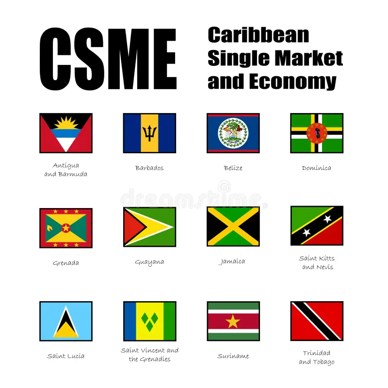

## Table of Contents

## What is the Caribbean Single Market and Economy (CSME)?

The Caribbean Single Market and Economy (CSME) is a plan by Caribbean countries to work together more closely. It is part of the Caribbean Community (CARICOM), which is a group of countries in the Caribbean that want to improve their economies and help each other. The main goal of the CSME is to make it easier for people and businesses in these countries to trade with each other and move around freely.

The CSME allows people from member countries to work in any other member country without needing a work permit. This helps people find better jobs and opportunities. It also makes it easier for businesses to sell their goods and services across different countries in the Caribbean. By working together, these countries hope to grow their economies and become stronger as a region.

## Which countries are members of the CSME?

The CSME includes many countries from the Caribbean. Some of the countries that are part of it are Antigua and Barbuda, The Bahamas, Barbados, Belize, Dominica, Grenada, Guyana, Haiti, Jamaica, Montserrat, Saint Kitts and Nevis, Saint Lucia, Saint Vincent and the Grenadines, Suriname, and Trinidad and Tobago.

Not all of these countries are fully participating in every part of the CSME. Some countries have joined certain aspects of the CSME but not others. For example, The Bahamas and Haiti are not fully participating in all areas of the CSME, but they are still members of CARICOM.

## What are the main objectives of the CSME?

The main goal of the Caribbean Single Market and Economy (CSME) is to help Caribbean countries work together better. It wants to make it easier for people and businesses in these countries to trade with each other. By doing this, the CSME hopes to grow the economies of these countries and make them stronger. It also wants to create more jobs and opportunities for people in the Caribbean.

Another important objective of the CSME is to allow people to move freely between member countries. This means that someone from one country can go to another country to work without needing a special permit. This helps people find better jobs and improves their lives. By working together and sharing resources, the CSME aims to make the Caribbean a better place for everyone.

## How does the CSME facilitate trade among member countries?

The CSME helps countries in the Caribbean trade with each other by making it easier for businesses to sell their goods and services across different countries. It does this by removing trade barriers, like taxes on goods that are moved between member countries. This makes it cheaper and simpler for businesses to sell their products in other Caribbean countries. By lowering these costs, businesses can sell more and make more money, which helps grow the economies of the member countries.

Another way the CSME helps trade is by creating a common market. This means that businesses from one country can compete fairly with businesses from other countries in the CSME. It also encourages countries to work together on big projects, like building better roads or ports, which can help move goods more easily. By working together, the countries can share the costs and benefits of these projects, making trade smoother and more efficient for everyone in the Caribbean.

## What are the benefits of the CSME for businesses and citizens?

The CSME helps businesses by making it easier for them to sell their goods and services in different Caribbean countries. It does this by removing taxes and other barriers that make trade more expensive. This means businesses can sell more products without worrying about extra costs, which can help them grow and make more money. The CSME also creates a fair competition environment where businesses from any member country can compete on equal terms. This encourages businesses to improve their products and services to attract more customers.

For citizens, the CSME offers many benefits too. One big advantage is the freedom to move and work in any member country without needing a special permit. This means people can look for better job opportunities in different countries, which can improve their lives and careers. The CSME also aims to create more jobs overall by helping businesses grow and by encouraging countries to work together on big projects. This can lead to better infrastructure, like roads and ports, which can make life easier and more comfortable for everyone in the Caribbean.

## What challenges does the CSME face in its implementation?

The CSME faces several challenges in making it work well. One big problem is that not all countries are fully participating in every part of the CSME. Some countries have joined certain parts but not others, which makes it hard for everyone to work together smoothly. Another challenge is the different levels of development among the countries. Some countries are richer and more developed than others, which can make it difficult to agree on how to share benefits and costs fairly.

Another issue is the lack of good infrastructure in some countries. For the CSME to work well, countries need good roads, ports, and communication systems to move goods and people easily. But building these things can be expensive and take a long time. There are also challenges with laws and regulations. Each country has its own rules, and making them work together can be complicated. This can slow down trade and make it harder for people to move freely between countries.

## How does the CSME promote free movement of people?

The CSME helps people move freely by letting them work in any member country without needing a special work permit. This means someone from one Caribbean country can go to another country to find a job and start working right away. This is good because it helps people find better jobs and opportunities. It also makes it easier for families to stay together if they need to move to another country for work.

But there are some challenges too. Not all countries in the CSME are fully participating in this part of the plan. Some countries have rules that make it harder for people to move freely. Also, different countries have different laws and ways of doing things, which can make it confusing for people trying to move. Even with these challenges, the CSME is trying to make it easier for people to move and work in the Caribbean, which can help improve their lives.

## What role does the Caribbean Court of Justice play in the CSME?

The Caribbean Court of Justice (CCJ) is very important for the CSME. It helps make sure that the rules and agreements of the CSME are followed by all the countries. The CCJ acts like a judge for any disagreements that happen between countries or businesses in the CSME. This helps keep everything fair and makes sure that everyone follows the same rules.

The CCJ also helps explain the laws of the CSME. Sometimes, the rules can be hard to understand, and the CCJ makes sure that everyone knows what they mean. This is important because it helps businesses and people know their rights and what they can do in different countries. By doing this, the CCJ makes it easier for the CSME to work well and helps the Caribbean countries work together better.

## How does the CSME address economic disparities among member states?

The CSME tries to help countries that are not as rich as others by working together. Some countries in the Caribbean have more money and better jobs than others. The CSME wants to make things more equal by letting people move and work in any country they want. This way, people from poorer countries can find better jobs in richer countries, which can help them earn more money and improve their lives. The CSME also helps businesses from all countries trade more easily, which can bring more money to poorer countries and help them grow.

Another way the CSME helps with economic differences is by sharing resources and working on big projects together. For example, if a poorer country needs better roads or ports, richer countries can help pay for them. This can make it easier for businesses in the poorer country to sell their goods to other countries. By working together, the CSME aims to make sure that all countries in the Caribbean can grow and that everyone has a chance to do better.

## What measures are in place to harmonize laws and regulations across the CSME?

The CSME works to make the laws and rules the same across all the countries by having them talk and work together. They do this through meetings and agreements where they decide on common rules that everyone will follow. This helps businesses and people know what to expect when they move or trade between countries. It also makes it easier for everyone to work together because they all follow the same rules.

One important way they do this is by using the Caribbean Court of Justice (CCJ). The CCJ helps explain the laws and makes sure everyone follows them. If there are disagreements about the rules, the CCJ can decide what is right. This helps keep things fair and makes sure the CSME can work well. By having the same laws and rules, the CSME can help the countries work together better and make life easier for everyone in the Caribbean.

## How does the CSME contribute to regional integration and development?

The CSME helps Caribbean countries work together and grow stronger as a group. It does this by making it easier for people and businesses to move and trade between countries. When people can work in any country they want, they can find better jobs and make more money. Businesses can sell their products in more places without worrying about extra costs, which helps them grow and create more jobs. By working together, the countries can share resources and help each other build things like better roads and ports, which makes life easier for everyone.

The CSME also tries to make things more equal among the countries. Some countries are richer than others, and the CSME wants to help the poorer ones catch up. By letting people from poorer countries find jobs in richer ones, it helps them earn more money and improve their lives. The CSME also encourages countries to work on big projects together, so the costs and benefits are shared. This way, all countries can grow and develop, making the whole Caribbean region stronger and better for everyone.

## What future developments are anticipated for the CSME?

In the future, the CSME hopes to get even better at helping Caribbean countries work together. They want to make it even easier for people to move and work in different countries without any problems. This means making the rules the same in all countries so everyone knows what to expect. They also want to help businesses sell their products more easily across the Caribbean. By doing this, they hope to create more jobs and make life better for everyone.

Another thing the CSME wants to do is help poorer countries catch up with richer ones. They plan to do this by sharing money and resources to build things like better roads and schools. This will help everyone in the Caribbean have a chance to do well. The CSME also wants to work more closely with other countries outside the Caribbean to bring in more money and opportunities. By working together and planning for the future, the CSME aims to make the Caribbean a stronger and happier place.

## References & Further Reading

[1]: ["Caribbean Community (CARICOM)."](https://en.wikipedia.org/wiki/Caribbean_Community) Official website of the Caribbean Community, providing detailed information about the CSME and regional integration efforts.

[2]: Lopez de Prado, M. (2018). ["Advances in Financial Machine Learning."](https://www.amazon.com/Advances-Financial-Machine-Learning-Marcos/dp/1119482089) John Wiley & Sons. A comprehensive guide discussing how machine learning can be applied to improve financial trading systems.

[3]: Chan, E. P. (2008). ["Quantitative Trading: How to Build Your Own Algorithmic Trading Business."](https://github.com/ftvision/quant_trading_echan_book) John Wiley & Sons. This book provides insights into building and operating an algorithmic trading business, relevant to exploring algorithmic trading within Caribbean markets.

[4]: Aronson, D. R. (2007). ["Evidence-Based Technical Analysis: Applying the Scientific Method and Statistical Inference to Trading Signals."](https://onlinelibrary.wiley.com/doi/book/10.1002/9781118268315) John Wiley & Sons. Offers methods on applying scientific analysis to trading, which can enhance understanding of algorithmic trading benefits.

[5]: Jansen, S. (2020). ["Machine Learning for Algorithmic Trading."](https://github.com/stefan-jansen/machine-learning-for-trading) Packt Publishing. Discusses the application and benefits of machine learning in creating efficient trading algorithms applicable to the Caribbean context.