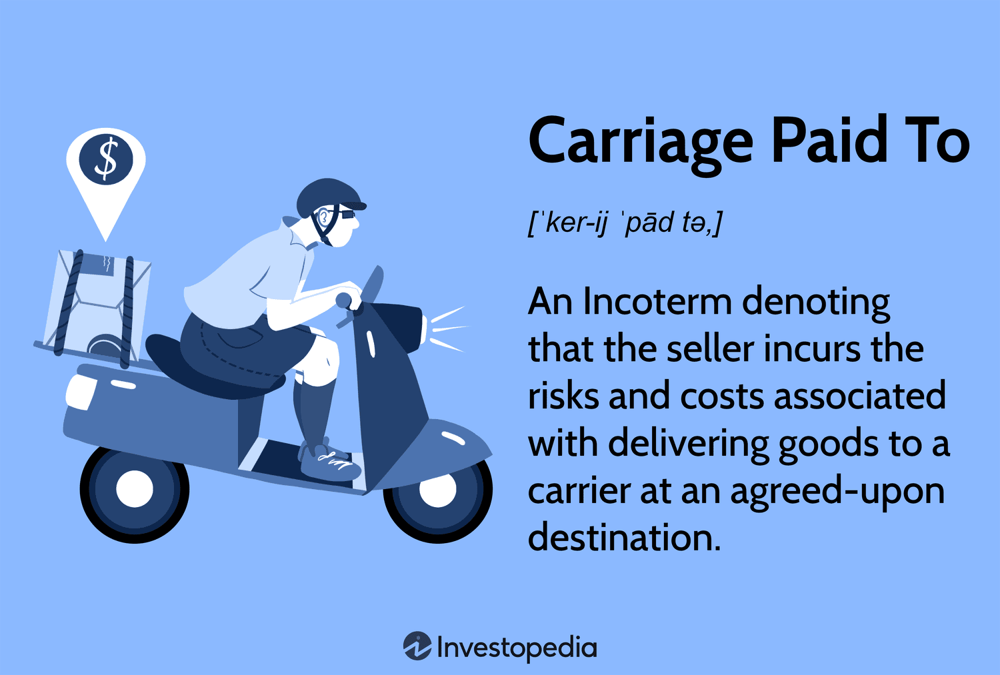

In international trade, understanding standardized shipping terms is crucial for ensuring seamless and efficient transactions between parties across different countries. Among these terms, the CPT (Carriage Paid To) Incoterms hold significant importance. Carriage Paid To is one of the terms developed by the International Chamber of Commerce (ICC) to provide clarity in trade by defining the responsibilities and risks associated with the transportation of goods.

Under CPT Incoterms, the seller is obligated to cover costs and assume risks until the goods are delivered to a carrier at an agreed-upon location. This arrangement provides a balanced framework where both parties understand their responsibilities, promoting smoother logistical operations. CPT is particularly versatile because it can be applied across multiple modes of transport, including land, sea, and air, making it a flexible choice for various types of international shipments.



The nuances of CPT Incoterms have significant implications for global trade. They not only facilitate trade operations by delineating cost and risk factors but also cater to the dynamic needs of diverse markets. It is essential for traders, logistics professionals, and business owners to comprehend these terms thoroughly to negotiate effectively and minimize potential disputes.

Beyond traditional trade, CPT Incoterms also have a role in the expanding arena of algorithmic trading. As algorithms increasingly dictate commodity and derivatives trading strategies, understanding shipping logistics such as CPT can impact pricing models and delivery timelines. This integration highlights the broader influence of shipping terms in optimizing global trading outcomes.

## Table of Contents

## What is CPT Incoterms?

Carriage Paid To (CPT) is a crucial term within international trade that defines the responsibilities of buyers and sellers in accordance with shipping logistics. As outlined by the International Chamber of Commerce (ICC) in its Incoterms standards, CPT mandates that sellers cover all necessary costs related to transporting goods to a predetermined location. This includes expenses up to the point where the goods are handed over to a designated carrier agreed upon by both parties.

Under CPT agreements, the seller's obligations extend only to covering transportation costs and arranging the shipment to the specified destination. However, the transfer of risk occurs much earlier. The moment the goods are delivered to the first carrier, all risks associated with loss or damage transfer from the seller to the buyer. This specific risk transfer point distinguishes CPT from other Incoterms and is a critical consideration for both parties involved in the transaction.

In practice, the named destination in a CPT contract can vary. For instance, it may be the buyer's city or another specified location where the responsibility of arranging further transport or delivery falls upon the buyer. Such an arrangement simplifies the process for sellers, allowing them to manage logistics up to the initial handover, post which the buyer assumes responsibility for the goods.

The CPT agreement's flexibility and clarity benefit international trade, providing a standardized understanding of transportation cost coverage while demarcating the transition point of risk. This not only facilitates smoother transactions but also helps businesses plan and strategize effectively, anticipating their responsibilities and liabilities accordingly.

## Understanding CPT

CPT (Carriage Paid To) serves as a key element in international trade, dictating the terms under which a seller is obligated to cover all transport-related expenses until the goods reach the first carrier at a designated destination. This stipulation significantly reduces the logistical and financial burden on the buyer, creating a more streamlined transaction experience.

The adaptability of the CPT term is one of its defining characteristics, making it applicable across various modes of transportation, including land, sea, and air. Regardless of the transportation method, the seller retains the responsibility for the carriage costs, ensuring that the buyer does not have to manage these complexities initially. However, this convenience for the buyer goes hand-in-hand with the need to be aware of the associated risks.

Under CPT, the transfer of risk from seller to buyer occurs when the goods are handed over to the carrier, not when they reach their final destination. This early risk transfer necessitates critical decision-making by the buyer regarding insurance coverage. Since any damage or loss that occurs during transit becomes the responsibility of the buyer once the goods are with the carrier, securing adequate insurance is essential to safeguard against potential losses.

For buyers, a thorough understanding of these risks and liabilities is crucial to inform their logistical strategies and insurance procurement. By doing so, buyers can effectively mitigate the risks inherent in the transportation process and ensure that their interests are adequately protected throughout the transaction. As such, CPT requires both parties to engage in strategic planning to optimize the benefits while managing the risks associated with international trade under this Incoterm.

## Practical Example of CPT

Consider a shipment from a seller in Germany to a buyer in Japan labeled as CPT Tokyo. In this scenario, the seller in Germany is obligated to arrange and cover all transportation costs required to move the goods to Tokyo. This means that the seller will pay for the transportation and any other associated costs up to the designated port in Tokyo. Once the goods are handed over to the first carrier in Germany, the risk associated with the goods shifts from the seller to the buyer. This transfer of risk occurs irrespective of the actual physical location of the goods and highlights the importance of understanding the terms under which the risk is transferred.

For the buyer in Japan, this means that while they do not have to worry about initial transportation costs, they must consider purchasing insurance to cover potential risks that might occur during transit. Since the risk passes from the seller to the buyer once the goods are delivered to the carrier, any incidents, such as damage or loss, that occur after this transfer are not the responsibility of the seller. Therefore, it is crucial for the buyer to have appropriate insurance coverage starting from the point the goods are handed over to the carrier.

This example underscores the importance of understanding the terms of the CPT agreement, as it informs both the buyer and the seller of their respective responsibilities and risks. The seller must ensure that all arrangements and payments for the transport up to the specified destination are made, while the buyer must manage the risk from the point the goods are in transit with the carrier until they reach Tokyo. This clarity in roles facilitates smoother transactions and helps in managing expectations and responsibilities effectively in international trade.

## Advantages and Disadvantages of CPT

The Carriage Paid To (CPT) Incoterm offers several advantages and disadvantages for both sellers and buyers in international trade agreements.

### Advantages for Sellers
One of the primary advantages for sellers utilizing the CPT Incoterm is the ability to increase sales by offering more attractive terms to buyers. By ensuring that goods are transported to a predetermined location, sellers can make their offerings more appealing to buyers who are looking to minimize the complexities associated with international purchasing. Since sellers manage and pay for transport up to the first carrier, buyers are more inclined to engage due to reduced logistical involvement on their part.

### Advantages for Buyers
For buyers, the CPT terms minimize initial costs and logistical responsibilities related to the transportation of goods. Buyers do not have to navigate the complexities of organizing international freight transport to the carrier, consequently reducing their operational burden. This arrangement may also enable better cash flow management as they can allocate resources elsewhere until the risk transfers to them.

### Disadvantages for Buyers
However, while CPT terms offer convenience, they also pigeonhole buyers into assuming risk earlier in the transportation process. The risk transfers to the buyer as soon as the goods are handed over to the first carrier, which can be inconvenient and risky in the event of any mishaps or accidents during transit. Buyers must be astute in acquiring insurance to mitigate these risks effectively.

### Disadvantages for Sellers
On the sellers' side, the primary disadvantage is the increased risk and cost until the goods reach the first carrier. Sellers must manage and pay for the transportation costs up to the handover point, necessitating efficient logistics management. Furthermore, sellers might need to exert in-depth control over their selection of transportation modes and carriers to ensure timely and cost-effective delivery, adding another layer of complexity to their operations.

These elements underline the importance of carefully weighing both benefits and obligations associated with CPT, ensuring that both sellers and buyers make informed decisions aligned with their strategic trade objectives.

## CPT vs. Other Incoterms

CPT (Carriage Paid To) is one of several Incoterms that delineate responsibilities and risks in international trade. Comparing CPT with other terms like CIF (Cost, Insurance, and Freight) and DDP (Delivered Duty Paid) reveals important differences that influence trade agreements.

CIF is specific to maritime shipping and obligates the seller to arrange and pay for transportation of goods to the destination port. Under CIF, the seller also provides insurance covering the goods during the maritime leg of the journey. The critical distinction in CIF is that the risk transfers to the buyer once the goods pass the ship's rail at the port of shipment. This ensures that the buyer's risk starts when the goods are loaded onto the vessel, aligning cost and risk transfer points in a maritime context.

On the other hand, CPT applies to any mode of transport and requires the seller to pay for carriage to a named destination but does not include insurance. The risk shifts to the buyer once the goods are delivered to the first carrier, as opposed to when the goods are loaded onto a vessel as with CIF. This earlier transfer of risk underlines the importance for buyers choosing CPT to manage insurance and logistics considerations proactively from the outset of transportation.

DDP is another Incoterm, placing the maximum obligation on the seller who must cover all costs and risks until the goods are delivered to the buyer's premises. This term flips the responsibilities observed in CPT and CIF, as the seller bears the burden of import duties and taxes, ensuring that the buyer incurs no logistical responsibility until receipt of the goods.

For businesses, understanding these terms is essential to align logistical strategies and risk exposure with their operational capabilities and risk tolerance. Tailoring agreements with an informed choice of Incoterms can enhance efficiency and safeguard interests in international transactions.

## CPT in Algo Trading

In [algorithmic trading](/wiki/algorithmic-trading), precise knowledge of shipping logistics, such as those encapsulated by the CPT (Carriage Paid To) Incoterms, can significantly impact the development and execution of trading strategies, particularly in commodities and derivatives markets. Shipping terms like CPT influence not only the physical delivery of goods but also the economic models that underpin algorithmic trading systems.

CPT terms affect pricing models by altering the timeline and cost structure of the delivery process. In commodity trading, for example, the cost associated with transporting the physical goods from the seller to a designated point is crucial for calculating margins and forecasting profits. Since the risk in CPT transfers to buyers once the goods are with the first carrier, traders must incorporate potential risk factors into their algorithms. The formula for assessing costs could be represented as:

$$
\text{Total Cost} = \text{CPT Price} + \text{Risk Premium} + \text{Additional Charges}
$$

Where the risk premium reflects uncertainties arising from the point of risk transition under CPT terms, necessitating traders to [factor](/wiki/factor-investing) in the potential [volatility](/wiki/volatility-trading-strategies) during transportation.

Additionally, traders aiming to optimize algorithms must account for differing responsibilities and risk allocations. Implementing conditionals in an algorithm that adjusts for variable scenarios can enhance predictive accuracy and risk management. For instance, using Python, a basic example might involve adjusting commodity pricing based on risk assessments:

```python
def calculate_price(cpt_price, risk_factor, additional_charges):
    risk_premium = cpt_price * risk_factor
    total_cost = cpt_price + risk_premium + additional_charges
    return total_cost

cpt_price = 1000  # Example CPT price
risk_factor = 0.05  # Example risk factor (5%)
additional_charges = 50  # Additional charges

price = calculate_price(cpt_price, risk_factor, additional_charges)
print(f"Total Trading Price: {price}")
```

In a global trading context, understanding how CPT affects delivery responsibilities and timelines allows for optimized decisions. Territories subject to high transportation risks might necessitate alterations in trade routes or adjustments in expected delivery punctuality. These changes can be simulated within algorithms to enhance decision-making processes, ultimately yielding more robust trading strategies. The alignment between shipping terms like CPT and trading algorithms reflects a symbiotic relationship essential for optimizing outcomes in international trade operations.

## Conclusion

CPT Incoterms play an essential role in international trade by clearly delineating cost and risk responsibilities between parties. This clarity contributes significantly to the efficacy of global transactions. For sellers and buyers, a thorough grasp of the implications associated with CPT enhances transaction efficiency by ensuring that each party is aware of its obligations concerning transportation costs and risk transfer points. This awareness is vital for minimizing misunderstandings and disputes, thereby fostering smoother trade relations.

In trading environments, including algorithmic trading, understanding Incoterms such as CPT can markedly influence pricing models and strategies. The specification of cost and risk factors under CPT might impact the delivery timelines and overall cost structures, thus affecting algorithmic calculations. Traders can refine their algorithms by integrating these variables, thereby optimizing trading strategies for better risk management and cost efficiency.

Moreover, expertise in CPT and other Incoterms is crucial for successful international trade ventures. These terms provide a standardized framework that allows traders to tailor agreements according to specific business needs and risk tolerances. By integrating detailed knowledge of Incoterms into their operational strategies, businesses can enhance their competitive edge in the global market. Thus, a comprehensive understanding of CPT Incoterms supports not only transactional transparency and efficiency but also strategic advancements in trading environments.

## References & Further Reading

[1]: International Chamber of Commerce. ["Incoterms® 2020: ICC Rules for the Use of Domestic and International Trade Terms."](https://iccwbo.org/business-solutions/incoterms-rules/incoterms-2020/) ICC Publications.

[2]: Schmitthoff, C. M. (2012). ["Schmitthoff: The Law and Practice of International Trade."](https://books.google.com/books/about/Schmitthoff_the_Law_and_Practice_of_Inte.html?id=TI2dcQAACAAJ) Sweet & Maxwell.

[3]: Ramberg, J. (2011). ["ICC Guide to Incoterms 2010."](https://archive.org/details/iccguidetoincote0000janr) ICC Services.

[4]: Slack, N., Brandon-Jones, A., & Johnston, R. (2016). ["Operations Management."](https://books.google.com/books/about/Operations_Management.html?id=wEqTDwAAQBAJ) Pearson Education.

[5]: Tirole, J. (1988). ["The Theory of Industrial Organization."](https://archive.org/details/theoryofindustri00jean) MIT Press.