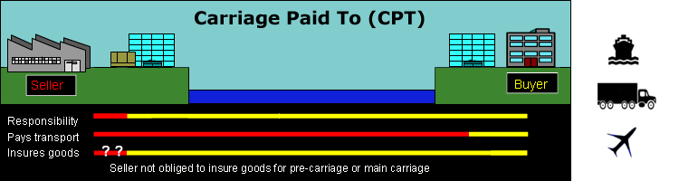

## Table of Contents

## What is Carriage Paid To (CPT)?

Carriage Paid To (CPT) is a term used in international trade. It means that the seller pays for the cost of transporting the goods to a destination that the buyer chooses. The seller is responsible for arranging the transport and paying for it up to that point. Once the goods reach the chosen destination, the buyer takes over and is responsible for any further costs and risks.

In simple terms, CPT helps to make things clear between the seller and the buyer about who pays for what. The seller's job is to get the goods to the agreed place, and after that, it's up to the buyer. This term is useful because it sets out responsibilities clearly, helping to avoid confusion and disagreements.

## How does CPT differ from other Incoterms?

CPT is different from other Incoterms because it focuses on where the seller's responsibility ends. With CPT, the seller pays for the main transport to get the goods to a place the buyer picks. Once the goods get there, the buyer takes over and handles any more costs or risks. This is different from terms like EXW (Ex Works), where the buyer pays for everything from the start, or DAP (Delivered at Place), where the seller handles everything until the goods reach the final destination.

Another key difference is how risk and cost are split. For example, with FOB (Free on Board), the seller's responsibility ends when the goods are on the ship, and the buyer takes over from there. But with CPT, the seller pays for the transport to the destination, but the risk transfers to the buyer once the goods are handed over to the first carrier. This means that if something goes wrong during transport, the buyer might have to deal with it, even though the seller paid for the shipping. Understanding these differences helps businesses choose the right Incoterm for their needs.

## What are the responsibilities of the seller under CPT?

Under Carriage Paid To (CPT), the seller has some important jobs to do. The main job is to pay for the transport of the goods to a place the buyer chooses. This means the seller has to find a way to get the goods there, like using a truck, train, or ship, and pay for it. The seller also needs to get any export licenses or other documents needed to send the goods out of the country. They have to make sure the goods are packed well and ready to go.

Another thing the seller needs to do is to give the buyer the documents they need to get the goods from the carrier at the destination. These documents are important because they help the buyer to pick up the goods. But, once the seller hands the goods over to the first carrier, the risk of any damage or loss goes to the buyer. So, even though the seller pays for the transport, if something goes wrong during the trip, it's the buyer's problem to fix.

## What are the responsibilities of the buyer under CPT?

Under Carriage Paid To (CPT), the buyer has to take over once the goods reach the place they chose. This means the buyer needs to handle any costs and risks after the goods get to that point. If something goes wrong during the transport, like the goods getting damaged, the buyer has to deal with it, even though the seller paid for the shipping.

The buyer also needs to pay for any import duties or taxes when the goods arrive in their country. They have to get any permits or licenses needed to bring the goods into the country. The buyer should also make sure they have the right documents from the seller to pick up the goods from the carrier at the destination.

## How is risk transferred in a CPT transaction?

In a CPT transaction, the risk of the goods gets transferred from the seller to the buyer as soon as the goods are handed over to the first carrier. This means that even though the seller pays for the transport to get the goods to the place the buyer chose, if anything goes wrong during the trip, it's the buyer's problem. The seller's job is to get the goods to the carrier safely, but after that, the buyer has to deal with any damage or loss.

The buyer needs to be ready to handle any issues that might happen while the goods are on their way. This includes paying for any insurance if they want to be safe. The buyer also has to take care of any costs and risks once the goods reach the destination, like import duties and taxes. So, in a CPT deal, the seller pays to get the goods moving, but the buyer takes over the risk and any extra costs from the moment the goods are with the carrier.

## What costs are included in CPT?

In a CPT deal, the seller pays for the main transport to get the goods to the place the buyer picks. This includes the cost of sending the goods by truck, train, ship, or any other way they choose. The seller also has to pay for getting any export licenses or documents needed to send the goods out of their country. They need to make sure the goods are packed well and ready to go.

The buyer takes over once the goods reach the chosen place. This means the buyer has to pay for any import duties or taxes when the goods arrive in their country. They also need to get any permits or licenses needed to bring the goods into the country. If the buyer wants to be safe, they can pay for insurance during the transport, but that's their choice. So, in simple terms, the seller pays to get the goods moving, and the buyer pays for everything once the goods get to the destination.

## Can you explain the process of a typical CPT transaction?

In a typical CPT transaction, the seller starts by preparing the goods and packing them properly. They then arrange and pay for the main transport to get the goods to a place that the buyer has chosen. This could be by truck, train, ship, or any other way. The seller also needs to get any export licenses or documents needed to send the goods out of their country. Once everything is ready, the seller hands the goods over to the first carrier. At this point, the risk of any damage or loss transfers to the buyer, even though the seller paid for the transport.

When the goods reach the chosen destination, the buyer takes over. The buyer has to pick up the goods from the carrier and handle any costs and risks from that point on. This includes paying for any import duties or taxes when the goods arrive in their country. The buyer also needs to get any permits or licenses needed to bring the goods into the country. If the buyer wants to protect themselves from any problems during the transport, they can choose to buy insurance, but that's their responsibility. So, in a CPT deal, the seller gets the goods moving and pays for it, but the buyer takes over once the goods reach the destination.

## What documentation is required under CPT?

Under CPT, the seller needs to give the buyer certain documents. These documents are important for the buyer to pick up the goods from the carrier at the destination. The main document is usually a transport document, like a bill of lading or an air waybill, which shows that the goods have been handed over to the carrier. The seller also needs to provide any export documents needed to send the goods out of their country. This might include export licenses or certificates.

The buyer needs to make sure they have all the right documents to get the goods into their country. This includes any import documents, like customs declarations, and any permits or licenses needed for the goods. The buyer also has to handle any paperwork related to paying import duties or taxes. So, while the seller gives the buyer the documents to pick up the goods, the buyer has to take care of the documents needed to bring the goods into their country and pay any related costs.

## How does CPT affect insurance responsibilities?

In a CPT deal, the seller pays to get the goods moving to the place the buyer picks. But, the risk of anything going wrong with the goods goes to the buyer as soon as the seller hands the goods over to the first carrier. This means the buyer has to deal with any damage or loss during the trip, even though the seller paid for the transport.

Because the buyer takes on the risk, they might want to buy insurance to be safe. The buyer can choose to get insurance to cover any problems during the transport, but it's their choice and they have to pay for it. The seller doesn't have to get insurance for the goods once they're with the carrier, so it's up to the buyer to decide if they want to protect themselves.

## What are the advantages of using CPT for international trade?

Using CPT for international trade can make things easier for both the seller and the buyer. For the seller, CPT means they only have to pay for the transport up to a certain point. This can be good because it gives them a clear limit on their costs. They know they have to get the goods to the place the buyer chose, and after that, it's the buyer's job. This can help the seller plan their budget better and not worry about what happens after the goods are with the carrier.

For the buyer, CPT can be helpful because it lets them control where the goods go. They can pick the place where they want the goods to arrive, which can be important for their business. Even though the buyer has to handle any risks and costs after the goods reach that place, they can choose to buy insurance if they want to be safe. This way, the buyer knows what to expect and can plan for any extra costs or problems that might come up.

## What are the potential risks or disadvantages of using CPT?

Using CPT can have some risks for the buyer. The main risk is that the buyer has to deal with any damage or loss of the goods once they are handed over to the first carrier, even though the seller paid for the transport. This means if something goes wrong during the trip, like the goods getting damaged, the buyer has to handle it. The buyer might need to buy insurance to be safe, but that's an extra cost they have to pay. Also, the buyer has to take care of any import duties or taxes when the goods arrive, which can add to their costs.

For the seller, there can be some disadvantages too. Even though the seller only pays for the transport up to the place the buyer picks, they still have to make sure the goods are packed well and ready to go. If the goods are not packed properly and get damaged before they reach the carrier, the seller might have to deal with that. Also, the seller needs to get all the right export documents, which can be a lot of work. So, while CPT can make things clear, it also means both the seller and the buyer have to be careful about their responsibilities.

## How can businesses ensure compliance with CPT terms?

To make sure they follow CPT terms, businesses need to know exactly what each side has to do. The seller should pay for the transport to the place the buyer picks and make sure the goods are packed well. They also need to get the right export documents. The buyer has to handle any risks or costs after the goods reach the chosen place, like paying import duties and taxes. Both the seller and the buyer should check the contract carefully to understand their jobs and make sure they do them right.

It's also a good idea for businesses to talk to each other clearly. They should agree on the place where the goods will go and make sure the seller knows how to get the goods there. The buyer should be ready to take over once the goods arrive and know what to do next. If there are any problems, like the goods getting damaged, the buyer needs to have a plan, like buying insurance. By working together and understanding CPT, businesses can make sure everything goes smoothly and avoid any surprises.

## What is CPT in Algo Trading?

In [algorithmic trading](/wiki/algorithmic-trading), precise knowledge of shipping logistics, such as those encapsulated by the CPT (Carriage Paid To) Incoterms, can significantly impact the development and execution of trading strategies, particularly in commodities and derivatives markets. Shipping terms like CPT influence not only the physical delivery of goods but also the economic models that underpin algorithmic trading systems.

CPT terms affect pricing models by altering the timeline and cost structure of the delivery process. In commodity trading, for example, the cost associated with transporting the physical goods from the seller to a designated point is crucial for calculating margins and forecasting profits. Since the risk in CPT transfers to buyers once the goods are with the first carrier, traders must incorporate potential risk factors into their algorithms. The formula for assessing costs could be represented as:

$$
\text{Total Cost} = \text{CPT Price} + \text{Risk Premium} + \text{Additional Charges}
$$

Where the risk premium reflects uncertainties arising from the point of risk transition under CPT terms, necessitating traders to [factor](/wiki/factor-investing) in the potential [volatility](/wiki/volatility-trading-strategies) during transportation.

Additionally, traders aiming to optimize algorithms must account for differing responsibilities and risk allocations. Implementing conditionals in an algorithm that adjusts for variable scenarios can enhance predictive accuracy and risk management. For instance, using Python, a basic example might involve adjusting commodity pricing based on risk assessments:

```python
def calculate_price(cpt_price, risk_factor, additional_charges):
    risk_premium = cpt_price * risk_factor
    total_cost = cpt_price + risk_premium + additional_charges
    return total_cost

cpt_price = 1000  # Example CPT price
risk_factor = 0.05  # Example risk factor (5%)
additional_charges = 50  # Additional charges

price = calculate_price(cpt_price, risk_factor, additional_charges)
print(f"Total Trading Price: {price}")
```

In a global trading context, understanding how CPT affects delivery responsibilities and timelines allows for optimized decisions. Territories subject to high transportation risks might necessitate alterations in trade routes or adjustments in expected delivery punctuality. These changes can be simulated within algorithms to enhance decision-making processes, ultimately yielding more robust trading strategies. The alignment between shipping terms like CPT and trading algorithms reflects a symbiotic relationship essential for optimizing outcomes in international trade operations.

## References & Further Reading

[1]: International Chamber of Commerce. ["Incoterms® 2020: ICC Rules for the Use of Domestic and International Trade Terms."](https://iccwbo.org/business-solutions/incoterms-rules/incoterms-2020/) ICC Publications.

[2]: Schmitthoff, C. M. (2012). ["Schmitthoff: The Law and Practice of International Trade."](https://books.google.com/books/about/Schmitthoff_the_Law_and_Practice_of_Inte.html?id=TI2dcQAACAAJ) Sweet & Maxwell.

[3]: Ramberg, J. (2011). ["ICC Guide to Incoterms 2010."](https://archive.org/details/iccguidetoincote0000janr) ICC Services.

[4]: Slack, N., Brandon-Jones, A., & Johnston, R. (2016). ["Operations Management."](https://books.google.com/books/about/Operations_Management.html?id=wEqTDwAAQBAJ) Pearson Education.

[5]: Tirole, J. (1988). ["The Theory of Industrial Organization."](https://archive.org/details/theoryofindustri00jean) MIT Press.