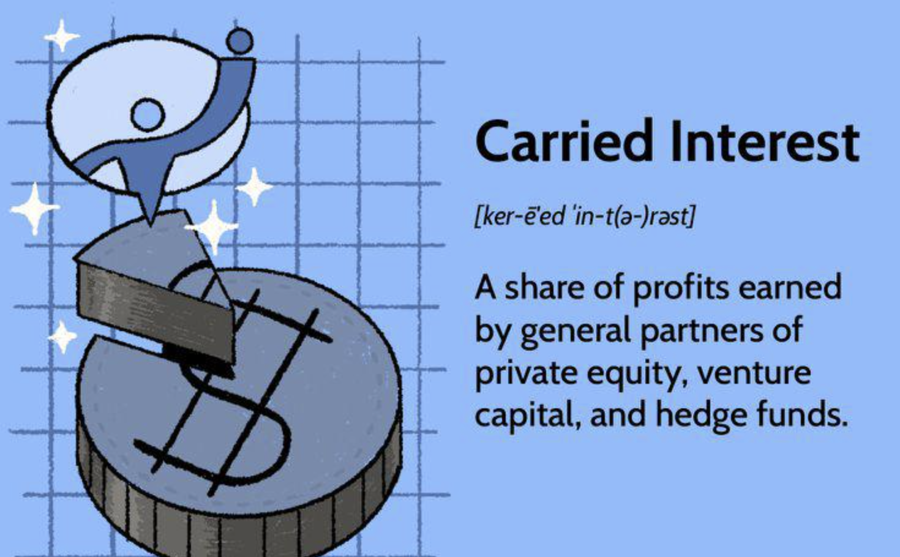

## Table of Contents

## What is carried interest?

Carried interest is a share of the profits that investment managers earn from the funds they manage. It's like a bonus they get for doing a good job. This is common in private equity and hedge funds, where managers get a part of the profits if the fund does well. The idea is to reward managers for making smart investments and growing the fund's value.

The way it works is that managers usually get about 20% of the profits as carried interest, but only after the investors get their initial investment back plus a certain return, called a "hurdle rate." This means the managers have to perform well before they can earn this bonus. Carried interest is often taxed at a lower rate than regular income, which can be controversial because some people think it should be taxed like normal salary.

## How does carried interest work in private equity and hedge funds?

In private equity and hedge funds, carried interest is like a reward for the managers who run the fund. They get a piece of the profits, usually around 20%, but only if the fund makes money. The way it works is that the investors first get back all the money they put in, plus a certain return called the "hurdle rate." Once that's covered, the managers can start earning their share of the extra profits. This setup is meant to encourage the managers to make good investments and grow the fund's value.

For example, imagine a private equity fund makes a big profit from selling a company it bought. After the investors get their initial investment back plus the hurdle rate, any extra money is split between the investors and the managers. The managers get their 20% carried interest from this extra profit. This can be a big deal for managers because it can be a lot of money, and it's often taxed at a lower rate than regular income. This lower tax rate can be controversial because some people think it should be taxed like a normal salary.

## What are the historical origins of carried interest?

Carried interest started a long time ago, back in the days of sailing ships and trade. In the 1500s and 1600s, people who owned ships would let others use their ships to go on trading trips. The ship owners would get a share of the profits from the trip, but they didn't have to pay for the trip itself. This share of the profits was called "carried interest" because the ship owners were "carrying" the interest in the voyage without spending money on it.

Over time, the idea of carried interest moved from ships to businesses. In the 1900s, it became popular in the world of investing, especially in private equity and hedge funds. Managers of these funds would get a share of the profits, just like the old ship owners. This was a way to reward them for making good investments and growing the fund's value. Today, carried interest is still used in the same way, but it's often a topic of debate because of how it's taxed.

## Who typically receives carried interest?

Carried interest is usually received by the managers of investment funds, like private equity and hedge funds. These managers work hard to find good investments and make the fund grow. When the fund makes money, the managers get a share of the profits, which is called carried interest. It's like a bonus for doing a good job.

The managers only get carried interest after the investors in the fund get their money back, plus a certain return called the "hurdle rate." This means the fund has to do well before the managers can earn their share. Carried interest is important because it motivates managers to make smart investments and help the fund succeed.

## What are the tax implications of carried interest for recipients?

Carried interest is often taxed at a lower rate than regular income. This is because it's considered a type of investment gain, not a salary. In the United States, for example, carried interest might be taxed as a long-term capital gain, which can be as low as 20%. This is much lower than the top rates for regular income, which can go up to 37%. People who get carried interest like this lower tax rate because it means they keep more of their earnings.

However, this lower tax rate can be controversial. Some people think that carried interest should be taxed like regular income because it's really a reward for the work that fund managers do. They argue that it's not fair for managers to pay less tax on their earnings than other workers. This debate has been going on for a while, and some lawmakers have tried to change the law to tax carried interest at a higher rate, but so far, the rules haven't changed much.

## How does carried interest align the interests of fund managers and investors?

Carried interest helps make sure that fund managers and investors want the same thing: for the fund to do well. When a fund makes money, the investors get their money back first, plus a certain return called the "hurdle rate." After that, the managers get a share of the extra profits, which is the carried interest. This setup means that managers only get their bonus if they make good investments and grow the fund's value. So, both the managers and the investors are working towards the same goal of making the fund successful.

This alignment of interests is important because it encourages managers to work hard and make smart choices. If the fund does well, everyone benefits. The investors get a good return on their money, and the managers get their carried interest. This way, managers are motivated to do their best because their reward depends on the fund's success. It's like a team effort where everyone wins if the fund does well.

## What are the arguments in favor of carried interest as a compensation model?

Carried interest is a good way to pay fund managers because it makes sure they work hard to make the fund successful. When the fund does well, the managers get a share of the profits, which is the carried interest. This means they only get their bonus if they make good investments and grow the fund's value. So, they are motivated to do their best because their reward depends on how well the fund does. It's like a team effort where everyone wins if the fund makes money.

Also, carried interest helps to align the interests of the managers and the investors. Both want the fund to do well, so the managers work hard to make smart choices that will make the fund grow. This way, investors know that the managers are working towards the same goal of making the fund successful. It's a fair system because the managers only get their bonus after the investors get their money back, plus a certain return. This setup encourages everyone to work together for the best results.

## What criticisms are commonly leveled against carried interest?

One big criticism of carried interest is that it is taxed at a lower rate than regular income. People say this is not fair because it means fund managers pay less tax on their earnings than other workers. They argue that carried interest should be taxed like a salary because it's really a reward for the work managers do. This lower tax rate has been a hot topic for a long time, and some lawmakers have tried to change the law, but so far, the rules haven't changed much.

Another criticism is that carried interest can make managers take too many risks. Because they only get their bonus if the fund makes a big profit, they might try to make risky investments to get a bigger reward. This can be bad for investors because they might lose money if the risky investments don't work out. Critics say the system should be set up to encourage smart and safe investments, not just risky ones.

## How has the taxation of carried interest been debated in recent policy discussions?

In recent policy discussions, the taxation of carried interest has been a big topic. Many people argue that it's not fair that fund managers pay a lower tax rate on their earnings from carried interest. They say it should be taxed like regular income because it's a reward for the work managers do. Some lawmakers have tried to change the law to make carried interest taxed at a higher rate, but so far, these changes haven't happened. The debate continues because many believe the current system benefits fund managers too much and doesn't treat everyone fairly.

Others argue that changing the tax rules on carried interest could hurt the economy. They say that if managers have to pay more taxes, they might not want to take risks and start new funds. This could mean fewer jobs and less investment in new businesses. So, the debate is about finding a balance between fairness in taxes and keeping the economy strong. Both sides have strong opinions, and it's a topic that keeps coming up in policy discussions.

## What alternatives to carried interest have been proposed or implemented in the industry?

Some people have come up with different ways to pay fund managers instead of using carried interest. One idea is to give managers a fixed salary and a bonus based on how well the fund does. This way, their pay is more like regular income and can be taxed at the same rate as everyone else's. Another idea is to give managers a share of the fund's profits, but only after the investors get a higher return than the usual "hurdle rate." This can make managers think more about the long-term success of the fund and not just about making quick profits.

Some funds have already started using these new ways to pay their managers. For example, some hedge funds give their managers a bigger part of the profits, but they also have to wait longer to get it. This encourages managers to make investments that will do well over time, not just in the short term. Other funds have tried to mix carried interest with other types of pay, like giving managers stock in the companies they invest in. This can help align the interests of the managers and the investors even more, making sure everyone works together for the best results.

## How do different countries treat carried interest for tax purposes?

Different countries have different rules about how to tax carried interest. In the United States, carried interest is often taxed as a long-term capital gain, which means it can be taxed at a lower rate than regular income. This can be as low as 20%, while the top rate for regular income can go up to 37%. In the United Kingdom, carried interest is also taxed at a lower rate, but they have a special rule called the "disguised investment management fee" that can make some of it taxed as income. This means that some parts of carried interest might be taxed at a higher rate.

In other places, like Germany, carried interest is treated more like regular income and taxed at the normal rates. This can be higher than in the U.S. or U.K. In Australia, carried interest can be taxed as a capital gain, but they have rules that can make it taxed as income if it's seen as payment for services. Each country has its own way of dealing with carried interest, and it can be confusing because the rules can change and be different from one place to another.

## What impact does carried interest have on fund performance and investor returns?

Carried interest can affect how well a fund does and how much money investors make. When managers get carried interest, it gives them a big reason to make the fund successful. They only get their bonus if the fund makes money, so they work hard to find good investments and grow the fund's value. This can help the fund do well because the managers are motivated to do their best. If the fund does well, investors get a good return on their money, and everyone is happy.

However, carried interest can also make managers take big risks. Because they only get their bonus if the fund makes a big profit, they might try to make risky investments to get a bigger reward. This can be bad for investors because they might lose money if the risky investments don't work out. So, while carried interest can help the fund do well, it can also lead to problems if managers focus too much on making quick profits instead of thinking about the long-term success of the fund.

## References & Further Reading

[1]: Kaplan, S. N., & Strömberg, P. (2009). ["Leveraged Buyouts and Private Equity."](https://www.aeaweb.org/articles?id=10.1257/jep.23.1.121) Journal of Economic Perspectives, 23(1), 121-146.

[2]: Phalippou, L. (2009). ["Private Equity Performance: What Do We Know?"](https://papers.ssrn.com/sol3/papers.cfm?abstract_id=1932316) The Review of Financial Studies, 22(4), 1747-1776.

[3]: Narang, R. K. (2009). ["Inside the Black Box: A Simple Guide to Quantitative and High Frequency Trading."](https://onlinelibrary.wiley.com/doi/book/10.1002/9781118662717) Wiley Finance.

[4]: Jegadeesh, N., & Titman, S. (1993). ["Returns to Buying Winners and Selling Losers: Implications for Stock Market Efficiency."](https://www.bauer.uh.edu/rsusmel/phd/jegadeesh-titman93.pdf) The Journal of Finance, 48(1), 65-91.

[5]: Hall, P., Burke, W., & Goodacre, A. (2020). ["The Role of Carried Interest in Private Equity."](https://pubs.asha.org/doi/pdf/10.1044/2020_JSLHR-20-00129?download=true) Journal of Financial Services Research, 58, 213-238.