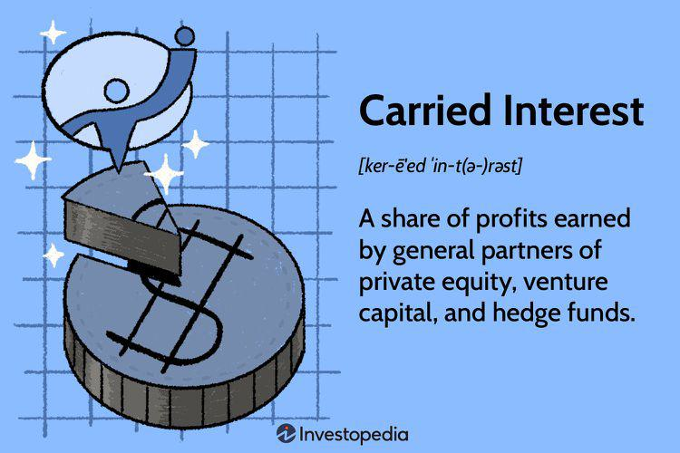

Carried interest is a form of performance-based compensation typically associated with private equity and hedge fund managers. It represents a share of the profits generated by an investment fund that is allocated to the investment manager, usually calculated as a percentage of the fund's net profit. This form of compensation is crucial in aligning the interests of fund managers with those of the investors, as it incentivizes managers to pursue profitable investment strategies.

Private equity investment involves investing capital in private companies or buying out public companies to restructure them and increase their value over time. Over the past few decades, private equity has experienced significant growth, driven by the demand for alternative investment opportunities and the potential for high returns. This growth is evidenced by a rise in the number of funds and total assets under management, as investors seek to diversify their portfolios beyond traditional stocks and bonds.

Algorithmic trading refers to the use of computerized systems to execute trading strategies based on pre-defined criteria. It has become an integral part of modern financial markets, leveraging advances in technology and data analytics to execute trades with speed and precision that surpasses human capabilities. Algorithmic trading provides significant advantages, such as reducing transaction costs and eliminating the emotional biases that can influence human traders.

The convergence of carried interest, private equity investment, and algorithmic trading represents a novel area of exploration within financial markets. This integration brings together the profit-sharing incentives of carried interest with the strategic investment opportunities of private equity and the technological prowess of algorithmic trading systems. Such synergies hold the potential for creating more robust investment strategies that combine human expertise with technological efficiency.

Understanding these concepts sets the stage for a discussion on the benefits and challenges of merging carried interest in private equity with algorithmic trading. This combination may unlock new avenues for investment, offering enhanced returns and reduced risks, thus capturing the interest of financial professionals looking to stay ahead in the evolving landscape of investment strategies.

## Table of Contents

## Understanding Carried Interest in Private Equity

Carried interest is a unique compensation structure primarily associated with private equity and hedge funds, where the fund managers receive a share of the profits generated by the fund. This performance-based compensation aligns the interests of the managers with those of the investors, as managers profit only when the fund is successful. Typically, carried interest constitutes around 20% of the fund’s profits, although this percentage can vary depending on the specific agreement between the fund managers and the investors. 

The fundamental mechanism of carried interest operates upon achieving a hurdle rate, which is a minimum rate of return set for the investors; only after surpassing this rate do managers receive their share of the profits. This ensures that managers are motivated to exceed baseline performance targets, thereby benefiting both the managers and the investors. For instance, if a fund realizes a profit of $10 million and the hurdle rate is met, the fund managers would receive $2 million if the carried interest is set at 20%.

Carried interest plays a crucial role in incentivizing fund managers, as it ties their compensation directly to the fund's performance. This alignment encourages managers to adopt strategies that aim for significant returns, fostering a culture of strategic and efficient investment planning. The potential to earn carried interest motivates managers to seek and exploit lucrative opportunities, improve the value of the portfolio companies, and employ effective [exit](/wiki/exit-strategy) strategies to maximize returns.

The profit-sharing aspect of carried interest is significant because it fosters a partnership-like atmosphere between investors and managers. Investors are assured that managers will work diligently to achieve the best possible outcomes, as their earnings depend on the fund's success. This model contrasts with a flat management fee, which offers no performance incentive, regardless of fund performance.

Additionally, carried interest influences investment decision-making by affecting the choice of investments, the timing of exits, and the level of risk undertaken. Managers are often encouraged to pursue investments with high-growth potential, possibly leading to higher risk than more conservative investments. However, this risk-taking attitude is tempered by the realization that achieving the hurdle rate is a prerequisite for receiving carried interest. Therefore, managers need to balance the trade-off between risk and reward carefully to optimize fund performance. 

In conclusion, carried interest serves as a powerful motivator for fund managers, driving them to maximize fund performance and generate substantial returns for the fund's investors. This compensation structure is a cornerstone of the private equity industry, reinforcing a mutually beneficial relationship between managers and investors.

## Benefits of Private Equity Investment

Private equity investment presents numerous benefits for both investors and managers, characterized chiefly by the potential for high returns, portfolio diversification, access to unique markets, and the effective application of strategic management.

One of the primary advantages of private equity investment is the potential for high returns. Unlike traditional public market investments, private equity funds are often structured to align the interests of fund managers and investors toward achieving substantial financial gains. Fund managers typically receive compensation through carried interest, incentivizing them to maximize the overall return of the fund. Historical data suggests that private equity investments have consistently outperformed public markets over extended periods. According to a report by McKinsey & Company, private equity has delivered annual returns exceeding those of public equities by an average of approximately 3% to 6% over the past two decades.

Portfolio diversification is another significant advantage of investing in private equity. Private equity funds invest in diverse assets such as private companies, real estate, infrastructure, and other non-publicly traded entities. This diversity can help investors mitigate the risks associated with market [volatility](/wiki/volatility-trading-strategies), as private equity investments often remain relatively unaffected by stock market fluctuations. Diversified private equity portfolios can provide a buffer against economic downturns, achieving a more stable and resilient investment strategy.

Private equity also grants investors access to unique markets and industries that are often inaccessible through public markets. Many privately-held companies operate in specialized sectors or emerging industries that do not yet have a public presence or are in early growth stages. This access allows investors to capitalize on early-stage companies with high growth potential and gain exposure to innovative business models. For instance, investments in technology startups, biotech firms, or disruptive financial services companies can yield substantial returns as these entities achieve maturity and possibly pursue public offerings or acquisitions.

Strategic management plays a pivotal role in driving the benefits of private equity investment. Private equity managers often take an active role in the operations and strategic direction of their portfolio companies, applying management expertise to improve performance and drive growth. They may implement operational efficiencies, optimize capital structures, and provide strategic guidance to enhance the value of portfolio companies. This hands-on approach contrasts with the typically passive nature of public equity investments where investor influence is limited. By directly managing businesses, private equity managers can unlock hidden value and accelerate growth, ultimately leading to substantial returns for both managers and investors.

In summary, private equity investment offers several advantages, including the potential for high returns, enhanced diversification, access to exclusive markets, and the benefits of strategic management. These factors collectively contribute to its appeal as a robust asset class within diversified investment portfolios.

 to Algorithmic Trading

Algorithmic trading is a method of executing trade orders using automated and pre-programmed trading instructions that account for variables such as time, price, and [volume](/wiki/volume-trading-strategy). These trading strategies are designed to benefit from the speed and data processing capabilities of computers, which surpass human abilities in executing trades and analyzing market conditions.

At its core, [algorithmic trading](/wiki/algorithmic-trading) relies on computer algorithms—sets of defined rules and computational procedures— to determine the timing, pricing, and quantity of trades. This method of trading is particularly prevalent in high-frequency trading ([HFT](/wiki/high-frequency-trading-strategies)), where algorithms are used to execute a large number of orders at extremely high speeds and over very short time scales, often just fractions of a second. 

Technology plays a pivotal role in algorithmic trading, as it enables the precise implementation of complex trading strategies that might incorporate historical data analysis, market condition predictions, and even [machine learning](/wiki/machine-learning) techniques. Advances in technology have facilitated the evolution of trading platforms, allowing for the development of sophisticated trading systems that can optimize the execution of trades based on real-time market data.

A significant benefit of algorithmic trading is its speed and efficiency. Algorithms can process a vast amount of information and execute trades across multiple markets simultaneously much faster than a human trader can. This rapid execution is crucial in taking advantage of short-lived market opportunities and executing large orders incrementally to minimize market impact and transaction costs.

Algorithmic trading has profoundly transformed traditional trading practices. Historically, trades were placed manually by human traders who made decisions based on a limited set of data inputs. The introduction of automated trading systems has diminished human error and psychological biases, allowing for more systematic and disciplined trading approaches. By relying on quantitative models and computational algorithms, trading has shifted towards a more data-driven and scientific approach.

Overall, the integration of algorithmic trading practices into financial markets has increased market [liquidity](/wiki/liquidity-risk-premium), reduced transaction costs, and allowed for greater market participation by institutional and retail investors alike. As technology continues to evolve, algorithmic trading strategies are expected to further refine and expand their influence on the global financial landscape.

## Synergies Between Private Equity and Algorithmic Trading

Algorithmic trading has become a pivotal component in enhancing private equity investment strategies by offering advanced tools for data analysis, risk management, and decision optimization. The integration of algorithmic trading into private equity facilitates more informed and timely investment decisions through the use of sophisticated data analytics. These algorithms can process vast amounts of data at unprecedented speeds, enabling private equity firms to identify profitable investment opportunities that might otherwise go unnoticed.

Data analytics plays a crucial role in optimizing investment decisions within private equity. By leveraging machine learning models, private equity investors can analyze trends, forecast future market movements, and assess company performance more accurately. For instance, algorithms can evaluate historical financial data and apply predictive analytics to determine the most promising investment targets. This not only enhances the accuracy of investment decisions but also increases the potential for high returns.

Risk management is another area where algorithmic trading can significantly benefit private equity portfolios. Algorithms can continuously monitor market conditions and adjust portfolios in real-time to minimize risks. For example, quantitative models can be employed to simulate various market scenarios, allowing investors to understand potential risks and implement hedging strategies accordingly. Additionally, algorithms can identify correlations and patterns that human analysts might miss, further aiding in the diversification and stabilization of investment portfolios.

Successful integration of algorithmic trading with private equity strategies is evidenced by several case studies. One notable example is the use of algorithmic trading by leading private equity firms to manage large-scale investments in the technology sector. By applying machine learning algorithms to track industry-specific indicators, these firms were able to time their entry and exit points in tech investments more accurately, resulting in superior returns compared to traditional investment methods.

Another case involves the healthcare sector, where private equity firms used algorithmic trading to manage investments in biotechnology stocks. The algorithms enabled the identification of undervalued companies with high growth potential, significantly outperforming market averages. The success of these strategies showcases the potential of algorithmic trading in enhancing the efficacy of private equity investments.

In conclusion, the synergy between algorithmic trading and private equity presents significant opportunities for optimizing investment strategies, managing risks, and achieving substantial returns. As financial markets become increasingly complex, the reliance on data-driven decision-making tools like algorithmic trading will likely grow, offering private equity firms a competitive edge in the dynamic investment landscape.

## Potential Challenges and Considerations

Integrating algorithmic trading with private equity investments presents various challenges that need careful consideration. These challenges include regulatory and compliance factors, technical and operational hurdles, and the human [factor](/wiki/factor-investing) involving skilled financial professionals.

### Regulatory and Compliance Considerations

Integrating algorithmic trading into private equity involves navigating a complex web of financial regulations. Both sectors are subject to distinct regulatory frameworks which can sometimes be conflicting. Algorithmic trading operations must comply with market regulations such as those outlined by the U.S. Securities and Exchange Commission (SEC) and the European Securities and Markets Authority (ESMA), which mandate transparency and fairness in automated trading practices. Similarly, private equity funds are governed by regulations related to disclosure, investor protection, and anti-money laundering. 

One key concern is ensuring that algorithm-driven decisions align with such regulatory requirements while maintaining the privacy and confidentiality of the sensitive financial data inherent in private equity. Failure to adhere to these regulations could lead to severe penalties and reputational damage. Moreover, discrepancies between jurisdictions regarding algorithmic trading practices can further complicate compliance for global operations.

### Technical and Operational Hurdles

The integration of algorithmic trading strategies within private equity portfolios necessitates robust technical infrastructure. This includes high-speed data processing capabilities and advanced trading platforms that can handle the complexities of algorithmic execution. Latency reduction is central in algorithmic trading, necessitating cutting-edge technology to ensure trades are executed at optimal times.

Operationally, the integration requires seamless coordination between the systems managing algorithmic trades and those handling the broader private equity portfolio. This presents a significant challenge, as the two may use different data models and analysis tools. Additionally, maintaining cybersecurity is paramount due to the heightened risk of cyber-attacks targeting automated trading systems and sensitive financial data.

### Human Factor and Financial Expertise

Despite the advanced technology, the human factor remains crucial in successfully integrating algorithmic trading with private equity. Skilled financial professionals are needed to design, monitor, and refine complex algorithms, ensuring they meet investment objectives while adhering to regulatory guidelines. These professionals must possess not only deep expertise in finance and economics but also a strong understanding of computer science and data analytics.

Furthermore, decision-making in private equity traditionally relies on qualitative analysis and human judgment based on long-term investment strategies. Balancing this with data-driven algorithmic approaches requires professionals adept at harmonizing quantitative data analysis with qualitative insights. Hiring and retaining such multidisciplinary talent can pose significant challenges for firms aiming to leverage both private equity and algorithmic trading effectively.

In summary, the intersection of algorithmic trading and private equity, while promising, demands rigorous attention to compliance, technical sophistication, and human expertise for successful execution.

## Future Trends and Outlook

Predicting future developments at the intersection of private equity and algorithmic trading involves understanding the dynamic advancements in technology and financial markets. The integration of [artificial intelligence](/wiki/ai-artificial-intelligence) (AI) into investment strategies is one of the key trends poised to reshape these sectors. AI has the potential to enhance traditional algorithmic trading through sophisticated data analysis, pattern recognition, and predictive modeling. By leveraging machine learning algorithms, private equity firms can not only identify lucrative investment opportunities more efficiently but also optimize portfolio management by predicting market trends and consumer behavior with greater accuracy.

As AI continues to evolve, so does its application in automating investment decision-making processes. Natural language processing (NLP), a subset of AI, enables the analysis of vast amounts of unstructured data, such as financial news and reports, to derive actionable insights. This capability supports quicker and more informed investment decisions, a critical factor in a fast-paced trading environment. Furthermore, AI-driven models can enhance the accuracy and execution speed of trades, reducing transaction costs and improving profitability.

Evolving technologies are also likely to impact carried interest structures within private equity. As AI and algorithmic systems take on greater roles in decision-making, the traditional compensation model linking carried interest to fund managers' performance might require adjustments. For instance, performance attribution models could evolve to incorporate the contributions of AI systems, leading to more dynamic compensation practices that reflect the technological inputs to investment performance.

The financial markets themselves are becoming more interconnected and complex, driven by globalization and technological advancements. As a result, investment strategies must adapt to new types of risks and opportunities. The increasing availability of big data allows for more granular approaches to risk management, with algorithmic trading systems capable of executing diversified strategies across multiple asset classes and regions. This diversification can help mitigate systemic risk and align investment portfolios with broader financial market dynamics.

AI's integration into investment strategies is expected to grow, with technologies such as [deep learning](/wiki/deep-learning) and [reinforcement learning](/wiki/reinforcement-learning) offering profound improvements in predictive analytics and decision-making automation. For example, reinforcement learning algorithms can simulate numerous trading scenarios, learning optimal strategies in a trial-and-error manner, which can be highly beneficial in volatile market conditions.

The evolving landscape of financial markets necessitates continuous innovation in investment strategies. As AI and algorithmic trading mature, they will likely drive further convergence between technology and finance, prompting shifts in how carried interest is structured, how risks are managed, and how investment opportunities are seized. Financial professionals need to remain adaptable, embracing technological innovations to enhance their strategic capabilities.

In conclusion, the future of private equity and algorithmic trading lies in their symbiotic relationship with advanced technologies like AI. This convergence presents opportunities for increased efficiency, improved risk management, and potentially new compensation models that reflect the advanced contributions of these technologies to investment success. Financial professionals and firms should continue exploring and integrating these innovations to thrive in an increasingly complex and competitive market.

## Conclusion

The integration of carried interest in private equity with algorithmic trading presents a promising evolution in modern financial strategies. Throughout this article, we've explored several key points that underscore the synergy between these two distinct yet complementary sectors.

Carried interest serves as a vital component in private equity, motivating fund managers through a share in profits, and aligning their interests closely with those of their investors. It establishes a strong incentive structure that can drive investment performance. When combined with the speed and data processing capabilities of algorithmic trading, private equity firms can potentially enhance their decision-making processes. Algorithmic trading offers accelerated trade execution, risk management, and the harnessing of data analytics to inform strategic choices.

The benefits of this combination are manifold. It not only allows for improved efficiency and potentially higher returns but also paves the way for diversification by accessing unique markets and industries that might otherwise be difficult to penetrate. The merging of human expertise in strategic management with machine-led precision forms a hybrid approach that could redefine investment landscapes.

Looking towards the future, there is immense potential for growth and innovation by integrating these strategies. Emerging technologies, such as artificial intelligence, are set to further enhance the capabilities of algorithmic trading, allowing for even more refined and predictive investment strategies. Moreover, the evolution of financial markets necessitates a continuous adaptation, and the fusion of carried interest with algorithmic approaches represents an exciting frontier.

Financial professionals are encouraged to explore these strategies further, adapting to the dynamic shifts within the financial sector. As technology continues to advance, the combination of traditional incentive structures with modern trading methodologies is likely to create new opportunities. Engaging with these developments will be crucial for those aiming to stay at the forefront of financial innovation, unlocking new paths to profitability and growth.

## References & Further Reading

[1]: Kaplan, S. N., & Strömberg, P. (2009). ["Leveraged Buyouts and Private Equity."](https://www.aeaweb.org/articles?id=10.1257/jep.23.1.121) Journal of Economic Perspectives, 23(1), 121-146.

[2]: Phalippou, L. (2009). ["Private Equity Performance: What Do We Know?"](https://papers.ssrn.com/sol3/papers.cfm?abstract_id=1932316) The Review of Financial Studies, 22(4), 1747-1776.

[3]: Narang, R. K. (2009). ["Inside the Black Box: A Simple Guide to Quantitative and High Frequency Trading."](https://onlinelibrary.wiley.com/doi/book/10.1002/9781118662717) Wiley Finance.

[4]: Jegadeesh, N., & Titman, S. (1993). ["Returns to Buying Winners and Selling Losers: Implications for Stock Market Efficiency."](https://www.bauer.uh.edu/rsusmel/phd/jegadeesh-titman93.pdf) The Journal of Finance, 48(1), 65-91.

[5]: Hall, P., Burke, W., & Goodacre, A. (2020). ["The Role of Carried Interest in Private Equity."](https://pubs.asha.org/doi/pdf/10.1044/2020_JSLHR-20-00129?download=true) Journal of Financial Services Research, 58, 213-238.