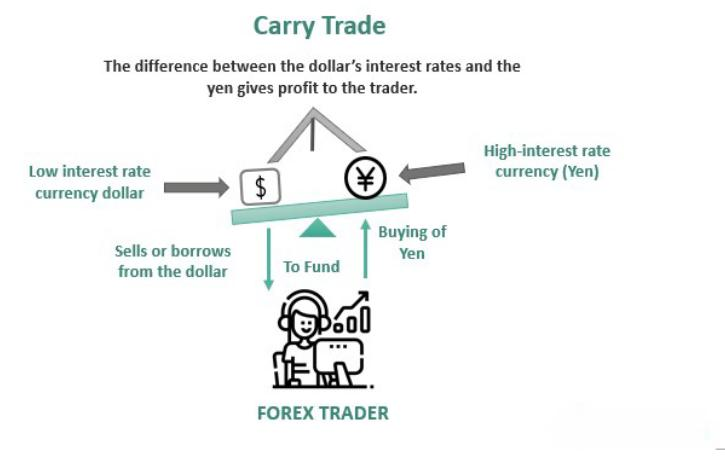

Currency trading has become a focal point for both institutional and individual investors, largely driven by the allure of significant returns through methods such as carry trades and algorithmic trading. While these strategies present enticing opportunities, they come with substantial risks that are best navigated by seasoned traders. 

Carry trades involve borrowing in a currency with a low-interest rate and investing in another currency offering a higher return. This strategy hinges on the interest rate differential between currencies, which can offer consistent profits in a stable economic climate. However, the inherent risk lies in abrupt changes in market conditions, which can lead to swift and significant losses. For instance, a sudden appreciation in the funding currency could erode profits or even result in losses, making a deep understanding of macroeconomic signals crucial.



Algorithmic trading, on the other hand, employs sophisticated algorithms to execute trades at high speed and volume. While this automation minimizes human error and enhances execution efficiency, it can also lead to system failures and contribute to market volatility. Such trading strategies are not without controversy, as they raise concerns around market stability and fairness, given their ability to react to market events with lightning speed, often ahead of human traders.

The interplay between carry trades and algorithmic trading has profound implications for the financial markets. Both strategies require a keen eye on global economic indicators and market sentiment, given their potential to influence currency valuations and volatility. Understanding these dynamics is vital for anyone involved in or considering entering the foreign exchange market. Only through comprehensive risk management and informed decision-making can traders hope to capitalize on these opportunities while mitigating potential downsides.

## Table of Contents

## Understanding Financial Risks in Currency Trading

Currency trading is characterized by substantial volatility and risk, primarily driven by fluctuating exchange rates. These fluctuations result from a complex interplay of economic, political, and social factors. Understanding the financial risks associated with currency trading is essential for traders aiming to navigate this dynamic market effectively.

The main financial risks in currency trading include market risk, liquidity risk, leverage risk, and geopolitical risk.

1. **Market Risk**: Market risk refers to the potential for an investor to experience losses due to movements in the market prices. In currency trading, this risk is primarily associated with unexpected changes in exchange rates. Traders must monitor various factors such as economic indicators, central bank announcements, and other macroeconomic factors that can impact currency valuations.

2. **Liquidity Risk**: Liquidity risk arises when a trader cannot buy or sell assets quickly enough to prevent or minimize a loss. In the forex market, liquidity is typically high, especially for major currency pairs, but it can decrease sharply during periods of economic turmoil or unexpected geopolitical events. Traders need to be aware of the liquidity conditions to implement effective trade strategies.

3. **Leverage Risk**: Leverage risk is inherent in forex trading, as it allows traders to control large positions with relatively small amounts of capital. While leverage can amplify profits, it also magnifies losses. Traders often employ leverage ratios, which define the maximum allowable leverage. For instance, a leverage ratio of 100:1 implies that a trader can trade up to $100,000 with an investment of $1,000. However, this increases the potential for significant losses if the market moves unfavorably.

4. **Geopolitical Risk**: Political instability and geopolitical tensions influence currency values substantially. Events such as elections, policy changes, or conflicts can lead to rapid and unpredictable changes in exchange rates. For example, geopolitical tensions impacting oil-producing regions can affect currencies tied to energy exports.

Effective currency trading requires a solid understanding of market analysis and risk management strategies. Traders often use technical analysis, [fundamental analysis](/wiki/fundamental-analysis), and sentiment analysis to make informed decisions. Technical analysis involves studying price charts and market trends, fundamental analysis focuses on economic indicators and news events, and sentiment analysis gauges the market's mood based on traders' positions and opinions.

Additionally, economic indicators such as GDP growth rates, employment [statistics](/wiki/bayesian-statistics), and inflation rates play a critical role in forecasting currency movements. Sentiments in the market, driven by investor confidence or fear, can also lead to abrupt changes in market conditions.

To illustrate the complexities, consider the Python code snippet below that simulates potential profit and loss scenarios based on leverage:

```python
def calculate_pnl(leverage, capital, price_change):
    position_size = leverage * capital
    pnl = position_size * price_change
    return pnl

capital = 1000  # initial investment
leverage = 100  # leverage ratio
price_changes = [-0.02, 0.01, 0.015]  # example price changes

for change in price_changes:
    pnl = calculate_pnl(leverage, capital, change)
    print(f'Price Change: {change*100}%, Profit/Loss: ${pnl:.2f}')
```

Understanding these risks and tools is crucial for traders to anticipate potential losses and make strategic decisions. As currency markets are influenced by a multitude of factors, traders must be vigilant and adaptable in their approach to managing financial risks.

## The Dynamics and Risks of Carry Trades

Carry trade is a widely utilized strategy in the [forex](/wiki/forex-system) trading market wherein traders borrow funds in a currency with a low-[interest rate](/wiki/interest-rate-trading-strategies) and invest in one with a higher interest rate, seeking to capitalize on the interest rate differential. This strategy is often pursued because it is relatively straightforward and can generate profits as long as the interest rate differential remains favorable and exchange rates stay stable.

Under stable economic conditions, [carry](/wiki/carry-trading) trades can yield consistent returns. The primary appeal lies in exploiting the differential between interest rates of different currencies. For instance, if a trader borrows in a currency with an interest rate of 1% (e.g., the Japanese yen) and invests in a currency offering 5% interest (e.g., the Australian dollar), the potential profit from the interest differential would be about 4%, assuming the exchange rates remain constant.

However, the dynamics of carry trades introduce significant risks:

1. **Interest Rate Changes**: Central banks frequently adjust interest rates in response to economic conditions. A change in interest rates can alter the profitability of a carry trade, potentially leading to losses. For example, an increase in the interest rate of the borrowing currency can diminish the interest rate differential, thus affecting the carry trade's profit margin.

2. **Exchange Rate Volatility**: The exchange rate risk is paramount, as fluctuations in currency exchange rates can negate any interest rate differential advantage. A rapid appreciation of the borrowed currency or depreciation of the invested currency can lead to losses that outweigh the interest earnings.

3. **Market Sentiment Shifts**: Carry trades are sensitive to investor sentiment and global risk perceptions. During times of economic uncertainty or geopolitical tension, investors may seek safe-haven assets, leading to abrupt unwinding of carry trades. This can cause sharp reversals in capital flows, impacting currency values.

The unwinding of carry trades can lead to substantial market disruptions. For instance, the 2024 Japanese yen carry trade unwinding exemplified such risks. Triggered by geopolitical pressures and adjustments in central bank policies, the rapid [exit](/wiki/exit-strategy) from yen-funded positions resulted in pronounced [volatility](/wiki/volatility-trading-strategies) across global forex markets. This instance underscores the potential systemic impact tied to the scale and abruptness with which carry trades can be liquidated.

In summary, while carry trades offer enticing opportunities for profit, they require careful consideration of interest rate policies, currency stability, and broader economic signals. Traders engaging in these strategies need to remain vigilant to avoid the adverse effects of market volatility and shifts in interest and foreign exchange dynamics.

## Algorithmic Trading in Forex Markets

Algorithmic trading in forex markets involves the utilization of sophisticated mathematical models and automated systems to execute trades at extremely high speeds and volumes. This method leverages algorithms to identify and capitalize on trading opportunities that a human trader might miss due to speed and complexity of data. The primary advantage of [algorithmic trading](/wiki/algorithmic-trading) is the elimination of human errors, which can often arise from emotional responses or misinterpretations of market trends. Additionally, it enhances the execution speed of trades, ensuring that orders are placed at the best possible times and prices.

Despite these advantages, algorithmic trading introduces several risks. Technical failures can occur, ranging from software malfunctions to network connectivity issues, which could lead to significant trading losses. Moreover, algorithms are designed to react to market conditions, but in certain scenarios, they may amplify market overreactions. For instance, if many algorithms identify the same trading signal, they can act in unison, causing drastic price movements within short periods.

Market makers and high-frequency trading ([HFT](/wiki/high-frequency-trading-strategies)) firms are prominent users of algorithmic trading systems. They exploit minute price inefficiencies in the forex market to generate profits. While their activities improve market [liquidity](/wiki/liquidity-risk-premium) by ensuring there is always a buyer and a seller, they also contribute to increased volatility. This is due to the sheer [volume](/wiki/volume-trading-strategy) and speed of trades executed by these algorithms. High-frequency traders can complete thousands of transactions in seconds, which sometimes results in sudden price spikes or crashes.

The rapid proliferation of algorithmic trading has prompted regulatory bodies to scrutinize its implications for market stability. There are growing ethical considerations regarding the potential for these systems to disrupt fair trading practices. Regulators are concerned about issues such as market manipulation, where algorithms are used to deceive other market participants, or the creation of unfair advantages for certain traders. In response, regulatory frameworks are being developed and refined to address these concerns, aiming to ensure transparency and fairness in highly automated trading environments.

Algorithmic trading stands as a double-edged sword in forex markets, offering numerous efficiencies but also posing unique challenges that require careful regulatory oversight and strategic management.

## Case Studies: Major Market Movements Affected by Carry and Algo Trades

The 2008 financial crisis marked a significant period of volatility and upheaval in global financial markets, with the rapid unwinding of yen carry trades contributing substantially to sharp currency fluctuations. A carry trade involves borrowing in a low-interest-rate currency, such as the Japanese yen, and investing in a higher-yielding currency. The appeal of the carry trade rests on the interest rate differential between these currencies, which can yield profits in stable economic conditions. However, during the financial crisis, heightened risk aversion among investors triggered a sudden reversal in carry trades. This led to a strong appreciation of the yen as traders repaid their loans, exacerbating market volatility and currency instability.

In 2024, the unwinding of yen carry trades once again led to significant market disruptions. This time, the unwinding was driven by a confluence of political pressures and central bank policies. The Bank of Japan’s adjustments to its monetary policy, aimed at tightening amid growing inflation concerns, coupled with political uncertainty in key markets, intensified the pressure on carry trades. As traders moved to mitigate risks, the rapid unwinding of positions led to a sharp increase in yen value, impacting currencies and markets globally. This event underscored the sensitivity of carry trades to macroeconomic and political changes.

Instances of flash crashes, attributed to algorithmic trading, further illustrate the potential for rapid and unforeseen market movements. A flash crash typically involves a swift and deep plunge in asset prices, largely fueled by automated trading strategies. The 2010 "Flash Crash" in the U.S. stock market, where the Dow Jones Industrial Average experienced a sudden and severe drop, serves as a pertinent example. In the forex market, algorithmic trading can amplify price movements, as high-frequency traders exploit small price inefficiencies. While these algorithms enhance market liquidity, the potential for technical failures or unexpected interactions among trading algorithms can lead to abrupt market shifts.

These case studies highlight the complexities and risks associated with carry trades and algorithmic trading in currency markets. They emphasize the need for robust risk management practices and regulatory oversight to navigate and mitigate such volatile market conditions effectively.

## Mitigating Risks in Currency and Algorithmic Trading

Mitigating risks in currency and algorithmic trading necessitates the adoption of comprehensive risk management strategies tailored to the dynamic and volatile nature of the forex market. One of the fundamental approaches is implementing stop-loss orders. These orders enable traders to predetermine the maximum loss they are willing to endure, thereby automating the sell-off of positions once the set price level is breached. This method is critical in controlling potential losses in fast-moving markets where human reaction may lag behind market events.

Diversification of portfolios is another key risk management strategy. By spreading investments across various currency pairs or asset classes, traders can reduce the impact of adverse price movements in any single currency. This practice hedges against specific risks related to individual currencies and contributes to a more balanced risk-return profile.

Ensuring ample liquidity is equally essential. Traders must maintain sufficient funds to cover margin requirements and potential losses, especially when employing leverage. Sudden market shifts can deplete available margin rapidly, leading to forced liquidation of positions if additional liquidity is not available. Hence, prudent liquidity management protects traders from unexpected market downturns.

Regular monitoring of economic indicators and geopolitical developments is imperative to anticipate market shifts that can affect currency values. Key indicators include interest rates, inflation rates, and employment figures, while geopolitical events such as elections and trade negotiations can significantly influence market sentiment.

In the context of algorithmic trading, rigorous testing of algorithms before deployment is critical. Algorithms must undergo extensive simulation and [backtesting](/wiki/backtesting) using historical data to evaluate their performance under various market conditions. This process helps identify vulnerabilities and ensures the algorithm operates as intended without causing unintended market disruptions.

Moreover, safeguards must be implemented to prevent exploitable flaws or unintended market manipulation. These may include implementing circuit breakers or kill switches that automatically deactivate trading in case of abnormal market behavior, preventing large-scale losses or market distortions that could arise from algorithmic anomalies.

Policy reforms and regulatory frameworks play a pivotal role in governing the impact of algorithmic trading. Regulatory bodies must establish clear guidelines and standards for algorithmic practices to ensure market transparency and stability. This includes setting rules on latency [arbitrage](/wiki/arbitrage), spoofing, and other potentially harmful trading strategies that could undermine fair market operations.

In conclusion, effective risk management in currency and algorithmic trading involves a multifaceted approach that integrates technological safeguards, strategic market analysis, and adherence to regulatory standards. By embracing these practices, traders can navigate the complexities of the forex market with greater resilience and safety.

## Conclusion

Currency trading offers substantial profit opportunities, primarily through carry trades and algorithmic trading strategies. However, these methods come with considerable risks that demand careful management. Carry trades rely on interest rate differentials between currencies, presenting lucrative opportunities during stable economic periods. Yet, they are vulnerable to rapid shifts in market conditions, which can lead to significant losses if not managed properly. Algorithmic trading, on the other hand, leverages technology to execute trades with precision and speed but carries its own set of risks, including technical failures and market overreactions.

Understanding the financial risks associated with these strategies is essential for traders aiming to succeed in the foreign exchange market. Proper risk management techniques—such as setting stop-loss orders, diversifying portfolios, and continuously monitoring market conditions—are crucial in mitigating these risks. Traders should be well-versed in analyzing market indicators and geopolitical events to anticipate potential market movements.

As global markets and technologies evolve, traders must remain informed and adaptable. This includes keeping abreast of economic developments and advancements in trading technology. By staying knowledgeable and responsive to changes in the market environment, traders can enhance their ability to navigate the complex and volatile landscape of currency trading effectively. This adaptability, coupled with solid risk management practices, forms the cornerstone of successful trading in an ever-changing financial world.

## References & Further Reading

[1]: Galati, G., & Melvin, M. (2004). ["Why has FX trading surged? Explaining the 2004 triennial survey."](https://www.bis.org/publ/qtrpdf/r_qt0412f.pdf) BIS Quarterly Review, December.

[2]: Brunnermeier, M. K., Nagel, S., & Pedersen, L. H. (2008). ["Carry Trades and Currency Crashes."](https://www.nber.org/system/files/working_papers/w14473/w14473.pdf) National Bureau of Economic Research.

[3]: Lyons, R. K. (2001). ["The Microstructure Approach to Exchange Rates."](https://direct.mit.edu/books/monograph/2004/The-Microstructure-Approach-to-Exchange-Rates) MIT Press.

[4]: Dacorogna, M. M., Gencay, R., Müller, U. A., Olsen, R. B., & Pictet, O. V. (2001). ["An Introduction to High-Frequency Finance."](https://www.sciencedirect.com/science/article/abs/pii/S1059056003000467) Academic Press.

[5]: Chaboud, A. P., Chiquoine, B., Hjalmarsson, E., & Vega, C. (2009). ["Rise of the Machines: Algorithmic Trading in the Foreign Exchange Market."](https://www.jstor.org/stable/43612951) FRB International Finance Discussion Paper No. 980.