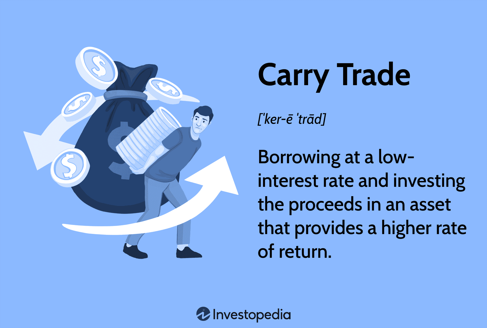

## Table of Contents

## What is a carry trade strategy?

A carry trade strategy is a way to make money by borrowing money in a country where interest rates are low and then using that money to invest in a country where interest rates are higher. The idea is to earn more from the higher interest rates than you pay on the borrowed money. For example, if you borrow money at a 1% interest rate and invest it at a 5% interest rate, you make a profit of 4% before other costs.

However, carry trades can be risky. The value of the currencies you borrow and invest in can change. If the currency you borrowed in becomes stronger compared to the currency you invested in, you might lose money even if you're earning more interest. Also, if the interest rates in the country you invested in go down, your profits could shrink. So, while carry trades can be profitable, they need careful management and understanding of currency markets.

## How does a carry trade work?

A carry trade works by taking advantage of the difference in interest rates between two countries. Imagine you borrow money from a country where the interest rate is low, like 1%. You then take that borrowed money and invest it in a country where the interest rate is higher, say 5%. The goal is to earn more from the higher interest rate than you have to pay back on the loan. If everything goes well, you make a profit from the difference, which in this case would be 4%.

However, carry trades can be risky because of changes in currency values. If the currency you borrowed in gets stronger compared to the currency you invested in, it can eat into your profits or even cause you to lose money. For example, if you borrowed in dollars and invested in pesos, and the dollar becomes worth more pesos, it will cost you more to pay back your loan. Also, if the interest rates in the country you invested in drop, your potential earnings could go down. So, while carry trades can be a way to make money, they require careful watching and understanding of how currencies and interest rates move.

## What are the key components of a carry trade?

A carry trade has two main parts: borrowing and investing. You start by borrowing money from a place where the interest rate is low. This means you don't have to pay back much in interest. Then, you take that money and invest it in a place where the interest rate is higher. The goal is to earn more from your investment than you have to pay back on your loan. The difference between what you earn and what you pay is your profit.

However, there are risks involved. One big risk is that the value of the money you borrowed can change compared to the money you invested in. If the currency you borrowed in becomes stronger, it will cost you more to pay back your loan. This can eat into your profits or even cause you to lose money. Another risk is that the interest rates in the country you invested in might go down, which would reduce your earnings. So, while a carry trade can be profitable, it's important to keep an eye on currency values and interest rates.

## What are the typical currencies used in carry trades?

In carry trades, people often borrow money in countries where interest rates are low. A common choice for borrowing is the Japanese yen because Japan usually has low interest rates. Another currency that people sometimes use for borrowing is the Swiss franc, which also tends to have low interest rates.

For investing, people look for countries with higher interest rates. The Australian dollar and the New Zealand dollar are popular choices because these countries often have higher interest rates. Sometimes, people also invest in emerging market currencies like the Brazilian real or the Turkish lira, but these can be riskier because their values can change a lot.

So, a typical carry trade might involve borrowing in yen and investing in Australian dollars. This strategy can make money if the interest rate difference is big enough and if the currency values don't change too much against each other.

## What are the risks associated with carry trades?

Carry trades can be risky because of changes in currency values. If you borrow money in a currency that becomes stronger compared to the currency you invest in, it can cost you more to pay back your loan. This can eat into your profits or even cause you to lose money. For example, if you borrow in Japanese yen and invest in Australian dollars, and the yen gets stronger, you'll need more Australian dollars to pay back your loan than you expected.

Another risk is that interest rates can change. If the interest rates in the country you invested in go down, your earnings will be less than you planned. This can happen if the country's central bank decides to lower rates or if the economy changes. So, even if you start with a good interest rate difference, it might not last.

Also, carry trades can be affected by big events like financial crises or sudden changes in the economy. These events can cause big swings in currency values and interest rates, making carry trades even riskier. So, while carry trades can be a way to make money, they need careful watching and understanding of how currencies and interest rates move.

## How can one identify good opportunities for carry trades?

To find good opportunities for carry trades, you need to look at the interest rates in different countries. You want to borrow money from a country where the interest rate is low, like Japan, and invest it in a country where the interest rate is high, like Australia. The bigger the difference between these rates, the more money you can make. You can find this information by checking the interest rates set by central banks around the world.

But it's not just about the interest rates. You also need to think about how the value of the currencies might change. If the currency you borrow in gets stronger compared to the currency you invest in, it can cost you more to pay back your loan. So, you should keep an eye on what's happening in the world that might affect currency values, like big economic news or changes in the economy. Using tools like economic calendars and currency charts can help you make better guesses about what might happen.

Lastly, it's important to understand the risks. Carry trades can be risky because of sudden changes in interest rates or currency values. Big events like financial crises can make things even more unpredictable. So, while carry trades can be a way to make money, they need careful watching and understanding of how currencies and interest rates move. It's a good idea to start small and learn as you go, rather than jumping in with a lot of money right away.

## What historical examples illustrate successful carry trades?

One famous example of a successful carry trade happened in the early 2000s. Many people borrowed money in Japanese yen, where interest rates were very low, and invested in the Australian dollar, which had higher interest rates. This trade worked well for a long time because the interest rate difference was big, and the Australian dollar stayed strong against the yen. People made money from the interest they earned in Australia, even after paying back the loan in Japan.

Another good example was in the late 1990s when people used the same strategy but invested in emerging market currencies like the Brazilian real. Brazil had high interest rates, so borrowing in yen and investing in the real could make a lot of money. This trade was successful for a while, but it was also riskier because emerging market currencies can change a lot. Still, for those who got in and out at the right time, it was a profitable move.

## How do interest rate differentials affect carry trade profitability?

Interest rate differentials are really important for carry trade profitability. They are the difference between the interest rate you pay on the money you borrow and the interest rate you earn on the money you invest. If the interest rate you earn is a lot higher than the interest rate you pay, you can make a good profit. For example, if you borrow money at a 1% interest rate and invest it at a 5% interest rate, you make a 4% profit before other costs. The bigger the difference, the more money you can make.

But, interest rate differentials can change over time. If the country you invested in lowers its interest rates, your earnings go down. Or if the country you borrowed from raises its interest rates, it costs you more to pay back your loan. So, even if you start with a good interest rate difference, it might not last. That's why it's important to keep an eye on what's happening with interest rates and be ready to change your strategy if things start to shift.

## What role does leverage play in carry trades?

Leverage is like borrowing more money to make a bigger investment in carry trades. If you use leverage, you can borrow a lot more than you have, which means you can invest more and possibly make more money. For example, if you have $1,000 and use leverage to borrow 10 times that amount, you can invest $10,000 instead of just $1,000. If the interest rate difference is good, you can make a lot more profit than if you just used your own money.

But leverage also makes carry trades riskier. If things go wrong, like if the currency you borrowed in gets stronger or the interest rates change, you can lose a lot more money because you owe so much more. It's like riding a bike with no brakes down a steep hill - you can go really fast, but if you crash, it can hurt a lot more. So, while leverage can help you make more money, it's important to be careful and understand the risks.

## How do market conditions influence the effectiveness of carry trades?

Market conditions can really change how well carry trades work. If everything is calm and stable, carry trades can be a good way to make money. When interest rates stay the same and currencies don't move around a lot, you can earn money from the difference in interest rates without too much worry. But if the markets get shaky, like during a financial crisis or big economic news, carry trades can become risky. Big changes in currency values or sudden shifts in interest rates can turn a profitable trade into a losing one.

For example, if there's a lot of uncertainty in the markets, people might start selling off the currency they invested in to buy back the currency they borrowed. This can make the currency they borrowed stronger and the one they invested in weaker, which means they lose money when they have to pay back their loan. Also, if central banks start changing interest rates a lot, it can mess up the whole plan. So, keeping an eye on what's happening in the markets and being ready to adjust your strategy is really important when doing carry trades.

## What are some advanced techniques for managing carry trade risks?

One advanced way to manage carry trade risks is by using stop-loss orders. A stop-loss order is like a safety net that automatically sells your investment if the currency you're invested in starts to lose too much value. This can help you limit how much money you lose if things go wrong. Another technique is called hedging. Hedging is like buying insurance for your trade. You can use other financial tools, like options or futures, to protect yourself against big changes in currency values. This can make your carry trade safer, but it might also lower your potential profits because you have to pay for this protection.

Another smart move is to diversify your carry trades. Instead of putting all your money into one trade, you can spread it out across different currencies and countries. This way, if one trade goes bad, you might still make money from the others. Also, keeping an eye on economic indicators and news can help you see when it might be time to get out of a trade or change your strategy. For example, if a country's central bank is about to change interest rates, you might want to adjust your trade before it happens. By staying informed and using these advanced techniques, you can better manage the risks of carry trades and increase your chances of making money.

## How can one integrate carry trades into a broader investment strategy?

Integrating carry trades into a broader investment strategy can help you make the most of your money. Carry trades can be a good way to earn extra income from the difference in interest rates between countries. But they can be risky, so it's smart to use them as just one part of your overall plan. You might want to mix carry trades with other types of investments, like stocks or bonds, to spread out your risk. This way, if something goes wrong with your carry trades, you still have other investments that might be doing well.

Another important thing is to keep an eye on how much money you put into carry trades. It's a good idea to start small and only use a part of your money for these trades. As you learn more and get better at it, you can slowly put more money into carry trades. Also, staying informed about what's happening in the world can help you make better decisions. By watching economic news and understanding how currencies and interest rates move, you can adjust your carry trades to fit into your bigger investment plan and make them work better for you.

## What is Carry Trade?

Carry trade is a financial strategy extensively utilized in the forex market, aiming to capitalize on differences in interest rates between currencies. This approach involves borrowing funds in a currency that has a relatively low-interest rate and investing them in a currency that offers a higher interest rate. The fundamental objective is to profit from the interest rate differential between the two currencies involved, while simultaneously managing the risks associated with currency exchange fluctuations.

In practice, the carry trade can be exemplified by an investor who borrows in Japanese yen, which historically has maintained low-interest rates, and invests in Australian dollars, often associated with higher yield returns. The profit potential lies in the rate differential, expressed mathematically as:

$$
\text{Profit} = (\text{Interest Rate of Target Currency} - \text{Interest Rate of Funding Currency}) + \Delta \text{Exchange Rate}
$$

Despite its primary association with [forex](/wiki/forex-system) trading, the [carry](/wiki/carry-trading) trade strategy is versatile and can be applied to other asset classes such as stocks or bonds. For instance, an investor might borrow funds at a low-[interest rate](/wiki/interest-rate-trading-strategies) from a bank in one currency and invest in high-yield bonds denominated in a different currency. The key is to ensure that the yields on the invested asset surpass the borrowing costs, allowing the investor to gain a net positive return after accounting for any currency exposure.

Effectively managing the risks associated with currency exchange rates is crucial, as fluctuations could offset the gains from interest rate differentials. Strategies such as hedging, employing financial derivatives, or monitoring macroeconomic indicators are often used to mitigate these risks.

Overall, the carry trade offers a mechanism for investors to seek returns by leveraging interest rate disparities, although it requires careful consideration of exchange rate [volatility](/wiki/volatility-trading-strategies) and global economic conditions.

## References & Further Reading

[1]: Burnside, C. (2011). ["Carry Trades and Risk."](https://www.nber.org/papers/w17278) Journal of Financial Economics, 102(1), 101-121.

[2]: Clarida, R., Davis, J., & Pedersen, N. (2009). ["Currency carry trade regimes: Beyond the Fama regression."](https://papers.ssrn.com/sol3/papers.cfm?abstract_id=1510473) Review of Financial Studies, 22(9), 3173-3212.

[3]: Menkhoff, L., Sarno, L., Schmeling, M., & Schrimpf, A. (2012). ["Carry trades and global foreign exchange volatility."](https://onlinelibrary.wiley.com/doi/abs/10.1111/j.1540-6261.2012.01728.x) Journal of Finance, 67(2), 681-718.

[4]: Lopez de Prado, M. (2018). ["Advances in Financial Machine Learning"](https://www.amazon.com/Advances-Financial-Machine-Learning-Marcos/dp/1119482089) Wiley.

[5]: Dunis, C., & Middleton, P. (2004). ["Exploiting technical analysis on an artificial market: the automated learning of technical trading rules for use on forex markets."](https://www2.x-plane.com/data/publication/Documents/ai%20use%20cases%20in%20asset%20management.pdf) In Computational Intelligence in Economics and Finance (pp. 65-88). Springer, Berlin, Heidelberg.