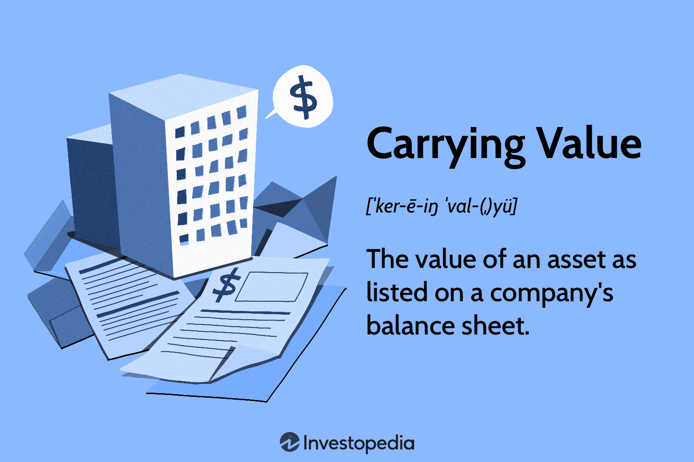

## Table of Contents

## What is a carrying charge?

A carrying charge is a cost that you pay to keep something over time. It's like a fee for holding onto an item or an investment. For example, if you store furniture in a warehouse, the rent you pay for the space is a carrying charge. In the world of finance, carrying charges can include costs like interest on loans, storage fees for commodities, or maintenance fees for investments.

These charges can add up and affect the overall cost of owning something. It's important to consider carrying charges when deciding whether to buy or keep something. For instance, if the carrying charges on a piece of land are too high, it might not be a good investment, even if the land itself is valuable. Understanding and managing carrying charges can help you make better financial decisions.

## How does a carrying charge differ from other types of fees?

A carrying charge is a fee you pay just to keep something over time. It's different from other fees because it's not about using or buying something, but about holding onto it. For example, if you rent a storage unit to keep your old furniture, the rent you pay every month is a carrying charge. It's not for using the furniture, but for keeping it in the storage unit.

Other types of fees might be for services or transactions. For instance, a bank might charge you a fee every time you use an ATM that's not theirs. This is different from a carrying charge because it's for doing something specific, not just for holding onto your money. Another example is a fee you might pay when you buy a ticket online, which is for the service of selling you the ticket, not for keeping the ticket. So, carrying charges are unique because they're all about the cost of keeping something, not about using it or doing something with it.

## Can you provide a simple example of a carrying charge?

Imagine you have some old furniture you don't want to throw away, so you rent a small storage unit to keep it safe. The money you pay every month to the storage company is called a carrying charge. It's not for using the furniture, but just for keeping it in the storage unit.

This fee is different from other costs. For example, if you were to move the furniture into the storage unit, you might have to pay a moving company. That would be a different kind of fee, for the service of moving the furniture, not for keeping it stored. So, the carrying charge is just the cost of holding onto something over time.

## What are the common components that make up a carrying charge?

Carrying charges can have different parts depending on what you're keeping. For example, if you're storing something, you might pay rent for the space where you keep it. This is a big part of the carrying charge. If you're holding onto an investment like stocks, you might have to pay fees to keep your account open. These fees are also part of the carrying charge.

Another part of a carrying charge can be the cost of keeping something safe. For instance, if you're storing valuable items, you might need to pay for insurance to protect them. This insurance cost is added to the carrying charge. Sometimes, you might also need to pay for maintenance to keep what you're storing in good condition. All these costs together make up the carrying charge for keeping something over time.

## How are carrying charges calculated?

Carrying charges are calculated by adding up all the costs you have to pay just to keep something over time. For example, if you're storing furniture in a storage unit, you would start with the monthly rent for the unit. Then, you might add the cost of insurance to protect your items, and any maintenance fees if you need to keep the furniture in good condition. All these costs together make up the carrying charge.

The way carrying charges are calculated can change depending on what you're keeping. If you're holding onto an investment like stocks, the carrying charge might include fees for keeping your account open, and maybe even interest if you borrowed money to buy the stocks. The key is to add up all the costs that come from holding onto something, not from using it or doing something with it. This total is your carrying charge.

## In what industries are carrying charges most commonly applied?

Carrying charges are common in the storage and warehousing industry. If you rent a storage unit to keep your things safe, the rent you pay every month is a carrying charge. Companies that store big things like furniture or cars also have to pay these charges. It's not just for keeping personal items; businesses use warehouses to store products they plan to sell later, and they pay carrying charges for that space.

Carrying charges are also important in the finance and investment world. If you buy stocks or other investments, you might have to pay fees just to keep your account open. These fees are carrying charges. If you borrow money to buy investments, the interest you pay on that loan is also part of the carrying charge. So, whether it's storing physical items or holding onto financial investments, carrying charges are a big part of the cost of keeping things over time.

## What impact do carrying charges have on investment decisions?

Carrying charges can make a big difference when you're deciding whether to invest in something. If the carrying charges are high, it might not be a good idea to invest, even if the thing you're thinking about buying seems valuable. For example, if you want to buy a piece of land but the taxes and maintenance costs are too high, it might not be worth it. You need to think about these costs and see if the investment will still make you money after you pay them.

In the world of finance, carrying charges can also affect your choices. If you're thinking about buying stocks or other investments, you need to look at the fees you'll have to pay just to keep your account open. If these fees are too high, it might be better to put your money somewhere else. Understanding and managing carrying charges can help you make smarter investment decisions and keep more of your money in the long run.

## How can carrying charges affect the overall cost of holding an asset?

Carrying charges can make the overall cost of holding an asset much higher. These charges are the fees you pay just to keep something over time, like rent for a storage unit or fees for keeping an investment account open. If these carrying charges are high, they can add up quickly and make the asset more expensive to hold onto. For example, if you buy a piece of land and have to pay a lot in property taxes and maintenance, the carrying charges could make the land cost more than you expected.

These extra costs can change how you think about keeping an asset. If the carrying charges are too high, it might not be worth holding onto the asset, even if it seems valuable at first. In the world of investments, high carrying charges can eat into your profits. If the fees for keeping your investment account open are too high, you might end up making less money than you thought. So, it's important to think about carrying charges when deciding whether to keep an asset, because they can really affect the total cost.

## Are there strategies to minimize the impact of carrying charges?

There are ways to lower the impact of carrying charges. One way is to look for cheaper options for storing things. Instead of renting a big storage unit, you could find a smaller one that costs less. Or, if you're keeping an investment account, you might switch to a company that charges lower fees. Another way is to use what you're holding onto. If you have a piece of land, you could rent it out to someone else to help pay the carrying charges.

It's also a good idea to keep an eye on your carrying charges and see if they change over time. Sometimes, you can talk to the people you're paying and ask for a lower rate. If you're paying a lot in taxes for something you own, you might be able to find ways to lower those taxes. By being smart about how you handle carrying charges, you can keep more of your money and make better decisions about what to keep and what to let go.

## How do carrying charges vary across different financial instruments?

Carrying charges can be different for different types of investments. For example, if you invest in stocks, you might have to pay fees to keep your account open. These fees are part of the carrying charge. If you borrow money to buy stocks, the interest you pay on that loan is also a carrying charge. But if you invest in bonds, the carrying charges might be lower. Bonds usually don't have account fees, but you might have to pay for safekeeping if you keep them in a safe place.

In the world of commodities, like gold or oil, carrying charges can be even more complicated. If you store physical commodities, you'll have to pay for the space where you keep them. This is a big part of the carrying charge. You might also need insurance to protect your commodities, which adds to the cost. If you invest in commodity futures, the carrying charge could include the cost of rolling over your contracts, which means moving your investment from one time period to the next. So, the type of financial instrument you choose can make a big difference in how much you pay in carrying charges.

## What are the regulatory considerations related to carrying charges?

Governments and financial regulators keep an eye on carrying charges to make sure they are fair and clear. They set rules that companies have to follow when they charge fees for keeping things or holding investments. These rules can include limits on how much companies can charge and requirements for them to tell people about the fees upfront. For example, in the storage industry, there might be laws about how much a company can charge for renting a storage unit. In finance, regulators might require investment companies to show all their fees clearly so people can see what they're paying.

Regulations can also change depending on the country or the type of asset. In some places, there might be strict rules about how much interest can be charged on loans used for investments. Other places might have rules about how much companies can charge for keeping commodities safe. These rules help protect people from getting charged too much and make sure everyone knows what they're paying for. By keeping an eye on carrying charges, regulators help make sure the market stays fair and people can make good decisions about what to keep and what to let go.

## How do carrying charges influence market behavior and pricing?

Carrying charges can change how people act in the market and how much things cost. If the carrying charges for keeping something are high, people might decide not to buy it or to sell it quickly. This can make the price of the thing go down because fewer people want to hold onto it. For example, if it costs a lot to store oil, people might sell it faster, which can make the price of oil drop. On the other hand, if carrying charges are low, people might be more willing to keep things for a longer time, which can help keep prices stable or even make them go up.

Carrying charges also affect how much it costs to do business. If a company has to pay a lot to keep its products in a warehouse, it might raise the price of those products to cover the cost. This can make things more expensive for everyone. But if carrying charges are low, companies might not need to raise prices as much, which can keep costs down for people buying things. So, carrying charges play a big role in how markets work and how much things cost, influencing both what people do and how businesses set their prices.

## What are Carrying Charges and How Can They Be Understood?

Carrying charges represent the cumulative costs incurred for holding a commodity or financial instrument over a specified duration. These costs are significant in the financial sector because they directly affect the net returns on investments. Carrying charges encompass several components, primarily: 

1. **Interest Expenses**: These occur when an investor borrows funds to finance the purchase of an asset. For example, in the commodities market, if a trader is holding a physical commodity, the cost of financing this inventory is part of the carrying charge.

2. **Storage Fees**: When physical commodities are involved, particularly in agriculture or energy sectors, storage fees become a substantial part of carrying charges. These are the costs associated with safely storing the commodity until it is sold or utilized.

3. **Insurance Costs**: Holding physical assets entails risks, including damage or loss due to natural disasters, theft, or other unforeseen events. Insurance is crucial to mitigate these risks, and its cost contributes to the overall carrying charges.

4. **Opportunity Costs**: By allocating capital to hold a particular asset, investors may forego alternative investment opportunities that could potentially offer better returns. The loss of potential profit from not investing elsewhere is an opportunity cost that must be factored into carrying charges.

Mathematically, carrying charges can be expressed as:

$$
\text{Carrying Charge} = \text{Interest Expense} + \text{Storage Cost} + \text{Insurance Cost} + \text{Opportunity Cost}
$$

The concept of carrying charges is integral for both short-term and long-term investment strategies, influencing the decision-making process. For instance, in futures markets, the carrying cost is a critical [factor](/wiki/factor-investing) in the pricing model. The cost of [carry](/wiki/carry-trading) model, which incorporates these charges into the pricing of futures contracts, can be given by:

$$
F = S \times e^{(r + c - y) \times t}
$$

where $F$ is the future price, $S$ is the spot price, $r$ is the risk-free interest rate, $c$ represents the cost of carry, $y$ is the yield benefit (if any, such as dividends for stocks), and $t$ is the time to maturity.

Understanding carrying charges is essential for accurately estimating the profitability of holding an asset over time. They serve as a key variable in various financial models and investment assessments, particularly in price determination and strategy formulation. Hence, comprehensive cost management, including meticulous evaluation of carrying charges, is indispensable for optimizing investment outcomes.

## What are the types of carrying charges?

Carrying charges encompass a variety of costs associated with holding commodities or financial instruments over a period. These include but are not limited to insurance payments, interest charges, storage or holding costs, taxes, and utility costs. Each type of carrying charge can significantly influence the overall cost of maintaining an asset, impacting its investment viability.

1. **Insurance Payments**: Insurance is often required to protect assets against unforeseen events that may result in loss or damage. The cost of insurance is a carrying charge that investors must account for when holding physical commodities such as precious metals, agricultural products, or energy resources.

2. **Interest Charges**: For investments made using borrowed funds, the interest charges represent a significant carrying cost. In the context of financial instruments like futures or leveraged positions, these interest expenses can erode potential returns. The formula for calculating simple interest is given by:
$$
   \text{Interest} = P \times r \times t

$$

   where $P$ is the principal amount, $r$ is the annual interest rate, and $t$ is the time period in years.

3. **Storage or Holding Costs**: Physical commodities and certain financial securities incur storage costs. For example, storing large quantities of oil or grains requires physical facilities, security, and maintenance, all contributing to the carrying charge. These costs must be balanced against the expected returns from holding the asset over time.

4. **Taxes**: Taxes levied on holding certain assets over specific periods add to the carrying charges. This could include property taxes on real estate investments, capital gains taxes on securities, or specific taxes applicable to asset types like commodity futures.

5. **Utility Costs**: Particularly relevant for commodities requiring specific storage conditions (such as temperature-controlled environments for agricultural produce), utility costs are another facet of carrying charges that must be managed. These can fluctuate due to varying energy prices, adding a layer of complexity to cost estimation.

The impact of each carrying charge varies based on the asset in question, necessitating a thorough understanding and analysis to optimize cost management strategies. For example, precious metals might have high insurance and storage costs, whereas financial securities might primarily incur interest charges. Investors must evaluate these costs to assess the viability of an investment and implement strategies to mitigate unnecessary expenses.

By comprehensively understanding the different types of carrying charges, investors can strategically plan their portfolios to enhance returns and ensure efficient cost management, aligning their investment strategies with their financial goals.

## What is the impact of the cost of carry on algorithmic trading?

In [algorithmic trading](/wiki/algorithmic-trading), the impact of carrying charges is a pivotal factor that significantly shapes trading strategies and execution. Carrying charges, the cumulative costs associated with holding financial instruments or commodities over a given period, directly influence the timing and profitability of trades. These charges often include interest expenses, storage fees, insurance premiums, and opportunity costs, all of which must be accurately accounted for to ensure optimal trading outcomes.

High-frequency trading ([HFT](/wiki/high-frequency-trading-strategies)) and other algorithmic strategies rely on precise calculations of carrying charges to create efficient entry and [exit](/wiki/exit-strategy) points. The cost of carry can dictate the viability of certain trades, particularly in strategies where margins are slim and rapid transactions occur. One fundamental aspect is that these costs can be dynamic, fluctuating based on external factors such as interest rates, market [liquidity](/wiki/liquidity-risk-premium), and demand for the asset.

To maintain profitability, trading algorithms must incorporate carrying charges into their computational models. This involves sophisticated techniques that adjust the valuation of trades in real-time. For instance, consider a simplified model where the net payoff $\text{NP}$ of holding a financial instrument is calculated as:

$$
\text{NP} = \text{Expected Price Change} - \text{Carrying Cost}
$$

In this equation, the Expected Price Change is forecast based on market movement predictions, while the Carrying Cost represents all associated expenses of holding the position. Without accurate modeling of these costs, algorithms could systematically make sub-optimal decisions, eroding their potential profitability.

Moreover, these charges can influence algorithmic adjustments through adaptive strategies like hedging. Advanced algorithms might employ real-time data analytics to dynamically hedge against carrying costs, using financial instruments such as futures contracts to mitigate risks. This active management is crucial in scenarios where market conditions shift rapidly, potentially altering the cost structures and profitability of positions.

In practical terms, implementing the cost of carry considerations into algorithmic models often involves writing scripts that adjust position sizes or initiate liquidation based on fluctuating carrying costs. For instance, a Python script could be used to fetch real-time [interest rate](/wiki/interest-rate-trading-strategies) data, calculate carrying charges, and adjust positions accordingly. Below is a basic example of how such a script might be structured:

```python
import requests

def fetch_interest_rate():
    # This function would fetch current interest rates from a reliable financial API
    response = requests.get('https://api.financialdata.org/interest_rate')
    return response.json().get('rate', 0)

def adjust_position(current_positions, target_profit, expected_price_change, interest_rate):
    carrying_cost = calculate_carrying_cost(current_positions, interest_rate)
    for position in current_positions:
        net_payoff = expected_price_change - carrying_cost
        if net_payoff < target_profit:
            # Adjust or close the position based on strategy
            print(f"Adjust or close position: {position}")

def calculate_carrying_cost(positions, interest_rate):
    # Simplified calculation of carrying cost for demonstration
    return sum(pos.value * interest_rate for pos in positions)

# Example usage
current_positions = [{'value': 10000}, {'value': 20000}] # Example positions
interest_rate = fetch_interest_rate()
adjust_position(current_positions, target_profit=500, expected_price_change=1000, interest_rate=interest_rate)
```

In conclusion, the integration of carrying charges into algorithmic trading models is a critical component for maximizing trading efficiency. By systematically accounting for these costs, traders can ensure that their strategies remain within profitable margins, thereby enhancing overall financial outcomes.

## References & Further Reading

Fernando, J. provides an overview of carrying charges, explaining their significance as costs incurred when holding commodities or financial instruments over time. This resource elaborates on the components of carrying charges, including interest expenses, storage fees, and insurance, offering practical examples to illustrate their impact on trading and investment strategies.

Hull, J. C. (2017). "Options, Futures, and Other Derivatives" is a foundational text that covers a wide array of financial derivatives. It provides insights into the calculations and implications of carrying charges within the context of options and futures trading. Hull's work is essential for understanding the theoretical frameworks and practical applications of cost management in derivative markets.

Taleb, N. N. (1997). "Dynamic Hedging: Managing Vanilla and Exotic Options" explores advanced hedging techniques that traders can use to manage carrying charges effectively. Taleb's book incorporates real-world scenarios and complex strategies to mitigate risk, making it a valuable reference for traders looking to optimize their cost management processes.

de Prado, M. L. (2018). "Advances in Financial Machine Learning" investigates into the integration of machine learning techniques in financial trading. De Prado emphasizes the role of carrying charges in algorithmic trading, highlighting how sophisticated algorithms can incorporate these costs to improve trading efficiencies and outcomes. This resource bridges the gap between traditional financial concepts and cutting-edge technological applications in finance.

