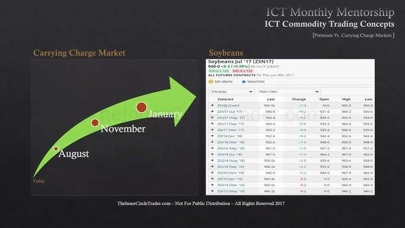

## Table of Contents

## What is a carrying charge in the financial market?

A carrying charge in the financial market is a cost that investors pay to hold or store certain investments. This can include expenses like storage fees for commodities, interest costs for holding futures contracts, or other ongoing costs associated with maintaining an investment position. For example, if you invest in physical gold, you might have to pay for a safe place to keep it, which would be a carrying charge.

These charges are important because they can affect the overall return on an investment. If the carrying charges are high, they can eat into the profits an investor makes, making the investment less attractive. On the other hand, if the carrying charges are low, the investment might be more appealing because the investor gets to keep more of the profit. Understanding these costs helps investors make better decisions about where to put their money.

## How does the carrying charge affect commodity markets?

Carrying charges have a big impact on commodity markets. They are the costs that people pay to keep their commodities safe and in good condition until they can sell them. For example, if you have a lot of corn, you need to store it in a place where it won't get ruined. The money you pay for that storage is a carrying charge. These costs can make a big difference in how much money someone can make from selling their commodities. If the carrying charges are high, it might not be worth it to hold onto the commodities for a long time because the costs could eat up a lot of the profit.

In the commodity markets, carrying charges can also affect the prices of commodities. If it costs a lot to store something like oil or wheat, sellers might want to sell it quickly to avoid those high costs. This can lead to more commodities being available in the market, which can push prices down. On the other hand, if carrying charges are low, people might be more willing to hold onto their commodities, which can lead to less supply in the market and higher prices. So, understanding carrying charges is important for anyone involved in buying and selling commodities.

## What are the components that make up a carrying charge?

Carrying charges are made up of different costs that people have to pay to keep their investments safe and ready to sell. One big part of carrying charges is storage fees. If you have things like oil, gold, or grain, you need a safe place to keep them. This could be a warehouse, a vault, or even a special tank. The money you pay to use these places is a part of the carrying charge. Another part of carrying charges can be insurance. If your commodities are valuable, you might want to have insurance to protect them from things like fire or theft. This insurance cost also adds to the carrying charge.

Another component of carrying charges is the cost of money, which is often called interest. If you need to borrow money to buy commodities and hold onto them, you'll have to pay interest on that loan. This interest is a part of the carrying charge. There can also be other smaller costs, like the money you spend to move the commodities around or to keep them in good condition. All these different costs together make up the carrying charge, and they can affect how much money you make from your investment.

## Can you explain the difference between carrying charge and storage costs?

Carrying charge and storage costs are related but not exactly the same thing. Storage costs are just one part of the carrying charge. They are the specific costs you pay to keep your commodities in a safe place, like a warehouse or a vault. If you have grain, for example, you need to store it somewhere so it doesn't go bad. The money you pay for that storage is the storage cost.

On the other hand, the carrying charge includes the storage costs but also other costs that come with holding onto your investment. Besides storage, the carrying charge can include things like insurance to protect your commodities, interest if you borrowed money to buy them, and even smaller costs like moving the commodities around or keeping them in good condition. So, while storage costs are just about where you keep your stuff, the carrying charge is about all the costs you have to pay to keep your investment until you can sell it.

## How do carrying charges influence investment decisions in commodities?

Carrying charges play a big role in deciding whether to invest in commodities. When people think about buying things like oil, gold, or grain, they need to think about how much it will cost to keep those things until they can sell them. If the carrying charges are high, it might not be worth it to hold onto the commodities for a long time. This is because the costs can eat into the money they make when they finally sell. So, if the carrying charges are too high, people might choose not to invest in those commodities or look for other investments that don't have such high costs.

On the other hand, if the carrying charges are low, it can make commodities a more attractive investment. When it doesn't cost a lot to store and protect the commodities, people might be more willing to buy them and hold onto them until the prices go up. This can lead to more people investing in commodities and can even affect the supply and demand in the market. Understanding carrying charges helps investors make smart choices about where to put their money and how long to keep their investments.

## What role do carrying charges play in futures and options markets?

Carrying charges are important in futures and options markets because they affect the prices of contracts. In these markets, people agree to buy or sell commodities at a future date. The carrying charge is the cost of holding onto the commodity until that date. If these costs are high, it can make the futures contract more expensive because the seller needs to cover those costs. On the other hand, if the carrying charges are low, the futures contract might be cheaper because it doesn't cost as much to hold onto the commodity.

In options markets, carrying charges also matter because they can affect how much it costs to buy an option. An option gives someone the right to buy or sell a commodity at a set price in the future. If the carrying charges are high, it can make the option more expensive because the person who sells the option might need to cover those costs if the option is exercised. So, carrying charges play a big role in deciding the prices of futures and options and can influence whether people choose to invest in them.

## How can carrying charges be calculated for different commodities?

To calculate carrying charges for different commodities, you need to add up all the costs that come with holding onto the commodity until you sell it. One big cost is storage. For example, if you have oil, you need a safe place to keep it, like a tank. The money you pay for that tank is part of the carrying charge. Another cost is insurance. If your commodity is valuable, like gold, you might want to pay for insurance to protect it from damage or theft. That insurance cost also goes into the carrying charge.

Another part of the carrying charge is interest. If you borrowed money to buy the commodity, you have to pay interest on that loan. This interest is also a part of the carrying charge. There might be other smaller costs too, like the money you spend to move the commodity around or to keep it in good condition. To find the total carrying charge, you just add up all these different costs. For example, if you have wheat, you would add the cost of the warehouse, the insurance, any interest on a loan, and any other small costs to get the total carrying charge for that wheat.

## What strategies can traders use to mitigate the impact of high carrying charges?

Traders can use different strategies to lower the impact of high carrying charges. One way is to sell the commodity quickly instead of holding onto it for a long time. If they sell it fast, they don't have to pay as much for storage, insurance, and interest. Another strategy is to use financial tools like futures contracts. By selling a futures contract, traders can lock in a price for the commodity in the future without having to keep the actual commodity, which saves on carrying charges.

Another approach is to choose commodities with lower carrying charges. Some commodities are cheaper to store and protect than others, so traders might decide to invest in those instead. For example, if storing oil costs a lot but storing sugar is cheaper, traders might choose to trade sugar to avoid high carrying charges. By being smart about when to sell and what to invest in, traders can manage the costs of carrying charges better and make more money from their investments.

## How do seasonal variations affect carrying charges in agricultural commodities?

Seasonal variations can really change the carrying charges for agricultural commodities. During harvest time, there's a lot of the commodity available, like wheat or corn. Farmers need to store all this extra stuff until they can sell it. This means they have to pay more for storage space, which makes the carrying charges go up. Also, if the weather is bad during the harvest, it might cost more to keep the commodities safe and dry, which adds to the carrying charges.

After the harvest, when there's less of the commodity around, the carrying charges might go down. There's less need for big storage spaces, so the costs can be lower. But if people decide to keep the commodity for a long time to sell it later when the price might be higher, they still have to pay for storage, insurance, and maybe even interest on loans. So, the time of year and how much of the commodity is available can make a big difference in how much it costs to hold onto it.

## What are the historical trends in carrying charges for major commodities?

Over the years, carrying charges for major commodities like oil, gold, and grains have gone up and down based on different things happening in the world. For oil, carrying charges can change a lot because of how much it costs to store it safely. If there's a lot of oil and not enough space to keep it, the carrying charges can go up. During times like the 2008 financial crisis or the 2020 global health crisis, oil prices dropped a lot, and it was hard to find places to store all the oil, so carrying charges went up. For gold, carrying charges have stayed pretty steady because the cost to keep gold safe in a vault doesn't change much.

For grains like wheat and corn, carrying charges have followed the seasons. During harvest time, when there's a lot of grain, the costs to store it can go up because farmers need big spaces to keep all the extra grain. After the harvest, the carrying charges might go down because there's less grain to store. But if farmers decide to keep the grain for a long time hoping to sell it later at a higher price, they still have to pay for storage, insurance, and maybe even interest on loans, which can keep the carrying charges high. So, the time of year and how much grain is around can really affect the carrying charges.

## How do global economic factors influence carrying charges in the market?

Global economic factors can change the carrying charges in the market a lot. When the world economy is doing well, people might want to invest more in commodities, which can make the costs of storing and keeping them safe go up. For example, if everyone wants to buy oil because they think the economy will keep growing, the places to store oil might get full, and the carrying charges will go up. On the other hand, if the economy is not doing well, like during a big financial crisis, people might not want to invest in commodities as much. This can make the carrying charges go down because there's less need for storage and other costs.

Another way global economic factors affect carrying charges is through changes in interest rates. If the interest rates go up, it can cost more to borrow money to buy commodities, which adds to the carrying charges. For example, if you need to take out a loan to buy gold and the interest on that loan goes up, your carrying charges will be higher. Also, things like trade policies and tariffs can change how much it costs to move commodities around the world, which can affect the carrying charges too. So, the global economy can really make a big difference in how much it costs to hold onto commodities.

## What advanced models or tools are used by experts to predict carrying charge fluctuations?

Experts use different models and tools to guess how carrying charges might change in the future. One common tool is called time series analysis. This helps them look at past data on carrying charges and see patterns. By understanding these patterns, they can make better guesses about what might happen next. Another tool is econometric modeling, which uses math to understand how things like interest rates, storage costs, and even the weather might change carrying charges. These models can be really helpful because they take into account many different things that can affect carrying charges.

Another important tool is [machine learning](/wiki/machine-learning). This is a type of computer program that can learn from data and make predictions. Experts feed the machine learning model lots of information about past carrying charges and other factors like global economic trends or seasonal changes. The model then uses this information to predict future carrying charges. By using these advanced tools, experts can make smarter decisions about when to buy or sell commodities and how to manage the costs of holding onto them.

## What is the Carrying Charge Market Explained?

Carrying charge markets are characterized by futures prices being higher than spot prices, a condition commonly attributed to the costs of holding or storing a commodity over time. This market behavior is a direct consequence of the expenses associated with storage, insurance, financing, and other incidental costs, collectively referred to as carrying charges. The presence of carrying charges is essential to the pricing of futures contracts, as they reflect the total costs that traders and investors must consider when deciding between purchasing a commodity at its current spot price or opting for a future acquisition at a predetermined rate.

The influence of carrying charges is particularly evident in commodities such as corn and [crude oil](/wiki/crude-oil). These markets frequently exhibit a situation known as 'contango', where future prices surpass spot prices. This pricing structure not only includes the intrinsic value of the commodity but also encapsulates the cumulative carrying costs, which encompass storage fees, insurance, and financing charges.

Understanding the dynamics of carrying charge markets is essential for traders and investors aiming to optimize their transactional strategies. One must recognize that the difference between the futures and spot prices can be expressed mathematically through the cost of [carry](/wiki/carry-trading) model:

$$
F = S \times e^{(r+s-u)t}
$$

where:
- $F$ is the futures price,
- $S$ is the spot price,
- $r$ is the risk-free interest rate,
- $s$ represents storage costs as a percentage of the commodity value,
- $u$ accounts for any income derived from the commodity (such as a convenience yield),
- $t$ is the time until the contract's maturity, and
- $e$ is the base of the natural logarithm.

This formula elucidates how futures pricing factors in all relevant carrying charges, thereby allowing market participants to assess whether entering into a futures contract aligns with their financial objectives. Traders and investors can leverage this understanding to make informed decisions, manage risks, and potentially capitalize on the temporal spreads between futures and spot prices. Consequently, carrying charge markets offer insightful perspectives requisite for navigating the complexities of financial markets, particularly for those engaged in commodity trading or managing portfolios that include futures contracts.

## What is the impact of carrying charges on algorithmic trading?

Algorithmic trading is a cornerstone of modern financial markets, utilizing computer algorithms to execute trades with speed and efficiency that surpasses human capability. At the core of these operations lies the necessity of accurately calculating carrying charges, which significantly influence trading strategies, particularly in high-frequency trading environments.

Carrying charges encompass expenses associated with holding assets, including interest rates, storage fees, insurance, and opportunity costs. These charges are crucial inputs in the algorithms that drive trading decisions. For instance, consider a scenario where a trader is evaluating the profitability of a futures contract. The algorithm must incorporate the carrying charge to predict if the future price will adequately cover these costs along with producing a profit margin.

In mathematical terms, carrying charges (CC) can be expressed as:

$$
CC = (I + S + Ins + OC)
$$

where:
- $I$ is the interest expense,
- $S$ is the storage fee,
- $Ins$ outlines the insurance cost, and
- $OC$ corresponds to the opportunity cost.

For optimal trading decisions, algorithms need to dynamically adjust these variables as market conditions change. High-frequency trading algorithms, which conduct numerous trades in fractions of a second, demand precision in these calculations to swiftly adapt to fluctuating market parameters. This precision mitigates unnecessary costs and enhances decision efficacy.

Moreover, carrying charges in algorithmic models require integration of sophisticated pricing algorithms. For example, in Python, traders can model carrying costs using libraries like NumPy for numerical calculations and pandas for data manipulation to dynamically update prices based on carrying charges. A simplified Python snippet demonstrating this could be:

```python
import numpy as np
import pandas as pd

# Example DataFrame with hypothetical prices and carrying costs
df = pd.DataFrame({
    'spot_price': [100, 102, 104],
    'future_price': [105, 107, 109],
    'interest': [2, 2, 2],
    'storage': [1, 1, 1],
    'insurance': [0.5, 0.5, 0.5],
    'opportunity_cost': [0.5, 0.5, 0.5]
})

# Calculating total carrying charge
df['carrying_charge'] = df[['interest', 'storage', 'insurance', 'opportunity_cost']].sum(axis=1)

# Adjust future price based on carrying charges
df['adjusted_future_price'] = df['future_price'] - df['carrying_charge']

# Display the DataFrame
print(df)
```

In this example, the script calculates total carrying charges for a series of trades and adjusts future prices accordingly. Such models, although simplified, facilitate rapid adjustments in trading strategies as they can be scaled and augmented with real-time data inputs.

For algorithmic traders, incorporating carrying charges in models allows for a structured approach to trading that precludes the erosion of profits due to unexpected costs. This element is especially critical in volatile markets where carrying charges can fluctuate significantly, impacting the timing and [volume](/wiki/volume-trading-strategy) of trades.

In sum, the consideration of carrying charges is not merely a supplementary action for [algorithmic trading](/wiki/algorithmic-trading) algorithms but a fundamental requirement that shapes the strategic planning and execution of trades, thereby ensuring the viability and profitability of trading operations in financial markets.

## References & Further Reading

Fernando, J. offers a comprehensive overview of carrying charges in financial markets, crucial for understanding the costs associated with holding assets or commodities. This reference will aid readers in grasping the fundamental concepts that influence futures pricing and market behavior. 

Hull, J. C.'s "Options, Futures, and Other Derivatives" is an essential resource for understanding financial derivatives in detail. The book provides in-depth explanations of how derivatives work and are used in various financial strategies, offering insights into the complexities of pricing and market strategies impacted by carrying charges.

Taleb, N. N.'s "Dynamic Hedging" discusses risk management strategies, focusing on how hedging can mitigate carrying costs and other market risks. Taleb's work is instrumental in understanding the application of derivatives in protecting investments from [volatility](/wiki/volatility-trading-strategies) and unexpected market movements.

de Prado, M. L.'s "Advances in Financial Machine Learning" explores the integration of machine learning techniques in trading. This text is particularly useful for those interested in algorithmic trading, where precise calculations and adaptability to carrying charges are critical components of successful trading algorithms. The book provides methodologies for incorporating machine learning in trading strategies to achieve optimal results.

