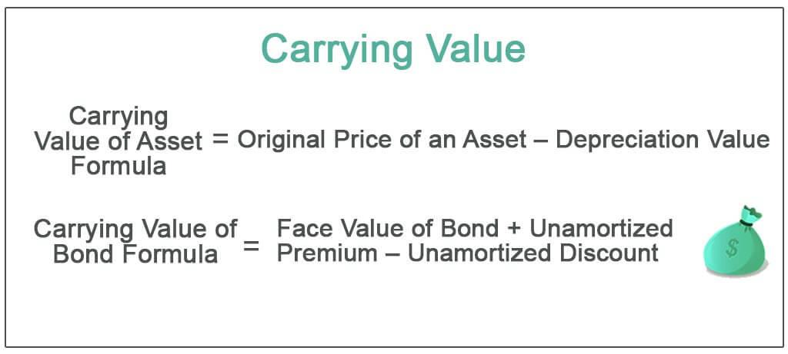

In finance and investing, understanding key terms and concepts is crucial for success. This article aims to shed light on three important topics: accounting carrying value, balance sheets, and algo trading. Each of these elements forms a cornerstone in the financial ecosystem, playing significant roles in investment decisions and financial analysis.

Accounting carrying value, often referred to as book value, is a fundamental metric in financial reporting. It represents the recorded value of an asset, calculated by deducting accumulated depreciation or amortization from its original cost. This measure is vital for assessing the financial health of a company's assets and is prominently featured within balance sheets.



Balance sheets offer a snapshot of a company's financial position at a specific point in time. They detail the company's assets, liabilities, and shareholders' equity, with carrying values of assets contributing critically to this comprehensive overview. This financial statement is essential for evaluating a company's stability and making informed investment decisions.

Algorithmic trading, or algo trading, introduces a technological advancement to the traditional landscape of trading. By employing sophisticated mathematical models and computer algorithms, trades are executed with speed and precision, guided by predefined criteria. This innovation has transformed financial markets, enhancing efficiency and providing traders with strategic advantages.

By exploring these interconnected topics, readers will gain a comprehensive understanding of their roles and integration within the financial ecosystem. This knowledge is crucial for navigating the complexities of modern finance and investing with confidence.

## Table of Contents

## Understanding Accounting Carrying Value

Carrying value, also termed book value, represents the value at which an asset is recorded on a company's balance sheet. This metric is a crucial element in accounting, reflecting the net value of an asset over time. It is calculated by taking the initial purchase cost of an asset and deducting any accumulated depreciation or amortization. The formula to compute carrying value is:

$$
\text{Carrying Value} = \text{Original Cost} - \text{Accumulated Depreciation/Amortization}
$$

**Calculation Methods**: 

1. **Original Cost**: This is the purchase price of the asset, including any costs associated with bringing the asset to its intended use, such as installation fees or initial testing.

2. **Accumulated Depreciation/Amortization**: This represents the total depreciation or amortization that has been charged against the asset since it was acquired. Depreciation is used for tangible assets like machinery, whereas amortization refers to intangible assets such as patents.

Different methods exist to calculate depreciation and amortization, influencing the carrying value. Common methods include:

- **Straight-Line Method**: Equal depreciation is charged over the useful life of the asset. It is represented as:

  \[ \text{Annual Depreciation} = \frac{\text{Original Cost} - \text{Residual Value}}{\text{Useful Life}}
$$

- **Declining Balance Method**: Depreciation is greatest in the initial years and decreases over time.

- **Units of Production Method**: Based on the usage of the asset, leading to variable depreciation amounts each period.

**Factors Influencing Carrying Value**:

- **Asset Revaluation**: Sometimes, assets are revalued to reflect their fair market value. This can result in an increase or decrease in carrying value.

- **Impairment**: If an asset's market value drops below its carrying amount, an impairment loss is recognized, reducing the carrying value.

- **Useful Life Estimation**: The estimated useful life plays a significant role. A longer lifespan implies lower annual depreciation, affecting carrying value.

**Implications for Businesses**:

Carrying value plays a vital role in financial analysis and decision-making. For investors, it provides insight into the valuation of a company’s assets, which is integral for calculating ratios such as return on assets (ROA) and debt-to-equity ratio. Companies also utilize carrying value to make strategic decisions regarding asset replacement, sales, or upgrades. Accurate computation and reporting of carrying value ensure compliance with accounting standards and provide transparency to stakeholders, influencing investment and financing decisions.

## The Role of Balance Sheets

The balance sheet is a fundamental financial statement that offers a detailed snapshot of a company's financial position at a particular moment. It is composed of three primary components: assets, liabilities, and shareholders' equity. Assets are what the company owns, liabilities are what it owes, and shareholders' equity represents the ownership interest of investors.

The carrying value of assets is prominently featured in the balance sheet. This value, also referred to as book value, represents the recorded worth of an asset after accounting for factors such as depreciation, amortization, or impairment. The calculation is straightforward: 
$$
\text{Carrying Value} = \text{Original Cost} - \text{Accumulated Depreciation/Amortization}
$$

This measure is crucial for assessing the financial health of a company. By comparing the carrying value of assets with their market value, stakeholders can gain insights into whether the assets are over or undervalued in the company's [books](/wiki/algo-trading-books). A significant disparity between these figures might highlight potential issues with asset valuation, which could affect investment decisions.

Within the balance sheet framework, the carrying value aids in determining the company's net asset value (NAV), which is a critical indicator of its financial stability. The NAV is calculated as the difference between total assets and total liabilities, reflecting the actual value that shareholders would theoretically receive if the company were liquidated:
$$
\text{Net Asset Value} = \text{Total Assets} - \text{Total Liabilities}
$$

Understanding the impact of carrying value on the balance sheet is essential for financial analysis. It affects key financial ratios used to evaluate the company's [liquidity](/wiki/liquidity-risk-premium), solvency, and overall financial health. Ratios such as the current ratio, debt-to-equity ratio, and return on equity rely on accurate asset values to provide meaningful insights.

For instance, the current ratio, defined as the ratio of current assets to current liabilities, helps in assessing the company's ability to meet short-term obligations:
$$
\text{Current Ratio} = \frac{\text{Current Assets}}{\text{Current Liabilities}}
$$

When the carrying value of assets is accurately represented, it ensures that these ratios provide a reliable measure of the company's performance and aids stakeholders in making informed investment decisions.

In conclusion, the balance sheet, through its detailed representation of carrying values, plays an integral role in financial analysis. It provides the insights necessary for evaluating the company's financial position and making informed decisions regarding investments and corporate strategies. Understanding the interdependencies between balance sheet components and carrying values is crucial for robust financial analysis and planning.

 to Algo Trading

Algorithmic trading, often referred to as algo trading, has become a cornerstone of modern financial markets. It involves the use of computer programs and algorithms to execute a large number of trades at high speeds. These algorithms analyze vast amounts of market data and execute trades based on predefined criteria, such as timing, price, or quantity. This approach allows traders to capitalize on market opportunities with a precision and speed unattainable by human traders.

One of the core advantages of algo trading is its efficiency. Traditional trading methods often rely on human intervention, which can introduce delays and emotional biases. In contrast, algo trading systems can process complex calculations and execute trades within microseconds, minimizing latency and human error. This speed not only enhances trading efficiency but also enables traders to exploit [arbitrage](/wiki/arbitrage) opportunities and provide liquidity to the markets.

Algo trading is underpinned by advanced mathematical models and statistical analysis. These models are employed to predict market trends and define the trading parameters that algorithms use to make trading decisions. A simple example of an [algorithmic trading](/wiki/algorithmic-trading) strategy is a moving average crossover, which generates buy or sell signals when short-term moving averages cross above or below long-term moving averages. In Python, a basic implementation of a moving average crossover strategy could look like this:

```python
import numpy as np
import pandas as pd

# Load market data
data = pd.read_csv('market_data.csv')
short_window = 40
long_window = 100

# Calculate moving averages
data['Short_MA'] = data['Close'].rolling(window=short_window, min_periods=1).mean()
data['Long_MA'] = data['Close'].rolling(window=long_window, min_periods=1).mean()

# Generate trading signals
data['Signal'] = 0
data['Signal'][short_window:] = np.where(data['Short_MA'][short_window:] > data['Long_MA'][short_window:], 1, 0)
data['Position'] = data['Signal'].diff()

# Trade execution logic will go here
```

The growth of algo trading has transformed the trading landscape by improving market transparency and reducing transaction costs. These benefits have made algorithmic trading an integral part of major exchanges and trading platforms worldwide. Additionally, algo trading integrates seamlessly with traditional trading practices, as traders can incorporate algorithmic strategies to manage portfolios, hedge risks, and enhance the execution quality of trades.

Despite its numerous advantages, algo trading also presents challenges and risks. The reliance on algorithms requires robust technology infrastructures and market data feeds to ensure accurate and timely trade execution. Furthermore, the complexity of financial markets means that algorithmic systems must be constantly updated and monitored for performance. Regulatory scrutiny has also increased, necessitating compliance with financial regulations designed to prevent market manipulation and ensure fair trading practices.

In summary, algo trading embodies a significant evolution in the field of trading, leveraging technology and mathematics to optimize trading activities. By automating trade execution and analysis, it not only augments the capabilities of financial professionals but also enhances the overall efficiency of financial markets.

## The Interconnection: Carrying Value and Algo Trading

The interplay between carrying value, balance sheet analysis, and algorithmic trading is a significant dimension of contemporary investing. Carrying values, reflected as book values on balance sheets, directly impact trading strategies, especially in algorithmic trading that relies heavily on real-time data analytics.

Carrying value provides a snapshot of an asset's worth after accounting for depreciation and amortization. This metric is vital for traders using algorithmic strategies to evaluate the true value of a company’s assets relative to their current market prices. For instance, if the carrying value significantly diverges from market value, it could indicate potential overvaluation or undervaluation, prompting specific trading actions.

Algorithmic trading, which automates trade executions using pre-defined criteria, can integrate carrying values as part of its evaluative criteria. Algorithms can be programmed to incorporate financial ratios derived from carrying values, such as Price-to-Book (P/B) ratio, to assess investment opportunities:

$$
\text{P/B Ratio} = \frac{\text{Market Price per Share}}{\text{Book Value per Share}}
$$

A low P/B ratio might trigger buy signals in an algorithmic trading system, suggesting that the asset may be undervalued relative to its book value. Conversely, a high P/B ratio could signal overvaluation, prompting sell orders.

Moreover, algorithmic trading systems can exploit anomalies between carrying value and market value swiftly, leveraging discrepancies identified during balance sheet analysis. By using historical data and statistical models, algo trading can predict movements based on shifts in accounting metrics like carrying values, thus optimizing trading outcomes. For example, [machine learning](/wiki/machine-learning) models can analyze patterns and make predictions on asset valuation changes, incorporating carrying value as a key variable.

Implementing such systems requires a profound understanding of both financial accounting and computational finance. Robust algorithms ensure traders can promptly react to fluctuations, harnessing the full potential of carrying values for refined decision-making in asset management and trading.

In summary, the integration of carrying values into algorithmic trading strategies can significantly enhance value investing efforts. By leveraging these accounting metrics with advanced computational techniques, traders can uncover latent opportunities, manage risks, and ultimately optimize their investment strategies to align with broader financial objectives.

## Conclusion

The landscape of finance continues to evolve rapidly, making it crucial for individuals involved in investing and managing funds to master core concepts such as accounting carrying value, balance sheets, and algorithmic trading. These elements are interwoven in modern financial systems, collectively shaping strategies and decisions made by investors and businesses. The understanding of accounting carrying value allows one to assess the real worth of assets, moving beyond superficial market trends. In conjunction with balance sheets, carrying values provide a clear snapshot of a company's financial health, aiding stakeholders in making informed judgements about potential investments or financial strategies.

Algorithmic trading introduces another dimension to finance, utilizing automation and data analysis to improve trading efficiency and precision. By integrating insights from carrying value and balance sheets, algorithms can be crafted to optimize trading outcomes. This fusion of traditional accounting metrics with innovative trading techniques exemplifies the transformative nature of current financial practices.

Possessing a comprehensive grasp of these concepts enhances financial acumen, equipping individuals to navigate the complexities of modern trading with confidence. This knowledge not only supports personal investment strategies but also boosts competitiveness in professional financial environments. With these insights, individuals are better positioned to thrive in the dynamic, fast-paced world of finance, making significant contributions to the financial markets and securing their financial futures.

## References

- Investopedia provides comprehensive articles on various financial topics, including accounting carrying value, balance sheets, and algorithmic trading. These resources offer valuable insights into fundamental concepts and practical applications, making them a useful reference for understanding how these elements function and interconnect within the financial ecosystem.

- The Double Entry Bookkeeping website offers specialized resources on trading securities accounting. This platform explains how securities are recorded and managed under the dual-entry system, providing clarity on the implications of carrying value for securities on balance sheets.

- A wide array of financial literature and scholarly articles contribute to a deeper understanding of these topics. These sources often explore the methodologies and theoretical underpinnings of carrying value calculations, the construction and analysis of balance sheets, and the technological advancements driving algorithmic trading.

These references collectively support a thorough comprehension of accounting carrying value, balance sheets, and algo trading, equipping readers with the knowledge to enhance their financial literacy and strategic decision-making in the financial markets.

## References & Further Reading

[1]: ["Financial Reporting and Analysis"](https://www.wallstreetmojo.com/financial-reporting/) by Charles H. Gibson

[2]: ["Intermediate Accounting"](https://accountingtestprep.com/intermediate-accounting-2/) by Donald E. Kieso, Jerry J. Weygandt, and Terry D. Warfield

[3]: ["Algorithmic Trading & DMA: An introduction to direct access trading strategies"](https://www.amazon.com/Algorithmic-Trading-DMA-introduction-strategies/dp/0956399207) by Barry Johnson

[4]: ["Advances in Financial Machine Learning"](https://www.amazon.com/Advances-Financial-Machine-Learning-Marcos/dp/1119482089) by Marcos Lopez de Prado

[5]: ["Quantitative Trading: How to Build Your Own Algorithmic Trading Business"](https://www.amazon.com/Quantitative-Trading-Build-Algorithmic-Business/dp/1119800064) by Ernest P. Chan